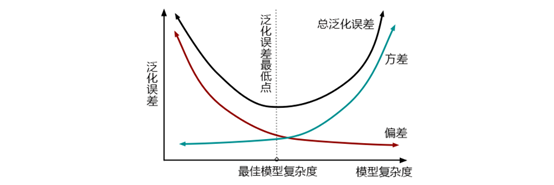
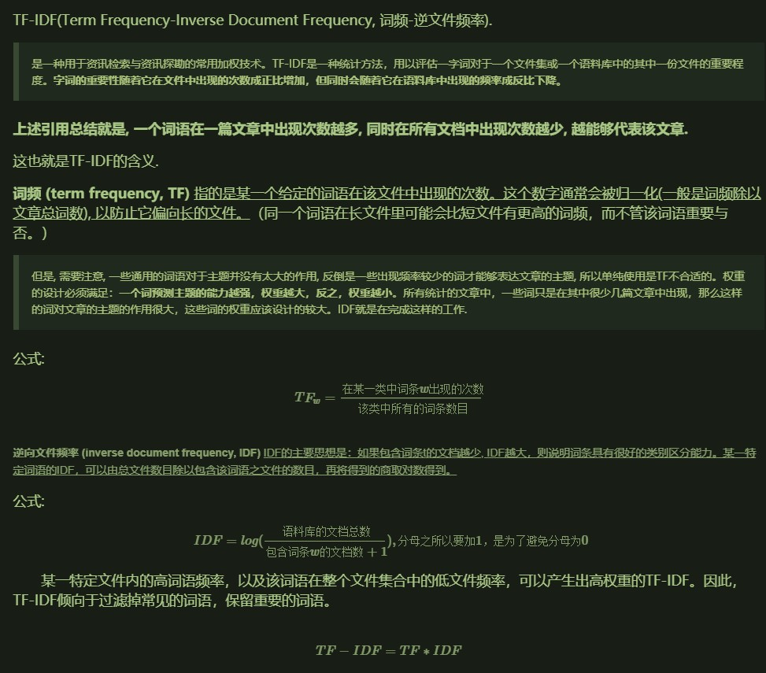
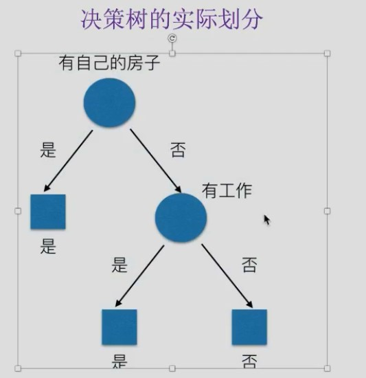
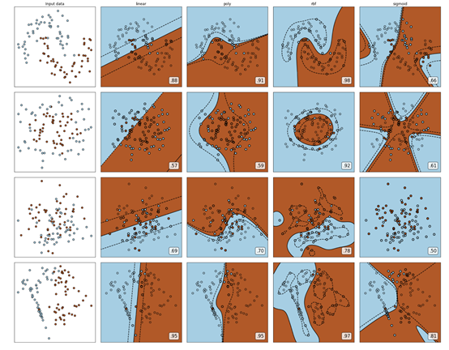
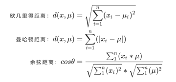
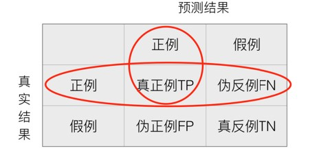
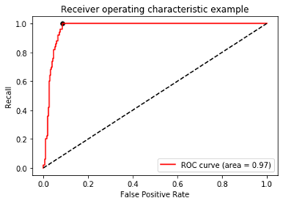
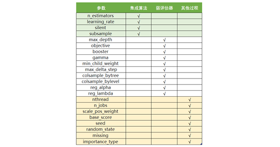
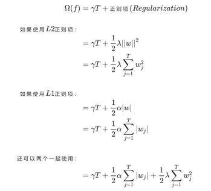

# 1. 开始

## 1.1. 相关

- 发展：
  - 人工智能：最早出现的概念，指一些自动化的程序
  - 机器学习：对数据进行自动分析获得规律
  - 深度学习：机器学习中较为复杂的算法，比如图像识别等
    > 
- 影响因素；
  - 硬件计算水平
  - 数据量多少
  - 算法发展
- 应用：

  - 自然语言处理
  - 图像识别
  - 传统预测

- 机器学习库和框架

  - 前面部分使用：scikit learn
  - 后面部分使用：tensorflow(用的最火)
  - 框架列表：
    > 

- 书籍推荐

  > 

- 数据集：

  > 

- 数据集结构：

  - 特征值，即 x
  - 目标值，即 y

- 基本流程：
  > 

- 示例流程：
  ```
  短期风功率预测的实现流程：
  （1）	原始数据的探索性分析
  （2）	数据清洗：nwp数据和A09号风机数据
  （3）	数据合并：清洗后的nwp数据和A09号风机数据合并
  （4）	数据集拆分：合并后的数据，拆分出训练集和测试集
  （5）	特征工程：构建特征
  （6）	训练集的阈值筛选
  （7）	训练集的特征探索性分析
  （8）	数据标准化：训练集和测试集
  （9）	神经网络预测功率
  （10）	预测能力评估
  ```


## 1.2. 误差来源

看那个台湾的那个

一个集成模型(f)在未知数据集(D)上的泛化误差 E(f;D)，由方差(var)，偏差(bais)和噪声(ε)共同决定。




# 2. scikit-learn 数据处理

## 2.1. 优缺点

- sklearn
  - 有点：封装好，建立模型简单，预测简单
  - 缺点：
    - 算法的过程，部分参数都在内部自行优化
    - 不推荐处理大量数据。
  - 注意：sklearn 当中特征矩阵必须是二维
- tensorflow:封装高低的 api 都有，可以自己实现算法

## 2.2. 数据抽取

### 2.2.1. 字典数据抽取

#### 2.2.1.1. DictVectorizer

将字典转换为矩阵

```py
  # 导包
from sklearn.feature_extraction import DictVectorizer

def main():
    # 实例化数据抽取对象
    # 默认sparse为true，会将矩阵转换为sparse
    dictVector = DictVectorizer(sparse=False)

    # 调用fit_transform
    rdata=dictVector.fit_transform(
        [
          {
              "name": 1,
              "value": "value1"
          },
          {
              "name": 2,
              "value": "value2"
          },
          {
              "name": 3,
              "value": "value3"
          }
        ]
    )
    print(dictVector.get_feature_names())
    print((rdata))
    print(type(rdata))
    """
    输出：
    ['name', 'value=value1', 'value=value2', 'value=value3']
    [[1. 1. 0. 0.]
    [2. 0. 1. 0.]
    [3. 0. 0. 1.]]
    <class 'numpy.ndarray'>

    数字为值的第一列为name;字符串为值的value会转换为第二，三，四列，true为1，false为0(one-hot编码)
    默认会通过sparse压缩，所以不必担心内存

    sparse矩阵：
      (0, 0)        1.0
      (0, 1)        1.0
      (1, 0)        2.0
      (1, 2)        1.0
      (2, 0)        3.0
      (2, 3)        1.0
    """

if __name__ == "__main__":
    main()

```

### 2.2.2. 文本特征抽取

#### 2.2.2.1. Count

> 统计单词出现频率

```py
  # 导入特征抽取类
from sklearn.feature_extraction.text import CountVectorizer

def main():
    cv = CountVectorizer()
    # 实例化
    rdata = cv.fit_transform(
        ["life is short,I use python", "life is too long,i don't use python"])
        # 传入两篇文章
    print(rdata)
    print(cv.get_feature_names())
    print((rdata.toarray()))
    pass

if __name__ == "__main__":
    main()
"""
结果：
  (0, 2)        1
  (0, 1)        1
  (0, 5)        1
  (0, 7)        1
  (0, 4)        1
  (1, 2)        1
  (1, 1)        1
  (1, 7)        1
  (1, 4)        1
  (1, 6)        1
  (1, 3)        1
  (1, 0)        1
['don', 'is', 'life', 'long', 'python', 'short', 'too', 'use']
[[0 1 1 0 1 1 0 1]
 [1 1 1 1 1 0 1 1]]

1. 统计文章中所有出现的词，重复词之看作一次，作为feature_names
2. 一行对应一篇文章，对每篇文章，统计出词的出现次数
3. 单个字母不统计
4. 中文默认不支持特征抽取，因为不能自动分词，除非用空格划开。可以使用 jieba 进行分词
"""
```

#### 2.2.2.2. tf-idf

> 已过时

- tf(term frequency):单词频率
- idf(inverse document frequency):逆文档频率

  > `log(总文档数量/改词出现的文档数+1)`<br>
  > 比如`我们`，`今天`这些常用词不应该计入考虑，可以通过逆文档频率判断重要性

- 计算公式
  > 

```python
from sklearn.feature_extraction.text import TfidfVectorizer
import jieba

def main():
    str1 = "1、今天很残酷，明天更残酷，后天很美好， 但绝对大部分是死在明天晚上，所以每个人不要放弃今天。"
    str2 = "2、我们看到的从很远星系来的光是在几百万年之前发出的， 这样当我们看到宇宙时，我们是在看它的过去。"
    str3 = "3、如果只用一种方式了解某样事物，你就不会真正了解它。 了解事物真正含义的秘密取决于如何将其与我们所了解的事物相联系。"
    str1_cut = jieba.cut(str1)
    str2_cut = jieba.cut(str2)
    str3_cut = jieba.cut(str3)
    str1_s = " ".join(str1_cut)
    str2_s = " ".join(str2_cut)
    str3_s = " ".join(str3_cut)
    tifid = TfidfVectorizer()
    rdata = tifid.fit_transform([str1_s, str2_s, str3_s])
    print(tifid.get_feature_names())
    print(rdata.toarray())
    print(rdata)

if __name__ == "__main__":
    main()

"""
['一种', '不会', '不要', '之前', '了解', '事物', '今天', '光是在', '几百万年', '发出', '取决于', '只用', '后天', '含义', '大部分', '如何', '如果', '宇宙', '我们', '所以', '放弃', '方式', '明天', '星系', '晚上', '某样', '残酷', '每个', '看到', '真正', '秘密', '绝对', '美好', '联系', '过去', '这样']
[[0.         0.         0.21821789 0.         0.         0.
  0.43643578 0.         0.         0.         0.         0.
  0.21821789 0.         0.21821789 0.         0.         0.
  0.         0.21821789 0.21821789 0.         0.43643578 0.
  0.21821789 0.         0.43643578 0.21821789 0.         0.
  0.         0.21821789 0.21821789 0.         0.         0.        ]
 [0.         0.         0.         0.2410822  0.         0.
  0.         0.2410822  0.2410822  0.2410822  0.         0.
  0.         0.         0.         0.         0.         0.2410822
  0.55004769 0.         0.         0.         0.         0.2410822
  0.         0.         0.         0.         0.48216441 0.
  0.         0.         0.         0.         0.2410822  0.2410822 ]
 [0.15698297 0.15698297 0.         0.         0.62793188 0.47094891
  0.         0.         0.         0.         0.15698297 0.15698297
  0.         0.15698297 0.         0.15698297 0.15698297 0.
  0.1193896  0.         0.         0.15698297 0.         0.
  0.         0.15698297 0.         0.         0.         0.31396594
  0.15698297 0.         0.         0.15698297 0.         0.        ]]

  # 一个数组对应一篇文章，数大小对应词在该篇文章中的的重要性
"""
```

## 2.3. 数据预处理

### 2.3.1. 概述

- 定义：通过特定的统计方法（数学方法）将数据转换成算法要求的数据

- 处理：

  - 数值型数据：标准缩放：
    - 1、归一化
    - 2、标准化
    - 3、缺失值(pandas 和 numpy 都可以进行处理)
  - 类别型数据：one-hot 编码 （字典类型数据抽取）
  - 时间类型：时间的切分(根据情况处理字符串)

- api：`sklearn.preprocessing`

- 注意：会先分训练集和测试集，再开始进行数据预处理。分别进行处理。确保数据的独立性

### 2.3.2. 归一化 Normalization

> 不怎么使用

- 特点：通过对原始数据进行变换把数据映射到一定范围(默认为[0,1])之间
- 目的：避免因数值而影响特征的。
  > 比如身高和体重 与 健康程度的关系，因为本身就不是同一范围，直接使用的话，所占权也不同
- 缺点：受异常点影响打（特别是最大最小值受影响时），鲁棒性较差。**只适合传统精确小数据**

  - 鲁棒性 Robustness，也就是健壮性

- 公式：

  > 

- api:`sklearn.preprocessing.MinMaxScaler(feature_range=(0,1),...)`
  - MinMaxScalar.fit_transform(X)
    - X:numpy array 格式的数据[n_samples,n_features]
    - 返回值：转换后的形状相同的 array

```py
from sklearn.preprocessing import MinMaxScaler

def main():
    mm = MinMaxScaler()
    # 默认就是 mm = MinMaxScaler(feature_range=(0,1))
    rdata = mm.fit_transform( [[90, 2, 10, 40], [60, 4, 15, 45], [75, 3, 13, 46]])
    print(mm.feature_range)
    print(rdata)
    pass

if __name__ == "__main__":
    main()
```

### 2.3.3. 标准化 standardization

- 特点：通过对原始数据进行变换把数据变换到均值为 0,方差为 1 范围内
  > 在已有样本足够多的情况下比较稳定，适合现代嘈杂大数据场景
- 公式：

  > 

- api:`sklearn.preprocessing.StandardScaler`
  - 处理之后每列来说所有数据都聚集在
    - 均值:0 附近
    - 方差为 1
  - StandardScaler.fit_transform(X,y)
    - X:numpy array 格式的数据[n_samples,n_features]
    - 返回值：转换后的形状相同的 array
  - StandardScaler.mean\_
    - 原始数据中每列特征的平均值
  - StandardScaler.std\_
    - 原始数据每列特征的方差

```py
from sklearn.preprocessing import StandardScaler

def main():
    stdv = StandardScaler()
    rdata = stdv.fit_transform( [[ 1., -1., 3.], [ 2., 4., 2.], [ 4., 6., -1.]])
    print(rdata)

if __name__ == "__main__":
    main()
```

```
大多数机器学习算法中，会选择StandardScaler来进行特征缩放，
因为MinMaxScaler对异常值非常敏感。在PCA，聚类，逻辑回归，支持向量机，
神经网络这些算法中，StandardScaler往往是最好的选择。
MinMaxScaler在不涉及距离度量、梯度、协方差计算以及数据需要被压缩到特定区间时使用广泛，
比如数字图像处理中量化像素强度时，都会使用MinMaxScaler将数据压缩于[0,1]区间之中。
建议先试试看StandardScaler，效果不好换MinMaxScaler
```

### 2.3.4. 缺失值处理

> 单纯用 numpy 和 pandas 就能完成

- 插补：可以通过缺失值每行或者每列的平均值、中位数来填充
- api:`sklearn.preprocessing.Imputer`

  - Imputer(missing_values='NaN', strategy='mean', axis=0)

    - 完成缺失值插补
    - strategy:
      - mean:默认均值
      - median:中位数
      - constant：0
      - most_frequent:众数
    - fill_value：当参数 startegy 为”constant"的时候可用，可输入字符串或数字表示要填充的值，常用 0
    - copy=true: 默认为 True，将创建特征矩阵的副本，反之则会将缺失值填补到原本的特征矩阵中

  - Imputer.fit_transform(X,y)
    - X:numpy array 格式的数据[n_samples,n_features]
    - 返回值：转换后的形状相同的 array

> **Imputer 类已经过时，0.22 版本会被移除，下面使用了 sklearn.impute.SimpleImputer 替换了原代码中的 Imputer**

### 2.3.5. 非数值型-->数值型

- sklearn.preprocessing.LabelEncoder：标签专用，能够将分类转换为分类数值
  - inverse_transform():复原
- sklearn.preprocessing.OrdinalEncoder：特征专用，能够将分类特征转换为分类数值
  > OrdinalEncoder 可以用来处理有序变量，但对于名义变量，我们只有使用哑变量的方式来处理，才能够尽量向算法传达最准确的信息
- sklearn.preprocessing.OneHotEncoder：独热编码，创建哑变量**重要※**
  - categories='auto'：自动分组
- sklearn.preprocessing.Binarizer:根据阈值将数据二值化（将特征值设置为 0 或 1）
  - 大于阈值的值映射为 1，而小于或等于阈值的值映射为 0。
  - 默认阈值为 0 时，特征中所有的正值都映射到 1
- sklearn.preprocessing.KBinsDiscretizer:可以将连续型变量划分为多个分类变量的类，能够将连续型变量排序后按顺序分箱后编码
  - 比如对年龄进行独热等宽分箱
    - "uniform"：表示等宽分箱，即每个特征中的每个箱的最大值之间的差为(特征.max() - 特征.min())/(n_bins)
    - "quantile"：表示等位分箱，即每个特征中的每个箱内的样本数量都相同
    - "kmeans"：表示按聚类分箱，每个箱中的值到最近的一维 k 均值聚类的簇心得距离都相同

## 2.4. 特征工程

- 维度：特征的数量

### 2.4.1. 特征选择

#### 2.4.1.1. 说明

- 原因：

  - 冗余：部分特征的相关度高，容易消耗计算性能
  - 噪声：部分特征对预测结果有负影响

- 定义：
  ```
  特征选择就是单纯地从提取到的所有特征中选择部分特征作为训练集特征，
  特征在选择前和选择后可以改变值、也不改变值，但是选择后的特征维数肯
  定比选择前小，毕竟我们只选择了其中的一部分特征。
  ```
- 主要方法:
  - **Filter(过滤式):VarianceThreshold**
    > variance:方差<br>
    > threshold:入口；门槛；开始；极限；临界值
  - **Embedded(嵌入式)：正则化、决策树**:后面算法时再讲
  - Wrapper(包裹式)：基本不用
- 其他方法：
  - **神经网络**，之后再说
  - 线性判别分析 LDA（基本不用）

#### 2.4.1.2. 过滤式

##### 方差过滤：VarianceThreshold

- api:`sklearn.feature_selection.VarianceThreshold`
  - VarianceThreshold(threshold = 0.0)
    > 默认 threshold=0.0。要根据实际情况取值
    - 删除所有低方差特征
  - Variance.fit_transform(X,y)
    - X:numpy array 格式的数据[n_samples,n_features]
    - 返回值：训练集差异低于 threshold 的特征将被删除。
    - 默认值是保留所有非零方差特征，即删除所有样本
    - 中具有相同值的特征。

```py
from sklearn.feature_selection import VarianceThreshold

def main():
    vt = VarianceThreshold()
    rdata = vt.fit_transform([[0, 2, 0, 3], [0, 1, 4, 3], [0, 1, 1, 3]])
    print(rdata)

if __name__ == "__main__":
    main()
    """
    结果：
    [[2 0]
    [1 4]
    [1 1]]

    即删除了一样的列
    """
```

##### 相关性过滤

###### 卡方过滤

```
卡方过滤是专门针对离散型标签（即分类问题）的相关性过滤。
卡方检验类feature_selection.chi2计算每个非负特征和标签之间的卡方统计量，并依照卡方统计量由高到低为特征排名。
再结合feature_selection.SelectKBest这个可以输入”评分标准“来选出前K个分数最高的特征的类，
我们可以借此除去最可能独立于标签，与我们分类目的无关的特征。
```

- api:

  ```py
  from sklearn.feature_selection import SelectKBest
  from sklearn.feature_selection import chi2

  #假设需要300个特征
  X_fschi = SelectKBest(chi2, k=300).fit_transform(X_fsvar, y)
  X_fschi.shape
  ```

###### 互信息过滤

> 了解

```
互信息法是用来捕捉每个特征与标签之间的任意关系（包括线性和非线性关系）的过滤方法。
互信息法不返回p值或F值类似的统计量，它返回 每个特征与目标之间的互信息量的估计 ，这个估计量在[0,1]之间取值，
为0则表示两个变量独立，为1则表示两个变量完全相关。
使用互信息法选取数据特征。
```

- api
  ```python
  from sklearn.feature_selection import mutual_info_classif as MIC
  result = MIC(X_fsvar,y)#互信息法
  ```

#### 2.4.1.3. 嵌入式

##### 介绍和 api

- 嵌入法是一种让算法自己决定使用哪些特征的方法，即特征选择和算法训练同时进行

- 步骤：
  - 在使用嵌入法时，我们先使用某些机器学习的算法和模型进行训练，得到各个特征的权值系数，根据权值系数从大到小选择特征。
    - 这些权值系数往往代表了特征对于模型的某种贡献或某种重要性，
    - 比如决策树和树的集成模型中的 feature*importances*属性，可以列出各个特征对树的建立的贡献
  - 我们就可以基于这种贡献的评估，找出对模型建立最有用的特征。
- 其他：
  - 嵌入法引入了算法来挑选特征，因此其计算速度也会和应用的算法有很大的关系。
  - 如果采用计算量很大，计算缓慢的算法，嵌入法本身也会非常耗时耗力。
  - 并且，在选择完毕之后，我们还是需要自己来评估模型。


- api:主要是 threshold（阈值）的选择
  ```py
  class sklearn.feature_selection.SelectFromModel(
    estimator, # 使用的模型评估器，只要是带feature_importances_或者coef_属性，或带有l1和l2惩罚项的模型都可以使用
    threshold=None, # 特征重要性的阈值，重要性低于这个阈值的特征都将被删除
    prefit=False, # 默认False，判断是否将实例化后的模型直接传递给构造函数。
                  # 如果为True，则必须直接调用fit和transform，不能使用fit_transform，
                  # 并且SelectFromModel不能与cross_val_score，GridSearchCV和克隆估计器的类似实用程序一起使用。
    norm_order=1, # k可输入非零整数，正无穷，负无穷，默认值为1。在评估器的coef_属性高于一维的情况下，用于过滤低于阈值的系数的向量的范数的阶数
    ax_features=None #在阈值设定下，要选择的最大特征数。要禁用阈值并仅根据max_features选择，请设置threshold = -np.inf
  )
  ```

#### 2.4.1.4. 包装式

- 包装法也是一个特征选择和算法训练同时进行的方法，与嵌入法十分相似，它也是依赖于算法自身的选择，
  - 比如 coef*属性或 feature_importances*属性来完成特征选择
  - 从当前的一组特征中修剪最不重要的特征。在修剪的集合上递归地重复该过程，直到最终到达所需数量的要选择的特征
  - 区别于过滤法和嵌入法的一次训练解决所有问题，包装法要使用特征子集进行多次训练，因此它所需要的计算成本是最高的
  - 包装法的效果是所有特征选择方法中最利于提升模型表现的，它可以使用很少的特征达到很优秀的效果。
  - 除此之外，在特征数目相同时，包装法和嵌入法的效果能够匹敌，不过它比嵌入法算得更见缓慢，所以也不适用于太大型的数据。相比之下，包装法是最能保证模型效果的特征选择方法。


- 最典型的目标函数是递归特征消除法（Recursive feature elimination, 简写为 RFE）。

  - 它是一种贪婪的优化算法，旨在找到性能最佳的特征子集。
  - 它反复创建模型，并在每次迭代时保留最佳特征或剔除最差特征，
  - 下一次迭代时，它会使用上一次建模中没有被选中的特征来构建下一个模型，直到所有特征都耗尽为止。
  - 然后，它根据自己保留或剔除特征的顺序来对特征进行排名，最终选出一个最佳子集。

- api:
  ass sklearn . feature \_ selection . RFE ( estimator , n features to select = None , step = 1 , verbose

### 2.4.2. 特征降维

#### 2.4.2.1. 概念

在降维的过程中，能够即减少特征的数量，又保留大部分有效信息——将那些带有重复信息的特征合并，
并删除那些带无效信息的特征等等——逐渐创造出能够代表原特征矩阵大部分信息的，特征更少的，新特征矩阵

降维算法的计算量很大，运行比较缓慢，但无论如何，它们的功能无可替代

- 和特征选择区别：
  - 特征选择是从已存在的特征中选取携带信息最多的，选完之后的特征依然具有可解释性，我们依然知道这个特征在原数据的哪个位置，代表着原数据上的什么含义。
  - 而 PCA，是将已存在的特征进行压缩，降维完毕后的特征不是原本的特征矩阵中的任何一个特征，而是通过某些方式组合起来的新特征。
  - 通常来说，在新的特征矩阵生成之前，我们无法知晓 PCA 都建立了怎样的新特征向量，新特征矩阵生成之后也不具有可读性，我们无法判断新特征矩阵的特征是从原数据中的什么特征组合而来，新特征虽然带有原始数据的信息，却已经不是原数据上代表着的含义了。
  - 以 PCA 为代表的降维算法因此是特征创造（feature creation，或 feature construction）的一种。
  - 可以想见，PCA 一般不适用于探索特征和标签之间的关系的模型（如线性回归），因为无法解释的新特征和标签之间的关系不具有意义

#### 2.4.2.2. PCA(主成分分析)

> 当特征成百上千时，就需要考虑了

```
PCA使用的信息量衡量指标，就是样本方差，又称可解释性方差，方差越大，特征所带的信息量越多。
降维完成之后，PCA找到的每个新特征向量就叫做“主成分”，而被丢弃的特征向量被认为信息量很少，这些信息很可能就是噪音。
```

> **原理自己查**

- 本质：PCA 是一种分析、简化数据集的技术。
- 目的：是数据维数压缩，尽可能降低原数据的维数（复杂度），损失少量信息。
  > 比如 feature1 和 featrue2 间为线性关系，那么就可以删除其中一个
- 作用：可以削减回归分析或者聚类分析中特征的数量
- api:`sklearn.decomposition.PCA`

  - PCA

    - n_components=None
      > mle:缺点计算量大
      > 小数，0~1 的百分比，表示信息的损失量，一般为 0.9~0.95<br>
      > 整数：减少到的特征数量。**一般不用**
    - svd_solver
      > 在降维过程中，用来控制矩阵分解的一些细节的参数。有四种模式可选 "auto"是默认值
      - "auto"：基于 X.shape 和 n_components 的默认策略来选择分解器：如果输入数据的尺寸大于 500x500 且要提取的特征数小于数据最小维度 min(X.shape)的 80％，就启用效率更高的”randomized“方法。否则，精确完整的 SVD 将被计算，截断将会在矩阵被分解完成后有选择地发生
      - "full"：从 scipy.linalg.svd 中调用标准的 LAPACK 分解器来生成精确完整的 SVD，适合数据量比较适中，计算时间充足的情况
      - "arpack"：可以加快运算速度，适合特征矩阵很大的时候，但一般用于特征矩阵为稀疏矩阵的情况，此过程包含一定的随机性。
      - "randomized"：适合特征矩阵巨大，计算量庞大的情况。

  - PCA.fit_transform(X)
    - X:numpy array 格式的数据[n_samples,n_features]
    - 返回值：转换后指定维度的 array
  - 属性：
    - explained*variance*，查看降维后每个新特征向量上所带的信息量大小 （可解释性方差的大小）
    - **explained_variance_ratio**，查看降维后每个新特征向量所占的信息量占原始数据总信息量的百分比又叫做可解释方差贡献率
      > 降维前要看看
    - explained*variance_ratio*.sum() 保留信息总和
    - components\_:新特征空间
  - PCA.inverse_transform()
    > 数据恢复

```py
from sklearn.decomposition import PCA

def main():
    pca = PCA(n_components=0.9)
    pca.fit([[2, 8, 4, 5], [6, 3, 0, 8], [5, 4, 9, 1]])
    print(pca.explained_variance_ratio)  # 当有必要时，才进行转换。贡献度都差不多，就别降维了
    rdata = pca.transform();
    print(rdata)

if __name__ == "__main__":
    main()
```

#### 2.4.2.3. SVD

```
SVD使用奇异值分解来找出空间V，其中Σ也是一个对角矩阵，不过它对角线上的元素是奇异值，这也是SVD中用来衡量特征上的信息量的指标。
```

##### 降维案例

[数据](https://www.kaggle.com/c/instacart-market-basket-analysis/data)

## 2.5. 数据集

> scikit-learn 有内置数据集

- 可将数据集划分为划分为：
  - 训练数据集
  - 测试数据集

> 

- api:
  - 获取：
    - sklearn.datasets
      > 加载获取流行数据集
      - `datasets.load_*()`
        > 获取小规模数据集，数据包含在 datasets 里
      - `datasets.fetch_*(data_home=None)`
        > 获取大规模数据集，需要从网络上下载，函数的第一个参数是 data_home，表示数据集下载的目录,默认是 ~/scikit_learn_data/<br>
        > subset: 'train'或者'test','all'，可选，选择要加载的数据集. 训练集的“训练”，测试集的“测试”，两者的“全部”
    - 数据格式；
      - load*和 fetch*返回的数据类型 datasets.base.Bunch(字典格式)
      - data：特征数据数组，是 [n_samples * n_features] 的二维 numpy.ndarray 数组
      - target：目标值数组，是 n_samples 的一维 numpy.ndarray 数组
      - DESCR：数据描述
      - feature_names：特征名,新闻数据，手写数字、回归数据集没有
      - target_names：标签名,回归数据集没有
  - 划分：`sklearn.model_selection.train_test_split(*arrays, **options)`
    - x: 数据集的特征值
    - y: 数据集的标签值
    - test_size 测试集的大小，一般为 float
    - random_state 随机数种子,不同的种子会造成不同的随机 采样结果。相同的种子采样结果相同。
    - return 训练集特征值，测试集特征值，训练标签，测试标签 (默认随机取)
  - 清楚：
    - `datasets.clear_data_home(data_home=None)`
      > 清除目录下的数据

## 2.6. 转换器与估计器

### 2.6.1. 转换器

> 特征工程，数据处理所用 api

- 通用：
  - fit():输入数据，但不进行处理。但会计算些平均值和方差，或者词列表等前提操作，这些值会存储到处理对象中，比如 StandScaler
    > **所以不能 fit 完一个数据，再 transform 另一个数据，会乱套**
  - transform():数据处理。根据 fit()得到的结果，再进行处理
  - fit_transform():输入数据，直接转换。**一般使用这个即可，上面两个基本不用**
    > 等于 fit()+transform()

### 2.6.2. 估计器

- 定义：在 sklearn 中，估计器(estimator)是一个重要的角色，分类器和回归器都属于 estimator，是一类实现了算法的 API

  > 实现算法 api

- 用于分类的估计器
  - sklearn.neighbors k-近邻算法
  - sklearn.naive_bayes 贝叶斯
  - sklearn.linear_model.LogisticRegression 逻辑回归
- 用于回归的估计器

  - sklearn.linear_model.LinearRegression 线性回归
  - sklearn.linear_model.Ridge 岭回归

- 通用：
  - fit()：进行训练
  - prediec():预估结果
  - score():准确率

## 2.7. api 总结

### 2.7.1. api 总结

- 数据抽取：
  - 字典类型数据抽取:`sklearn.feature_extraction.DictVectorizer`
  - 文本特征数据抽取:
    - count:`sklearn.feature_extraction.text.CountVectorizer`
    - tf-idf:`sklearn.feature_extraction.text.TfidfVectorizer`
- 数据预处理
  - 归一化：`sklearn.preprocessing.MinMaxScaler(feature_range=(0,1),...)`
  - 标准化:`sklearn.preprocessing.StandardScaler`
  - 缺失值:`sklearn.preprocessing.Imputer`
- 数据降维
  - 特征选择:`sklearn.feature_selection.VarianceThreshold`
  - PCA:`sklearn.decomposition.PCA`

### 2.7.2. api 大致使用流程


# 3. 基本算法

> 此处只会讲解基本概念和 api 使用。算法实现不做总结

## 3.1. 监督学习

### 3.1.1. 分类

#### 3.1.1.1. k-近邻算法

> 基本不咋用

- 看《算法图解》
- 需要做标准化处理
- api:sklearn.neighbors.KNeighborsClassifier(n_neighbors=5,algorithm='auto')

  - n_neighbors：int,可选（默认= 5），k_neighbors 查询默认使用的邻居数
  - algorithm：{‘auto’，‘ball_tree’，‘kd_tree’，‘brute’}，可选用于计算最近邻居的算法：‘ball_tree’将会使用 BallTree，‘kd_tree’将使用 KDTree。‘auto’将尝试根据传递给 fit 方法的值来决定最合适的算法。 (不同实现方式影响效率)

- 优点：
  - 简单，易于理解，易于实现，无需估计参数，无需训练
- 缺点：

  - 懒惰算法，对测试样本分类时的计算量大，内存开销大
  - 必须指定 K 值，K 值选择不当则分类精度不能保证

  ```py
  import numpy as np
  import pandas as pd
  from sklearn import neighbors
  from sklearn.datasets import load_iris
  from sklearn.model_selection import train_test_split
  from sklearn.preprocessing import MinMaxScaler

  # 获取数据
  iris_data = load_iris()

  # 数据描述
  print(iris_data.DESCR)

  # 查看部分数据
  print(iris_data.data[:5, :])

  # 归一化
  mm = MinMaxScaler()
  x_data = mm.fit_transform(iris_data.data)

  # 权重处理(尝试)
  # x_data[:,[0]] = x_data[:,[0]]/(1-0.7826)
  # x_data[:,[1]] = x_data[:,[0]]/(1+0.4194)
  # x_data[:,[2]] = x_data[:,[0]]/(1-0.9490)

  # 数据划分
  x_train, x_test, y_train, y_test = train_test_split(
      x_data, iris_data.target, test_size=0.25)

  # 实例化knn对象
  knn = neighbors.KNeighborsClassifier(n_neighbors=5,)

  # 尝试添加权重
  # knn = neighbors.KNeighborsClassifier(n_neighbors=5, metric="wminkowski", metric_params={
  #                                      "w": [0.7826, -0.4194, 0.9490, 0.9565]})

  # 加载数据
  knn.fit(x_train, y_train)

  # 预测值
  knn.predict(x_test)

  # 准确率
  knn.score(x_test, y_test)
  ```

#### 3.1.1.2. 朴素贝叶斯分类

[讲解](https://zhuanlan.zhihu.com/p/26262151)

|             类             |                               含义                               |
| :------------------------: | :--------------------------------------------------------------: |
|  naive_bayes.BernoulliNB   |                     伯努利分布下的朴素贝叶斯                     |
|   naive_bayes.GaussianNB   |                      高斯分布下的朴素贝叶斯                      |
| naive_bayes.MultinomialNB  |                     多项式分布下的朴素贝叶斯                     |
|  naive_bayes.ComplementNB  |                       补集朴素贝叶斯(推荐)                       |
| linear_model.BayesianRidge | 贝叶斯岭回归，在参数估计过程中使用贝叶斯回归技术来包括正则化参数 |

```python
  # 四个朴素贝叶斯使用基本差不多。这里只演示一个
import numpy as np
import pandas as pd
from sklearn.datasets import fetch_20newsgroups
from sklearn.model_selection import train_test_split
from sklearn.feature_extraction.text import TfidfVectorizer
from sklearn.naive_bayes import MultinomialNB

news = fetch_20newsgroups(subset='all')
x_train,x_test,y_train,y_test = train_test_split(news.data,news.target,test_size=0.25)

  # 数据处理
tf = TfidfVectorizer()
x_train = tf.fit_transform(x_train)
x_test = tf.transform(x_test) # 注意，这里用trainsform，没有fit，要以train为标准

  # 创建朴素贝叶斯api对象
mlt = MultinomialNB(alpha=1.0)

  # 进行训练
mlt.fit(x_train,y_train)

  # 预测值
mlt.predict(x_test)

  # 准确率
mlt.score(x_test,y_test)
```

- 特点

  - 无法传入参数进行调整，训练集影响大
  - 不需要调参
  - 训练集误差会大大影响结果
  - 有监督，不需要建立模型

- 优点：
  - 朴素贝叶斯模型发源于古典数学理论，有稳定的分类效率。
  - 对缺失数据不太敏感，算法也比较简单，常用于文本分类。
  - 分类准确度高，速度快
- 缺点：
  - 由于使用了样本属性独立性的假设，所以如果样本属性有关联时 其效果不好

> 神经网络的效果要比朴素贝叶斯要好

- 朴素贝叶斯评估

  - 种类
    - 布里尔分数:
      - 范围是从 0 到 1，分数越高则预测结果越差劲，校准程度越差，因此布里尔分数越接近 0 越好
        > 
      ```python
      from sklearn.metrics import brier_score_loss
      #注意，第一个参数是真实标签，第二个参数是预测出的概率值
      #在二分类情况下，接口predict_proba会返回两列，但SVC的接口decision_function却只会返回一列
      #要随时注意，使用了怎样的概率分类器，以辨别查找置信度的接口，以及这些接口的结构
      brier_score_loss(Ytest, prob[:,1], pos_label=1)
      #我们的pos_label与prob中的索引一致，就可以查看这个类别下的布里尔分数是多少
      ```
    - 对数损失（log_loss）**推荐使用**
      > 又叫做对数似然，逻辑损失或者交叉熵损失，
      - 由于是损失，因此对数似然函数的取值越小，则证明概率估计越准确，模型越理想
        > 又叫做对数似然，逻辑损失或者交叉熵损失，
      ```python
      from sklearn.metrics import log_loss
      log_loss(Ytest,prob)
      ```
  - 选择
    `在现实应用中，对数似然函数是概率类模型评估的黄金指标，往往是我们评估概率类模型的优先选择。 但是它也有一些缺点，首先它没有界，不像布里尔分数有上限，可以作为模型效果的参考。 其次，它的解释性不如布里尔分数，很难与非技术人员去交流对数似然存在的可靠性和必要性。 第三，它在以最优化为目标的模型上明显表现更好。`

    |    需求    |              优先使用对数似然              |          优先使用布里尔分数           |
    | :--------: | :----------------------------------------: | :-----------------------------------: |
    |  衡量模型  |   要对比多个模型，或者衡量模型的不同变化   |          衡量单一模型的表现           |
    |  可解释性  | 机器学习和深度学习之间的行家交流，学术论文 |       商业报告，业务模型的衡量        |
    | 最优化指向 |               逻辑回归，SVC                |              朴素贝叶斯               |
    |  数学问题  | 概率只能无限接近于 0 或 1，无法取到 0 或 1 | 概率可以取到 0 或 1，比如树，随机森林 |

#### 3.1.1.3. 决策树与随机森林

##### 决策树

> 企业过程中使用较多

- 原理：信息论基础

  - 信息熵的计算
  - 条件熵的计算
    > 
  - 信息增益的计算
    > 信息增益：当得知一个特征条件之后，减少的信息熵的大小
    > 

- 信息增益大的作为最开始的分类。

  > 信息增益越大，越有可能得出结果。大的放前面有利于不进行多余的判断
  > 

- 算法(了解)：
  > 这是在 sklearn 中可以选择划分的原则
  > 对于高维数据或者噪音很多的数据，信息熵很容易过拟合，基尼系数在这种情况下效果往往比较好
  - ID3
    - 信息增益 最大的准则。
  - C4.5
    - 信息增益比 最大的准则
  - CART
    - 回归树: 平方误差 最小 。
      - api:sklearn.tree.DecisionTreeRegressor
    - 分类树: 基尼系数 最小的准则
- api:`sklearn.tree.DecisionTreeClassifier(criterion=’gini’, max_depth=None,random_state=None)`

  - 使用
    > 决策树分类器<br>
    > 超参数放在随机森林
    - decision_path:返回决策树的路径
    ```python
    DecisionTreeClassifier(
    *,
    criterion='gini', # 默认是’gini’系数，也可以选择信息增益的熵’entropy’
    splitter='best',
    max_depth=None, # 树的深度最大大小
    min_samples_split=2, # 样本数大于两个时才会分叉
    min_samples_leaf=1, # 样本数大于1个时，节点才会被留下
    min_weight_fraction_leaf=0.0,
    max_features=None, # 限制分枝时考虑的特征个数，超过限制个数的特征都会被舍弃
    random_state=None, # 随机数种子
    max_leaf_nodes=None,
    min_impurity_decrease=0.0, # 比较难调，不推荐。 限制信息增益的大小，信息增益小于设定数值的分枝不会发生
    min_impurity_split=None,
    class_weight=None,
    presort='deprecated',
    ccp_alpha=0.0,
    )
    ```
  - 查看 feature 的重要性:`feature_importances_`
  - 查看学习曲线（其实就是调整 max_depth，查看不同 max_depth 的正确率）
  - 模型保存

    - 1、sklearn.tree.export_graphviz()  该函数能够导出 DOT 格式
      ```
      tree.export_graphviz(estimator,out_file='tree.dot’,feature_names=[‘’,’’])
      ```
    - 2、工具:(能够将 dot 文件转换为 pdf、png)

      ```
      安装graphviz
      ubuntu:sudo apt-get install graphviz                    Mac:brew install graphviz

      运行命令
      然后我们运行这个命令
      $ dot -Tpng tree.dot -o tree.png
      ```

- 示例：

  - 泰坦尼克号存活率

- 优缺点：
  - 优点：
    - 简单的理解和解释，树木可视化。
    - 需要很少的数据准备，其他技术通常需要数据归一化，
  - 缺点：
    - 决策树学习者可以创建不能很好地推广数据的过于复杂的树， 这被称为过拟合。
    - 决策树可能不稳定，因为数据的小变化可能会导致完全不同的树被生成
  - 改进：
    - 减枝 cart 算法
      - 创建 api 对象时设置参数：
        ```python
        min_samples_split=2, # 样本数大于两个时才会分叉
        min_samples_leaf=1, # 样本数大于1个时，节点才会被留下
        ```
    - 随机森林

##### 随机森林

- 集成学习方法：

  ```
  集成学习通过建立几个模型组合的来解决单一预测问题。
  它的工作原理是生成多个分类器/模型，各自独立地学习和作出预测。
  这些预测最后结合成单预测，因此优于任何一个单分类的做出预测。
  ```

  - 装袋法（Bagging）:构建多个相互独立的评估器，然后对其预测进行平均或多数表决原则来决定集成评估器的结果。代表模型就是随机森林
  - 提升法（Boosting）:，基评估器是相关的，是按顺序一一构建的。其核心思想是结合弱评估器的力量一次次对难以评估的样本进行预测，从而构成一个强评估器。提升法的代表模型有 Adaboost 和梯度提升树。
  - stacking
    > 

- 随机森林：

  - 在机器学习中，随机森林是一个包含多个决策树的分类器，并且其输出的类别是由个别树输出的类别的**众数**而定。

  - 随机森林创建过程：

    1. 单棵树创建过程
    2. 随机在 M 个特征中选出 m 个特征,m 应远小于 M
    3. 随机从 N 个样本中选择一个样本，重复 N 次。随机放回抽样(bootstrap 抽样),样本有可能重复
    4. 使用抽取的样本，训练模型,并用未抽到的样本作预测，评估其误差。
    5. 重复操作，建立指定数量的决策树

  - 问题：

    - 为什么要随机抽样训练集？
      ```
      如果不进行随机抽样，每棵树的训练集都一样，那么最终训练出的树分类结果也是完全一样的
      ```
    - 为什么要有放回地抽样？
      ```
      如果不是有放回的抽样，那么每棵树的训练样本都是不同的，都是没有交集的，这样每棵树都是“有偏的”，都是绝对“片面的”（当然这样说可能不对），也就是说每棵树训练出来都是有很大的差异的；而随机森林最后分类取决于多棵树（弱分类器）的投票表决。
      ```
    - 什么是袋外集

      ```
      bootstrap参数默认True，代表采用这种有放回的随机抽样技术。
      当n足够大时，这个概率收敛于1-(1/e)，约等于0.632。
      因此，会有约37%的训练数据被浪费掉，没有参与建模，这些数据被称为袋外数据(out of bag data，简写为oob)。
      除了我们最开始就划分好的测试集之外，这些数据也可以被用来作为集成算法的测试集

      在使用随机森林时，我们可以不划分测试集和训练集，只需要用袋外数据来测试我们的模型即可。
      当然，这也不是绝对的，当n和n_estimators都不够大的时候， 很可能就没有数据掉落在袋外，自然也就无法使用oob数据来测试模型了。
      如果希望用袋外数据来测试，则需要在实例化时就将oob_score这个参数调整为True。
      ```

  - api:

    ```python
    class sklearn.ensemble.RandomForestClassifier(
      n_estimators=10, #  森林里的树木数量。推荐：120,200,300,500,800,1200
                      # n_estimators是森林中树木的数量，即基评估器的数量。
                      # 这个参数对随机森林模型的精确性影响是单调的，n_estimators越大，模型的效果往往越好。
                      # 但是相应的，任何模型都有决策边界，n_estimators达到一定的程度之后，随机森林的精确性往往不在上升或开始波动，
                      # 并且，n_estimators越大，需要的计算量和内存也越大，训练的时间也会越来越长。
      *,
      criterion=’gini’, # 分割特征的测量方法
      max_depth=None, #可选（默认=无）树的最大深度
      min_samples_split=2,
      min_samples_leaf=1,
      min_weight_fraction_leaf=0.0,
      max_features='auto', # 每棵决策树选取的最大的特征数量（m的最大值）
        # 查文档即可
        # - If int, then consider `max_features` features at each split.
        # - If float, then `max_features` is a fraction and
        #   `int(max_features * n_features)` features are considered at each
        #   split.
        # - If "auto", then `max_features=sqrt(n_features)`.
        # - If "sqrt", then `max_features=sqrt(n_features)` (same as "auto").
        # - If "log2", then `max_features=log2(n_features)`.
        # - If None, then `max_features=n_features`.
      max_leaf_nodes=None,
      min_impurity_decrease=0.0,
      min_impurity_split=None,
      bootstrap=True, # 是否在构建树时使用放回抽样
      oob_score=False, # 是否使用袋外数据
      n_jobs=None,
      random_state=None,
            # random_state相同时，抽样会相同，生成的森林也相同
            # 随机森林的重要属性之一：estimators，查看森林中树的状况
            # rfc.estimators_[0].random_state
            # 随机森林中的random_state控制的是生成森林的模式，而非让一个森林中只有一棵树
            # 每棵树random_state不同
            # 通过rfc.estimators_[0].random_state.random_state查看
      verbose=0,
      warm_start=False,
      class_weight=None,
      ccp_alpha=0.0,
      max_samples=None,
    )

    # 查看各个feature的重要度
    [*zip(wine.feature_names ,rfc.feature_importances_)]
    #每一个样本对应标签的概率
    rfc.predict_proba(Xtest)
    ```

  - 调参：
    - 主要是n_estimators
  - 示例代码 
    ```python
    # 导入相关的库
    from sklearn.datasets import load_breast_cancer
    from sklearn.ensemble import RandomForestClassifier
    from sklearn.model_selection import GridSearchCV
    from sklearn.model_selection import cross_val_score
    import matplotlib.pyplot as plt
    import pandas as pd
    import numpy as np
    # 读取数据并探索
    data = load_breast_cancer()
    data 
    data.data.shape 
    data.target
    # 使用100棵树进行分类预测
    rfc = RandomForestClassifier(n_estimators=100,random_state=90)
    score_pre = cross_val_score(rfc,data.data,data.target,cv=10).mean()
    score_pre
    # 使用学习曲线画图找到1-200棵树中的交叉验证的最佳取值
    scorel = []
    for i in range(0,200,10):
      rfc = RandomForestClassifier(n_estimators=i+1,n_jobs=-1,
      random_state=90)
      score = cross_val_score(rfc,data.data,data.target,cv=10).mean()
      scorel.append(score)
    print(max(scorel),(scorel.index(max(scorel))*10)+1)
    plt.figure(figsize=[20,5])
    plt.plot(range(1,201,10),scorel)
    plt.show()

    # 在确定好的范围内，进一步细化学习曲线
    scorel = []
    for i in range(65,75):
      rfc = RandomForestClassifier(n_estimators=i, n_jobs=-1, random_state=90)
          score = cross_val_score(rfc,data.data,data.target,cv=10).mean()
          scorel.append(score)
    print(max(scorel),([*range(65,75)][scorel.index(max(scorel))]))
    plt.figure(figsize=[20,5])
    plt.plot(range(65,75),scorel)
    plt.show()
    # 尝试网格搜索对随机森林的其它参数进行调参（max_depth, max_features, min_samples_leaf）
    #调整max_depth
    param_grid = {'max_depth':np.arange(1, 20, 1)}
    rfc = RandomForestClassifier(n_estimators=73, random_state=90)
    GS = GridSearchCV(rfc,param_grid,cv=10)#网格搜索
    GS.fit(data.data,data.target)
    
    GS.best_score_#返回调整好的最佳参数对应的准确率
    ```


  - 优点：

    - 在当前所有算法中，具有极好的准确率
    - 能够有效地运行在大数据集上
    - 能够处理具有高维特征的输入样本，而且不需要降维
    - 能够评估各个特征在分类问题上的重要性
    - 对于缺省值问题也能够获得很好得结果

- 随机森林回归系
  - api: sklearn.ensemble.RandomForestRegressor
    ```
    回归树衡量分枝质量的指标，支持的标准有三种：
    1）输入"mse"使用均方误差mean squared error(MSE)，父节点和叶子节点之间的均方误差的差额将被用来作为特征选择的标准，这种方法通过使用叶子节点的均值来最小化L2损失
    2）输入“friedman_mse”使用费尔德曼均方误差，这种指标使用弗里德曼针对潜在分枝中的问题改进后的均方误差
    3）输入"mae"使用绝对平均误差MAE（mean absolute error），这种指标使用叶节点的中值来最小化L1损失
    然而，回归树的接口score返回的是R平方，并不是MSE。

    sklearn.metrics 模块下有所有评分依据。字符串从那里抄
    ```
  - 示例代码：
    ```python
    #	导入相应的库
    from sklearn.datasets import load_boston#一个标签是连续西变量的数据集
    from sklearn.model_selection import cross_val_score#导入交叉验证模块
    from sklearn.ensemble import RandomForestRegressor#导入随机森林回归系
    from sklearn.tree import DecisionTreeRegressor#导入决策树
    #	应用随机森林回归树对波士顿房价进行预测，查看MSE和R平方
    boston = load_boston()
    regressor = RandomForestRegressor(n_estimators=100,random_state=0)#实例化
    cross_val_score(regressor, boston.data, boston.target, cv=10
                  ,scoring = "neg_mean_squared_error"#如果不写scoring，回归评估默认是R平方
                  )
    # 用随机森林和回归树进行对比
    regressor1 = DecisionTreeRegressor(random_state=0)
    cross_val_score(regressor1, boston.data, boston.target, cv=10,
                    scoring = "neg_mean_squared_error")

    ```

#### 3.1.1.4. SVM

- 先进行无量纲化，能大幅提高模型准确度
- api:

  > 

- 重要参数 kernel
  - linear：线性核
  - poly：多项式核
  - sigmoid：双曲真切核
  - rbf：高斯径向基
  - 不同核的划分边界示例
    >  
- 与 kernel 有关参数
  - degree：整数，可不填，默认 3 多项式核函数的次数（'poly'），如果核函数没有选择"poly"，这个参数会被忽略
  - gamma: 浮点数，可不填，默认“auto",核函数的系数，仅在参数 Kernel 的选项为”rbf","poly"和"sigmoid”的时候有效
    - 输入“auto"，自动使用 1/(n_features)作为 gamma 的取值
    - 输入"scale"，则使用 1/(n_features \* X.std())作为 gamma 的取值
    - 输入"auto_deprecated"，则表示没有传递明确的 gamma 值（不推荐使用）
  - coef0: 浮点数，可不填，默认=0.0 核函数中的常数项，它只在参数 kernel 为'poly'和'sigmoid'的时候有效。
- 硬间隔与软间隔：正则化参数 C
  ```
  当两组数据是完全线性可分，我们可以找出一个决策边界使得训练集上的分类误差为0，这两种数据就被称为是存在硬间隔的。
  当两组数据几乎是完全线性可分的，但决策边界在训练集上存在较小的训练误差，这两种数据就被称为是存在”软间隔“。

  我们可以通过调整我们对决策边界的定义，将硬间隔时得出的数学结论推广到软间隔的情况上，
  让决策边界能够忍受一小部分训练误差。这个时候，我们的决策边界就不是单纯地寻求最大边际了，
  因为对于软间隔地数据来说，边际越大被分错的样本也就会越多，因此我们需要找出一个”最大边际“与”被分错的样本数量“之间的平衡。

  参数C用于权衡”训练样本的正确分类“与”决策函数的边际最大化“两个不可同时完成的目标，希望找出一个平衡点来让模型的效果最佳。

  C是浮点数，默认1，必须大于等于0，可不填。松弛系数的惩罚项系数。
  如果C值设定比较大，那SVC可能会选择边际较小的，能够更好地分类所有训练点的决策边界，不过模型的训练时间也会更长。
  如果C的设定值较小，那SVC会尽量最大化边界，决策功能会更简单，但代价是训练的准确度。
  换句话说，C在SVM中的影响就像正则化参数对逻辑回归的影响。
  ```
- 属性
  - decision_function 返回的值也因此被我们认为是 SVM 中的置信度（confidence）
  - 在二分类过程中，
    - decision_function 只会生成一列距离，样本的类别由距离的符号来判断，
    - predict_proba 会生成两个类别分别对应的概率


- 代码示例1：
  ```python
  # 1.	导入乳腺癌数据集
  from sklearn.datasets import load_breast_cancer
  from sklearn.svm import SVC
  from sklearn.model_selection import train_test_split
  import matplotlib.pyplot as plt
  import numpy as np
  from time import time
  import datetime

  data = load_breast_cancer()
  X = data.data
  y = data.target
  # 2.	使用不同的kernel参数来对乳腺癌数据进行评分
  Xtrain, Xtest, Ytrain, Ytest = train_test_split(X,y,test_size=0.3,random_state=420)
  Kernel = ["linear","poly","rbf","sigmoid"]
  
  for kernel in Kernel:
      time0 = time()
      clf= SVC(kernel = kernel
              , gamma="auto"
              , degree = 1
              , cache_size=5000
              ).fit(Xtrain,Ytrain)
      print("The accuracy under kernel %s is %f" % (kernel,clf.score(Xtest,Ytest)))
  print(time()-time0)
  # 3.	使用数据预处理中的标准化的类，对数据进行标准化，然后重新评分
  import pandas as pd
  data = pd.DataFrame(X)
  data.describe([0.01,0.05,0.1,0.25,0.5,0.75,0.9,0.99]).T#描述性统计

  # #这个时候就需要对数据进行标准化
  from sklearn.preprocessing import StandardScaler
  X = StandardScaler().fit_transform(X)#将数据转化为0,1正态分布
  data = pd.DataFrame(X)
  data.describe([0.01,0.05,0.1,0.25,0.5,0.75,0.9,0.99]).T#均值很接近，方差为1了
  Xtrain, Xtest, Ytrain, Ytest = train_test_split(X,y,test_size=0.3,random_state=420)
  
  Kernel = ["linear","poly","rbf","sigmoid"]
  for kernel in Kernel:
      time0 = time()
      clf= SVC(kernel = kernel
              , gamma="auto"
              , degree = 1
              , cache_size=5000
              ).fit(Xtrain,Ytrain)
      print("The accuracy under kernel %s is %f" % (kernel,clf.score(Xtest,Ytest)))
      print(time()-time0)

  # 量纲统一之后，可以观察到，所有核函数的运算时间都大大地减少了，尤其是对于线性核来说，
  # 而多项式核函数居然变成了计算最快的。其次，rbf表现出了非常优秀的结果。经过我们的探索，我们可以得到的结论是：
  # 1. 线性核，尤其是多项式核函数在高次项时计算非常缓慢
  # 2. rbf和多项式核函数都不擅长处理量纲不统一的数据集
  # 幸运的是，这两个缺点都可以由数据无量纲化来解决。因此，SVM执行之前，非常推荐先进行数据的无量纲化
  # 4.	试试高斯径向基核函数rbf的参数gamma在乳腺癌数据集上的表现

  score = []
  gamma_range = np.logspace(-10, 1, 50) #返回在对数刻度上均匀间隔的数字
  for i in gamma_range:
      clf = SVC(kernel="rbf",gamma = i,cache_size=5000).fit(Xtrain,Ytrain)
      score.append(clf.score(Xtest,Ytest))
      
  print(max(score), gamma_range[score.index(max(score))])
  plt.plot(gamma_range,score)
  plt.show()
  # 5.	使用网格搜索来共同调整三个对多项式核函数有影响的参数, 依然使用乳腺癌数据集
  from sklearn.model_selection import StratifiedShuffleSplit
  from sklearn.model_selection import GridSearchCV
  time0 = time()
  gamma_range = np.logspace(-10,1,20)
  coef0_range = np.linspace(0,5,10)
  param_grid = dict(gamma = gamma_range
                  ,coef0 = coef0_range)
  cv = StratifiedShuffleSplit(n_splits=5, test_size=0.3, random_state=420)
  grid = GridSearchCV(SVC(kernel = "poly",degree=1,cache_size=5000),
  param_grid=param_grid, cv=cv)
  grid.fit(X, y)
  print("The best parameters are %s with a score of %0.5f" % (grid.best_params_,
                  grid.best_score_))
  print(datetime.datetime.fromtimestamp(time()-time0).strftime("%M:%S:%f"))
  # 6.	使用网格搜索或者学习曲线来调整C的值。
  #调线性核函数
  score = []
  C_range = np.linspace(0.01,30,50)
  for i in C_range:
      clf = SVC(kernel="linear",C=i,cache_size=5000).fit(Xtrain,Ytrain)
      score.append(clf.score(Xtest,Ytest))
  print(max(score), C_range[score.index(max(score))])
  plt.plot(C_range,score)
  plt.show()
  
  #换rbf
  score = []  
  C_range = np.linspace(0.01,30,50)
  for i in C_range:
      clf = SVC(kernel="rbf",C=i,gamma = 0.01274,cache_size=5000).fit(Xtrain,Ytrain)
      score.append(clf.score(Xtest,Ytest))
  print(max(score), C_range[score.index(max(score))])
  plt.plot(C_range,score)
  plt.show()
  ```

- 分类不均衡问题

  > 基本全是 1，只有少数 0。为了更好地判断出 0。也就是为了召回率
  ```
  首先，分类模型天生会倾向于多数的类，让多数类更容易被判断正确，少数类被牺牲掉。
  因为对于模型而言，样本量越大的标签可以学习的信息越多，算法就会更加依赖于从多数类中学到的信息来进行判断。
  如果我们希望捕获少数类，模型就会失败。其次，模型评估指标会失去意义。
  这种分类状况下，即便模型什么也不做，全把所有人都当成不会犯罪的人，准确率也能非常高，这使得模型评估指标accuracy变得毫无意义，根本无法达到我们的“要识别出会犯罪的人”的建模目的。
  所以现在，我们首先要让算法意识到数据的标签是不均衡的，通过施加一些惩罚或者改变样本本身，来让模型向着捕获少数类的方向建模。
  然后，我们要改进我们的模型评估指标，使用更加针对于少数类的指标来优化模型。
  ```
  - 参数：class_weight
    ```
    如果没有给出具体的class_weight，则所有类都被假设为占有相同的权重1，模型会根据数据原本的状况去训练。
    如果希望改善样本不均衡状况，请输入形如{"标签的值1"：权重1，"标签的值2"：权重2}的字典，
    则参数C将会自动被设为： 标签的值1的C：权重1 * C，标签的值2的C：权重2*C
    或者，可以使用“balanced”模式，这个模式使用y的值自动调整与输入数据中的类频率成反比的权重为n_samples/(n_classes * np.bincount(y))

    从准确率的角度来看，不做样本平衡的时候准确率反而更高，做了样本平衡准确率反而变低了，这是因为做了样本平衡后，
    为了要更有效地捕捉出少数类，模型误伤了许多多数类样本，而多数类被分错的样本数量 > 少数类被分类正确的样本数量，使得模型整体的精确性下降。
    但是
    ```

  - 接口 fit 的参数：sample_weight
    - 重新设置权重
    - 作用和class_weight相同
  - 通过**ROC曲线评估**
    > 之后的章节，有

- 示例代码2
  ```python
  # 1.	导入需要的库和模块
  import numpy as np
  import matplotlib.pyplot as plt
  from sklearn import svm
  from sklearn.datasets import make_blobs
  # 2.	创建样本不均衡的数据集
  class_1 = 500 #类别1有500个样本，10：1
  class_2 = 50 #类别2只有50个
  centers = [[0.0, 0.0], [2.0, 2.0]] #设定两个类别的中心
  clusters_std = [1.5, 0.5] #设定两个类别的方差，通常来说样本量比较大的类会更加松散
  X, y = make_blobs(n_samples=[class_1, class_2],
                    centers=centers,
                    cluster_std=clusters_std,
                    random_state=0, shuffle=False)
  plt.scatter(X[:, 0], X[:, 1], c=y, cmap="rainbow",s=10)
  plt.show()

  # 3.	在数据集上分别建模（用class weight和不用class weight）并分别打分

  #不设定class_weight
  clf = svm.SVC(kernel='linear', C=1.0)
  clf.fit(X, y)
  #设定class_weight
  wclf = svm.SVC(kernel='linear', class_weight={1: 10})
  wclf.fit(X, y)
  clf.score(X,y)
  wclf.score(X,y)
  
  # 4.	获取两个模型的精确度

  #所有判断正确并确实为1的样本 / 所有被判断为1的样本
  #对于没有class_weight，没有做样本平衡的灰色决策边界来说：
  (y[y == clf.predict(X)] == 1).sum()/(clf.predict(X) == 1).sum()

  #对于有class_weight，做了样本平衡的红色决策边界来说：
  (y[y == wclf.predict(X)] == 1).sum()/(wclf.predict(X) == 1).sum()

  # 可以看出，做了样本平衡之后，精确度是下降的。因为很明显，样本平衡之后，有更多的多数类紫色点被我们误伤了。
  # 精确度可以帮助我们判断，是否每一次对少数类的预测都精确，所以又被称为”查准率“。在现实的样本不平衡例子中，
  # 当每一次将多数类判断错误的成本非常高昂的时候（比如大众召回车辆的例子），我们会追求高精确度。
  # 精确度越低，我们对多数类的判断就会越错误。当然了，如果我们的目标是不计一切代价捕获少数类，那我们并不在意精确度。

  # 5.	获取两个模型的召回率

  #所有predict为1的点 / 全部为1的点的比例
  #对于没有class_weight，没有做样本平衡的灰色决策边界来说：
  (y[y == clf.predict(X)] == 1).sum()/(y == 1).sum()

  #对于有class_weight，做了样本平衡的红色决策边界来说：
  (y[y == wclf.predict(X)] == 1).sum()/(y == 1).sum()

  # 可以看出，做样本平衡之前，我们只成功捕获了60%左右的少数类点，而做了样本平衡之后的模型，捕捉出了100%的少数类点，从图像上来看，我们的红色决策边界的确捕捉出了全部的少数类，而灰色决策边界只捕捉到了一半左右。
  # 召回率可以帮助我们判断，我们是否捕捉除了全部的少数类，所以又叫做查全率。
  # 如果我们希望不计一切代价，找出少数类（比如找出潜在犯罪者的例子），那我们就会追求高召回率，相反如果我们的目标不是尽量捕获少数类，那我们就不需要在意召回率。注意召回率和精确度的分子是相同的（都是11），
  # 只是分母不同。而召回率和精确度是此消彼长的，两者之间的平衡代表了捕捉少数类的需求和尽量不要误伤多数类的需求的平衡。究竟要偏向于哪一方，取决于我们的业务需求：究竟是误伤多数类的成本更高，还是无法捕捉少数类的代价更高

  # 6.	求出两个模型的特异度，即决策边界下方的点占所有紫色点的比例

  #所有被正确预测为0的样本 / 所有的0样本
  #对于没有class_weight，没有做样本平衡的灰色决策边界来说：
  (y[y == clf.predict(X)] == 0).sum()/(y == 0).sum()
  #对于有class_weight，做了样本平衡的红色决策边界来说：
  (y[y == wclf.predict(X)] == 0).sum()/(y == 0).sum()
  ```


### 3.1.2. 回归

#### 3.1.2.1. 线性回归

> 看机器学习文档

- api:
  - 正规方程：`sklearn.linear_model.LinearRegression()`
    - 普通最小二乘法线性回归
    - coef\_：回归系数
    - fit_intercept
      ```
      布尔值，可不填，
      默认为True 是否计算此模型的截距。如果设置为False，则不会计算截距
      ```
    - normalize:
      ```
      布尔值，可不填，默认为False
      当fit_intercept设置为False时，将忽略此参数。如果为True，则特征矩阵X在进入回归之前将会被减去均值（中心化）并除以L2范式（缩放）。
      如果你希望进行标准化，请在fit数据之前使用preprocessing模块中的标准化专用类StandardScaler
      ```
    - copy_X:
      ```
      布尔值，可不填，默认为True
      如果为真，将在X.copy()上进行操作，否则的话原本的特征矩阵X可能被线性回归影响并覆盖
      ```
    - n_jobs
      ```
      整数或者None，可不填，默认为None
      用于计算的作业数。只在多标签的回归和数据量足够大的时候才生效。除非None在joblib.parallel_backend上下文中，否则None统一表示为1。如果输入 -1，则表示使用全部的CPU来进行计算。
      ```
  - 梯度下降：sklearn.linear_model.SGDRegressor( )
    - 通过使用 SGD 最小化线性模型
    - coef\_：回归系数
- 回归评估 API:`sklearn.metrics.mean_squared_error`

  > 均方误差回归损失

  - y_true:真实值
  - y_pred:预测值
    > 注：真实值，预测值为标准化之前的值
  - return:浮点数结果

- reg.score

  - 评判标准：
  - 
  - 越接近 1，越好

- 两种回归比较：
  > 
- LinearRegression 与 SGDRegressor 评估
  - 特点：线性回归器是最为简单、易用的回归模型。
  - 从某种程度上限制了使用，尽管如此，在不知道特征之 间关系的前提下，我们仍然使用线性回归器作为大多数 系统的首要选择。
    - 小规模数据：LinearRegression(不能解决拟合问题)以及其它
    - 大规模数据：SGDRegressor
- 线性回归问题：
  - 欠拟合
  - 过拟合
  - 解决：
    - 过滤式：选择地方差特征
    - 嵌入式：决策树，神经网络，正则化（岭回归）

#### 3.1.2.2. 岭回归

> 正则化：避免过拟合

- L2 正则化：岭回归，带有正则化的线性回归。
- 损失函数
  > 
- `api:sklearn.linear_model.Ridge`
  > 具有 l2 正则化的线性最小二乘法
  - alpha(0~1):正则化力度
    > **面试问题：**回归过拟合调优方式？<br>
    > 正则化，岭回归，调整 alpha 参数大小
  - coef\_:回归系数

> 岭回归：回归得到的回归系数更符合实际，更可靠。另外，能让 估计参数的波动范围变小，变的更稳定。在存在病态数据偏多的研 究中有较大的实用价值。

- 带有交叉验证：`api:sklearn.linear_model.RidgeCV`
  - 参数，属性，接口
    > 

#### 3.1.2.3. Lasso

> 不怎么会用

- api:`sklearn.linear_model.Lasso`
- 带有交叉验证：`sklearn.linear_model.LassoCV`

- 损失函数
  > 

#### 3.1.2.4. 多项式回归

- 说明：

  ```
  线性回归只能是 y = ax1 + bx2 +c
  而多项式回归则是 y = ax1平方 + bx1 + cx2平方 + dx2 +e
  ```

- api:`sklearn.preprocessing.PolynomialFeatures`
  - 用来给数据升维
  - 之后再通过 LinearRegression 进行预测

|       参数       |                    含义                    |
| :--------------: | :----------------------------------------: |
|      degree      |          多项式中的次数，默认为 2          |
| interaction_only |    布尔值是否只产生交互项，默认为 False    |
|   include_bias   | 布尔值，是否产出与截距项相乘的 ，默认 True |

#### 3.1.2.5. sklearn 模型的保存与加载

> 文件格式：pkl

- 保存：joblib.dump(rf,"test.pkl")
- 加载：estimator = joblib.load("test.pkl")

#### 3.1.2.6. 逻辑回归

> 用于二分类

- 应用：
  - 广告点击率
  - 判断用户的性别
  - 预测用户是否会购买给定的商品类
  - 判断一条评论是正面的还是负面的
- 优点：适合需要得到一个分类概率的场景
- 缺点：当特征空间很大时，逻辑回归的性能不是很好 （看硬件能力）
- 原理：sigmoid 函数，将变量映射到 0-1 之间

  > 

- 原理

  ```
  假设z为拟合函数，那么
  g(z)为对应的Sigmoid函数
  将输入映射为0-1间的小数（类概率，并不是概率，但可以当作概率看）
  用来判断属于1类还是0类
  ```

  >  >  > 

- 损失函数

  > 由极大似然估计推导出来
  > 

  ```
  θ表示求解出来的一组参数，
  m是样本的个数，
  yi是样本i上真实的标签，
  yθ(xi)是样本i上基于θ算出来的逻辑回归返回值，
  xi是样本i各个特征的取值。
  我们的目标就是求解出使是样本i上，基于参数θ 计算最小的J(θ) 取值。
  ```

- 正则化

  ```
  正则化是用来防止模型过拟合的过程，常用的有L1正则化和L2正则化两种选项，
  分别通过在损失函数后加上参数向量θ 的L1范式和L2范式的倍数来实现。

  L1范式表现为参数向量中θ的每个参数的绝对值之和，L2范数表现为参数向量中的每个参数的平方和的开方值
  ```

  > 

- api: sklearn.linear_model.LogisticRegression

  ```py
  LogisticRegression(
    penalty='l2',
    # 可以输入"l1"或"l2"来指定使用哪一种正则化方式，不填写默认"l2"。
    # 注意，若选择"l1"正则化，参数solver仅能够使用求解方式”liblinear"和"saga“，若使用“l2”正则化，参数solver中所有的求解方式都可以使用。
    *,
    dual=False,
    tol=0.0001,
    C=1.0,
    # 正则化强度的倒数，必须是一个大于0的浮点数，不填写默认1.0，即默认正则项与损失函数的比值是1：1。
    # C越小，损失函数会越小，模型对损失函数的惩罚越重，正则化的效力越强，参数会逐渐被压缩得越来越小。
    fit_intercept=True,
    intercept_scaling=1,
    class_weight=None,
    random_state=None,
    solver='lbfgs',
    # 若选择"l1"正则化，参数solver仅能够使用求解方式”liblinear"和"saga“，若使用“l2”正则化，参数solver中所有的求解方式都可以使用
    max_iter=100,
    multi_class='auto',
    verbose=0,
    warm_start=False,
    n_jobs=None,
    l1_ratio=None,
  )
  ```

- 得分：accuracy_score(l.predict(x_test),y_test)

- 降维：

  - PCA 和 SVD 的降维结果是不可解释的，因此一旦降维后，我们就无法解释特征和标签之间的关系
  - 因此使用 embedded 嵌入法。即使用 SelectFromModel

- 多分类问题：

  ```
  sklearn提供了多种可以使用逻辑回归处理多分类问题的选项。比如说，我们可以把某种分类类型都看作1，其余的分类类型都为0值，
  和”数据预处理“中的二值化的思维类似，这种方法被称为"一对多"(One-vs-rest)，简称OvR，在sklearn中表示为“ovr"。
  又或者，我们可以把好几个分类类型划为1，剩下的几个分类类型划为0值，这是一种”多对多“(Many-vs-Many)的方法，简称MvM，
  在sklearn中表示为"Multinominal"。每种方式都配合L1或L2正则项来使用。在sklearn中，我们使用参数multi_class来告诉模型，
  我们的预测标签是什么样的类型。
  ```

  - multi_class
    - ovr,表示分类问题是二分类，或让模型使用"一对多"的形式来处理多分类问题。
    - multinomial,表示处理多分类问题，这种输入在参数 solver 是'liblinear'时不可用
    - auto(默认),表示会根据数据的分类情况和其他参数来确定模型要处理的分类问题的类型。比如说，如果数据是二分类，或者 solver 的取值为"liblinear"，"auto"会默认选择"ovr"。反之，则会选择"nultinomial"。
  - slover:求解器
    > 

- 生成模型和判别模型：
  - 判别模型:如朴素贝叶斯算法，隐马可夫模型，一开始需要从数据中求得一些概率
  - 生成模型:如逻辑回归，决策树等等，不需要事先处理数据

#### 3.1.2.7. 神经网络

### 3.1.3. 标注

#### 3.1.3.1. 隐马尔可夫模型

## 3.2. 无监督学习

### 3.2.1. 聚类

#### 3.2.1.1. k-means

- 无监督学习：只有特征值，没有目标值
- k-means:聚类
- 度量距离：
  > 
- 过程：
  
- api:`sklearn.cluster.KMeans`

  - n_clusters:开始的聚类中心数量。必填，默认 8 类
  - init：可输入"k-means++"，"random"或者一个 n 维数组。
    - 这是初始化质心的方法，默认"k-means++"。
    - 输入"kmeans++"：一种为 K 均值聚类选择初始聚类中心的聪明的办法，以加速收敛。
    - 如果输入了 n 维数组，数组的形状应该是(n_clusters，n_features)并给出初始质心。
  - labels\_:默认标记的类型，可以和真实值比较（不是值比较）
  - random_state：控制每次质心随机初始化的随机数种子
  - n_init：整数，默认 10，使用不同的质心随机初始化的种子来运行 k-means 算法的次数。最终结果会是基于 Inertia 来计算的 n_init 次连续运行后的最佳输出
  - max_iter：整数，默认 300，单次运行的 k-means 算法的最大迭代次数
  - tol：浮点数，默认 1e-4，两次迭代间 Inertia 下降的量，如果两次迭代之间 Inertia 下降的值小于 tol 所设定的值，迭代就会停下

- 属性：
  - labels\_：查看每个样本的分类
  - centroid：质心
  - inertia：总距离平方和
  - n_iter:迭代次数
- 训练方法：
  - fit
  - predict:=
  ```
  当数据量特别大时，取一部分数据进行训练。
  再预测剩下数据的分类
  ```
- 评估标准：
  > 
  - 如果〖𝑠𝑐〗*𝑖 小于 0，说明 𝑎*𝑖 的平均距离大于最近的其他簇。 聚类效果不好
  - 如果〖𝑠𝑐〗*𝑖 越大，说明 𝑎*𝑖 的平均距离小于最近的其他簇。 聚类效果好
  - 轮廓系数的值是介于 [-1,1] ，越趋近于 1 代表内聚度和分离度都相对较优
- 评估 api： `sklearn.metrics.silhouette_score`

  > 计算所有样本的平均轮廓系数

  - X：特征值
  - labels：被聚类标记的目标值

- 降维：

  - K-Means 聚类中获得的质心来替代原有的数据，可以把数据上的信息量压缩到非常小，但又不损失太多信息
  - api:

- 缺点：
  - 容易收敛到局部最优解(多次聚类)
  - 需要预先设定簇的数量(k-means++解决)

# 4. 评估

## 4.1. 分类模型评估

### 4.1.1. 混淆矩阵

> 在分类任务下，预测结果(Predicted Condition)与正确标记(True Condition)之间存在四种不同的组合，构成混淆矩阵(适用于多分类)


- 混淆矩阵指标

  > 基于混淆矩阵，六个指标：准确率 Accuracy，精确度 Precision，召回率 Recall，精确度和召回度的平衡指标 F measure，特异度 Specificity，以及假正率 FPR。

  - 精确率(Precision):预测结果为正例样本中真实为正例的比例（查得准）
    > 
  - 召回率(sensitivity):真实为正例的样本中预测结果为正例的比例（查的全，对正样本的区分能力）
    - api:`from sklearn.metrics import recall_score(y_test,y_pred)`
      > 
  - F1-score，反映了模型的稳健型
    > 
  - 假负率（False Negative Rate），从 Recall 延申出来的评估指标
    - 它等于 1 - Recall，用于衡量所有真实为 1 的样本中，被我们错误判断为 0 的，通常用得不多。
  - 特异度(Specificity)表示所有真实为 0 的样本中，被正确预测为 0 的样本所占的比例
  - 假正率（False Positive Rate）:1 - specificity 就是一个模型将多数类判断错误的能力

- api:`sklearn.metrics.classification_report `

  - y_true：真实目标值
  - y_pred：估计器预测目标值
  - target_names：目标类别名称
  - return：每个类别精确率与召回率

- api2:`sklearn.metrics.confusion_matrix`
  - y
  - pred_y
  - labels

### 4.1.2. ROC 曲线

> 全称 The Receiver Operating Characteristic Curve，译为受试者操作特性曲线

- 目标：模型在尽量捕捉少数类的时候，误伤多数类的情况会如何变化。
- 坐标
  - 横坐标:不同阈值下的假正率 FPR
  - 纵坐标:不同阈值下的召回率 Recall
- 衡量：越接近直线，越差

  ```
  我们希望随着Recall的不断提升，FPR增加得越慢越好，这说明我们可以尽量高效地捕捉出少数类，而不会将很多地多数类判断错误。

  对于一条凸型ROC曲线来说，曲线越靠近左上角越好，越往下越糟糕，
  曲线如果在虚线的下方，有两种情况，
    模型完全无法使用。
    模型没问题,标签搞反了
  ```

- 最好的点：Recall 和 FPR 差距最大的点，也就是凸线顶点。叫做约登指数
- 示例：

  > 

- api:
  > 
  - y_true : 数组，形状 = [n_samples]，真实标签
  - y_score : 数组，形状 = [n_samples]，置信度分数，可以是正类样本的概率值，或置信度分数，或者 decision_function 返回的距离
  - pos_label : 整数或者字符串, 默认 None，表示被认为是正类样本的类别
  - sample_weight : 形如 [n_samples]的类数组结构，可不填，表示样本的权重
  - drop_intermediate : 布尔值，默认 True，如果设置为 True，表示会舍弃一些 ROC 曲线上不显示的阈值点，这对于计算一个比较轻量的 ROC 曲线来说非常有用

- 示例代码
  ```python
  # 1.	通过make_blob创建样本不均衡的数据集并画图。
  import numpy as np
  import matplotlib.pyplot as plt
  from sklearn import svm
  from sklearn.datasets import make_blobs

  class_1 = 500 #类别1有500个样本
  class_2 = 50 #类别2只有50个
  centers = [[0.0, 0.0], [2.0, 2.0]] #设定两个类别的中心
  clusters_std = [1.5, 0.5] #设定两个类别的方差，通常来说样本量比较大的类别会更松散
  X, y = make_blobs(n_samples=[class_1, class_2],
                    centers=centers,
                    cluster_std=clusters_std,
                    random_state=0, shuffle=False)
  plt.scatter(X[:, 0], X[:, 1], c=y, cmap="rainbow",s=10)
  #其中红色点是少数类，紫色点是多数类

  # 2.	进行概率预测并求出decision_function
  clf_proba = svm.SVC(kernel="linear",C=1.0,probability=True).fit(X,y)
  clf_proba.predict_proba(X).shape #生成的各类标签下的概率
  clf_proba.decision_function(X)
  clf_proba.decision_function(X).shape

  # 3.	得到混淆矩阵，并从混淆矩阵中获取FPR和Recall
  from sklearn.metrics import confusion_matrix as CM, precision_score as P, recall_score as R
  cm = CM(y,clf_proba.predict(X),labels=[1,0])
  cm
  #FPR
  cm[1,0]/cm[1,:].sum()
  #Recall
  cm[0,0]/cm[0,:].sum()

  # 4.	画出ROC曲线
  #开始绘图
  probrange = np.linspace(clf_proba.predict_proba(X)[:,1].min(),
                          clf_proba.predict_proba(X)[:,1].max(),num=50,endpoint=False)

  from sklearn.metrics import confusion_matrix as CM, recall_score as R
  import matplotlib.pyplot as plot
  recall = []
  FPR = []

  for i in probrange:
      y_predict = []
      for j in range(X.shape[0]):
          if clf_proba.predict_proba(X)[j,1] > i:
              y_predict.append(1)
          else:
              y_predict.append(0)
      cm = CM(y,y_predict,labels=[1,0])
      recall.append(cm[0,0]/cm[0,:].sum())
      FPR.append(cm[1,0]/cm[1,:].sum())

  recall.sort()
  FPR.sort()

  plt.plot(FPR,recall,c="red")
  plt.plot(probrange+0.05,probrange+0.05,c="black",linestyle="--")
  plt.show()

  # 5.	计算ROC曲线的横坐标假正率FPR，纵坐标Recall和对应的阈值的类
  from sklearn.metrics import roc_curve
  FPR, recall, thresholds = roc_curve(y,clf_proba.decision_function(X), pos_label=1)

  # 6.	计算AUC面积
  from sklearn.metrics import roc_auc_score as AUC
  area = AUC(y,clf_proba.decision_function(X))

  # 7.	利用ROC曲线找出最佳阈值
  max((recall - FPR).tolist())
  maxindex = (recall - FPR).tolist().index(max(recall - FPR))
  ```

## 4.2. 模型选择与调优

### 4.2.1. 交叉验证

> 一般和网格搜索搭配。

- 目的：交叉验证：为了让被评估的模型更加准确可信
- 过程：

  ```
  交叉验证：将拿到的训练数据，分为训练和验证集。以下图为例：
  将数据分成5份，其中一份作为验证集。
  然后经过5次(组)的测试，每次都更换不同的验证集。
  即得到5组模型的结果，取平均值作为最终结果。又称5折交叉验证。
  ```

  > 

- api:
  - `sklearn.model_selection.cross_val_score(estimator,data,target,cv,[scoring])`:分别在K-1折上训练模型，在余下的1折上验证模型，并保存余下1折中的预测得分
  - `sklearn.model_selection.cross_val_predict(estimator,data,target,cv,[scoring])`:分别在K-1上训练模型，在余下的1折上验证模型，并将余下1折中样本的预测输出作为最终输出结果的一部分
  ```python
  # 例
  regressor = DecisionTreeRegressor(random_state=0)
  score_arr = cross_val_score(regressor, boston.data, boston.target, cv=10,
                    scoring = "neg_mean_squared_error")
  ```

### 4.2.2. 网格搜索

> 一般与交叉验证搭配

- 说明：
  ```
  通常情况下，有很多参数是需要手动指定的（如k-近邻算法中的K值），
  这种叫超参数。但是手动过程繁杂，所以需要对模型预设几种超参数组
  合。每组超参数都采用交叉验证来进行评估。最后选出最优参数组合建
  立模型。
  ```
- 过程：
  - 就是一个穷举。每个参数值都用交叉验证得到模型
  - 参数间相互组合
  - 选取最好的模型

### 4.2.3. 两者搭配

- api:`sklearn.model_selection.GridSearchCV`
  > 对估计器的指定参数值进行详尽搜索
  - 参数
    - estimator：估计器对象
    - param_grid：估计器参数(dict){“n_neighbors”:[1,3,5]}
    - cv：指定几折交叉验证
    - fit：输入训练数据
    - score：准确率
  - 结果分析：
    - best*score*:在交叉验证中测试的最好结果
    - best*estimator*：最好的参数模型
    - cv*results*:每次交叉验证后的测试集准确率结果和训练集准确率结果

### 4.2.4. ※通过学习曲线进行选择(通用)※

- 查看某个参数不同取值的 score 变化
- 例：随机森林的 n_estimators

- 手动实现

  - 通过宽泛的学习曲线进行选择

    ```py
    # RFC_:随机森林对象
    RFC_.fit(X,y).feature_importances_

    threshold = np.linspace(0,(RFC_.fit(X,y).feature_importances_).max(),20) # 从0到最高特征重要性，linspace得到20个。作为阈值查看分数

    score = []
    for i in threshold:
        X_embedded = SelectFromModel(RFC_,threshold=i).fit_transform(X,y)  # 筛选出特征
        once = cross_val_score(RFC_,X_embedded,y,cv=5).mean()  # 5折交叉验证
        score.append(once)  # 得到分数
    plt.plot(threshold,score)
    plt.show()
    ```

  - 通过细化的学习曲线进行选择
    ```py
    score2 = []
    for i in np.linspace(0,0.00134,20):
        X_embedded = SelectFromModel(RFC_,threshold=i).fit_transform(X,y)
        once = cross_val_score(RFC_,X_embedded,y,cv=5).mean()
        score2.append(once)
    plt.figure(figsize=[20,5])
    plt.plot(np.linspace(0,0.00134,20),score2)
    plt.xticks(np.linspace(0,0.00134,20))
    plt.show()
    ```

- sklearn 的 api：`from sklearn.model_selection import learning_curve `
  ```
  学习曲线。
  确定交叉验证的针对不同训练集大小的训练和测试分数。

  交叉验证生成器将整个数据集拆分为训练和测试数据中的k次。
  具有不同大小的训练集的子集将用于训练估计器，并为每个训练子集大小和测试集计算分数。 之后，对于每个训练子集大小，将对所有k次运行的得分进行平均。
  ```
  > 查看样本数量对得分的影响
  ```python
  # from sklearn.model_selection import ShuffleSplit   #设定交叉验证模式的类
  cv = ShuffleSplit(n_splits=50 #把数据分为多少份
                    ,test_size=0.2 #20% * 50 份的数据会被作为测试集
                    ,random_state=0 #分交叉验证的份数的时候进行的随机抽样的模式
                  )
  train_sizes, train_scores, test_scores =
                              learning_curve(estimator, X, y
                              ,cv=cv,n_jobs=n_jobs)
                              # n_jobs=None #设定索要使用的线程
  ```
  ```
  参数
  estimator：实现“ fit”和“ predict”方法的对象类型
  每次验证都会克隆的该类型的对象。

  X：数组类，形状（n_samples，n_features）
  训练向量，其中n_samples是样本数，n_​​features是特征数。

  y：数组类，形状（n_samples）或（n_samples，n_features），可选
  相对于X的目标进行分类或回归；无监督学习无。

  groups：数组类，形状为（n_samples，），可选
  将数据集拆分为训练/测试集时使用的样本的标签分组。仅用于连接交叉验证实例组（例如GroupKFold）。

  train_sizes：数组类，形状（n_ticks），dtype float或int
  训练示例的相对或绝对数量，将用于生成学习曲线。如果dtype为float，则视为训练集最大尺寸的一部分（由所选的验证方法确定），即，它必须在（0，1]之内，否则将被解释为绝对大小注意，为了进行分类，样本的数量通常必须足够大，以包含每个类中的至少一个样本（默认值：np.linspace（0.1，1.0，5））

  cv：int，交叉验证生成器或可迭代的，可选的
  确定交叉验证拆分策略。cv的可能输入是：

  None，要使用默认的三折交叉验证（v0.22版本中将改为五折）
  整数，用于指定（分层）KFold中的折叠数，
  CV splitter
  可迭代的集（训练，测试）拆分为索引数组。
  对于整数/无输入，如果估计器是分类器，y是二进制或多类，则使用StratifiedKFold。在所有其他情况下，都使用KFold。
  scoring：字符串，可调用或无，可选，默认：None
  字符串（参阅model evaluation documentation）或带有签名scorer(estimator, X, y)的计分器可调用对象/函数。

  exploit_incremental_learning：布尔值，可选，默认值：False
  如果估算器支持增量学习，此参数将用于加快拟合不同训练集大小的速度。

  n_jobs：int或None，可选（默认=None）
  要并行运行的作业数。None表示1。 -1表示使用所有处理器。有关更多详细信息，请参见词汇表。

  pre_dispatch：整数或字符串，可选
  并行执行的预调度作业数（默认为全部）。该选项可以减少分配的内存。该字符串可以是“ 2 * n_jobs”之类的表达式。

  verbose：整数，可选
  控制详细程度：越高，消息越多。

  shuffle：布尔值，可选
  是否在基于``train_sizes’'为前缀之前对训练数据进行洗牌。

  random_state：int，RandomState实例或无，可选（默认=None）
  如果为int，则random_state是随机数生成器使用的种子；否则为false。如果是RandomState实例，则random_state是随机数生成器；如果为None，则随机数生成器是np.random使用的RandomState实例。在shuffle为True时使用。

  error_score：‘raise’ | ‘raise-deprecating’ 或数字
  如果估算器拟合中出现错误，则分配给分数的值。如果设置为“ raise”，则会引发错误。如果设置为“raise-deprecating”，则会在出现错误之前打印FutureWarning。如果给出数值，则引发FitFailedWarning。此参数不会影响重新安装步骤，这将始终引发错误。默认值为“不赞成使用”，但从0.22版开始，它将更改为np.nan。

  返回值
  train_sizes_abs：数组，形状（n_unique_ticks，），dtype int
  已用于生成学习曲线的训练示例数。 请注意，ticks的数量可能少于n_ticks，因为重复的条目将被删除。

  train_scores：数组，形状（n_ticks，n_cv_folds）
  训练集得分。

  test_scores：数组，形状（n_ticks，n_cv_folds）
  测试集得分。
  ```


# 5. XGBoost

## 5.1. 基本使用 n_estimators

评估参数：R方
- 

- 调用
  - xgb本身api
  - sklearnapi

- xgboost本身api 调用方式
  >  


- 评估指标小总结(调参依据)

  | 指标     | 含义                            |
  | :------- | :------------------------------ |
  | rmse     | 回归用，调整后的均方误差        |
  | mse      | 回归用，绝对平均误差            |
  | logloss  | 二分类用，对数损失              |
  | mlogloss | 多分类用，对数损失              |
  | error    | 分类用，分类误差，等于 1-准确率 |
  | auc      | 分类用，AUC 面积                |

- 决策树会随机抽选特征建立树


- 示例代码1
  ```python
  # 1.	导入需要的库，模块以及数据
  from xgboost import XGBRegressor as XGBR
  from sklearn.ensemble import RandomForestRegressor as RFR
  from sklearn.linear_model import LinearRegression as LinearR
  from sklearn.datasets import load_boston
  from sklearn.model_selection import KFold, cross_val_score as CVS, train_test_split as TTS
  from sklearn.metrics import mean_squared_error as MSE
  import pandas as pd
  import numpy as np
  import matplotlib.pyplot as plt
  from time import time
  import datetime
  data = load_boston()

  #波士顿数据集非常简单，但它所涉及到的问题却很多
  X = data.data
  y = data.target

  # 2.	建模，查看其他接口和属性
  Xtrain,Xtest,Ytrain,Ytest = TTS(X,y,test_size=0.3,random_state=420)
  reg = XGBR(n_estimators=100).fit(Xtrain,Ytrain)
  reg.predict(Xtest) #传统接口predict
  reg.score(Xtest,Ytest) #你能想出这里应该返回什么模型评估指标么？
  MSE(Ytest,reg.predict(Xtest))
  reg.feature_importances_
  #树模型的优势之一：能够查看模型的重要性分数，可以使用嵌入法进行特征选择

  #　3.	交叉验证，与线性回归&随机森林回归进行对比
  reg = XGBR(n_estimators=100)
  CVS(reg,Xtrain,Ytrain,cv=5).mean()
  #这里应该返回什么模型评估指标，还记得么？
  #严谨的交叉验证与不严谨的交叉验证之间的讨论：训练集or全数据？
  CVS(reg,Xtrain,Ytrain,cv=5,scoring='neg_mean_squared_error').mean()

  #来查看一下sklearn中所有的模型评估指标
  import sklearn
  sorted(sklearn.metrics.SCORERS.keys())
  #使用随机森林和线性回归进行一个对比
  rfr = RFR(n_estimators=100)
  CVS(rfr,Xtrain,Ytrain,cv=5).mean()
  CVS(rfr,Xtrain,Ytrain,cv=5,scoring='neg_mean_squared_error').mean()
  lr = LinearR()
  CVS(lr,Xtrain,Ytrain,cv=5).mean()
  CVS(lr,Xtrain,Ytrain,cv=5,scoring='neg_mean_squared_error').mean()
  #开启参数slient：在数据巨大，预料到算法运行会非常缓慢的时候可以使用这个参数来监控模型的训练进度
  reg = XGBR(n_estimators=10,silent=False)
  CVS(reg,Xtrain,Ytrain,cv=5,scoring='neg_mean_squared_error').mean()

  # 4.	定义绘制以训练样本数为横坐标的学习曲线的函数
  def plot_learning_curve(estimator,title, X, y, 
                          ax=None, #选择子图
                          ylim=None, #设置纵坐标的取值范围
                          cv=None, #交叉验证
                          n_jobs=None #设定索要使用的线程
                        ):
      
      from sklearn.model_selection import learning_curve
      import matplotlib.pyplot as plt
      import numpy as np
      
      train_sizes, train_scores, test_scores = learning_curve(estimator, X, y
                                                              ,shuffle=True
                                                              ,cv=cv
                                                              ,random_state=420
                                                              ,n_jobs=n_jobs)      
      if ax == None:
          ax = plt.gca()
      else:
          ax = plt.figure()
      ax.set_title(title)
      if ylim is not None:
          ax.set_ylim(*ylim)
      ax.set_xlabel("Training examples")
      ax.set_ylabel("Score")
      ax.grid() #绘制网格，不是必须
      ax.plot(train_sizes, np.mean(train_scores, axis=1), 'o-'
              , color="r",label="Training score")
      ax.plot(train_sizes, np.mean(test_scores, axis=1), 'o-'
              , color="g",label="Test score")
      ax.legend(loc="best")
  return ax

  # 5.	使用学习曲线观察XGB在波士顿数据集上的潜力
  cv = KFold(n_splits=5, shuffle = True, random_state=42) #交叉验证模式
  plot_learning_curve(XGBR(n_estimators=100,random_state=420)
                      ,"XGB",Xtrain,Ytrain,ax=None,cv=cv)
  plt.show()

  # 6.	使用参数学习曲线观察n_estimators对模型的影响
  axisx = range(10,1010,50)
  rs = []
  for i in axisx:
      reg = XGBR(n_estimators=i,random_state=420)
      rs.append(CVS(reg,Xtrain,Ytrain,cv=cv).mean())
  print(axisx[rs.index(max(rs))],max(rs))
  plt.figure(figsize=(20,5))
  plt.plot(axisx,rs,c="red",label="XGB")
  plt.legend()
  plt.show()

  # 7.	方差与泛化误差：在机器学习中，我们用来衡量模型在未知数据上的准确率的指标，叫做泛化误差（Genelization error）。
  # 一个集成模型(f)在未知数据集(D)上的泛化误差E（f;D） ，由方差(var)，偏差(bais)和噪声(ε)共同决定。
  # 其中偏差就是训练集上的拟合程度决定，方差是模型的稳定性决定，噪音是不可控的。而泛化误差越小，模型就越理想。

  #======【TIME WARNING 20s】=======#
  axisx = range(50,1050,50)
  rs = []
  var = []
  ge = []
  for i in axisx:
      reg = XGBR(n_estimators=i,random_state=420)
      cvresult = CVS(reg,Xtrain,Ytrain,cv=cv)
      #记录1-偏差
      rs.append(cvresult.mean())
      #记录方差
      var.append(cvresult.var())
      #计算泛化误差的可控部分
      ge.append((1 - cvresult.mean())**2+cvresult.var())

  #打印R2最高所对应的参数取值，并打印这个参数下的方差
  print(axisx[rs.index(max(rs))],max(rs),var[rs.index(max(rs))])

  #打印方差最低时对应的参数取值，并打印这个参数下的R2
  print(axisx[var.index(min(var))],rs[var.index(min(var))],min(var))

  #打印泛化误差可控部分的参数取值，并打印这个参数下的R2，
  #方差以及泛化误差的可控部分
  print(axisx[ge.index(min(ge))],rs[ge.index(min(ge))],var[ge.index(min(ge))],min(ge))

  plt.figure(figsize=(20,5))
  plt.plot(axisx,rs,c="red",label="XGB")
  plt.legend()
  plt.show()

  # 8.	细化学习曲线，找出最佳n_estimators
  axisx = range(50,200,10)
  rs = []
  var = []
  ge = []
  for i in axisx:
      reg = XGBR(n_estimators=i,random_state=420)
      cvresult = CVS(reg,Xtrain,Ytrain,cv=cv)
      rs.append(cvresult.mean())
      var.append(cvresult.var())
      ge.append((1 - cvresult.mean())**2+cvresult.var())
  print(axisx[rs.index(max(rs))],max(rs),var[rs.index(max(rs))])
  print(axisx[var.index(min(var))],rs[var.index(min(var))],min(var))
  print(axisx[ge.index(min(ge))],rs[ge.index(min(ge))],var[ge.index(min(ge))],min(ge))
  rs = np.array(rs)
  var = np.array(var)*0.01
  plt.figure(figsize=(20,5))
  plt.plot(axisx,rs,c="black",label="XGB")

  #添加方差线
  plt.plot(axisx,rs+var,c="red",linestyle='-.')
  plt.plot(axisx,rs-var,c="red",linestyle='-.')
  plt.legend()
  plt.show()
  9.	检测模型效果
  time0 = time()
  print(XGBR(n_estimators=100,random_state=420).fit(Xtrain,Ytrain).score(Xtest,Ytest))
  print(time()-time0)
  ```

## 5.2. 重要参数 subSample,eta和booster

- subsample
  ```
  使用参数subsample来控制我们的随机抽样。在xgb和sklearn中，这个参数都默认为1且不能取到0，
  这说明我们无法控制模型是否进行随机有放回抽样，只能控制抽样抽出来的样本量大概是多少。
  ```

- eta(针对两种api)
  >  

|                          参数含义                           |                           xgb.train()                            |          xgb.XGBRegressor()           |
| :---------------------------------------------------------: | :--------------------------------------------------------------: | :-----------------------------------: |
| 集成中的学习率，又称为步长,以控制迭代速率，常用于防止过拟合 | eta，默认 0.3（0.1 好一些。详细情况用学习曲线判断）取值范围[0,1] | learning_rate，默认 0.1 取值范围[0,1] |

- booster 弱评估器模型

  | xgb.train() & params                                                                                                                                                                                                                             | xgb.XGBRegressor()                                                                                                                                                                                                                                   |
  | :----------------------------------------------------------------------------------------------------------------------------------------------------------------------------------------------------------------------------------------------- | :--------------------------------------------------------------------------------------------------------------------------------------------------------------------------------------------------------------------------------------------------- |
  | xgb_model                                                                                                                                                                                                                                        | booster                                                                                                                                                                                                                                              |
  | 使用哪种弱评估器。可以输入 gbtree， gblinear 或 dart。输入的评估器不同，使用 的 params 参数也不同，每种评估器都有自 己的 params 列表。评估器必须于 param 参 数相匹配，否则报错。 基本上就是从（gbtree 和 dart 中二选一），除非数据适应线性模型。 | 使用哪种弱评估器。可以输入 gbtree，gblinear 或 dart。gbtree 代表梯度提升树，dart 是 Dropouts meet Multiple Additive Regression Trees，可译为抛弃提升树，在建树的过程中会抛弃一部分树，比梯度提升树有更好的防过拟合功能。输入 gblinear 使用线性模型。 |


## 5.3. 示例代码1

  ```python
  # 1. 准备波士顿房价数据集，并分好测试集训练集
  from xgboost import XGBRegressor as XGBR
  from sklearn.ensemble import RandomForestRegressor as RFR
  from sklearn.linear_model import LinearRegression as LinearR
  from sklearn.datasets import load_boston
  from sklearn.model_selection import KFold, cross_val_score as CVS, train_test_split as TTS
  from sklearn.metrics import mean_squared_error as MSE
  import pandas as pd
  import numpy as np
  import matplotlib.pyplot as plt
  from time import time
  import datetime

  data = load_boston()
  X = data.data
  y = data.target
  Xtrain,Xtest,Ytrain,Ytest = TTS(X,y,test_size=0.3,random_state=420)
  cv = KFold(n_splits=5, shuffle = True, random_state=42) #交叉验证模式
  # subSample取从0到1总共20个点，画学习曲线
  axisx = np.linspace(0,1,20)
  rs = []
  for i in axisx:
      reg = XGBR(n_estimators=180,subsample=i,random_state=420)
      rs.append(CVS(reg,Xtrain,Ytrain,cv=cv).mean())
  print(axisx[rs.index(max(rs))],max(rs))
  plt.figure(figsize=(20,5))
  plt.plot(axisx,rs,c="green",label="XGB")
  plt.legend()
  plt.show()

  #看看泛化误差的情况如何
  reg = XGBR(n_estimators=180 ,subsample=0.7708333333333334
  ,random_state=420).fit(Xtrain,Ytrain)
  reg.score(Xtest,Ytest)
  MSE(Ytest,reg.predict(Xtest))

  # 参数的效果在我们的预料之中，总体来说这个参数并没有对波士顿房价数据集上的结果造成太大的影响，由于我们的数据集过少，降低抽样的比例反而让数据的效果更低，不如就让它保持默认。
  # 首先我们先来定义一个评分函数，这个评分函数能够帮助我们直接打印Xtrain上的交叉验证结果。
  def regassess(reg,Xtrain,Ytrain,cv,scoring = ["r2"],show=True):
      score = []
      for i in range(len(scoring)):
          if show:
              print("{}:{:.2f}".format(scoring[i] #模型评估指标的名字
                                      ,CVS(reg
                                            ,Xtrain,Ytrain
                                            ,cv=cv,scoring=scoring[i]).mean()))
          score.append(CVS(reg,Xtrain,Ytrain,cv=cv,scoring=scoring[i]).mean())
  return score

  reg = XGBR(n_estimators=180,random_state=420)
  regassess(reg,Xtrain,Ytrain,cv,scoring = ["r2","neg_mean_squared_error"])
  regassess(reg,Xtrain,Ytrain,cv,scoring = ["r2","neg_mean_squared_error"],show=False)
  # 观察一下eta如何影响我们的模型
  from time import time
  import datetime

  for i in [0,0.2,0.5,1]:
      time0=time()
      reg = XGBR(n_estimators=180,random_state=420,learning_rate=i)
      print("learning_rate = {}".format(i))
      regassess(reg,Xtrain,Ytrain,cv,scoring = ["r2","neg_mean_squared_error"])
      print(datetime.datetime.fromtimestamp(time()-time0).strftime("%M:%S:%f"))
  print("\t")

  # 做出更细化的学习曲线
  axisx = np.arange(0.05,1,0.05)
  rs = []
  te = []
  for i in axisx:
      reg = XGBR(n_estimators=180,random_state=420,learning_rate=i)
  score = regassess(reg,Xtrain,Ytrain,cv,
  scoring = ["r2","neg_mean_squared_error"],show=False)
      test = reg.fit(Xtrain,Ytrain).score(Xtest,Ytest)
      rs.append(score[0])
      te.append(test)
  print(axisx[rs.index(max(rs))],max(rs))
  plt.figure(figsize=(20,5))
  plt.plot(axisx,te,c="gray",label="test")
  plt.plot(axisx,rs,c="green",label="train")
  plt.legend()
  plt.show()

  # 虽然从图上来说，默认的0.1看起来是一个比较理想的情况，并且看起来更小的步长更利于现在的数据，但我们也无法确定对于其他数据会有怎么样的效果。
  # 所以通常，我们不调整η，即便调整，一般它也会在[0.01,0.2]之间变动。如果我们希望模型的效果更好，更多的可能是从树本身的角度来说，对树进行剪枝，而不会寄希望于调整η。

  # 对比各种弱评估器
  for booster in ["gbtree","gblinear","dart"]:
      reg = XGBR(n_estimators=180
                ,learning_rate=0.1
                ,random_state=420
                ,booster=booster).fit(Xtrain,Ytrain)
      print(booster)
      print(reg.score(Xtest,Ytest))
  ```


## 5.4. 重要参数 obj 和 alpha，lambda,gamma

- obj
  ```
  XGB可以使用多种损失函数
  只要我们选出的函数是一个可微的，能够代表某种损失的函数，它就可以是我们XGB中的损失函数。
  要选用什么损失函数取决于我们希望解决什么问题，以及希望使用怎样的模型。
  比如说，如果我们的目标是进行回归预测，那我们可以选择调节后的均方误差RMSE作为我们的损失函数。
  如果我们是进行分类预测，那我们可以选择错误率error或者对数损失log_loss

  XGB的是实现了模型表现和运算速度的平衡的算法。普通的损失函数，比如错误率，均方误差等，都只能够衡量模型的表现，无法衡量模型的运算速度

  XGB因此引入了模型复杂度来衡量算法的运算效率。因此XGB的目标函数被写作：传统损失函数 + 模型复杂度。
  也就是Objective
  ```
  >  
  ```
  第一项代表传统的损失函数，衡量真实标签yi与预测值yhat之间的差异，通常是RMSE，调节后的均方误差。
  第二项代表模型的复杂度，使用树模型的某种变换Ω表示，这个变化代表了一个从树的结构来衡量树模型的复杂度的式子，可以有多种定义。

  注意，我们的第二项中没有特征矩阵xi的介入。我们在迭代每一棵树的过程中，都最小化Obj来力求获取最优的yhat，因此我们同时最小化了模型的错误率和模型的复杂度。
  ```
  | xgb.train()               | xgb.XGBRegressor()         | xgb.XGBClassifier()             |
  | :------------------------ | :------------------------- | :------------------------------ |
  | obj：默认 binary:logistic | objective：默认 reg:linear | objective：默认 binary:logistic |

  | 输入            | 选用的损失函数                                          |
  | :-------------- | :------------------------------------------------------ |
  | reg:linear      | 使用线性回归的损失函数，均方误差，回归时使用            |
  | binary:logistic | 使用逻辑回归的损失函数，对数损失 log_loss，二分类时使用 |
  | binary:hinge    | 使用支持向量机的损失函数，Hinge Loss，二分类时使用      |
  | multi:softmax   | 使用 softmax 损失函数，多分类时使用                     |

- alpha,lambda
  >  
  ```
  这个结构中有两部分内容，一部分是控制树结构的γT，另一部分则是我们的正则项。叶子数量 可以代表整个树结构，
  这是因为在XGBoost中所有的树都是CART树（二叉树），所以我们可以根据叶子的数量T判断出树的深度，
  而 γ 是我们自定的控制叶子数量的参数。至于第二部分正则项，类比一下我们岭回归和Lasso的结构，
  参数α和λ的作用其实非常容易理解，他们都是控制正则化强度的参数，我们可以二选一使用，也可以一起使用加大正则化的力度。
  当α和λ都为0的时候，目标函数就是普通的梯度提升树的目标函数。
  ```

  | 参数含义        | xgb.train()                 | xgb.XGBRegressor()                      |
  | :-------------- | :-------------------------- | :-------------------------------------- |
  | L1 正则项的参数 | alpha，默认 0，取值范围[0,  | +∞] reg_alpha，默认 0，取值范围[0, +∞]  |
  | L2 正则项的参数 | lambda，默认 1，取值范围[0, | +∞] reg_lambda，默认 1，取值范围[0, +∞] |

  ```
  两种正则化都会压缩θ参数的大小，只不过L1正则化会让θ为0，而L2正则化不会

  从XGB的默认参数来看，我们优先选择的是L2正则化。
  当然，如果想尝试L1也不是不可。两种正则项还可以交互，因此这两个参数的使用其实比较复杂。

  **在实际应用中，正则化参数往往不是我们调参的最优选择，**

  如果真的希望控制模型复杂度，我们会调整γ而不是调整这两个正则化参数，
  ```

- gamma
  ```
  γ又被称为复杂性控制（complexity control），
  所以γ是我们用来防止过拟合的重要参数。实践证明，γ是对梯度提升树影响最大的参数之一，
  其效果丝毫不逊色于n_estimators和防止过拟合的神器max_depth。同时，γ还是我们让树停止生长的重要参数。（γ和max_depth二选一即可）
  ```

| 参数含义       | xgb.train()             | xgb.XGBRegressor()                    |
| :------------- | :---------------------- | :------------------------------------ |
| 复杂度的惩罚项 | gamma，默认 0，取值范围 | [0,+∞] gamma，默认 0，取值范围[0, +∞] |

  - 调整工具
    >  
 
## 5.5. 示例代码2
  ```python
  # 1. 导入相关的库和波士顿数据集
  from xgboost import XGBRegressor as XGBR
  from sklearn.ensemble import RandomForestRegressor as RFR
  from sklearn.linear_model import LinearRegression as LinearR
  from sklearn.datasets import load_boston
  from sklearn.model_selection import KFold, cross_val_score as CVS, train_test_split as TTS
  from sklearn.metrics import mean_squared_error as MSE
  import pandas as pd
  import numpy as np
  import matplotlib.pyplot as plt
  from time import time
  import datetime

  data = load_boston()
  X = data.data
  y = data.target
  Xtrain,Xtest,Ytrain,Ytest = TTS(X,y,test_size=0.3,random_state=420)
  cv = KFold(n_splits=5, shuffle = True, random_state=42) #交叉验证模式

  # Xgb自身的调用方式
  reg = XGBR(n_estimators=180,random_state=420).fit(Xtrain,Ytrain)
  reg.score(Xtest,Ytest)
  MSE(Ytest,reg.predict(Xtest))

  #xgb实现法
  import xgboost as xgb

  #使用类Dmatrix读取数据
  dtrain = xgb.DMatrix(Xtrain,Ytrain)
  dtest = xgb.DMatrix(Xtest,Ytest)

  #写明参数，silent默认为False，通常需要手动将它关闭
  param = {'silent':False,'objective':'reg:linear',"eta":0.1}
  num_round = 180

  #类train，可以直接导入的参数是训练数据树的数量，其他参数都需要通过params来导入
  bst = xgb.train(param, dtrain, num_round)

  #接口predict
  from sklearn.metrics import r2_score
  r2_score(Ytest,bst.predict(dtest))
  MSE(Ytest,bst.predict(dtest))
  # 无论是从 还是从MSE的角度来看，都是xgb库本身表现更优秀，这也许是由于底层的代码是由不同团队创造的缘故。随着样本量的逐渐上升，sklearnAPI中调用的结果与xgboost中直接训练的结果会比较相似，如果希望的话可以分别训练，然后选取泛化误差较小的库。如果可以的话，建议脱离sklearnAPI直接调用xgboost库，因为xgboost库本身的调参要方便许多。

  # 对alpha和lamda使用网格搜索
  #使用网格搜索来查找最佳的参数组合
  from sklearn.model_selection import GridSearchCV
  param = {"reg_alpha":np.arange(0,5,0.05),"reg_lambda":np.arange(0,2,0.05)}
  gscv = GridSearchCV(reg,param_grid = param,scoring = "neg_mean_squared_error",cv=cv)
  #======【TIME WARNING：10~20 mins】======#
  time0=time()
  gscv.fit(Xtrain,Ytrain)
  print(datetime.datetime.fromtimestamp(time()-time0).strftime("%M:%S:%f"))
  gscv.best_params_
  gscv.best_score_
  preds = gscv.predict(Xtest)

  from sklearn.metrics import r2_score，mean_squared_error as MSE
  r2_score(Ytest,preds)
  MSE(Ytest,preds)

  # 使用xgboost库中的类xgboost.cv
  import xgboost as xgb
  #为了便捷，使用全数据
  dfull = xgb.DMatrix(X,y)

  #设定参数
  param1 = {'silent':True,'obj':'reg:linear',"gamma":0}
  num_round = 180
  n_fold=5

  #使用类xgb.cv
  time0 = time()
  cvresult1 = xgb.cv(param1, dfull, num_round,n_fold)
  print(datetime.datetime.fromtimestamp(time()-time0).strftime("%M:%S:%f"))

  #看看类xgb.cv生成了什么结果？
  cvresult1
  plt.figure(figsize=(20,5))
  plt.grid()
  plt.plot(range(1,181),cvresult1.iloc[:,0],c="red",label="train,gamma=0")
  plt.plot(range(1,181),cvresult1.iloc[:,2],c="orange",label="test,gamma=0")
  plt.legend()
  plt.show()

  # 把评估指标换为MAE
  param1 = {'silent':True,'obj':'reg:linear',"gamma":0,"eval_metric":"mae"}
  cvresult1 = xgb.cv(param1, dfull, num_round,n_fold)
  plt.figure(figsize=(20,5))
  plt.grid()
  plt.plot(range(1,181),cvresult1.iloc[:,0],c="red",label="train,gamma=0")
  plt.plot(range(1,181),cvresult1.iloc[:,2],c="orange",label="test,gamma=0")
  plt.legend()
  plt.show()

  # 尝试不同的γ，看一下对比的效果
  param1 = {'silent':True,'obj':'reg:linear',"gamma":0}
  param2 = {'silent':True,'obj':'reg:linear',"gamma":20}
  num_round = 180
  n_fold=5
  time0 = time()
  cvresult1 = xgb.cv(param1, dfull, num_round,n_fold)
  print(datetime.datetime.fromtimestamp(time()-time0).strftime("%M:%S:%f"))
  time0 = time()
  cvresult2 = xgb.cv(param2, dfull, num_round,n_fold)
  print(datetime.datetime.fromtimestamp(time()-time0).strftime("%M:%S:%f"))
  plt.figure(figsize=(20,5))
  plt.grid()
  plt.plot(range(1,181),cvresult1.iloc[:,0],c="red",label="train,gamma=0")
  plt.plot(range(1,181),cvresult1.iloc[:,2],c="orange",label="test,gamma=0")
  plt.plot(range(1,181),cvresult2.iloc[:,0],c="green",label="train,gamma=20")
  plt.plot(range(1,181),cvresult2.iloc[:,2],c="blue",label="test,gamma=20")
  plt.legend()
  plt.show()

  # 使用乳腺癌数据集，看一下分类的例子
  from sklearn.datasets import load_breast_cancer
  data2 = load_breast_cancer()
  x2 = data2.data
  y2 = data2.target
  dfull2 = xgb.DMatrix(x2,y2)
  param1 = {'silent':True,'obj':'binary:logistic',"gamma":0,"nfold":5}
  param2 = {'silent':True,'obj':'binary:logistic',"gamma":2,"nfold":5}
  num_round = 100

  time0 = time()

  cvresult1 = xgb.cv(param1, dfull2, num_round,metrics=("error"))
  print(datetime.datetime.fromtimestamp(time()-time0).strftime("%M:%S:%f"))

  time0 = time()

  cvresult2 = xgb.cv(param2, dfull2, num_round,metrics=("error"))
  print(datetime.datetime.fromtimestamp(time()-time0).strftime("%M:%S:%f"))
  plt.figure(figsize=(20,5))
  plt.grid()
  plt.plot(range(1,101),cvresult1.iloc[:,0],c="red",label="train,gamma=0")
  plt.plot(range(1,101),cvresult1.iloc[:,2],c="orange",label="test,gamma=0")
  plt.plot(range(1,101),cvresult2.iloc[:,0],c="green",label="train,gamma=2")
  plt.plot(range(1,101),cvresult2.iloc[:,2],c="blue",label="test,gamma=2")
  plt.legend()
  plt.show()
  ```

## 5.6. 重要参数3

> 影响剪枝的多个参数

| 参数含义                                                                          | xgb.train()                | xgb.XGBRegressor()        |
| :-------------------------------------------------------------------------------- | :------------------------- | :------------------------ |
| 树的最大深度                                                                      | （重要） max_depth，默认 6 | max_depth，默认 6         |
| 每次生成树时随机抽样特征的比例                                                    | colsample_bytree，默认 1   | colsample_bytree，默认 1  |
| 每次生成树的一层时随机抽样特征的比例（可以用用）                                  | colsample_bylevel，默认 1  | colsample_bylevel，默认 1 |
| 每次生成一个叶子节点时随机抽样特征的比例 （可以用用）                             | colsample_bynode，默认 1   | N.A.                      |
| 一个叶子节点上所需要的最小 hi 即叶子节点上的二阶导数 之和类似于样本权重(基本不用) | min_child_weight，默认 1   | min_child_weight，默认 1  |


```
当然，如果先调整了最大深度，则γ也有可能无法显示明显的效果。通常来说，这两个参数中我们只使用一个，不过两个都试试也没有坏处。
```

`三个随机抽样特征的参数中，前两个比较常用。在建立树时对特征进行抽样其实是决策树和随机森林中比较常见的一种方法，但是在XGBoost之前，这种方法并没有被使用到boosting算法当中过。
Boosting算法一直以抽取样本（横向抽样）来调整模型过拟合的程度，而实践证明其实纵向抽样（抽取特征）更能够防止过拟合。`

`参数min_child_weight不太常用，它是一片叶子上的二阶导数之和，当样本所对应的二阶导数很小时，比如说为0.01，min_child_weight若设定为1，则说明一片叶子上至少需要100个样本。
本质上来说，这个参数其实是在控制叶子上所需的最小样本量，因此对于样本量很大的数据会比较有效。如果样本量很小（比如我们现在使用的波士顿房价数据集，则这个参数效用不大）。`

`通常当我们获得了一个数据集后，我们先使用网格搜索找出比较合适的n_estimators和eta组合，然后使用gamma或者max_depth观察模型处于什么样的状态（过拟合还是欠拟合，处于方差-偏差图像的左边还是右边？），最后再决定是否要进行剪枝。通常来说，对于XGB模型，大多数时候都是需要剪枝的。接下来我们就来看看使用xgb.cv这个类来进行剪枝调参，以调整出一组泛化能力很强的参数。`


- 相关问题
  ```
  1. 一个个参数调整太麻烦，可不可以使用网格搜索呢？
  只要电脑有足够的计算资源，并且你信任网格搜索，那任何时候我们都可以使用网格搜索。只是使用的时候要注意，首先XGB的参数非常多，参数可取的范围也很广，究竟是使用np.linspace或者np.arange作为参数的备选值也会影响结果，而且网格搜索的运行速度往往不容乐观，因此建议至少先使用xgboost.cv来确认参数的范围，否则很可能花很长的时间做了无用功。并且，在使用网格搜索的时候，最好不要一次性将所有的参数都放入进行搜索，最多一次两三个。有一些互相影响的参数需要放在一起使用，比如学习率eta和树的数量n_estimators。
  另外，如果网格搜索的结果与你的理解相违背，与你手动调参的结果相违背，选择模型效果较好的一个。如果两者效果差不多，那选择相信手动调参的结果。网格毕竟是枚举出结果，很多时候得出的结果可能会是具体到数据的巧合，我们无法去一一解释网格搜索得出的结论为何是这样。如果你感觉都无法解释，那就不要去在意，直接选择结果较好的一个。

  2. 调参的时候参数的顺序会影响调参结果吗？
  会影响，因此在现实中，我们会优先调整那些对模型影响巨大的参数。在这里，我建议的剪枝上的调参顺序是：n_estimators与eta共同调节，gamma或者max_depth，采样和抽样参数（纵向抽样影响更大），最后才是正则化的两个参数。当然，可以根据自己的需求来进行调整。

  3. 调参之后测试集上的效果还没有原始设定上的效果好怎么办？
  如果调参之后，交叉验证曲线确实显示测试集和训练集上的模型评估效果是更加接近的，推荐使用调参之后的效果。我们希望增强模型的泛化能力，然而泛化能力的增强并不代表着在新数据集上模型的结果一定优秀，因为未知数据集并非一定符合全数据的分布，在一组未知数据上表现十分优秀，也不一定就能够在其他的未知数据集上表现优秀。因此不必过于纠结在现有的测试集上是否表现优秀。当然了，在现有数据上如果能够实现训练集和测试集都非常优秀，那模型的泛化能力自然也会是很强的。
  ```

- scale_pos_weight
  > 
  - 非常类似于之前随机森林和支持向量机中我们都使用到过的class_weight参数，通常我们在参数中输入的是负样本量与正样本量之比

## 5.7. 示例代码3

  ```python
  # 1.	导入相关的库和波士顿房价数据
  from xgboost import XGBRegressor as XGBR
  from sklearn.ensemble import RandomForestRegressor as RFR
  from sklearn.linear_model import LinearRegression as LinearR
  from sklearn.datasets import load_boston
  from sklearn.model_selection import KFold, cross_val_score as CVS, train_test_split as TTS
  from sklearn.metrics import mean_squared_error as MSE
  import pandas as pd
  import numpy as np
  import matplotlib.pyplot as plt
  from time import time
  import datetime
  import xgboost as xgb

  data = load_boston()
  X = data.data
  y = data.target
  Xtrain,Xtest,Ytrain,Ytest = TTS(X,y,test_size=0.3,random_state=420)
  cv = KFold(n_splits=5, shuffle = True, random_state=42) #交叉验证模式

  # 2.	先从设定默认参数开始，画出交叉验证曲线
  dfull = xgb.DMatrix(X,y)
  param1 = {'silent':True
            ,'obj':'reg:linear'
            ,"subsample":1
            ,"max_depth":6
            ,"eta":0.3
            ,"gamma":0
            ,"lambda":1
            ,"alpha":0
            ,"colsample_bytree":1
            ,"colsample_bylevel":1
            ,"colsample_bynode":1
            ,"nfold":5}
  num_round = 200
  time0 = time()
  cvresult1 = xgb.cv(param1, dfull, num_round)
  print(datetime.datetime.fromtimestamp(time()-time0).strftime("%M:%S:%f"))
  fig,ax = plt.subplots(1,figsize=(15,10))
  #ax.set_ylim(top=5)
  ax.grid()
  ax.plot(range(1,201),cvresult1.iloc[:,0],c="red",label="train,original")
  ax.plot(range(1,201),cvresult1.iloc[:,2],c="orange",label="test,original")
  ax.legend(fontsize="xx-large")
  plt.show()

  # 3.	从曲线上可以看出，模型现在处于过拟合的状态。我们决定要进行剪枝。我们的目标是：训练集和测试集的结果尽量接近，如果测试集上的结果不能上升，那训练集上的结果降下来也是不错的选择（让模型不那么具体到训练数据，增加泛化能力）。在这里，我们要使用三组曲线。一组用于展示原始数据上的结果，一组用于展示上一个参数调节完毕后的结果，最后一组用于展示现在我们在调节的参数的结果。
  param1 = {'silent':True
            ,'obj':'reg:linear'
            ,"subsample":1
            ,"max_depth":6
            ,"eta":0.3
            ,"gamma":0
            ,"lambda":1
            ,"alpha":0
            ,"colsample_bytree":1
            ,"colsample_bylevel":1
            ,"colsample_bynode":1
            ,"nfold":5}
  num_round = 200

  time0 = time()
  cvresult1 = xgb.cv(param1, dfull, num_round)
  print(datetime.datetime.fromtimestamp(time()-time0).strftime("%M:%S:%f"))

  fig,ax = plt.subplots(1,figsize=(15,8))
  ax.set_ylim(top=5)
  ax.grid()
  ax.plot(range(1,201),cvresult1.iloc[:,0],c="red",label="train,original")
  ax.plot(range(1,201),cvresult1.iloc[:,2],c="orange",label="test,original")

  param2 = {'silent':True
            ,'obj':'reg:linear'
            ,"max_depth":2
            ,"eta":0.05
            ,"gamma":0
            ,"lambda":1
            ,"alpha":0
            ,"colsample_bytree":1
            ,"colsample_bylevel":0.4
            ,"colsample_bynode":1
            ,"nfold":5}

  param3 = {'silent':True
            ,'obj':'reg:linear'
            ,"subsample":1
            ,"eta":0.05
            ,"gamma":20
            ,"lambda":3.5
            ,"alpha":0.2
            ,"max_depth":4
            ,"colsample_bytree":0.4
            ,"colsample_bylevel":0.6
            ,"colsample_bynode":1
            ,"nfold":5}

  time0 = time()
  cvresult2 = xgb.cv(param2, dfull, num_round)
  print(datetime.datetime.fromtimestamp(time()-time0).strftime("%M:%S:%f"))

  time0 = time()
  cvresult3 = xgb.cv(param3, dfull, num_round)
  print(datetime.datetime.fromtimestamp(time()-time0).strftime("%M:%S:%f"))

  ax.plot(range(1,201),cvresult2.iloc[:,0],c="green",label="train,last")
  ax.plot(range(1,201),cvresult2.iloc[:,2],c="blue",label="test,last")
  ax.plot(range(1,201),cvresult3.iloc[:,0],c="gray",label="train,this")
  ax.plot(range(1,201),cvresult3.iloc[:,2],c="pink",label="test,this")
  ax.legend(fontsize="xx-large")
  plt.show()

  # 4.	使用Pickle保存和调用模型，pickle是python编程中比较标准的一个保存和调用模型的库，我们可以使用pickle和open函数的连用，来将我们的模型保存到本地。以刚才我们已经调整好的参数和训练好的模型为例。
  import pickle
  dtrain = xgb.DMatrix(Xtrain,Ytrain)

  #设定参数，对模型进行训练
  param = {'silent':True
            ,'obj':'reg:linear'
            ,"subsample":1
            ,"eta":0.05
            ,"gamma":20
            ,"lambda":3.5
            ,"alpha":0.2
            ,"max_depth":4
            ,"colsample_bytree":0.4
            ,"colsample_bylevel":0.6
            ,"colsample_bynode":1}
  num_round = 180

  bst = xgb.train(param, dtrain, num_round)
  #保存模型
  pickle.dump(bst, open("xgboostonboston.dat","wb"))

  #open中我们往往使用w或者r作为读取的模式，但其实w与r只能用于文本文件 - txt
  #当我们希望导入的不是文本，而是模型本身的时候，我们使用"wb"和"rb"作为读取的模式
  #其中wb表示以二进制写入，rb表示以二进制读入，使用open进行保存的这个文件中是
  #一个可以进行读取或者调用的模型
  #看看模型被保存到了哪里？

  import sys
  sys.path

  #重新打开jupyter lab
  from sklearn.datasets import load_boston
  from sklearn.model_selection import train_test_split as TTS
  from sklearn.metrics import mean_squared_error as MSE
  import pickle
  import xgboost as xgb
  data = load_boston()
  X = data.data
  y = data.target
  Xtrain,Xtest,Ytrain,Ytest = TTS(X,y,test_size=0.3,random_state=420)

  #注意，如果我们保存的模型是xgboost库中建立的模型，
  #则导入的数据类型也必须是xgboost库中的数据类型

  dtest = xgb.DMatrix(Xtest,Ytest)

  #导入模型
  loaded_model = pickle.load(open("xgboostonboston.dat", "rb"))
  print("Loaded model from: xgboostonboston.dat")

  #做预测
  ypreds = loaded_model.predict(dtest)
  from sklearn.metrics import mean_squared_error as MSE, r2_score
  MSE(Ytest,ypreds)
  r2_score(Ytest,ypreds)

  # 5.	使用Joblib保存和调用模型：Joblib是SciPy生态系统中的一部分，它为Python提供保存和调用管道和对象的功能，处理NumPy结构的数据尤其高效，对于很大的数据集和巨大的模型非常有用。Joblib与pickle API非常相似
  bst = xgb.train(param, dtrain, num_round)
  import joblib
  #同样可以看看模型被保存到了哪里
  joblib.dump(bst,"xgboost-boston.dat")
  loaded_model = joblib.load("xgboost-boston.dat")
  ypreds = loaded_model.predict(dtest)
  MSE(Ytest, ypreds)
  r2_score(Ytest,ypreds)

  #使用sklearn中的模型
  from xgboost import XGBRegressor as XGBR
  bst = XGBR(n_estimators=200
  ,eta=0.05,gamma=20
  ,reg_lambda=3.5
  ,reg_alpha=0.2
  ,max_depth=4
  ,colsample_bytree=0.4
  ,colsample_bylevel=0.6).fit(Xtrain,Ytrain)
  joblib.dump(bst,"xgboost-boston.dat")
  loaded_model = joblib.load("xgboost-boston.dat")

  #则这里可以直接导入Xtest
  ypreds = loaded_model.predict(Xtest)
  MSE(Ytest, ypreds)

  # 6.	导库，创建样本不均衡的数据集
  import numpy as np
  import xgboost as xgb
  import matplotlib.pyplot as plt
  from xgboost import XGBClassifier as XGBC
  from sklearn.datasets import make_blobs
  from sklearn.model_selection import train_test_split as TTS
  from sklearn.metrics import confusion_matrix as cm, recall_score as recall, roc_auc_score as auc

  class_1 = 500 #类别1有500个样本
  class_2 = 50 #类别2只有50个
  centers = [[0.0, 0.0], [2.0, 2.0]] #设定两个类别的中心
  clusters_std = [1.5, 0.5] #设定两个类别的方差，通常来说，样本量比较大的类别会更加松散
  X, y = make_blobs(n_samples=[class_1, class_2],
  centers=centers,
  cluster_std=clusters_std,
  random_state=0, shuffle=False)
  Xtrain, Xtest, Ytrain, Ytest = TTS(X,y,test_size=0.3,random_state=420)
  (y == 1).sum() / y.shape[0]

  # 7.	在数据集上建模：sklearn模式
  #在sklearn下建模#
  clf = XGBC().fit(Xtrain,Ytrain)
  ypred = clf.predict(Xtest)
  clf.score(Xtest,Ytest)
  cm(Ytest,ypred,labels=[1,0])
  recall(Ytest,ypred)
  auc(Ytest,clf.predict_proba(Xtest)[:,1])
  #负/正样本比例
  clf_ = XGBC(scale_pos_weight=10).fit(Xtrain,Ytrain)
  ypred_ = clf_.predict(Xtest)
  clf_.score(Xtest,Ytest)
  cm(Ytest,ypred_,labels=[1,0])
  recall(Ytest,ypred_)
  auc(Ytest,clf_.predict_proba(Xtest)[:,1])
  #随着样本权重逐渐增加，模型的recall,auc和准确率如何变化？
  for i in [1,5,10,20,30]:
    clf_ = XGBC(scale_pos_weight=i).fit(Xtrain,Ytrain)
  ypred_ = clf_.predict(Xtest)
  print(i)
  print("\tAccuracy:{}".format(clf_.score(Xtest,Ytest)))
  print("\tRecall:{}".format(recall(Ytest,ypred_)))
  print("\tAUC:{}".format(auc(Ytest,clf_.predict_p roba(Xtest)[:,1])))
  ```

# 6. 统计分析库 statsmodels

## 6.1. 基本说明

