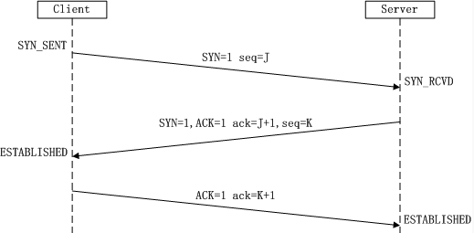
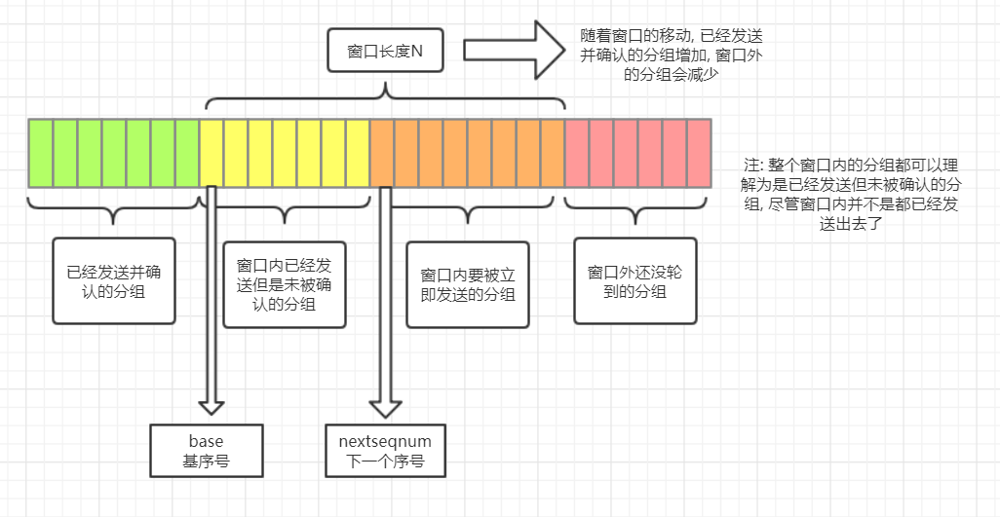
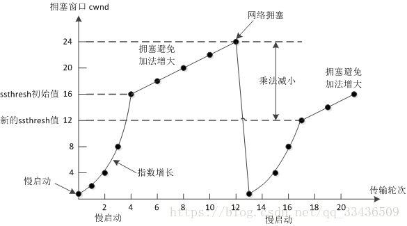
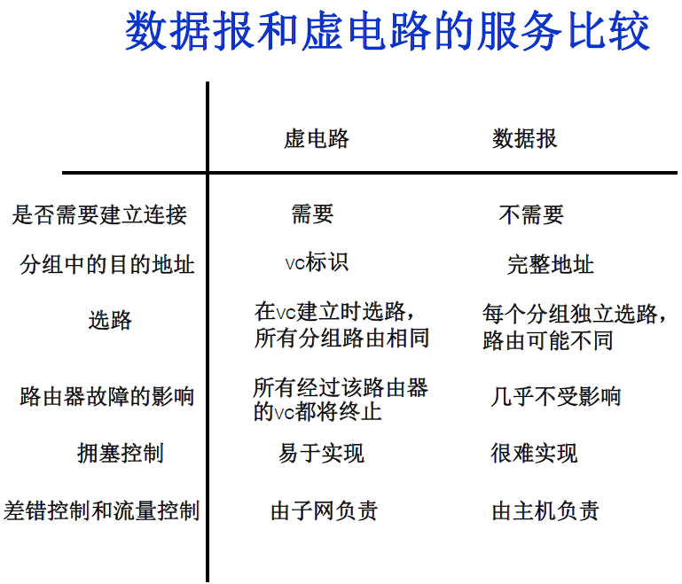
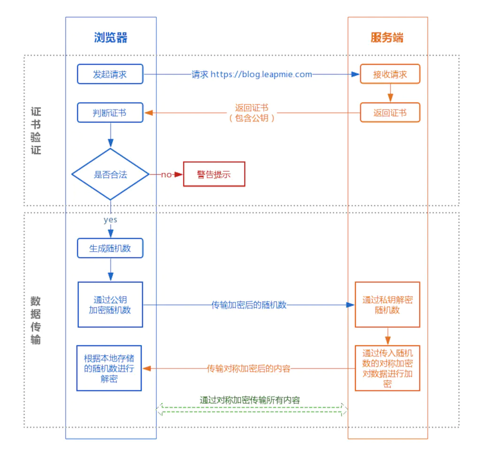
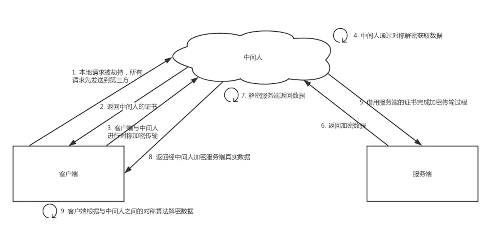
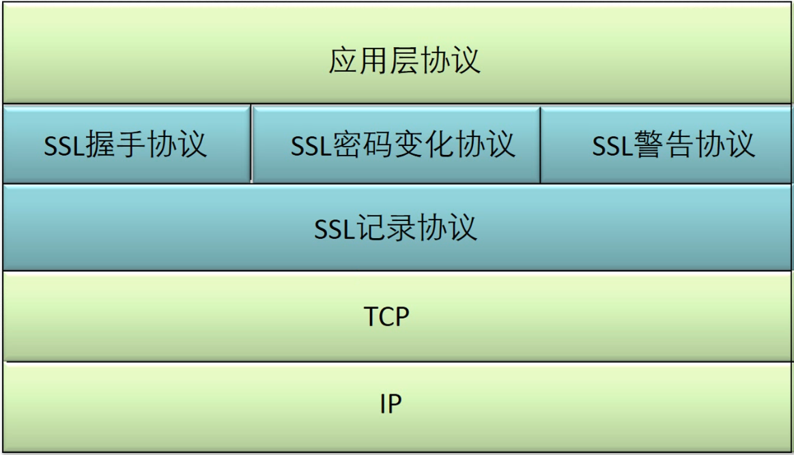
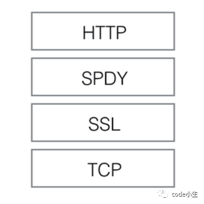

# 1. 理论

> 大多数内容都是出自谢希仁的计算机网络，可能会延后一些再整理

## 1.1. 思维导图

旧版思维导图

 

查看新版思维导图：[思维导图](https://whitestarrain.github.io/Note/YourBrain.html)

# 2. 常见问题

## 2.1. 基础

## 2.2. 物理层

## 2.3. 链路层

## 2.4. 网络层

### 2.4.1. 网络分为哪几类

### 2.4.2. 什么是划分子网，构成超网

### 2.4.3. 什么是ARP协议

## 2.5. 传输层

### 2.5.1. 什么是三次握手 (three-way handshake)？

展开

- 第一次握手：Client将SYN置1，随机产生一个初始序列号seq发送给Server，进入SYN_SENT状态；
- 第二次握手：Server收到Client的SYN=1之后，知道客户端请求建立连接，将自己的SYN置1，ACK置1，产生一个acknowledge number=sequence number+1，并随机产生一个自己的初始序列号，发送给客户端；进入SYN_RCVD状态；
- 第三次握手：客户端检查acknowledge number是否为序列号+1，ACK是否为1，检查正确之后将自己的ACK置为1，产生一个acknowledge number=服务器发的序列号+1，发送给服务器；进入ESTABLISHED状态；服务器检查ACK为1和acknowledge number为序列号+1之后，也进入ESTABLISHED状态；完成三次握手，连接建立。

#### 2.5.1.1. TCP 建立连接可以两次握手吗？为什么?

展开

不可以。有两个原因：

首先，可能会出现**已失效的连接请求报文段又传到了服务器端**。

> client 发出的第一个连接请求报文段并没有丢失，而是在某个网络结点长时间的滞留了，以致延误到连接释放以后的某个时间才到达 server。本来这是一个早已失效的报文段。但 server 收到此失效的连接请求报文段后，就误认为是 client 再次发出的一个新的连接请求。于是就向 client 发出确认报文段，同意建立连接。假设不采用 “三次握手”，那么只要 server 发出确认，新的连接就建立了。由于现在 client 并没有发出建立连接的请求，因此不会理睬 server 的确认，也不会向 server 发送数据。但 server 却以为新的运输连接已经建立，并一直等待 client 发来数据。这样，server 的很多资源就白白浪费掉了。采用 “三次握手” 的办法可以防止上述现象发生。例如刚才那种情况，client 不会向 server 的确认发出确认。server 由于收不到确认，就知道 client 并没有要求建立连接。

其次，两次握手无法保证 Client 正确接收第二次握手的报文（Server 无法确认 Client 是否收到），也无法保证 Client 和 Server 之间成功互换初始序列号。

#### 2.5.1.2. 可以采用四次握手吗？为什么？

展开

可以。但是会降低传输的效率。

四次握手是指：第二次握手：Server 只发送 ACK 和 acknowledge number；而 Server 的 SYN 和初始序列号在第三次握手时发送；原来协议中的第三次握手变为第四次握手。出于优化目的，四次握手中的二、三可以合并。

#### 2.5.1.3. 第三次握手中，如果客户端的 ACK 未送达服务器，会怎样？

展开

Server 端：  
由于 Server 没有收到 ACK 确认，因此会重发之前的 SYN+ACK（默认重发五次，之后自动关闭连接进入 CLOSED 状态），Client 收到后会重新传 ACK 给 Server。

Client 端，两种情况：

1. 在 Server 进行超时重发的过程中，如果 Client 向服务器发送数据，数据头部的 ACK 是为 1 的，所以服务器收到数据之后会读取 ACK number，进入 establish 状态
2. 在 Server 进入 CLOSED 状态之后，如果 Client 向服务器发送数据，服务器会以 RST 包应答。

#### 2.5.1.4. 如果已经建立了连接，但客户端出现了故障怎么办？

展开

服务器每收到一次客户端的请求后都会重新复位一个计时器，时间通常是设置为 2 小时，若两小时还没有收到客户端的任何数据，服务器就会发送一个探测报文段，以后每隔 75 秒钟发送一次。若一连发送 10 个探测报文仍然没反应，服务器就认为客户端出了故障，接着就关闭连接。

#### 2.5.1.5. 初始序列号是什么？

展开

TCP 连接的一方 A，随机选择一个 32 位的序列号（Sequence Number）作为发送数据的初始序列号（Initial Sequence Number，ISN），比如为 1000，以该序列号为原点，对要传送的数据进行编号：1001、1002...三次握手时，把这个初始序列号传送给另一方 B，以便在传输数据时，B 可以确认什么样的数据编号是合法的；同时在进行数据传输时，A 还可以确认 B 收到的每一个字节，如果 A 收到了 B 的确认编号（acknowledge number）是 2001，就说明编号为 1001-2000 的数据已经被 B 成功接受。

### 2.5.2. 什么是四次挥手？

展开

- 第一次挥手：Client 将 FIN 置为 1，发送一个序列号 seq 给 Server；进入 FIN_WAIT_1 状态；
- 第二次挥手：Server 收到 FIN 之后，发送一个 ACK=1，acknowledge number=收到的序列号+1；进入 CLOSE_WAIT 状态。此时客户端已经没有要发送的数据了，但仍可以接受服务器发来的数据。
- 第三次挥手：Server 将 FIN 置 1，发送一个序列号给 Client；进入 LAST_ACK 状态；
- 第四次挥手：Client 收到服务器的 FIN 后，进入 TIME_WAIT 状态；接着将 ACK 置 1，发送一个 acknowledge number=序列号+1 给服务器；服务器收到后，确认 acknowledge number 后，变为 CLOSED 状态，不再向客户端发送数据。客户端等待 2\*MSL（报文段最长寿命）时间后，也进入 CLOSED 状态。完成四次挥手。

#### 2.5.2.1. 为什么不能把服务器发送的 ACK 和 FIN 合并起来，变成三次挥手（CLOSE_WAIT 状态意义是什么）？

展开

因为服务器收到客户端断开连接的请求时，可能还有一些数据没有发完，这时先回复 ACK，表示接收到了断开连接的请求。等到数据发完之后再发 FIN，断开服务器到客户端的数据传送。

#### 2.5.2.2. 如果第二次挥手时服务器的 ACK 没有送达客户端，会怎样？

展开

客户端没有收到 ACK 确认，会重新发送 FIN 请求。

#### 2.5.2.3. 客户端 TIME_WAIT 状态的意义是什么？

展开

第四次挥手时，客户端发送给服务器的 ACK 有可能丢失，TIME_WAIT 状态就是用来重发可能丢失的 ACK 报文。如果 Server 没有收到 ACK，就会重发 FIN，如果 Client 在 2\*MSL 的时间内收到了 FIN，就会重新发送 ACK 并再次等待 2MSL，防止 Server 没有收到 ACK 而不断重发 FIN。

MSL(Maximum Segment Lifetime)，指一个片段在网络中最大的存活时间，2MSL 就是一个发送和一个回复所需的最大时间。如果直到 2MSL，Client 都没有再次收到 FIN，那么 Client 推断 ACK 已经被成功接收，则结束 TCP 连接。

#### 2.5.2.4. 服务器出现了大量CLOSE_WAIT状态如何解决

展开

大量 CLOSE_WAIT 表示程序出现了问题，对方的 socket 已经关闭连接，而我方忙于读或写没有及时关闭连接，需要检查代码，特别是释放资源的代码，或者是处理请求的线程配置。

### 2.5.3. 说明一下syn超时，洪泛攻击

展开

什么 SYN 是洪泛攻击？ 在 TCP 的三次握手机制的第一步中，客户端会向服务器发送 SYN 报文段。服务器接收到 SYN 报文段后会为该TCP分配缓存和变量，如果攻击分子大量地往服务器发送 SYN 报文段，服务器的连接资源终将被耗尽，导致内存溢出无法继续服务。

#### 2.5.3.1. 有什么解决策略

展开

最常用的一个手段就是优化主机系统设置。比如降低SYN timeout时间，使得主机尽快释放半连接的占用或者采用SYN cookie设置，如果短时间内收到了某个IP的重复SYN请求，我们就认为受到了攻击。我们合理的采用防火墙设置等外部网络也可以进行拦截。

SYN Cookie： 当服务器接受到 SYN 报文段时，不直接为该 TCP 分配资源，而只是打开一个半开的套接字。接着会使用 SYN 报文段的源Id，目的Id，端口号以及只有服务器自己知道的一个秘密函数生成一个 cookie，并把 cookie 作为序列号响应给客户端。

如果客户端是正常建立连接，将会返回一个确认字段为 cookie + 1 的报文段。接下来服务器会根据确认报文的源Id，目的Id，端口号以及秘密函数计算出一个结果，如果结果的值 + 1等于确认字段的值，则证明是刚刚请求连接的客户端，这时候才为该 TCP 分配资源

这样一来就不会为恶意攻击的 SYN 报文段分配资源空间，避免了攻击。

### 2.5.4. 自动重传请求(ARQ协议)

### 2.5.5. TCP 如何实现流量控制？(连续ARQ协议)

展开

使用滑动窗口协议实现流量控制。防止发送方发送速率太快，接收方缓存区不够导致溢出。接收方会维护一个接收窗口 receiver window（窗口大小单位是字节），接受窗口的大小是根据自己的资源情况动态调整的，在返回 ACK 时将接受窗口大小放在 TCP 报文中的窗口字段告知发送方。发送窗口的大小不能超过接受窗口的大小，只有当发送方发送并收到确认之后，才能将发送窗口右移。

发送窗口的上限为接受窗口和拥塞窗口中的较小值。接受窗口表明了接收方的接收能力，拥塞窗口表明了网络的传送能力。

#### 2.5.5.1. 什么是零窗口（接收窗口为 0 时会怎样）？

展开

如果接收方没有能力接收数据，就会将接收窗口设置为 0，这时发送方必须暂停发送数据，但是会启动一个持续计时器(persistence timer)，到期后发送一个大小为 1 字节的探测数据包，以查看接收窗口状态。如果接收方能够接收数据，就会在返回的报文中更新接收窗口大小，恢复数据传送。

#### 2.5.5.2. 什么是go-back-n

### 2.5.6. TCP的拥塞控制时怎么实现的

展开

拥塞控制主要由四个算法组成：**慢启动（Slow Start）、拥塞避免（Congestion voidance）、快重传 （Fast Retransmit）、快恢复（Fast Recovery）**

1. 慢启动：刚开始发送数据时，先把拥塞窗口（congestion window）设置为一个最大报文段 MSS 的数值，每收到一个新的确认报文之后，就把拥塞窗口加 1 个 MSS。这样每经过一个传输轮次（或者说是每经过一个往返时间 RTT），拥塞窗口的大小就会加倍

2. 拥塞避免：当拥塞窗口的大小达到慢开始门限(slow start threshold)时，开始执行拥塞避免算法，拥塞窗口大小不再指数增加，而是线性增加，即每经过一个传输轮次只增加 1MSS.

   > 无论在慢开始阶段还是在拥塞避免阶段，只要发送方判断网络出现拥塞（其根据就是没有收到确认），就要把慢开始门限 ssthresh 设置为出现拥塞时的发送方窗口值的一半（但不能小于 2）。然后把拥塞窗口 cwnd 重新设置为 1，执行慢开始算法。**（这是不使用快重传的情况）**

3. 快重传：快重传要求接收方在收到一个失序的报文段后就立即发出**重复确认**（为的是使发送方及早知道有报文段没有到达对方）而不要等到自己发送数据时捎带确认。快重传算法规定，发送方只要一连收到三个重复确认就应当立即重传对方尚未收到的报文段，而不必继续等待设置的重传计时器时间到期。

4. 快恢复：当发送方连续收到三个重复确认时，就把慢开始门限减半，然后执行拥塞避免算法。不执行慢开始算法的原因：因为如果网络出现拥塞的话就不会收到好几个重复的确认，所以发送方认为现在网络可能没有出现拥塞。  
   也有的快重传是把开始时的拥塞窗口 cwnd 值再增大一点，即等于 ssthresh + 3\*MSS 。这样做的理由是：既然发送方收到三个重复的确认，就表明有三个分组已经离开了网络。这三个分组不再消耗网络的资源而是停留在接收方的缓存中。可见现在网络中减少了三个分组。因此可以适当把拥塞窗口扩大些。

### 2.5.7. TCP和UDP的区别

展开

1. TCP 是面向连接的，UDP 是无连接的；

  

  
什么叫无连接？

  UDP 发送数据之前不需要建立连接

  

2. TCP 是可靠的，UDP 不可靠；

  

  
什么叫不可靠？

  UDP 接收方收到报文后，不需要给出任何确认

  

3. TCP 只支持点对点通信，UDP 支持一对一、一对多、多对一、多对多；
4. TCP 是面向字节流的，UDP 是面向报文的；
  

  
什么意思？

  面向字节流是指发送数据时以字节为单位，一个数据包可以拆分成若干组进行发送，而 UDP 一个报文只能一次发完。

  

5. TCP 有拥塞控制机制，UDP 没有。网络出现的拥塞不会使源主机的发送速率降低，这对某些实时应用是很重要的，比如媒体通信，游戏；
6. TCP 首部开销（20 字节）比 UDP 首部开销（8 字节）要大
7. UDP 的主机不需要维持复杂的连接状态表

#### 2.5.7.1. 什么时候选择 TCP，什么时候选 UDP？

展开

对某些实时性要求比较高的情况，选择UDP，比如游戏，媒体通信，实时视频流（直播），即使出现传输错误也可以容忍；其它大部分情况下，HTTP都是用TCP，因为要求传输的内容可靠，不出现丢失

#### 2.5.7.2. HTTP 可以使用 UDP 吗？

展开

HTTP不可以使用UDP，HTTP需要基于可靠的传输协议，而UDP不可靠

#### 2.5.7.3. 面向连接和无连接的区别(端到端和点对点)

展开

无连接的网络服务（数据报服务）-- 面向连接的网络服务（虚电路服务）

虚电路服务：首先建立连接，所有的数据包经过相同的路径，服务质量有较好的保证；

数据报服务：每个数据包含目的地址，数据路由相互独立（路径可能变化）；网络尽最大努力交付数据，但不保证不丢失、不保证先后顺序、不保证在时限内交付；网络发生拥塞时，可能会将一些分组丢弃；

### 2.5.8. TCP 如何保证传输的可靠性

展开

- 流量控制：确保接收端能够接收发送方的数据而不会缓冲区溢出
- 数据包校验
- 丢弃重复数据
- 对失序数据包重新排序（TCP 报文具有序列号）
- 应答机制：接收方收到数据之后，会发送一个确认（通常延迟几分之一秒）；
- 超时重发：发送方发出数据之后，启动一个定时器，超时未收到接收方的确认，则重新发送这个数据；

## 2.6. 应用层

### 2.6.1. HTTP 和 HTTPS 有什么区别？

展开

1. 端口不同：HTTP 使用的是 80 端口，HTTPS 使用 443 端口；
2. HTTP（超文本传输协议）信息是明文传输，HTTPS 运行在 SSL(Secure Socket Layer)之上，添加了加密和认证机制，更加安全；
3. HTTPS 由于加密解密会带来更大的 CPU 和内存开销；
4. HTTPS 通信需要证书，一般需要向证书颁发机构（CA）购买

#### 2.6.1.1. Https 的连接过程？

展开

- **证书验证阶段**：确认算法，验证证书
  - 客户端向服务器发送请求
    - 发送请求时同时发送客户端支持的一套加密规则
    - 包括对称加密、非对称加密、摘要(Hash)算法
  - 服务端返回证书
    - 服务器从中选出一组加密算法与 HASH 算法
    - 返回证书（代表自己的身份信息）
    - 证书里面包含了：
      - 网站地址
      - **加密公钥**（用于非对称加密）（私钥只能用于服务器端进行解密）
      - 以及证书的颁发机构等信息
  - 客户端验证服务器的合法性
    - 证书是否过期
    - CA 是否可靠
    - 发行者证书的公钥能否正确解开服务器证书的“发行者的数字签名”
    - 服务器证书上的域名是否和服务器的实际域名相匹配
- **数据传输阶段**
  - 发送对称加密算法的**随机密钥**以及摘要
    > 简而言之，使用非对称加密来加密对称加密的密钥；使用对称加密加密通过Hash算法得到的摘要。
    - 如果证书受信任，或者用户接收了不受信任的证书，浏览器会生成一个**随机密钥**（用于对称算法）
    - **随机密钥**会使用服务器提供的公钥加密
    - 使用 Hash 算法对握手消息进行**摘要**计算，并对摘要使用之前产生的**随机密钥**加密
    - 将加密后的随机密钥和摘要一起发送给服务器；
  - 服务器解密得到**对称算法密钥**，并验证摘要（验证摘要1）
    - 服务器使用自己的私钥解密，得到对称加密的密钥
    - 对称加密密钥解密出 Hash 摘要值
    - 使用Hash摘要值验证握手消息是否一致
      - 如果一致，服务器使用对称加密的密钥加密握手消息发给浏览器；
  - 浏览器解密并验证摘要（验证摘要2）
    - 若一致，则握手结束
  - 数据传输
    - 之后的数据传送都使用对称加密的密钥进行加密

总结：**非对称加密算法用于在握手过程中加密生成的密码；对称加密算法用于对真正传输的数据进行加密；HASH 算法用于验证数据的完整性。**

#### 2.6.1.4. HTTPS 连接的时候，怎么确定收到的包是服务器发来的（中间人攻击）？

展开

HTTP 协议被认为不安全是因为传输过程容易被监听者勾线监听、伪造服务器，而 HTTPS 协议主要解决的便是网络传输的安全性问题。

首先我们假设不存在认证机构，任何人都可以制作证书，这带来的安全风险便是经典的**“中间人攻击”**问题。
“中间人攻击”的具体过程如下：

- 本地请求被劫持（如DNS劫持等），所有请求均发送到中间人的服务器
- 中间人服务器返回中间人自己的证书
- 客户端创建随机数，通过中间人证书的公钥对随机数加密后传送给中间人，然后凭随机数构造对称加密对传输内容进行加密传输
- 中间人因为拥有客户端的随机数，可以通过对称加密算法进行内容解密
- 中间人以客户端的请求内容再向正规网站发起请求
- 因为中间人与服务器的通信过程是合法的，正规网站通过建立的安全通道返回加密后的数据
- 中间人凭借与正规网站建立的对称加密算法对内容进行解密
- 中间人通过与客户端建立的对称加密算法对正规内容返回的数据进行加密传输
- 客户端通过与中间人建立的对称加密算法对返回结果数据进行解密

#### 2.6.1.2. https如何保证连接的安全性？(连接过程说明)

展开

**如何安全地进行数据传输？**

假设现在A和B要进行安全的通信，那么究竟怎样才算是安全的通信？很自然地会想到：A和B之间传递数据，这些数据只有A和B才看得懂，中间人就算截取了信息但也看不懂，这才算得上安全。

**安全通信的处理手段：**

为了能让A和B才能看懂，就必须要对数据进行加密，而且首先想到的就是对称加密。对称加密的意思是A和B各持有一个相同的密钥，它们传递信息时会用密钥给信息加密，在消息到达端给消息解密，完成安全通信。

在对称加密中又会涉及到加密算法的选择问题。现实世界中，通常是多个客户端面向一个服务器的情况，不可能让每个客户端和服务器之间都采用相同的加密算法，如果是这样那和没加密差不多。所以注定每个客户端和服务器之间都会采用不同的加密方式。

**如何让每个客户端与服务器之间都采用不同的加密方式？**

要想对不同的机器使用不同的加密方式，最直接想到的就是使用随机数。也就说客户端和服务器之间每次都基于一个随机数产生加密算法。（具体实现时为了保证随机，用到还不止一个随机数）

这个产生加密算法的过程称之为协商，现在问题是协商的过程是透明的，也就是说中间人可以截获协商的过程，从而知道我们的加密方式。为了解决这个问题，我们需要对协商的过程进行加密。

**如何对协商的过程进行加密？**

之所以能来到这一步，是因为我们一开始就选择使用了对称加密，也就说一开始的对称加密导致了现在的问题，所以这时我们不能再使用对称加密了，否则会陷入死循环。

在密码学领域，还有一种加密过程叫非对称加密，它的逻辑是这样的：通信双方一方持有私钥，一方持有公钥，经过私钥加密的信息，都能通过公钥进行解密。但是经过公钥加密的数据，只有私钥可以解密。

按照非对称加密的规则，我们让服务器持有私钥，让客户端持有公钥。这样就能保证客户端给服务器发送消息的时候是安全的（相反，服务器给客户端发送消息就是不安全的），我们可以把协商时重要的逻辑安排在客户端给服务器发送信息的过程中，从而保证了协商过程的安全性。

**客户端如何获得公钥？**

现在用非对称加密算法解决了协商的安全问题，但是非对称加密的前提是客户端需要获得公钥，这又是一个问题了，客户端与服务器打交道之前是互不知道双方身份的，怎么才能让客户端获得公钥呢？

也就只有两种办法：

1. 客户端向服务器要公钥
2. 客户端向一个远程的公共服务器获取公钥

方法2显然是不行的，尚且不说多了一个访问节点，如何找到公共服务器的地址也是一个待解决的问题，所以还是使用方法1。

但是方法1存在一个问题：如果中间人把服务器发送给客户端的公钥调包了怎么办？也就是说客户端无法知道发送公钥的是否是正真的服务器。

**引入第三方机构解决问题**

客户端无法辨识服务端和中间人的问题称为“身份验证”问题，也就是说我们需要为服务器向客户端发送公钥的过程进行加密。

这下完了，之前我们因遇到对称加密的瓶颈选择了非对称加密，现在使用非对称加密也遇到了瓶颈。显然这两种加密方式都是不可用的了，否则会再次陷入死循环。

接下来我们只好通过第三方机构的介入，解决这个问题。首先我们自己保存有第三方权威机构的公钥，然后第三方机构使用私钥对服务器将要发送给客户端的公钥进行加密，客户端接收到这个经加密的公钥后（数字证书），就能通过自己保存的第三方机构公钥进行解密。

> 到这里为止，我们解释了HTTPS中使用到的对称加密，非对称加密，CA，数字证书的概念，但是还差一个叫数字签名的概念没有解释。

在现实生活中，CA不单止会给我们正常公司发放证书，还会给中间人的坏公司发放证书，如果中间人把发放的证书调包了怎么办？这时我们仍能用CA的私钥进行解密，但是证书已经被调包了。

那么客户端怎样验证证书的真伪呢？答案是证书本身会告诉客户端如何辨认真伪。比方说证书上面有一个证书编号，还有一个如何计算证书编号的方法，客户端可以根据计算证书编号的方法计算出自己要获得的证书的编号，然后把这个编号和证书上的编号进行比对，如果一样证明没有被调包。

这里的证书编号指的就是数字签名，证书指的就是数字证书。

总结一下HTTPS：HTTPS想要保证客户端与服务器之间的通信安全，就得使用对称加密算法进行加密。协商对称加密算法的过程通过非对称加密算法来保证。在非对称加密算法中，客户端获得公钥的过程需要第三方机构（CA）通过颁发数字证书保证安全性。

总得来说通过这一系列机制协商出了一个对称加密算法后，客户端与服务器之间就能通过该算法进行安全的通信了。

#### SSL，HTTPS，TLS三者的区别

展开

- SSL：
  - Secure Socket Layer，安全套接字层，
  - 位于可靠的面向连接的网络层协议和应用层协议之间的一种协议层
  - SSL通过互相认证、使用数字签名确保完整性、使用加密确保私密性，以实现客户端和服务器之间的安全通讯
  - 该协议由两层组成：SSL记录协议和SSL握手协议。
    - SSL记录协议（SSL Record Protocol）：它建立在可靠的传输协议（如TCP）之上，为高层协议提供数据封装、压缩、加密等基本功能的支持。
    - SSL握手协议（SSL Handshake Protocol）：它建立在SSL记录协议之上，用于在实际的数据传输开始前，通讯双方进行身份认证、协商加密算法、交换加密密钥等。

- TLS：
  - Transport Layer Security，传输层安全协议
  - 用于两个应用程序之间提供保密性和数据完整性
  - 该协议由两层组成：TLS记录协议和TLS握手协议。

- 称呼问题
  - SSL由从前的网景公司开发，有1,2,3三个版本，但现在只使用版本3
  - TLS是SSL的标准化后的产物。有1.0 1.1 1.2三个版本
  - 默认使用1.0
  - TLS1.0和SSL3.0几乎没有区别
  - 事实上我们现在用的都是TLS，但因为历史上习惯了SSL这个称呼
  - 平常还是以SSL为多。

#### 2.6.1.3. 输入 www.baidu.com，怎么变成 https://www.baidu.com 的，怎么确定用 HTTP 还是 HTTPS？

展开

[你访问的网站是如何自动切换到 HTTPS 的？](https://www.sohu.com/a/136637876_487516)

一种是原始的 302 跳转，服务器把所有的 HTTp 流量跳转到 HTTPS。但这样有一个漏洞，就是中间人可能在第一次访问站点的时候就劫持。
解决方法是引入 HSTS 机制，用户浏览器在访问站点的时候强制使用 HTTPS。

#### 2.6.1.5. 什么是对称加密、非对称加密？区别是什么？

展开

- 对称加密：加密和解密采用相同的密钥。如：DES、RC2、RC4
- 非对称加密：需要两个密钥：公钥和私钥。如果用公钥加密，需要用私钥才能解密。如：RSA
- 区别：对称加密速度更快，通常用于大量数据的加密；非对称加密安全性更高（不需要传送私钥）

#### 2.6.1.6. 数字签名、报文摘要的原理

展开

- 发送者 A 用私钥进行签名，接收者 B 用公钥验证签名。因为除 A 外没有人有私钥，所以 B 相信签名是来自 A。A 不可抵赖，B 也不能伪造报文。
- 摘要算法:MD5、SHA

#### 2.6.1.7. 其他加密算法

展开

### 2.6.2. HTTP1.0、1.1、2.0之间的区别

展开

> **HTTP1.1**

HTTP1.0最早在网页中使用是在1996年，那个时候只是使用一些较为简单的网页上和网络请求上
而HTTP1.1则在1999年才开始广泛应用于现在的各大浏览器网络请求中，同时HTTP1.1也是当前使用最为广泛的HTTP协议

- **HTTP1.0和HTTP1.1的一些区别**
  1. **缓存处理**，在HTTP1.0中主要使用header里的If-Modified-Since,Expires来做为缓存判断的标准，HTTP1.1则引入了更多的缓存控制策略例如Entity tag，If-Unmodified-Since, If-Match, If-None-Match等更多可供选择的缓存头来控制缓存策略。
  2. **带宽优化及网络连接的使用**，HTTP1.0中，存在一些浪费带宽的现象，例如客户端只是需要某个对象的一部分，而服务器却将整个对象送过来了，并且不支持断点续传功能，HTTP1.1则在请求头引入了range头域，它允许只请求资源的某个部分，即返回码是206（Partial Content），这样就方便了开发者自由的选择以便于充分利用带宽和连接。
  3. **错误通知的管理**，在HTTP1.1中新增了24个错误状态响应码，如409（Conflict）表示请求的资源与资源的当前状态发生冲突；410（Gone）表示服务器上的某个资源被永久性的删除。
  4. **Host头处理**，在HTTP1.0中认为每台服务器都绑定一个唯一的IP地址，因此，请求消息中的URL并没有传递主机名（hostname）。但随着虚拟主机技术的发展，在一台物理服务器上可以存在多个虚拟主机（Multi-homed Web Servers），并且它们共享一个IP地址。HTTP1.1的请求消息和响应消息都应支持Host头域，且请求消息中如果没有Host头域会报告一个错误（400 Bad Request）。
  5. **长连接**，HTTP 1.1支持长连接（PersistentConnection）和请求的流水线（Pipelining）处理，在一个TCP连接上可以传送多个HTTP请求和响应，减少了建立和关闭连接的消耗和延迟，在HTTP1.1中默认开启Connection： keep-alive，一定程度上弥补了HTTP1.0每次请求都要创建连接的缺点。

> **SPDY：HTTP1.x的优化**

- **SPDY相较于HTTP1.x**
  > 2012年google如一声惊雷提出了SPDY的方案，优化了HTTP1.X的请求延迟，解决了HTTP1.X的安全性，具体如下：
  1. **降低延迟**，针对HTTP高延迟的问题，SPDY优雅的采取了多路复用（multiplexing）。多路复用通过多个请求stream共享一个tcp连接的方式，解决了HOL blocking的问题，降低了延迟同时提高了带宽的利用率。
  2. **请求优先级**（request prioritization）。多路复用带来一个新的问题是，在连接共享的基础之上有可能会导致关键请求被阻塞。SPDY允许给每个request设置优先级，这样重要的请求就会优先得到响应。比如浏览器加载首页，首页的html内容应该优先展示，之后才是各种静态资源文件，脚本文件等加载，这样可以保证用户能第一时间看到网页内容。
  3. **header压缩。**前面提到HTTP1.x的header很多时候都是重复多余的。选择合适的压缩算法可以减小包的大小和数量。
  4. **基于HTTPS的加密协议传输**，大大提高了传输数据的可靠性。
  5. **服务端推送**（server push），采用了SPDY的网页，例如我的网页有一个sytle.css的请求，在客户端收到sytle.css数据的同时，服务端会将sytle.js的文件推送给客户端，当客户端再次尝试获取sytle.js时就可以直接从缓存中获取到，不用再发请求了。

  
  > SPDY位于HTTP之下，TCP和SSL之上，这样可以轻松兼容老版本的HTTP协议(将HTTP1.x的内容封装成一种新的frame格式)，同时可以使用已有的SSL功能。

> **HTTP2.0：SPDY的升级版**。

- **HTTP2.0和HTTP1.X相比的新特性**
  - **新的二进制格式**（Binary Format），HTTP1.x的解析是基于文本。基于文本协议的格式解析存在天然缺陷，文本的表现形式有多样性，要做到健壮性考虑的场景必然很多，二进制则不同，只认0和1的组合。基于这种考虑HTTP2.0的协议解析决定采用二进制格式，实现方便且健壮。
  - **多路复用**（MultiPlexing），即连接共享，即每一个request都是是用作连接共享机制的。一个request对应一个id，这样一个连接上可以有多个request，每个连接的request可以随机的混杂在一起，接收方可以根据request的 id将request再归属到各自不同的服务端请求里面。
  - **header压缩**，如上文中所言，对前面提到过HTTP1.x的header带有大量信息，而且每次都要重复发送，HTTP2.0使用encoder来减少需要传输的header大小，通讯双方各自cache一份header fields表，既避免了重复header的传输，又减小了需要传输的大小。
  - **服务端推送**（server push），同SPDY一样，HTTP2.0也具有server push功能。

#### 2.6.2.1. HTTP2.0的多路复用和HTTP1.X中的长连接复用有什么区别？

展开

- HTTP/1.0 一次请求-响应，建立一个连接，用完关闭；每一个请求都要建立一个连接；
- HTTP/1.1 Pipeling解决方式为，若干个请求排队串行化单线程处理，后面的请求等待前面请求的返回才能获得执行机会，一旦有某请求超时等，后续请求只能被阻塞，毫无办法，也就是人们常说的线头阻塞；
- HTTP/2多个请求可同时在一个连接上并行执行。某个请求任务耗时严重，不会影响到其它连接的正常执行；

  

#### 2.6.2.2. 为什么需要头部压缩？

展开

假定一个页面有100个资源需要加载（这个数量对于今天的Web而言还是挺保守的）, 而每一次请求都有1kb的消息头（这同样也并不少见，因为Cookie和引用等东西的存在）, 则至少需要多消耗100kb来获取这些消息头。

HTTP2.0可以维护一个字典，差量更新HTTP头部，大大降低因头部传输产生的流量。具体参考：HTTP/2 头部压缩技术介绍

#### 2.6.2.3. HTTP2.0多路复用有多好？

展开

HTTP 性能优化的关键并不在于高带宽，而是低延迟。TCP 连接会随着时间进行自我「调谐」，起初会限制连接的最大速度，如果数据成功传输，会随着时间的推移提高传输的速度。这种调谐则被称为 TCP 慢启动（TCP拥塞控制中的）

由于这种原因，让原本就具有突发性和短时性的 HTTP 连接变的十分低效。

HTTP/2 通过让所有数据流共用同一个连接，可以更有效地使用 TCP 连接，让高带宽也能真正的服务于 HTTP 的性能提升。

### 2.6.3. 请求行、请求头、请求体、响应行、响应头、响应体都包括什么

### 2.6.4. GET 与 POST 的区别？

展开

- 从 HTTP 报文层面来看，GET 请求将信息放在 URL，POST 将请求信息放在请求体中。这一点使得 GET 请求携带的数据量有限，因为 URL 本身是有长度限制的，而 POST 请求的数据存放在报文体中，因此对大小没有限制。而且从形式上看，GET 请求把数据放 URL 上感觉不太安全，而 POST 请求把数据放在请求体里似乎安全一些。实际上想要获取 POST 请求中的内容还是很容易的，因此两者在安全性上其实没有太大差异，想要实现安全的信息传输还是得靠 HTTPS
- 从数据库层面来看，GET 符合幂等性和安全性，而 POST 请求不符合。这个其实和 GET/POST 请求的作用有关。按照 HTTP 的约定，GET 请求用于查看信息，不会改变服务器上的信息；而 POST 请求用来改变服务器上的信息。正因为 GET 请求只查看信息，不改变信息，对数据库的一次或多次操作获得的结果是一致的，认为它符合幂等性。安全性是指对数据库操作没有改变数据库中的数据。
- 从其他层面来看，GET 请求能够被缓存，GET 请求能够保存在浏览器的浏览记录里，GET 请求的 URL 能够保存为浏览器书签。这些都是 POST 请求所不具备的。缓存是 GET 请求被广泛应用的根本，他能够被缓存也是因为它的幂等性和安全性，除了返回结果没有其他多余的动作，因此绝大部分的 GET 请求都被 CDN 缓存起来了，大大减少了 Web 服务器的负担。

### 2.6.5. 什么是cookie和session

展开

由于 http 协议是无状态协议，如果客户通过浏览器访问 web 应用时没有一个保存用户访问状态的机制，那么将不能持续跟踪应用的操作。比如当用户往购物车中添加了商品，web 应用必须在用户浏览别的商品的时候仍保存购物车的状态，以便用户继续往购物车中添加商品。

cookie 是浏览器的一种缓存机制，它可用于维持客户端与服务器端之间的会话。由于下面一题会讲到session，所以这里要强调cookie会将会话保存在客户端（session则是把会话保存在服务端）

这里以最常见的登陆案例讲解cookie的使用过程：

1. 首先用户在客户端浏览器向服务器发起登陆请求
2. 登陆成功后，服务端会把登陆的用户信息设置 cookie 中，返回给客户端浏览器
3. 客户端浏览器接收到 cookie 请求后，会把 cookie 保存到本地（可能是内存，也可能是磁盘，看具体使用情况而定）
4. 以后再次访问该 web 应用时，客户端浏览器就会把本地的 cookie 带上，这样服务端就能根据 cookie 获得用户信息了

  

session 是一种维持客户端与服务器端会话的机制。但是与 cookie 把会话信息保存在客户端本地不一样，session 把会话保留在浏览器端。

   我们同样以登陆案例为例子讲解 session 的使用过程：

   1. 首先用户在客户端浏览器发起登陆请求
   2. 登陆成功后，服务端会把用户信息保存在服务端，并返回一个唯一的 session 标识给客户端浏览器。
   3. 客户端浏览器会把这个唯一的 session 标识保存在起来
   4. 以后再次访问 web 应用时，客户端浏览器会把这个唯一的 session 标识带上，这样服务端就能根据这个唯一标识找到用户信息。

   看到这里可能会引起疑问：把唯一的 session 标识返回给客户端浏览器，然后保存起来，以后访问时带上，这难道不是 cookie 吗？

   没错，session 只是一种会话机制，在许多 web 应用中，session 机制就是通过 cookie 来实现的。也就是说它只是使用了 cookie 的功能，并不是使用 cookie 完成会话保存。与 cookie 在保存客户端保存会话的机制相反，session 通过 cookie 的功能把会话信息保存到了服务端。

   进一步地说，session 是一种维持服务端与客户端之间会话的机制，它可以有不同的实现。以现在比较流行的小程序为例，阐述一个 session 的实现方案：

   1. 首先用户登陆后，需要把用户登陆信息保存在服务端，这里我们可以采用 redis。比如说给用户生成一个 userToken，然后以 userId 作为键，以 userToken 作为值保存到 redis 中，并在返回时把 userToken 带回给小程序端。
   2. 小程序端接收到 userToken 后把它缓存起来，以后每当访问后端服务时就把 userToken 带上。
   3. 在后续的服务中服务端只要拿着小程序端带来的 userToken 和 redis 中的 userToken 进行比对，就能确定用户的登陆状态了。

#### 2.6.5.1. Session 与 Cookie 的区别？

展开

- cookie 是浏览器提供的一种缓存机制，它可以用于维持客户端与服务端之间的会话
- session 指的是维持客户端与服务端会话的一种机制，它可以通过 cookie 实现，也可以通过别的手段实现。
- 如果用 cookie 实现会话，那么会话会保存在客户端浏览器中
- 而 session 机制提供的会话是保存在服务端的。

#### 2.6.5.2. session和cookie的攻击方式有哪些

待整理

[web安全之XSS攻击原理及防范](https://www.cnblogs.com/tugenhua0707/p/10909284.html)

[Session攻击（会话劫持+固定）与防御](https://www.cnblogs.com/phpstudy2015-6/p/6776919.html)

[cookie窃取和session劫持](https://www.cnblogs.com/gavin-num1/p/4555179.html)

展开

- XSS攻击
  - 反射性XSS的原理是
    - 反射性xss一般指攻击者通过特定的方式来诱惑受害者去访问一个包含恶意代码的URL。当受害者点击恶意链接url的时候，恶意代码会直接在受害者的主机上的浏览器执行。
  - 反射性XSS又可以叫做非持久性XSS。为什么叫反射型XSS呢？那是因为这种攻击方式的注入代码是从目标服务器通过错误信息，搜索结果等方式反射回来的，而为什么又叫非持久性XSS呢？那是因为这种攻击方式只有一次性。
  - 存储型XSS的原理是：主要是将恶意代码上传或存储到服务器中，下次只要受害者浏览包含此恶意代码的页面就会执行恶意代码。

session劫持：攻击者通过捕获到的Session ID访问站点即可获得目标用户合法会话。可以通过token校验解决。

#### 2.6.5.3. 如何解决分布式session问题

#### 2.6.5.4. 如果禁用浏览器 cookie，如何实现用户追踪和认证

### 2.6.6. 从输入网址到获得页面的过程 (越详细越好)？

展开

1. 浏览器查询 DNS，获取域名对应的 IP 地址:具体过程包括浏览器搜索自身的 DNS 缓存、搜索操作系统的 DNS 缓存、读取本地的 Host 文件和向本地 DNS 服务器进行查询等。对于向本地 DNS 服务器进行查询，如果要查询的域名包含在本地配置区域资源中，则返回解析结果给客户机，完成域名解析(此解析具有权威性)；如果要查询的域名不由本地 DNS 服务器区域解析，但该服务器已缓存了此网址映射关系，则调用这个 IP 地址映射，完成域名解析（此解析不具有权威性）。如果本地域名服务器并未缓存该网址映射关系，那么将根据其设置发起递归查询或者迭代查询；
2. 浏览器获得域名对应的 IP 地址以后，浏览器向服务器请求建立链接，发起三次握手；
3. TCP/IP 链接建立起来后，浏览器向服务器发送 HTTP 请求；
4. 服务器接收到这个请求，并根据路径参数映射到特定的请求处理器进行处理，并将处理结果及相应的视图返回给浏览器；
5. 浏览器解析并渲染视图，若遇到对 js 文件、css 文件及图片等静态资源的引用，则重复上述步骤并向服务器请求这些资源；
6. 浏览器根据其请求到的资源、数据渲染页面，最终向用户呈现一个完整的页面。

#### DNS使用的是什么协议

展开

**DNS在进行区域传输的时候使用TCP协议，其它时候则使用UDP协议**

- **区域传输**：
  - DNS的规范规定了2种类型的DNS服务器，一个叫主DNS服务器，一个叫辅助DNS服务器。
  - 在一个区中主DNS服务器从自己本机的数据文件中读取该区的DNS数据信息，而辅助DNS服务器则从区的主DNS服务器中读取该区的DNS数据信息。
  - 当一个辅助DNS服务器启动时，它需要与主DNS服务器通信，并加载数据信息，这就叫做区传送（zone transfer）。 

- 区域传输使用TCP原因：
  - UDP报文的最大长度为512字节，而TCP则允许报文长度超过512字节。
    > 辅域名服务器会定时（一般时3小时）向主域名服务器进行查询以便了解数据是否有变动。
    >
    > 如有变动，则会执行一次区域传送，进行数据同步。区域传送将使用TCP而不是UDP，因为数据同步传送的数据量比一个请求和应答的数据量要多得多。
  - TCP是一种可靠的连接，保证了数据的准确性。

- 域名解析使用udp原因：
  - 客户端向DNS服务器查询域名，一般返回的内容都不超过512字节，用UDP传输即可
  - 不用经过TCP三次握手，这样DNS服务器负载更低，响应更快。
    > 虽然从理论上说，客户端也可以指定向DNS服务器查询的时候使用TCP，但事实上，很多DNS服务器进行配置的时候，仅支持UDP查询包。

#### ARP协议了解吗

添加ip,路由和MAC相关说明

**获取本机IP地址，DNS服务器地址，网关路由器地址**

首先我们需要准备一个 DHCP 报文，封装在一个 UDP 报文段中，里面包括本机端口号68和目的端口号67，然后到网络层封装成数据包里面包括了本机的初始IP0.0.0.0，和广播地址255.255.255.255。接着到链路层封装成链路层帧。里面包括广播地址和本机网卡的MAC地址。最后发送到本地局域网中

这个数据包最终会被局域网中的 DHCP 服务器发现（有可能有多个 DHCP 服务器），DHCP 服务器会把可用的 IP 地址返回给我们的主机。然后操作系统选择一个 IP 地址并发送给 DHCP 服务器，最后 DHCP 服务器会返回一个包含本机 IP，DNS 服务器 IP，网关路由器 IP 的报文。

接下来我们需要通过网关路由器的 IP 地址去获得网关路由器的 MAC 地址，这样我们才可以把获取网站 IP 的 DNS 请求报文由网关发送给 DNS 服务器。这时候我们需要准备一个 ARP 请求报文，请求获取网关路由器的 MAC 地址，这个报文同样是以广播的方式发送到局域网中，网关路由器接受到请求报文就会把自己的 MAC 地址返回给本机。

**获取域名的IP地址**

接下来一切都准备好了，可以开始讲键入URL之后的事情了：

首先我们要访问 DNS 服务器获得网站对应的 IP 地址，这时我们需要把 DNS 报文封装到一个 UDP 报文中，进而封装到网络层的数据包中，填上源 IP，目的 DNS 服务器 IP 地址。接着封装链路层，填上网卡 MAC 地址和网关路由器 MAC 地址。接下来这个 DNS 请求报文就会经网关路由器发送给 DNS 服务器。

我们假设 DNS 服务器缓存有该网站的 IP 地址，（如果没有缓存会进一步向更高级的DNS服务器索要IP地址）。接着 DNS 服务器会返回该域名的 IP 地址。

### 2.6.7. HTTP 请求有哪些常见状态码？

展开

1. 1xx：代表指示信息，表示请求已接收，继续处理
2. 2xx 状态码：操作成功。200 OK
3. 3xx 状态码：重定向。301 永久重定向；302 暂时重定向
4. 4xx 状态码：客户端错误。400 Bad Request；401 Unauthorized；403 Forbidden；404 Not Found；
5. 5xx 状态码：服务端错误。500 服务器内部错误；501 服务不可用

- 常见状态码：
  - 200 OK：正常返回信息
  - 400 Bad Request：客户端请求有语法错误，不能被服务器所理解
  - 403 Forbidden：服务器收到请求，但是拒绝提供服务
  - 404 Not Found：请求资源不存在，输入了错误的URL
  - 500 Internal Server Error：服务器发生不可预期错误
  - 503 Server Unavailable：服务器当前不能处理客户端的请求，一段时间后可能恢复正常

# 3. 参考

待详细整理

- [最常见的12道计算机网络面试题](https://www.justdojava.com/2019/11/03/Network_interview_question/)
- [HTTP1.0、HTTP1.1 和 HTTP2.0 的区别](https://www.cnblogs.com/heluan/p/8620312.html)
- [你连 HTTPS 原理都不懂,还讲“中间人攻击”?](https://juejin.cn/post/6844904065227292685)

