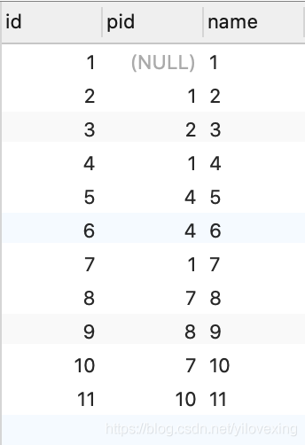
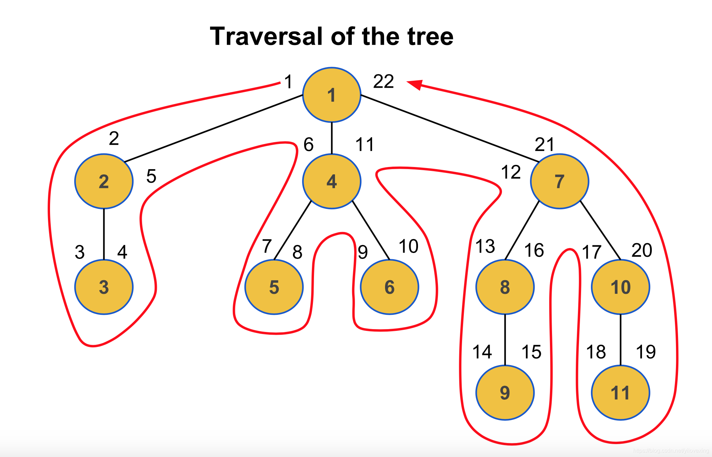
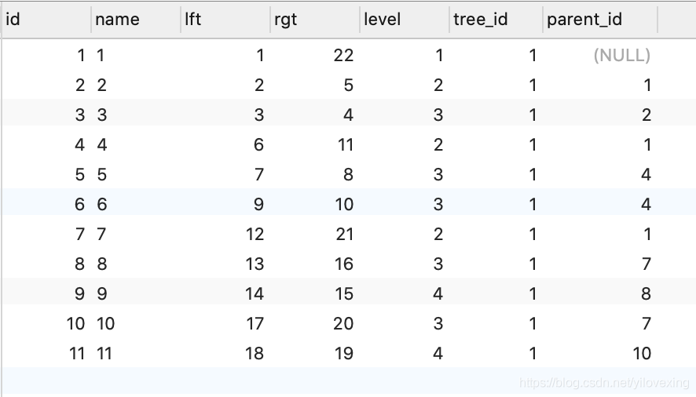

TODO: 《算法》大多是一些比较基础的算法

TODO: 《算法导论》非常全面的算法书。(2021出了第四版)

TODO: 《算法珠玑》 有一些大数据处理的算法可以看看

# 1. DataStructure

## 1.1. Array

### 1.1.1. basic array

### 1.1.2. sds(from redis)

## 1.2. Linked List

### 1.2.1. basic list

### 1.2.2. ziplist(from redis)

### 1.2.3. skiplist(from redis)

### 1.2.4. quicklist(from redis)

## 1.3. Map

### 1.3.1. Hashmap

### 1.3.2. Treemap

## 1.4. Stack

## 1.5. Queue

### 1.5.1. Queue

### 1.5.2. Circular queue

### 1.5.3. Priority queue

## 1.6. Tree

> always used as index

### 1.6.1. Binary Search Tree

### 1.6.2. 2-3 Tree

### 1.6.3. Red-Black Tree(From 2-3 Tree)

### 1.6.4. AVL Tree

### 1.6.5. B Tree

### 1.6.6. B+ Tree

### 1.6.7. Splay Tree

### 1.6.8. Prefix Tree(Trie)

### 1.6.9. Radix Tree(Compact Trie)

### 1.6.10. Ternary Search Tree (Trie with BST of children)

### 1.6.11. MPTT

> 也称为 嵌套集合模型 (nested set model)

- 说明：
  - 预排序遍历树遍历 全称 Modified Preorder Tree Traversal，
  - 可以说是树遍历的一种应用。
  - 主要是为了改进sql查询树结构时的效率问题。

- 标准树

  

  - 在程序里查询某个子节点时，要先从根节点进行递归查询，时间复杂度是 O(n)。

- mptt结构查询：

  

  

  - 遍历整棵树:遍历整棵树只需要查找 tree_id 等于 1 的条件即可
  - 找到某节点下所有的子孙节点:
    - 查找节点 4 的所有子孙节点，以 4 作为参考点。
    - 左值大于 6 且右值小于 11 的所有子孙节点，就是节点 4 的所有子孙节点。
  - 找到某节点下所有的子节点
    - 查找节点 1 的所有子节点，以 1 作为参考点。tree_id 等于 1 且 level 等于 2。
  - 查找某节点的路径
    - 查找节点 9 的所有上级路径，以 9 作为参考点。
    - 左值小于 14 且右值大于 15 的所有节点，就是节点9的路径。结果是：`1 -> 7 -> 8 -> 9`。

- mptt结构平衡算法
  - 新增
    - 如果要在不存在的树中新增节点，即要创建一颗新树。
      - 那么它是没有 parent_id 的，所以 parent_id 值为 NULL，level 是 1，tree_id 是根据已有树的最大 tree_id 加 1。
    - 如果要在已存在的树中新增节点。
      - 那么它的 parent_id 是父节点的 id，level 是父节点的 level 加 1，tree_id 和父节点保持一致。
    - 修复被破坏平衡的其他节点的左值。
      - 大于 parent_id 右值的所有节点的左值加 2。
    - 修复被破坏平衡的其他节点的右值。
      - 大于等于 parent_id 右值的所有节点的右值加 2。
  - 删除
    - 和增加类似，只不过删除一个节点以后对左值和右值进行相反的操作，即减 2。
  - 更新（移动）
    - 更新（移动）其实就是删除一个老节点，再新增一个新节点，具体算法参考上面的例子。

- 标准树和预排序遍历树的优劣对比
  - 标准树：
    - 适用于增删 操作较多的场景，每次删改只需要修改一条数据。
    - 在查询方面，随着分类层级的增加邻接表的递归查询效率逐渐降低。
  - 预排序遍历树：
    - 适用于查询操作较多的场景，查询的效率不受分类层级的增加的影响，但是随着数据的增多，
    - 每增删数据，都要同时操作多条受影响数据，执行效率逐渐下降。

## 1.7. Heap-Like

### 1.7.1. Heaps

### 1.7.2. Binomial Queues

### 1.7.3. Fibonacci Heaps

### 1.7.4. Leftist Heaps

### 1.7.5. Skew Heaps

## 1.8. Hashing

### 1.8.1. Open Hash Table

### 1.8.2. Closed Hash Table

### 1.8.3. Closed bucket Hash Table

## 1.9. Graph

# 2. Algorithm or The application of DataStructure

## 2.1. Sorting

### 2.1.1. Comparison Sorting

#### 2.1.1.1. Bubble Sort

#### 2.1.1.2. Selection Sort

#### 2.1.1.3. Insertion Sort

#### 2.1.1.4. Shell Sort

#### 2.1.1.5. Merge Sort

#### 2.1.1.6. Quck Sort

### 2.1.2. Bucket Sort

### 2.1.3. Counting Sort

### 2.1.4. Radix Sort

### 2.1.5. Heap Sort

## 2.2. Searching

### 2.2.1. Binary

### 2.2.2. Linear Search (of sorted list)

## 2.3. Substring search

### 2.3.1. 暴力查找

### 2.3.2. Knuth-Morris-Pratt

### 2.3.3. Boyer-karp 指纹字符串查找

## 2.4. Graph Algorithms

### 2.4.1. Breadth-First Search

### 2.4.2. Depth-First Search

### 2.4.3. Connected Components

### 2.4.4. Dijkstra's Shortest Path

### 2.4.5. Prim's Minimum Cost Spanning Tree

### 2.4.6. Topological Sort (Using Indegree array)

### 2.4.7. Topological Sort (Using DFS)

### 2.4.8. Floyd-Warshall (all pairs shortest paths)

### 2.4.9. Kruskal Minimum Cost Spanning Tree Algorithm

## 2.5. Index

### 2.5.1. Implemented by tree

- Binary and Linear Search (of sorted list)
- Binary Search Trees
- AVL Trees (Balanced binary search trees)
- Red-Black Trees
- Splay Trees
- Trie (Prefix Tree, 26-ary Tree)
- Radix Tree (Compact Trie)
- Ternary Search Tree (Trie with BST of children)
- B Trees
- B+ Trees

### 2.5.2. Implemented by hash table

- Open Hash Tables (Closed Addressing)
- Closed Hash Tables (Open Addressing)
- Closed Hash Tables, using buckets

### 2.5.3. z-order index

# 3. Other structure

## 3.1. LSM

> from k-v database, used by levelDB, HBase etc.

## 3.2. Piece table

# 4. 参考资料

- [ ] [Indexing — Data Structures](https://medium.com/nerd-for-tech/indexing-data-structures-aa7363693c40)
- [ ] [可视化：Data Structure Visualizations](https://www.cs.usfca.edu/~galles/visualization/Algorithms.html)
- [ ] 《算法（第四版）》
- [x] [数据结构和算法：预排序遍历树算法(MPTT)](https://blog.csdn.net/yilovexing/article/details/107066591)
- [ ] [Modified Preorder Tree Traversal](https://gist.github.com/tmilos/f2f999b5839e2d42d751)
