# 1. 操作系统基础

## 1.1. 什么是操作系统

- 操作系统本质上是一个运行在计算机上的软件程序 ，用于管理计算机硬件和软件资源，屏蔽了硬件层的复杂性。
- 电脑上的所有应用程序都通过操作系统来调用系统内存以及磁盘等等硬件。
- 另外，操作系统的内核（Kernel）是操作系统的核心部分，它负责系统的内存管理，硬件设备的管理，文件系统的管理以及应用程序的管理。 内核是连接应用程序和硬件的桥梁，决定着系统的性能和稳定性。

## 1.2. 用户态与内核态

为了确保操作系统的正确运行，必须区分操作**系统代码**和**用户代码**的执行。大多数计算机系统采用硬件支持，以便区分各种执行模式。
至少需要两种单独的运行模式：用户模式和内核模式

- 用户态(user mode) : 用户态运行的进程可以直接读取用户程序的数据。
- 系统态(kernel mode):可以简单的理解系统态运行的进程或程序几乎可以访问计算机的任何资源，不受限制。

当计算机系统执行用户应用时，系统处于用户模式。然而，当用户应用通过系统调用，请求操作系统服务时，系统必须从用户模式切换到内核模式，以满足请求

# 2. 操作系统结构

## 2.1. 操作系统的服务有哪些

> 待完善

- 用户界面，包括命令行界面，批处理界面以及图形化界面
- 程序执行
- I/O 操作
- 文件系统操作
- 通信
- 错误检测
- 资源分配
- 记账
- 保护和安全

## 2.2. 什么是 shell

Shell 是一个应用程序，它连接了用户和 Linux 内核，让用户能够更加高效、安全、低成本地使用 Linux 内核，这就是 Shell 的本质。

Shell 不属于内核的一部分。大部分情况下 Shell 都会去调用内核暴露出来的接口，这就是在使用内核，只是这个过程被 Shell 隐藏了起来，它自己在背后默默进行，我们看不到而已。

## 2.3. 系统调用

系统调用提供操作系统服务的接口，凡是与系统态级别的资源有关的操作，都必须通过系统调用方式向操作系统提出服务请求，并由操作系统代为完成。

这些系统调用按功能大致可分为如下几类：

- 设备管理。完成设备的请求或释放，以及设备启动等功能。
- 文件管理。完成文件的读、写、创建及删除等功能。
- 进程控制。完成进程的创建、撤销、阻塞及唤醒等功能。
- 进程通信。完成进程之间的消息传递或信号传递等功能。
- 内存管理。完成内存的分配、回收以及获取作业占用内存区大小及地址等功能。

# 3. 进程

## 3.1. 什么是进程

首先说一下什么是程序，程序只是被动（passive)实体，如存储在磁盘上包含一系列指令的文件（经常称为可执行文件（executable file))。

相反，进程是活动（active)实体，具有一个程序计数器用于表示下个执行命令和一组相关资源。

当一个可执行文件被加载到内存时，这个程序就成为进程。 进程是一个程序及其数据在处理器上顺序执行时所发生的活动。

进程是系统进行资源分配和调度的基本单位。

## 三种特殊进程

- 孤儿进程：如果父进程先退出,子进程还没退出那么子进程将被托孤给init进程,这是子进程的父进程就是init进程(1号进程).其实还是很好理解的

- 僵尸进程：如果我们了解过linux进程状态及转换关系,我们应该知道进程这么多状态中有一种状态是僵死状态,就是进程终止后进入僵死状态(zombie),等待告知父进程自己终止,后才能完全消失.但是如果一个进程已经终止了,但是其父进程还没有获取其状态,那么这个进程就称之为僵尸进程.僵尸进程还会消耗一定的系统资源,并且还保留一些概要信息供父进程查询子进程的状态可以提供父进程想要的信息.一旦父进程得到想要的信息,僵尸进程就会结束.

- 守护进程：同样我们需要了解一下什么是守护进程,守护进程就是在后台运行,不与任何终端关联的进程,通常情况下守护进程在系统启动时就在运行,它们以root用户或者其他特殊用户(apache和postfix)运行,并能处理一些系统级的任务.习惯上守护进程的名字通常以d结尾(sshd),但这些不是必须的.

## 3.2. 为什么要引入进程

早先的操作系统是单道批处理的，但是cpu是高效率的，而IO是低速的，就会出现cpu要等待IO的情况；从而降低了实际效率。后来就引入多道批处理；而程序在执行的过程中又会因为共享资源而导致程序在执行的过程中相互限制；所有后来引入进程用来给程序提供一个抽象的概念，他能申请道系统资源并且独立给程序提供资源，从而解决原来的程序之间因为资源共享而相互限制的问题。这样就可以提高系统资源的利用率以及系统的处理能力

## 3.3. 程序与进程之间的区别

- （1）进程更能真实地描述并发，而程序不能。
- （2）进程由程序和数据两部分组成，进程是竞争计算机系统有限资源的基本单位，也是进程处理机调度的基本单位。
- （3）程序是静态的概念；进程是程序在处理机上一次执行的过程，是动态的概念。
- （4）进程有生存周期，有诞生有消亡。是短暂的；而程序是相对长久的。
- （5）一个程序可以作为多个进程的运行程序；一个进程也可以运行多个程序。
- （6）进程具有创建其他进程的功能；而程序没有。

## 3.4. 作业与进程

一个进程是一个程序对某个数据集的执行过程，是分配资源的基本单位。作业是用户需要计算机完成的某项任务，是要求计算机所做工作的集合。一个作业的完成要经过作业提交、作业收容、作业执行和作业完成 4 个阶段。而进程是对已提交完毕的程序所执行过程的描述，是资源分配的基本单位。

- 其主要区别如下：

  - （1）作业是用户向计算机提交任务的任务实体。在用户向计算机提交作业后，系统将它放入外存中的作业等待队列中等待执行。而进程则是完成用户任务的执行实体，是向系统申请分配资源的基本单位。任一进程，只要它被创建，总有相应的部分存在于内存中。
  - （2）一个作业可由多个进程组成，且必须至少由一个进程组成，反过来则不成立。
  - （3）作业的概念主要用在批处理系统中，像 UNIX 这样的分时系统中就没有作业的概念。而进程的概念则用在几乎所有的多道程序系统中。

- 作业、进程和程序之间的联系：
  - 一个作业通常包括程序、数据和操作说明书 3 部分。每一个进程由 PCB、程序和数据集合组成。这说明程序是进程的一部分，是进程的实体。因此，一个作业可划分为若干个进程来完成，而每一个进程有其实体----程序和数据集合。

## 3.5. 操作系统进程的状态

- 创建状态(new) ：进程正在被创建，尚未到就绪状态。
- 就绪状态(ready) ：进程已处于准备运行状态，即进程获得了除了处理器之外的一切所需资源，一旦得到处理器资源(处理器分配的时间片)即可运行。
- 运行状态(running) ：进程正在处理器上上运行(单核 CPU 下任意时刻只有一个进程处于运行状态)。
- 阻塞状态(waiting) ：又称为等待状态，进程正在等待某一事件而暂停运行如等待某资源为可用或等待 IO 操作完成。即使处理器空闲，该进程也不能运行。
- 结束状态(terminated) ：进程正在从系统中消失。可能是进程正常结束或其他原因中断退出运行。

  

拓展：[java 线程状态](../MAIN_NOTE/java并发.md)

## 3.6. 什么是 PCB

进程控制块（Process Contral Block），也称为人物控制块。

系统利用 PCB 来描述进程的基本情况和运行状态，进而控制和管理进程。

相应的，有程序段、相关数据段和 PCB 三部分构成了进程映像（进程实体）。

所谓创建进程，实质上是创建进程映像中的 PCB；而撤销进程，实质上是撤销进程的 PCB。指的注意的是，进程映像是静态的，而进程是动态的。

- 了解：PCB 内容
  - 进程状态（process state):状态可以包括新的、就绪、运行、等待、停止等。程序计数器（program counter):计数器表示进程将要执行的下个指令的地址。
  - CPU 寄存器（CPU register):根据计算机体系结构的不同，寄存器的类型和数量也会不同。它们包括累加器、索引寄存器、堆栈指针、通用寄存器和其他条件码信息寄存器。在发生中断时，这些状态信息与程序计数器一起需要保存，以便进程以后能正确地继续执行
  - CPU 调度信息（CPU-scheduling information):这类信息包括进程优先级、调度队列的指针和其他调度参数。（第 5 章讨论进程调度）。
  - 内存管理信息（memory-management information):根据操作系统使用的内存系统，这类信息可以包括基地址和界限寄存器的值、页表或段表（第 8 章）。
  - 记账信息（accounting information):这类信息包括 CPU 时间、实际使用时间、时间期限、记账数据、作业或进程数量等。
  - I/O 状态信息（I/O status information):这类信息包括分配给进程的 I/O 设备列表、打开文件列表等。

## 3.7. 进程调度

### 3.7.1. 目的

进程调度器选择一个可用的进程到 CPU 上执行，最大化 CPU 利用率。

### 3.7.2. 相关队列与调度器

- **作业队列(job queue)**:进程在进入系统时，会被加到作业队列（job queue),这个队列包括系统内的所有进程。（位于外存）
- **就绪队列(ready queue)** ：驻留在内存中的、就绪的、等待运行的进程保存在就绪队列（ready queue)

- 通常，对于批处理系统，提交的进程多于可以立即执行的。这些进程会被保存到大容量存储设备（通常为磁盘）的缓冲池，以便以后执行。
  - **长期调度程序（long-term scheduler)或作业调度程序（job scheduler)** 从该池中选择进程，加到内存，以便执行。
  - **短期调度程序(short-term scheduler)或 CPU 调度程序（CPU scheduler)** 从准备执行的进程中选择进程，并分配 CPU。

有的系统，可能没有或极少采用长期调度程序。例如， **UNIX 或微软 Windows 的分时系统通常没有长期调度程序** ，
只是简单将所有新进程放于内存，以供短期调度程序使用。
这些系统的稳定性取决于物理限制（如可用的终端数）或用户的自我调整。如果多用户系统性
能下降到令人难以接受，那么有的用户就会退出。

有的操作系统如分时系统，可能引入一个额外的 **中期调度程序（medium-term scheduler)** 。
中期调度程序的核心思想是可将进程从内存（或从 CPU 竞争）中移出，从而降低多道程序程度。
之后，进程可被重新调入内存，并从中断处继续执行。这种方案称为交换（swap)。
通过中期调度程序，进程可换出（swap out),并在后来可换入（swap in)。
为了改善进程组合，或者由于内存需求改变导致过度使用内存从而需要释放内存，就有必要使用交换。

## 3.8. 上下文切换

切换 CPU 到另一个进程需要保存当前进程状态和恢复另一个进程的状态，这个任务称为 **上下文切换（context switch)** 。

当进行上下文切换时，内核会将旧进程状态保存在其 PCB 中，然后加载经调度而要执行的新进程的上下文。

上下文切换的时间是纯粹的开销，因为在切换时系统并没有做任何有用工作。

## 3.9. 进程间通信

### 3.9.1. 整体分类

- **共享内存**
  - 概念： 在共享存储器系统中，相互通信的进程共享某些数据结构或共享存储区，进程之间能够通过这些空间进行通信。如生产者消费者问题。

- **消息传递**
  - 概念：消息传递提供一种机制，以便允许进程不必通过共享地址空间来实现通信和同步。
  - 种类
    - 直接通信方式：发送进程直接把消息发送给接收进程，并将它挂在接收进程的消息缓冲队列上，接收进程从消息缓冲队列中取得消息。
    - 间接通信方式：发送进程把消息发送到某个中间实体中，接收进程从中间实体中取得消息。这种中间实体一般称为信箱，这种通信方式又称为信箱通信方式。该通信方式广泛应用于计算机网络中，相应的通信系统称为电子邮件系统。

- **管道通信**
  - 所谓“管道”，是指用于连接一个读进程和一个写进程以实现它们之间通信的一个共享文件，又名pipe文件。
  - 向管道（共享文件）提供输入的发送进程（即写进程），以字符流形式将大量的数据送入（写）管道；
  - 而接收管道输出的接收进程（即读进程），则从管道中接收（读）数据。
  - 为了协调双方的通信，管道机制必须提供以下三方面的协调能力：互斥、同步和确定对方的存在。

### 3.9.2. 具体方式

[详细介绍](https://www.jianshu.com/p/c1015f5ffa74)

- **管道/匿名管道(Pipes)** ：用于具有亲缘关系的父子进程间或者兄弟进程之间的通信。
- **有名管道(Names Pipes)** : 匿名管道由于没有名字，只能用于亲缘关系的进程间通信。为了克服这个缺点，提出了有名管道。有名管道严格遵循 **先进先出(first in first out)** 。有名管道以磁盘文件的方式存在，可以实现本机任意两个进程通信。
- **信号(Signal)** ：信号是一种比较复杂的通信方式，用于通知接收进程某个事件已经发生；
- **消息队列(Message Queuing)** ：消息队列是消息的链表,具有特定的格式,存放在内存中并由消息队列标识符标识。管道和消息队列的通信数据都是先进先出的原则。与管道（无名管道：只存在于内存中的文件；命名管道：存在于实际的磁盘介质或者文件系统）不同的是消息队列存放在内核中，只有在内核重启(即，操作系统重启)或者显示地删除一个消息队列时，该消息队列才会被真正的删除。消息队列可以实现消息的随机查询,消息不一定要以先进先出的次序读取,也可以按消息的类型读取.比 FIFO 更有优势。消息队列克服了信号承载信息量少，管道只能承载无格式字 节流以及缓冲区大小受限等缺。
- **信号量(Semaphores)** ：信号量是一个计数器，用于多进程对共享数据的访问，信号量的意图在于进程间同步。这种通信方式主要用于解决与同步相关的问题并避免竞争条件。
- **共享内存(Shared memory)** ：使得多个进程可以访问同一块内存空间，不同进程可以及时看到对方进程中对共享内存中数据的更新。这种方式需要依靠某种同步操作，如互斥锁和信号量等。可以说这是最有用的进程间通信方式。
- **套接字(Sockets)** : 此方法主要用于在客户端和服务器之间通过网络进行通信。套接字是支持 TCP/IP 的网络通信的基本操作单元，可以看做是不同主机之间的进程进行双向通信的端点，简单的说就是通信的两方的一种约定，用套接字中的相关函数来完成通信过程。

# 4. 多线程编程

## 4.1. 进程和线程区别

线程是资源分配的基本单位，进程是资源调度的基本单位。

一个进程中可以有多个线程，线程共享进程的代码段，数据，文件。但是每个线程有自己的寄存器和堆栈。

区别可以概括为以下几个方面：

- 1） 调度：在引入线程的操作系统中，线程是独立调度的基本单位，进程是资源拥有的基本单位。
- 2） 拥有资源：进程是拥有资源的基本单位，而线程不拥有系统资源，单线程可以防伪其隶属进程的系统资源。
- 3） 并发性：在引入线程的操作系统中，不仅进程之间可以并发执行，线程之间也可以并发执行，从而是操作系统具有更好的并发性，大大提高了系统的吞吐量。
- 4） 系统开销：线程开销极小。
- 5） 地址空间和其他资源：进程的地址空间之间相互独立，同一进程的各线程间共享进程的资源，进程内的线程对进程外的其他进程不可见。
- 6） 通信方面：进程间通信需要进程同步和互斥手段的辅助，以保证数据的一致性，而线程间可以直接读写进程数据段来进行通信。

  

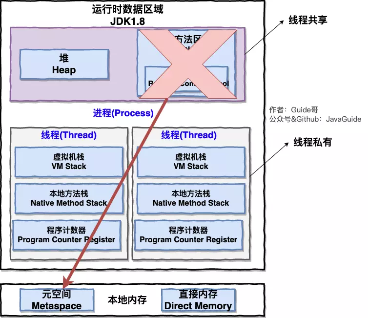

如果从 JVM 角度来说，一个进程中可以有多个线程，多个线程共享进程的 **堆和方法区 (JDK1.8 之后的元空间)** 资源，但是每个线程有自己的 **程序计数器、虚拟机栈和本地方法栈** 。

## 4.2. 多线程模型

- 多对一模型。因为无法利用多个核，所以几乎没有系统在使用该模型。
- 一对一模型
- 多对多模型
- 双层模型

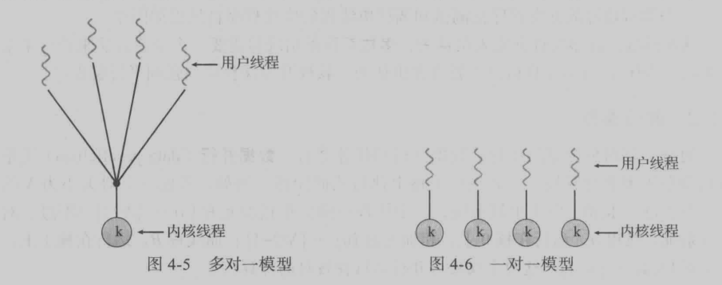

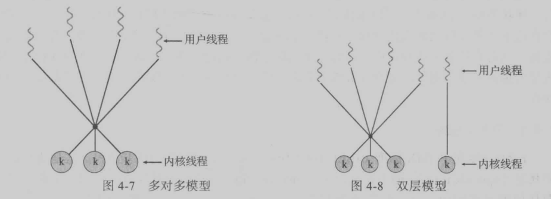

# 5. 进程调度

## 5.1. 调度程序与调度准则

- 调度程序作用
  - 切换上下文。
  - 切换到用户模式。
  - 跳转到用户程序的合适位置，以便重新启动程序
- 调度准则
  - CPU使用率
  - 吞吐量
  - 周转时间
  - 等待时间
  - 响应时间

## 5.2. 调度算法

- 先到先服务(FCFS)调度算法 :非抢占， 从就绪队列中选择一个最先进入该队列的进程为之分配资源，使它立即执行并一直执行到完成或发生某事件而被阻塞放弃占用 CPU 时再重新调度。
- 短作业优先(SJF)的调度算法 : 从就绪队列中选出一个估计运行时间最短的进程为之分配资源，使它立即执行并一直执行到完成或发生某事件而被阻塞放弃占用 CPU 时再重新调度。
  - 非抢占
  - 抢占(最短剩余时间优先)
- 优先级调度 ： 为每个流程分配优先级，首先执行具有最高优先级的进程，依此类推。具有相同优先级的进程以 FCFS 方式执行。可以根据内存要求，时间要求或任何其他资源要求来确定优先级。
  - 非抢占
  - 抢占
- 时间片轮转调度算法 :抢占，时间片轮转调度是一种最古老，最简单，最公平且使用最广的算法，又称 RR(Round robin)调度。每个进程被分配一个时间段，称作它的时间片，即该进程允许运行的时间。
- 多级反馈队列调度算法 ：前面介绍的几种进程调度的算法都有一定的局限性。如短进程优先的调度算法，仅照顾了短进程而忽略了长进程 。多级反馈队列调度算法**既能使高优先级的作业得到响应又能使短作业**（进程）迅速完成。，因而它是**目前被公认的一种较好的进程调度算法**，UNIX 操作系统采取的便是这种调度算法。

---

- 完全公平调度算法（CFS）：Linux线程调度使用的调度算法，目前用得最多

# 6. 同步

## 6.1. 线程间同步的方式

线程同步是两个或多个共享关键资源的线程的并发执行。应该同步线程以避免关键的资源使用冲突。操作系统一般有下面三种线程同步的方式：

- **互斥量(Mutex)** ：采用互斥对象机制，只有拥有互斥对象的线程才有访问公共资源的权限。因为互斥对象只有一个，所以可以保证公共资源不会被多个线程同时访问。比如 Java 中的 synchronized 关键词和各种 Lock 都是这种机制。
- **信号量(Semphares)** ：它允许同一时刻多个线程访问同一资源，但是需要控制同一时刻访问此资源的最大线程数量
- **事件(Event)**:Wait/Notify：通过通知操作的方式来保持多线程同步，还可以方便的实现多线程优先级的比较操

## 6.2. 进程间同步的方式

原子操作、信号量机制、自旋锁管程、会合、分布式系统

## 6.3. 临界区与临界资源

- 临界区
  - 指的是一个访问共用资源（例如：共用设备或是共用存储器）的程序片段，而这些共用资源又无法同时被多个线程访问的特性。
  - 当有线程进入临界区段时，其他线程或是进程必须等待，有一些同步的机制必须在临界区段的进入点与离开点实现，以确保这些共用资源是被互斥获得使用。只能被单一线程访问的设备，例如：打印机。

- 临界资源：
  - 一次仅允许一个进程使用的资源称为临界资源。许多物理设备都属于临界资源，如输入机、打印机、磁带机等。

- 临界问题解决要求：
  - **互斥（mutual exclusion)**:如果进程P1在其临界区内执行，那么其他进程都不能在其临界区内执行。
  - **进步（progress)**:如果没有进程在其临界区内执行，并且有进程需要进入临界区，那么只有那些不在剩余区内执行的进程可以参加选择，以便确定谁能下次进入临界区，而且这种选择不能无限推迟。
  - **有限等待（bounded waiting)**:从一个进程做出进入临界区的请求直到这个请求允许为止，其他进程允许进入其临界区的次数具有上限。
 
## 6.4. 互斥锁

## 6.5. 信号量

## 6.6. 经典问题

### 6.6.1. 生产者消费者

### 6.6.2. 哲学家就餐

# 7. 死锁

## 7.1. 产生条件

- **互斥（mutual exclusion)**:至少有一个资源必须处于非共享模式，即一次只有一个进程可使用。如果另一进程申请该资源，那么申请进程应等到该资源释放为止。
- **占有并等待（hold and wait)**:一个进程应占有至少一个资源，并等待另一个资源，而该资源为其他进程所占有。
- **非抢占（no preemption)**:资源不能被抢占，即资源只能被进程在完成任务后自愿释放。
- **循环等待（circular wait)**:有一组等待进程（Po,P1,...,Pn},Po等待的资源为P1占有，P1等待的资源为P2占有，...，Pn-1等待的资源为Pn占有，Pn等待的资源为Po占有。

## 7.2. 死锁预防

> 死锁预防的基本思想是 只要确保死锁发生的四个必要条件中至少有一个不成立，就能预防死锁的发生，具体方法包括：

- 打破互斥条件：允许进程同时访问某些资源。但是，有些资源是不能被多个进程所共享的，这是由资源本身属性所决定的，因此，这种办法通常并无实用价值。
- 打破占有并等待条件：可以实行资源预先分配策略(进程在运行前一次性向系统申请它所需要的全部资源，若所需全部资源得不到满足，则不分配任何资源，此进程暂不运行；只有当系统能满足当前进程所需的全部资源时，才一次性将所申请资源全部分配给该线程)或者只允许进程在没有占用资源时才可以申请资源（一个进程可申请一些资源并使用它们，但是在当前进程申请更多资源之前，它必须全部释放当前所占有的资源）。但是这种策略也存在一些缺点：在很多情况下，无法预知一个进程执行前所需的全部资源，因为进程是动态执行的，不可预知的；同时，会降低资源利用率，导致降低了进程的并发性。
- 打破非抢占条件：允许进程强行从占有者哪里夺取某些资源。也就是说，但一个进程占有了一部分资源，在其申请新的资源且得不到满足时，它必须释放所有占有的资源以便让其它线程使用。这种预防死锁的方式实现起来困难，会降低系统性能。
- 打破循环等待条件：实行资源有序分配策略。对所有资源排序编号，所有进程对资源的请求必须严格按资源序号递增的顺序提出，即只有占用了小号资源才能申请大号资源，这样就不回产生环路，预防死锁的发生。

## 7.3. 死锁避免

死锁避免的基本思想是动态地检测资源分配状态，以确保循环等待条件不成立，从而确保系统处于安全状态。所谓安全状态是指：如果系统能按某个顺序为每个进程分配资源（不超过其最大值），那么系统状态是安全的，换句话说就是，如果存在一个安全序列，那么系统处于安全状态。资源分配图算法和银行家算法是两种经典的死锁避免的算法，其可以确保系统始终处于安全状态。其中，资源分配图算法应用场景为每种资源类型只有一个实例(申请边，分配边，需求边，不形成环才允许分配)，而银行家算法应用于每种资源类型可以有多个实例的场景。

### 7.3.1. 安全状态

如果系统能按一定顺序为每个进程分配资源（不超过它的最大需求）,仍然避免死锁，那么系统的状态就是安全的（safe)。

更为正式地说，只有存在一个安全序列（safe sequence),系统才处于安全状态。

### 7.3.2. 资源分配图

### 7.3.3. 银行家算法

## 7.4. 死锁检测

## 7.5. 死锁恢复

- **进程终止**，有两种方式：
  - 中止所有死锁进程。这种方法显然会打破死锁环，但是代价也大。这些死锁进程可能已计算了较长时间；这些部分计算的结果也要放弃，并且以后可能还要重新计算。
  - 一次中止一个进程，直到消除死锁循环为止。这种方法的开销会相当大，这是因为每次中止一个进程，都应调用死锁检测算法，以确定是否仍有进程处于死锁。
- **资源抢占**，需要解决三个问题：
  - 选择牺牲进程：即确定抢占的顺序，使代价最小。
  - 回滚：被抢占的进程应该回滚到安全状态。
  - 饥饿：如何确保不会发生饥饿？即如何保证资源不会总是从同一个进程中被抢占。

# 8. 内存管理策略

## 8.1. 两个寄存器

每个进程都有一个单独的内存空间，单独的内存空间可以保护进程而不互相影响。确保一个进程只能访问属于自己的合法的地址，是通过两个寄存器实现的：

- 基地址寄存器:好友最小的合法的物理内存地址
- 界限地址寄存器:指定了范围的大小

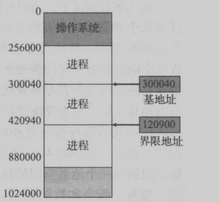

## 8.2. 逻辑,物理地址空间与虚拟寻址

CPU生成的地址通常称为 **逻辑地址（logical address)** ,

而内存单元看到的地址（即加载到内存地址寄存器（memory-address register)的地址）通常称为 **物理地址（physical address)** 。

现代处理器使用的是一种称为 虚拟寻址(Virtual Addressing) 的寻址方式。使用虚拟寻址，CPU 需要将虚拟地址翻译成物理地址，这样才能访问到真实的物理内存。 实际上完成虚拟地址转换为物理地址转换的硬件是 CPU 中含有一个被称为 内存管理单元（Memory Management Unit, MMU） 的硬件

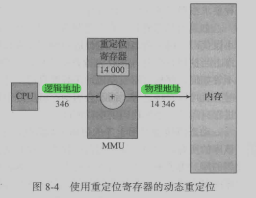

---

为什么要有虚拟地址空间？

- 如果直接访问内存
  - 用户程序可以访问任意内存，寻址内存的每个字节，这样就**很容易（有意或者无意）破坏操作系统**，造成操作系统崩溃。
  - 想要同时运行多个程序特别困难，比如你想同时运行一个微信和一个 QQ 音乐都不行。为什么呢？举个简单的例子：微信在运行的时候给内存地址 1xxx 赋值后，QQ 音乐也同样给内存地址 1xxx 赋值，那么 QQ 音乐对内存的赋值就会覆盖微信之前所赋的值，这就造成了微信这个程序就会崩溃。

**总结来说：如果直接把物理地址暴露出来的话会带来严重问题，比如可能对操作系统造成伤害以及给同时运行多个程序造成困难。**

- 通过虚拟地址访问内存有以下优势：
- 程序可以使用一系列相邻的虚拟地址来访问物理内存中不相邻的大内存缓冲区。
- 程序可以使用一系列虚拟地址来访问大于可用物理内存的内存缓冲区。当物理内存的供应量变小时，内存管理器会将物理内存页（通常大小为 4 KB）保存到磁盘文件。数据或代码页会根据需要在物理内存与磁盘之间移动。
- 不同进程使用的虚拟地址彼此隔离。一个进程中的代码无法更改正在由另一进程或操作系统使用的物理内存。

## 8.3. 交换

进程必须在内存中以便执行。

不过，进程可以暂时从内存交换（swap)到备份存储(backing store),当再次执行时再调回到内存中。

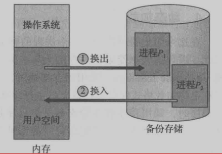

## 8.4. 内存管理机制

### 8.4.1. 概述

简单分为**连续分配管理方式**和**非连续分配管理方式**这两种。连续分配管理方式是指为一个用户程序分配一个连续的内存空间，常见的如**块式管理**。同样地，非连续分配管理方式允许一个程序使用的内存分布在离散或者说不相邻的内存中，常见的如**页式管理**和**段式管理**。

### 8.4.2. 块式管理

> 或者称为**多分区方法**

块式管理 ： 远古时代的计算机操系统的内存管理方式。将内存分为几个固定大小的块，每个块中只包含一个进程。如果程序运行需要内存的话，操作系统就分配给它一块，如果程序运行只需要很小的空间的话，分配的这块内存很大一部分几乎被浪费了。这些在每个块中未被利用的空间，我们称之为碎片。

### 8.4.3. 可变分区相关概念

- 孔
  - 对于**可变分区**（variable-partition)方案
  - 操作系统有一个表，用于记录哪些内存可用和哪些内存已用。
  - 开始，所有内存都可用于用户进程，因此可以作为一大块的可用内存，称为孔（hole)。
  - 最后，正如将会看到的，内存有一个集合，以包含各种大小的孔。
- 动态分配问题：
  > 为进程分配孔的策略
  - 首次适应:分配首个足够大的孔
  - 最优适应:分配最小的足够大的孔
  - 最差适应:分配最大的孔
- 外部碎片
  - 概念：
    - 随着进程加载到内存和从内存退出，空闲内存空间被分为小的片段。
    - 当总的可用内存之和可以满足请求但并不连续时，这就出现了外部碎片问题:
    - 存储被分成了大量的小孔。这个问题可能很严重。在最坏情况下，每两个进程之间就有空闲（或浪费的）块。如果这些内存是一整块，那么可能可以再运行多个进程。
  - 解决：允许进程的逻辑地址空间是不连续的；这样，只要有物理内存可用，就允许为进程分配内存。两种互补的技术为**分页和分段**。
- 内部碎片
  - 假设有一个18464字节大小的孔，并采用多分区分配方案。假设有一个进程需要18462字节。
  - 如果只能分配所要求的块，那么还剩下一个2字节的孔。
  - **维护这一小孔的开销要比孔本身大很多。**
  - 因此，通常按固定大小的块为单位（而不是字节）来分配内存。
  - 采用这种方案，**进程所分配的内存可能比所需的要大**。这**两个数字之差称为内部碎片**（internal fragmentation)
  - 这部分内存在分区内部，但又不能用。

### 8.4.4. 页式管理

#### 8.4.4.1. 基本概念

页式管理 ：把主存分为大小相等且固定的一页一页的形式，页较小，相对相比于块式管理的划分力度更大，提高了内存利用率，减少了碎片。页式管理通过页表对应逻辑地址和物理地址。

分页允许物理内存是**非连续的**。(看下面的图中，页在物理内存中的分布)

实现分页的基本方法涉及将物理内存分为固定大小的块，称为**帧或页帧（frame)**;
而将逻辑内存也分为同样大小的块，称为 **页或页面（page)** 。

由CPU生成的每个地址分为两部分： **页码（page number)(p)和页偏移（page offset)(d)** 。

页码作为页表的索引。页表包含每页所在物理内存的**基地址**。

这个**基地址与页偏移**的组合就形成了物理内存地址。

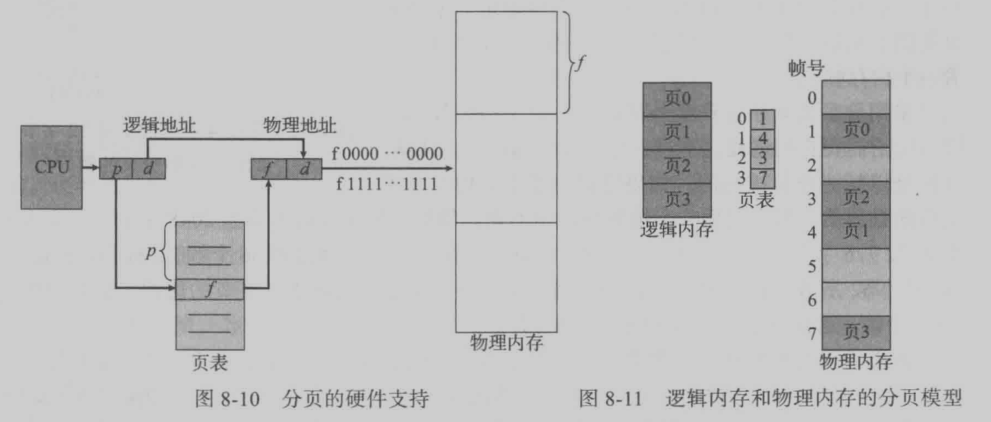

#### 8.4.4.2. 保护

- 有效位-无效位
- 共享页

#### 8.4.4.3. 硬件支持

- 页表硬件支持
  - 页表较小：使用寄存器
  - 页表较大：页表基地址寄存器存储页表基地址，页表存于内存。
    > 但是需要两次内存访问，太慢了
  - 解决两次访问的方式：转换表缓冲区（TLB,Translation Look-aside Buffer）
    > 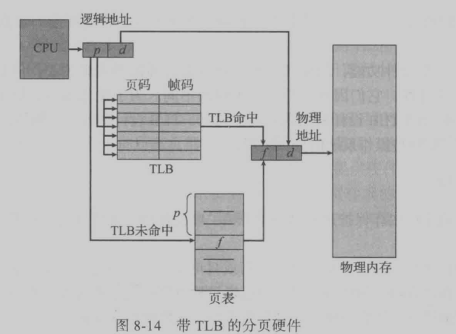 

#### 8.4.4.4. 页表种类

- 快表（也就是上面的TLB）
  - 概念：特殊的高速缓冲存储器（Cache），其中的内容是页表的一部分或者全部内容。作为页表的 Cache，它的作用与页表相似，但是提高了访问速率。
  - 目的：采用页表做地址转换，读写内存数据时 CPU 要访问两次主存。有了快表，有时只要访问一次高速缓冲存储器，一次主存，这样可加速查找并提高指令执行速度。
  - 流程：
    - 根据虚拟地址中的页号查快表；
    - 如果该页在快表中，直接从快表中读取相应的物理地址；
    - 如果该页不在快表中，就访问内存中的页表，再从页表中得到物理地址，同时将页表中的该映射表项添加到快表中；
    - 当快表填满后，又要登记新页时，就按照一定的淘汰策略淘汰掉快表中的一个页。

- 分层页表/多级页表
  

  
图示

  
  
  

  - 目的：
    - 当代计算机大多数都支持大逻辑空间，页表本身可以非常大。每个进程需要很大的空间来存储页表。为了避免在内存中连续分配页表，使用分层页表。
    - 引入多级页表的主要目的是为了避免把全部页表一直放在内存中占用过多空间，特别是那些根本就不需要的页表就不需要保留在内存中。利用局部性原理，把二级页表存放到磁盘中。
      > 多级页表如何节约内存：https://www.polarxiong.com/archives/多级页表如何节约内存.html

- 哈希页表
  > 处理大于32位地址空间的常用办法是使用哈希页表
  

  
图示

  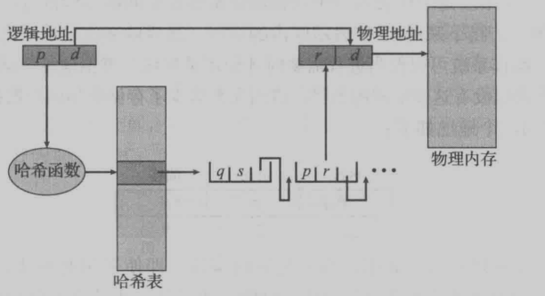
  

- 倒置页表
  > 解决页表使用大量内存的问题。对于每个真正的内存页或帧，倒置页表才有一个条目。每个条目包含保存在真正内存位置上的页的虚拟地址，
  

  
图示

  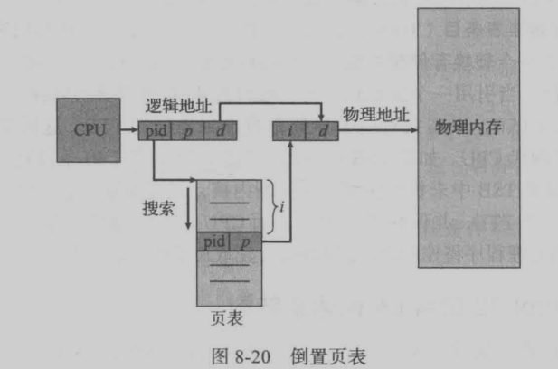
  

### 8.4.5. 段式管理

段式管理 ： 页式管理虽然提高了内存利用率，但是页式管理其中的页实际并无任何实际意义。 段式管理把主存分为一段段的，每一段的空间又要比一页的空间小很多 。但是，最重要的是段是有实际意义的，每个段定义了一组逻辑信息，例如,有主程序段 MAIN、子程序段 X、数据段 D 及栈段 S 等。 段式管理通过段表对应逻辑地址和物理地址。

- 一个c编译器可能会创建如下段：
  > 

- 分段硬件
  > 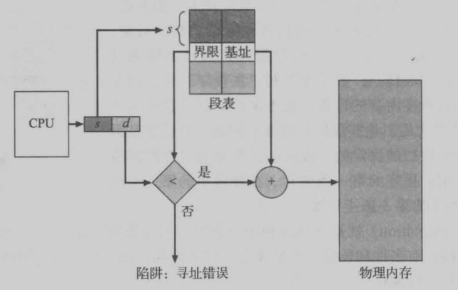

- 示例：
  > 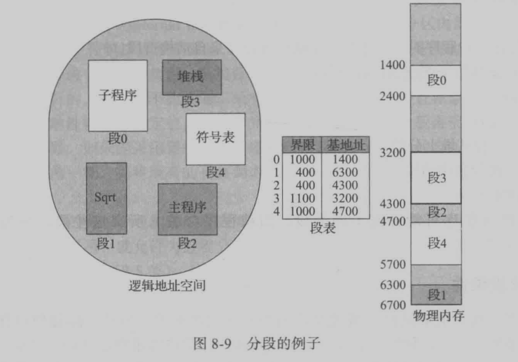

### 8.4.6. 段页式管理

段页式管理机制结合了段式管理和页式管理的优点。简单来说段页式管理机制就是把主存先分成若干段，每个段又分成若干页，也就是说 段页式管理机制 中段与段之间以及段的内部的都是离散的。

### 8.4.7. 分段和分页区别与共同点

- 共同点 ：
  - 分页机制和分段机制都是为了提高内存利用率，较少内存碎片。
  - 页和段都是离散存储的，所以两者都是离散分配内存的方式。但是，每个页和段中的内存是连续的。
- 区别 ：
  - 页的大小是固定的，由操作系统决定；而段的大小不固定，取决于我们当前运行的程序。
  - 分页仅仅是为了满足操作系统内存管理的需求，而段是逻辑信息的单位，在程序中可以体现为代码段，数据段，能够更好满足用户的需要。
  - 内存碎片：页式存储管理的优点是没有外碎片（因为页的大小固定），但会产生内碎片（一个页可能填充不满）；而段式管理的优点是没有内碎片（因为段大小可变，改变段大小来消除内碎片）。但段换入换出时，会产生外碎片（比如4k的段换5k的段，会产生1k的外碎片）。

# 9. 虚拟内存管理

## 9.1. 虚拟地址，线性地址，物理地址

> 待核实

如果是没有使用虚拟内存的页式/段式系统，没有虚拟地址这一说法，逻辑地址一定直接可以转换为物理地址，因为进程都在内存中存储。

如果是使用了虚拟内存的页式/段式系统，就有虚拟地址了，因为不一定在内存中存储，得到的进程地址不一定能在内存上找到，因为页表上对应的块号可能为空。

至于线性地址，仅存在于段页式，逻辑地址查找段表得到线性地址，线性地址查找页表得到物理地址

## 9.2. 什么是虚拟内存

很多时候我们使用点开了很多占内存的软件，这些软件占用的内存可能已经远远超出了我们电脑本身具有的物理内存。为什么可以这样呢？  
正是因为**虚拟内存**的存在，通过 虚拟内存 可以让程序可以拥有超过系统物理内存大小的可用内存空间。  

另外，虚拟内存为每个进程提供了一个一致的、私有的地址空间，它让每个进程产生了一种自己在独享主存的错觉（每个进程拥有一片连续完整的内存空间）。这样会更加有效地管理内存并减少出错。

对于进程而言，逻辑上似乎有很大的内存空间，实际上其中一部分对应物理内存上的一块(称为帧，通常页和帧大小相等)，还有一些没加载在内存中的对应在硬盘上

虚拟内存是计算机系统内存管理的一种技术，我们可以手动设置自己电脑的虚拟内存。**不要单纯认为虚拟内存只是“使用硬盘空间来扩展内存“的技术**。虚拟内存的重要意义是它**定义了一个连续的虚拟地址空间**，并且**把内存扩展到硬盘空间**。

> 维基： 
> 虚拟内存 使得应用程序认为它拥有连续的可用的内存（一个连续完整的地址空间），而实际上，它通常是被分隔成多个物理内存碎片，还有部分暂时存储在外部磁盘存储器上，在需要时进行数据交换。与没有使用虚拟内存技术的系统相比，使用这种技术的系统使得大型程序的编写变得更容易，对真正的物理内存（例如 RAM）的使用也更有效率。目前，大多数操作系统都使用了虚拟内存，如 Windows 家族的“虚拟内存”；Linux 的“交换空间”等。

## 9.3. 虚拟内存的技术实现

虚拟内存的实现需要**建立在离散分配的内存管理方式的基础上**。 虚拟内存的实现有以下三种方式：

- 请求分页存储管理 ：建立在分页管理之上，为了支持虚拟存储器功能而增加了请求调页功能和页面置换功能。请求分页是目前最常用的一种实现虚拟存储器的方法。请求分页存储管理系统中，在作业开始运行之前，仅装入当前要执行的部分段即可运行。假如在作业运行的过程中发现要访问的页面不在内存，则由处理器通知操作系统按照对应的页面置换算法将相应的页面调入到主存，同时操作系统也可以将暂时不用的页面置换到外存中。
- 请求分段存储管理 ：建立在分段存储管理之上，增加了请求调段功能、分段置换功能。请求分段储存管理方式就如同请求分页储存管理方式一样，在作业开始运行之前，仅装入当前要执行的部分段即可运行；在执行过程中，可使用请求调入中断动态装入要访问但又不在内存的程序段；当内存空间已满，而又需要装入新的段时，根据置换功能适当调出某个段，以便腾出空间而装入新的段。
- 请求段页式存储管理

## 9.4. 请求调页与缺页错误

- 请求调页：
  - 磁盘加载可执行程序到内存，一种策略是在程序执行时将整个程序加载到物理内存，
  - 另一种策略是，仅在需要时才加载页面。
  - 这种技术被称为**请求调页**（demand paging),常常用于虚拟内存系统。

- 调页程序与交换器区别：
  - 调页程序只涉及进程的页面
  - 儿交换器操作整个进程

- 有效位，无效位
  - 当该位被设置为有效时，相关联的页面是合法的，并且在内存中。
  - 当该位被设置为无效时，页面无效（即不在进程的逻辑地址空间中）,或有效但只在磁盘上。
    
    

    
不再进程逻辑地址空间的情况

    例如，对于14位地址空间（0\~16383)的系统，假设有一个程序，它的有效地址空间
    为0\~10468。如果页的大小为2KB,那么页表如图8.15所示。页0、1、2、3、4和5的
    地址可以通过页表正常映射。然而，如果试图产生页表6或7内的地址时，则会发现有效一
    无效位为无效，这样操作系统就会捕捉到这一非法操作（无效页引用）。
    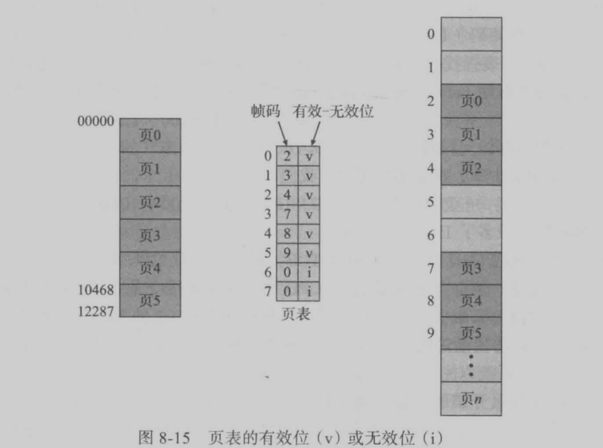
    

    

    
没有在内存的情况

    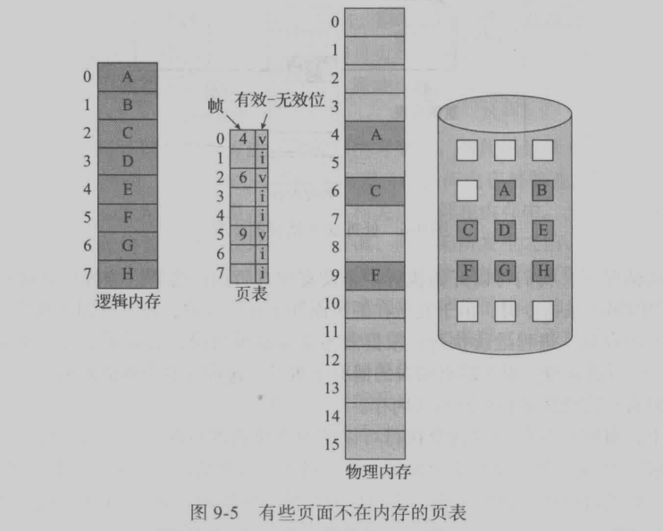 
    

- 缺页错误/缺页中断：如果进程试图访问那些尚未调入内存中的页面时，对标记为无效的页面访问会产生缺页错误（page fault)。

## 9.5. 写时复制

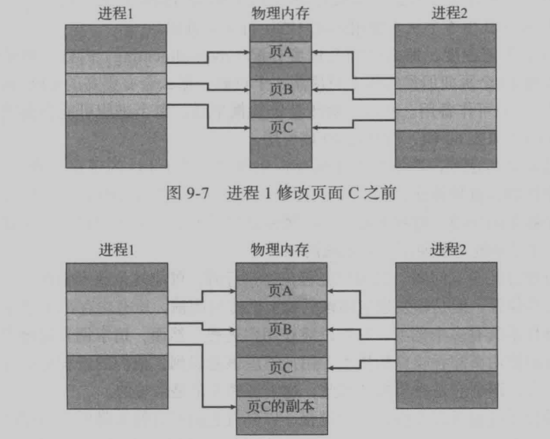

fork（）会产生一个和父进程完全相同的子进程，但子进程在此后多会exec系统调用，出于效率考虑，linux中引入了 写时复制 技术，

父进程与子进程最初共享相同的页面来工作，子进程的代码段、数据段、堆栈都是指向父进程的物理空间，也就是说，**两者的逻辑空间不同**，**但其对应的物理空间是同一个**。

当父子进程中有更改相应段的行为发生时，再为子进程相应的段分配物理空间。

## 9.6. 局部性原理

- 局部性原理表现在以下两个方面：
  - 时间局部性 ：如果程序中的某条指令一旦执行，不久以后该指令可能再次执行；如果某数据被访问过，不久以后该数据可能再次被访问。产生时间局部性的典型原因，是由于在程序中存在着大量的循环操作。
  - 空间局部性 ：一旦程序访问了某个存储单元，在不久之后，其附近的存储单元也将被访问，即程序在一段时间内所访问的地址，可能集中在一定的范围之内，这是因为指令通常是顺序存放、顺序执行的，数据也一般是以向量、数组、表等形式簇聚存储的。

时间局部性是通过将近来使用的指令和数据保存到高速缓存存储器中，并使用高速缓存的层次结构实现。空间局部性通常是使用较大的高速缓存，并将预取机制集成到高速缓存控制逻辑中实现。虚拟内存技术实际上就是建立了 “内存一外存”的两级存储器的结构，利用局部性原理实现髙速缓存。

## 9.7. 页面置换算法

当发生缺页中断时，如果当前内存中并没有空闲的页面，操作系统就必须在内存选择一个页面将其移出内存，以便为即将调入的页面让出空间。用来选择淘汰哪一页的规则叫做页面置换算法。

- FIFO（First In First Out） 页面置换算法（先进先出页面置换算法） : 总是淘汰最先进入内存的页面，即选择在内存中驻留时间最久的页面进行淘汰。
- OPT 页面置换算法（最优页面置换算法） ：最佳(Optimal, OPT)置换算法所选择的被淘汰页面将是以后永不使用的，或者是在最长时间内不再被访问的页面,这样可以保证获得最低的缺页率。但由于人们目前无法预知进程在内存下的若千页面中哪个是未来最长时间内不再被访问的，因而该算法无法实现。一般作为衡量其他置换算法的方法。
- LRU （Least Currently Used）页面置换算法（最近最少使用页面置换算法） ：LRU算法赋予每个页面一个访问字段，用来记录一个页面自上次被访问以来所经历的时间 T，当须淘汰一个页面时，选择现有页面中其 T 值最大的，即最近最久未使用的页面予以淘汰。
- LFU （Least Frequently Used）页面置换算法（最不常使用页面置换算法） : 该置换算法选择在之前时期使用最少的页面作为淘汰页。
- MFU （Most Frequently Used）页面置换算法（最常使用页面置换算法）： 该置换算法选择在之前时期使用最多的页面作为淘汰页。

## 9.8. 系统抖动

当CPU利用率低的时候，会通过引入新的程序的方式提高利用率。

如果物理内存中的帧不够，则会出现缺页错误，并且从其他进程那里获取帧，

被抢走帧的进程出现缺页错误后，又会向抢占另外进程的帧。

缺页错误发生后，发生缺页错误的进程必须等待调页设备将页面换进和换出。从而导致cpu利用率更低。

cpu利用率的降低又会增加多道程序，产生更多的缺页错误和更长的调页设备队列，恶性循环。

# 10. 文件系统

# 11. 文件系统实现

## 11.1. 分配方法

# 12. 大容量存储系统

# 13. I/O 系统

## 五种IO模型

[参考博客](http://cxd2014.github.io/2018/12/09/aio/)

## 13.1. 缓冲与缓存

- 缓冲(buffer):用于保存两个设备之间或在设备和应用程序之间传输的数据。
- 缓存(cache):是保存数据副本的告诉内存区域。访问缓存副本比访问原版更加有效。
- 假脱机:保存数据输出的缓冲区。如打印机，不能接收交叉的数据流。

# 14. 系统保护

# 15. 系统安全
