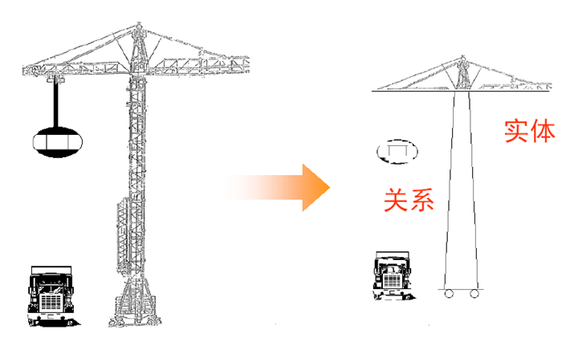
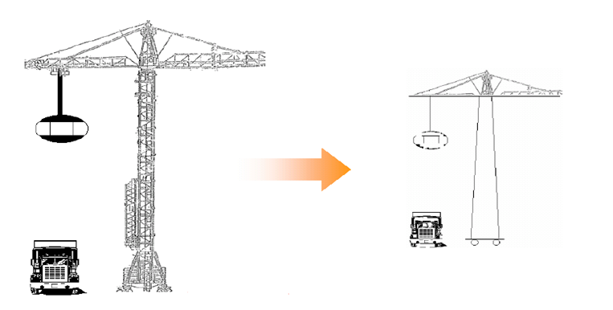
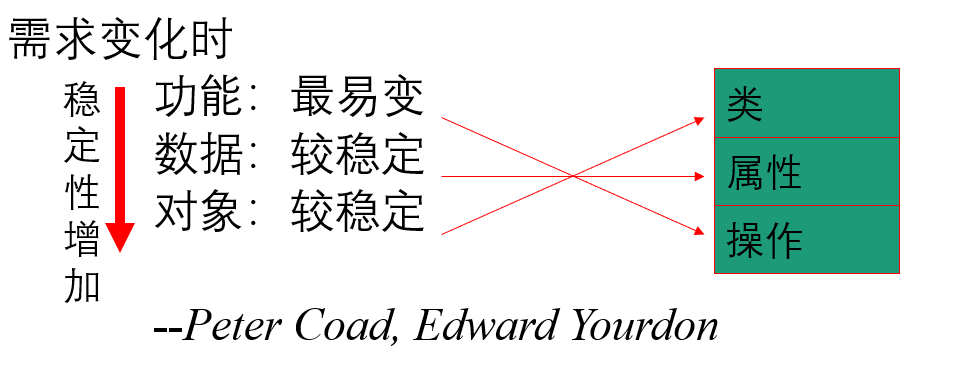
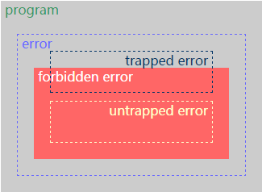
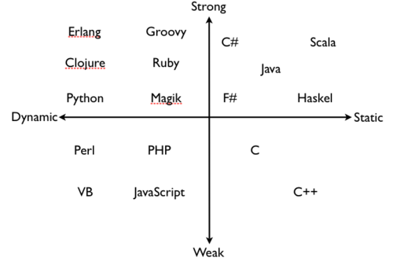

> 一些乱七八糟概念

# 1. 方法论

## 1.1. 软件分析设计方法

### 1.1.1. 演变

- 结构化方法（功能分解法）
  - 总的指导思想：
    - 自顶向下、逐步求精、单入口、单出口，基本原则是抽象和功能分解。
  - 结构化编程:
    - 结构化程序具有一个开始和一个结束的程序或程序模块，并且在程序执行中的每一步都由“顺序、选择和循环”之一组成。
  - 结构化设计
    - 结构化设计的两个基本原则：**松耦合、高内聚**
    - 结构化设计技术只是帮助系统设计者完成**部分而不是全部**系统设计生命周期阶段。

  

- 信息建模法  面向数据（数据与责任分离）

  

- 面向对象方法 描述现实世界（数据与责任结合）
  > 出发点和基本原则是尽可能模拟人类习惯的思维方式，使开发软件的方法有过程尽可能接近人类认识世界的方法与过程。
  - 面向对象编程
    - 定义各类对象的行为，包括对象间的消息传递。
  - 面向对象分析
    - 定义在系统中工作的所有类型的对象，并显示这些对象如何通过相互作用来完成任务。
  - 面向对象设计
    - 定义在系统中人机进行通讯所必须的所有类型的对象，并对每一种类型的对象进行细化。

  
  

- 形式化方法
  > 是提高计算机软件可靠性的一种重要技术。（VDM系统、Z系统、RAISE系统）
  - 形式化分析
    - 根据用户需求得到最初的规格说明。（采用RSL语言描述）
  - 形式化设计
    - 从最初的规格说明逐步演变到最终的规格说明。
  - 翻译
    - 将最终规格说明转换为计算机可执行的程序。

### 1.1.2. 对比

- 结构化方法
  - 简单实用、技术成熟、应用广泛（是软件工程中最为成熟的技术之一）
  - 缺点
- 面向对象方法
  - 稳定性、可复用性、可维护性好
- 形式化方法

> **面向对象与面向功能分析与设计**

> **核心**

如何利用各种方法的长处，实现优势互补（SOFL开发方法）！

## 1.2. 面向对象

### 1.2.1. 面向对象整体说明

**OOA、OOD、OOP 三个连在一起就是面向对象分析、设计、编程（实现），正好是面向对象软件开发要经历的三个阶段** 。

- 面向对象分析英文缩写是 OOA，全称是 Object Oriented Analysis；
  - 分析强调对问题的调查 而不是如何确定解决方案。
  - OOA的常用工件是“域模型”，并可以用UML的类图来可视化表示域模型。
- 面向对象设计的英文缩写是 OOD，全称是 Object Oriented Design。
  - 设计强调的是问题的逻辑解决方案 。
  - OOD常用的工件是“设计模型”，可以用UML的包图、类图和交互图来可视化表示设计模型。
- 面向对象编程的英文缩写是 OOP，全称是 Object Oriented Programming。
  - 面向对象编程是一种编程范式或编程风格。它以类或对象作为组织代码的基本单元，并将封装、抽象、继承、多态四个特性，作为代码设计和实现的基石 。
  - 面向对象编程语言是支持类或对象的语法机制，并有现成的语法机制，能方便地实现面向对象编程四大特性（封装、抽象、继承、多态）的编程语言。

### 1.2.2. OOA/OOD发展历史

- 发展
  - OO编程语言起源于挪威人Kristen Ngaard于1962年发明的Simula语言和美国人Alan Kay于1970年发明的Smalltalk语言。
  - 到1980年，Russell Abbott出版“Report onTeaching Ada”,有关OOA/D著作面世。
  - 里程碑式的论文是Grady Booch的”Describing Software Design in Ada”
  - 1995年UML语言诞生

- 注意：
  - 成功运用OOA/D重点不在表示符号（如UML）上而在于如何用对象来思考，也就是要掌握对象设计时要应用的原则和模式。
  - OOA/D不适合“瀑布”式的开发流程，而应在“迭代”过程里应用OOA/D，如RUP或XP。
  - 开发者学习多种编程语言非常有价值，这样做的目的是真正理解编程问题有多种不同的方法。

### 1.2.3. 面向对象要素

## 1.3. AOP

## 1.4. FP

# 2. 原则和模式

- [七大原则与设计模式](../design_patterns/design_pattern.md)

# 3. 范式

## 3.1. 过程式编程

## 3.2. 命令式编程

## 3.3. 面向对象编程

## 3.4. 声明式编程

TODO: 声明式编程和DSL

### 3.4.1. 基本说明

- 声明式编程(Declarative programming)是一种编程范式
  - 与命令式编程相对立。
  - 它描述目标的性质， **让计算机明白目标** ，而非流程。
  - 声明式编程不用告诉计算机问题领域，从而避免随之而来的副作用
  - 而命令式编程则需要用算法来明确的指出每一步该怎么做。

- 声明式编程通常被看做是形式逻辑的理论，把计算看做推导
  - 声明式编程因大幅简化了并行计算的编写难度
  - 声明式编程透过函数、推论规则或项重写（term-rewriting）规则，来描述变量之间的关系
  - 它的语言运行器（编译器或解释器）采用了一个固定的算法，以从这些关系产生结果。

- 声明式语言包包括:
  - 数据库查询语言（SQL，XQuery）
  - 正则表达式
  - 逻辑编程
  - 函数式编程
  - 组态管理系统

- 命令式与声明式

通过适当的封装、组件化，命令式也可以变成目标导向，变得更加“声明式”

### 3.4.2. 子编程范式

> 声明式编程是一个笼统的概念，其下包含一些有名的子编程范式

#### 3.4.2.1. 领域专属语言 DSL

##### 基本说明

- 领域特定语言(domain-specific language)（DSL）
  - 是一种 **旨在特定领域下的上下文的语言**
    - 这里的领域是指某种商业上的（例如银行业、保险业等）上下文
    - 也可以指某种应用程序的（例如 Web 应用、数据库等）上下文
  - 与之相比的另一个概念是  **通用语言(general purpose Programming language) GPPL**
    - 通用语言则可以广泛应用于各种商业或应用问题当中。

- 特点：DSL 并 **不具备很强的普适性**
  - 它是仅为 **某个适用的领域** 而设计的
  - 但它也足以用于表示这个领域中的问题以及构建对应的解决方案

- 示例：
  - DSL 的一个典型是HTML
    - 它是在 Web 应用上使用的语言
    - 尽管 HTML 无法进行数字运算，但也不影响它在这方面的广泛应用。
  - GPL 则没有特定针对的领域
    - 这种语言的设计者不可能知道这种语言会在什么领域被使用，更不清楚用户打算解决的问题是什么
    - 因此 GPL 会被设计成可用于解决任何一种问题、适合任何一种业务、满足任何一种需求
    - 例如 Java 就属于 GPL，它可以在 PC 或移动设备上运行，嵌入到银行、金融、保险、制造业等各种行业的应用中去。

##### 类别

- 外部DSL
  - 是一种独立的编程语言，需要从解析器开始实现自己的编译工具，实现成本较高。
  - 但语法的灵活性更高，更容易达到用户的表现力需求。
  - 外部 DSL 的直接对应就是 GPPL，由于受限语法特性更少，一般不要求图灵完备，所以它实现难度会低于 GPPL。

- 内部 DSL（Embedded DSL or Internal DSL）
  - 建立在其它宿主语言之上（一般为 GPPL）的特殊 DSL
  - 它 **与宿主语言共享编译与调试工具等基础设施** ，学习成本更低，也更容易被集成
  - 他在语法上与宿主语言同源，但在 **运行时上需要做额外的封装**
  - 可以 **将内部DSL视为针对特定任务的特殊接口封装风格**

- 示例：
  - 外部DSL: 前端常用的模板引擎如 mustache 以及 React、Vue 支持的 JSX 语法都属于外部 DSL
  - 内部DSL：jQuery 就可以认为是针对 DOM 操作的一种内部 DSL。

##### DSL风格指南

##### 用途

- DSL擅长在程序中某些特定的部分发挥作用，让它们容易被理解，进而提高编写和维护的速度，并且减少bug。
- DSL的第二个优势就不仅限于程序员的范畴了

  > 达成并非易事，但从其回报来看是很值得的。
  >
  > 软件开发中最狭窄的瓶颈就是程序员和客户之间的交流，任何可以解决这一问题的技术都值得一试。
  - 因为DSL往往短小易读，所以非程序员也能看懂这些驱动着其重要业务的代码
  - 把这些实际的代码暴露在领域专家面前，程序员和客户之间就有了非常顺畅的沟通渠道。

##### DSL与库接口区别

- 实际上 DSL 也有个别名叫 **流畅接口** ，所以它本身也属于接口封装或库封装的一种模式，目标是极限表达力。
- 但相较于传统接口封装，有几个显著设计差异点：
  - 语言性。
  - 不受传统编程最佳实践的束缚：如命令-查询分离、迪米特法则等
- 比如：
  - jQuery 中 html 即是查询方法（.html()）也是命令方法（.html('content to set')）
  - 这显然背离了命令查询分离的原则
- DSL设计的首要目标是「极限流畅的表现力」，而非职责清晰、降低耦合度等传统的封装抽象准则。

##### 优缺点

#### 3.4.2.2. 约束式编程

#### 3.4.2.3. 函数式编程

#### 3.4.2.4. 逻辑式编程

## 3.5. 事件驱动编程

java Swing、Pyqt等

## 3.6. 元编程

[元编程](https://www.jianshu.com/p/d3b637ece518)

元编程（Metaprogramming）是编写、操纵程序的程序，简而言之即为用代码生成代码。
元编程是一种编程范式，在传统的编程范式中，程序运行是动态的，但程序本身是静态的。在元编程中，两者都是动态的。
元编程将程序作为数据来对待，从而赋予了编程语言更加强大的表达能力。

# 4. 编程语言类型系统

## 4.1. 基础

### 4.1.1. 类型与数据

- 定义了一个某一个类型的数据，通常意味着以下三件事：
  > 无论编译型语言还是解释型语言，这三点是共性。
  - **定义了一块某种结构的存储空间，用来存储这个数据** ；
  - **特定类型意味可以对这块存储空间进行一些特定的操作** ；
  - **声明了一个标识符（不严密的说就是变量名）操作这块数据，否则这块数据是无法使用的** 。

- 从程序出错的角度来看，和类型有关的错误：
  - 访问了一个特定类型的标识符，但是访问的不是预期的存储空间。
  - 对特定类型的标识符对应的数据，进行了非预期的操作。

### 4.1.2. 判断标准参考

> 
> - 红色区域外：well behaved （type soundness）
> - 红色区域内：ill behaved

- 强/弱
  - 如果所有程序都是灰的，strongly typed
  - 否则如果存在红色的程序，weakly typed
- 动/静
  - 编译时排除红色程序，statically typed
  - 运行时排除红色程序，dynamically typed
- 所有程序都在黄框以外，type safe

- 

  
参考

  参考：《Type Systems》 Luca Cardelli - Microsoft Research

  - **Trapped error** : An execution error that immediately results in a fault.
  - **Untrapped error** : An execution error that does not immediately result in a fault.
  - **Forbidden error** : The occurrence of one of a predetermined class of execution errors;
  - **Typically the**  improper application of an operation to a value, such as not(3).
  - **Well behaved** : A program fragment that will not produce forbidden errors at run time.
  - **Strongly checked**  language: A language where no forbidden errors can occur at run time (depending on the definition of forbidden error).
  - **Weakly checked**  language: A language that is statically checked but provides no clear guarantee of absence of execution errors.
  - **Statically checked**  language: A language where good behavior is determined before execution.
  - **Dynamically checked**  language: A language where good behavior is enforced during execution.
  - **Type safety** : The property stating that programs do not cause untrapped errors.
  - **Explicitly typed**  language: A typed language where types are part of the syntax.
  - **Implicitly typed**  language: A typed language where types are not part of the syntax.
  

### 4.1.3. 语言总览

## 4.2. 类型系统的分类说明

### 4.2.1. 强弱类型

- 说明
  - 强类型语言是一种强制类型定义的语言
    - 即一旦某一个变量被定义类型
    - **如果不经强制转换** ，那么它永远就是该数据类型
  - 弱类型语言是一种弱类型定义的语言
    - 某一个变量被定义类型
    - **该变量可以根据环境变化自动进行转换** ，不需要经过现行强制转换。
    - 比如C,C++,javascript

- 注意：
  - 可以拿两个类型系统非常相近的语言进行比较，然后说其中一个的类型系统更强一些
  - 但除此之外，强弱这样的词语是无意义的

### 4.2.2. 静态/动态类型

> 动态和静态类型系统是截然不同的两个概念，只不过它们的目的有部分重合。

- 说明
  - 静态类型语言
    - 说明
      - 静态类型语言与动态类则刚好相反， **它的数据类型在编译期间检查**
      - 也就是说在写程序时要声明所有变量的数据类型
    - 原理：
      - 在编译器在检查代码时，会为特定的语法打标签，进而推断出程序的行为
      - 这里的标签就是“类型”，或者称为静态类型
    - 语言示例
      - C/C++是静态类型语言的典型代表，其他静态语言还有C#、Java等。
  - 动态类型语言：
    - 说明
      - 动态性语言是指 **在运行期间才去做数据类型检查** 的语言
      - 也就是说动态类型语言编程时，永远不用给任何变量指定数据类型
      - 该语言会在第一次赋值给变量时，在内部将数据类型记录下来
    - 原理：
      - 动态类型系统也是编译器的一种机制
      - 但是是用来跟踪记录程序中数据的种类（巧合的是，这个“种类“通常也被称为“类型”）的。
    - 语言示例
      - Python和Ruby就是一种典型的动态类型语言
      - 其他的各种脚本语言如VBScript也多少属于动态类型语言。

  > 这里两次使用了同一个词——“类型”，这并不完全是一种巧合。
  > 但是我们最好将此理解为一种历史遗留，因为一旦将两种系统中的“类型”解释为同一个概念，往往就容易混淆不清。

- 联系和差别
  - 很多时候，静态类型和动态类型是为了解决同样的问题。
  - 然而，静态类型能解决的问题不只限于动态类型解决的。
  - 同样的，动态类型能解决的问题也不只限于静态类型所解决的。
  - **从本质上看，这两种技术是完全不同的**

- 静态类型和动态类型的二分有一定的误导性
  - 大多数语言——即便自称是动态类型的——都包含一定的静态类型
  - 同时，几乎所有语言都有动态类型。但多数语言主要表现出这两种中的某一种
  - 为什么呢？因为上面四点中的第一点：
    - 这两种类型系统想要解决的问题有很大的重合
    - 所以，为一门语言既设计很强的静态类型又设计很强的动态类型并不会带来太多额外的好处，反而会增添不少成本。

### 4.2.3. 其他区分

> 还有很多其他相对不那么常见的类型系统分类方式，但有一些也值得一提。

- 可靠类型（sound types）：
  - 可靠类型系统能够提供可靠的某种保证。
  - 它是和静态类型相关的一个严格定义的概念，也有相关的证明技术等等。很多现代的类型系统都是可靠的。
  - 老的编程语言，比如C，由于设计原因，常常没有可靠的类型系统。它们的类型系统仅仅能够对一些常见的错误给出警告。
  - 可靠类型系统的概念也可以不那么严格的扩展到动态类型系统上去，但是不同用法的含义可能会略有不同。
- 显式/隐式类型（explicit/implicit types）：
  - 这些术语指的是编译器在何种程度上对程序的静态类型进行推理。
  - 所有的编程语言都对类型进行一些推理。有些语言比其他的推理得更多。
  - ML和Haskell使用隐式类型，程序员不（或很少，视具体的语言和扩展而定）需要进行类型声明。
  - Java和Ada使用非常显式的类型，你需要不停地声明所有东西的类型。所有这些语言都（相对C和C++）使用了更强的静态类型系统。
- Lambda方（the lambda cube）：
  - 不同静态类型系统之间的差别被抽象总结为了lambda方。
  - 它的具体定义超出了本文所讨论的范围，但简单来说就是描述了类型系统的一些特征：例如参数类型，依赖类型，类型运算符等等。想了解更多请点[这里](http://citeseer.ist.psu.edu/barendregt92lambda.html)。
- 结构化/名义类型（structural/nominal types）：
  - 结构化类型与名义类型的区分主要是针对有子类的静态类型而言的。
  - 结构化类型意味着只要某种关于类型的假定是合理的，我们就可以真的这么假定。
  - 例如某个含有字段x、y、z的类型可以自动被认为是只有x、y字段的类型的子类。而对于名义类型，除非我们显式地声明，否则这种关系并不存在。
    > **结构化类型比如typescript**
- 鸭子类型（duck typing）：
  - 这是一个最近开始流行的术语，可以认为是结构类型在动态类型系统里的对应概念。
  - 运行时系统并不是通过检查一个值的类型标签来决定它的类型和所支持的操作，而是检查它是否确实支持那些会被调用到的操作。
  - 而这些操作可以被不同的类型用不同的方式实现。

TODO: ※ 重要。编程语言类型系统，学ts，看看这个挺启发的

## 4.3. 误区分析

### 4.3.1. 误区：静态类型需要类型声明

### 4.3.2. 误区：动态类型语言都是弱类型的

### 4.3.3. 误区：静态类型意味着预先设计或是瀑布开发模式（waterfall methods）

### 4.3.4. 误区：动态类型语言不容易发现bug

### 4.3.5. 误区：静态类型要写更多代码

## 4.4. 静态类型优势

## 4.5. 类型与类型系统

# 5. 其他

## 5.1. 分合思想

### 5.1.1. 分

- 集中式服务发展到分布式服务
- 从Collections.synchronizedMap(x)到1.7ConcurrentHashMap再到1.8ConcurrentHashMap，细化锁的粒度的同时依旧保证线程安全
- 从AtomicInteger到LongAdder，ConcurrentHashMap的size()方法。用分散思想，减少cas次数，增强多线程对一个数的累加
- JVM的G1 GC算法，将堆分成很多Region来进行内存管理
- Hbase的RegionServer中，将数据分成多个Region进行管理
- 平时开发是不是线程池都资源隔离

### 5.1.2. 合

- TLAB（Thread Local Allocation Buffers），线程本地分配缓存。避免多线程冲突，提高对象分配效率
- 逃逸分析，将变量的实例化内存直接在栈里分配，无需进入堆，线程结束栈空间被回收。减少临时对象在堆内分配数量
- CMS GC算法下，虽然使用标记清除，但是也有配置支持整理内存碎片。如：
  - -XX:UseCMS-CompactAtFullCollection（FullGC后是否整理，Stop The World会变长）
  - -XX:CMSFullGCs-BeforeCompaction（几次FullGC之后进行压缩整理）
- 锁粗化，当JIT发现一系列连续的操作都是对同一对象反复加锁和释放锁，会加大锁同步的范围
- kafka的网络数据传输有一些数据配置，减少网络开销。如：batch.size和linger.ms等等
- 平时开发是不是都个叫批量获取接口

### 5.1.3. 面向单元测试代码重构

### 5.1.4. 契约式设计DbC(Design by Contract)

### 5.1.5. 面条代码与面向对象的平衡

# 6. 参考资料

待补充

- [ ] [谈谈编程思想](https://blog.p2hp.com/archives/4978)
- [x] [What to know before debating type systems](http://blogs.perl.org/users/ovid/2010/08/what-to-know-before-debating-type-systems.html)
  - [x] [翻译](https://www.zhihu.com/question/19918532)
- [ ]  《冒号课堂》
- [ ] [开发者需要了解的领域特定语言（DSL）](https://zhuanlan.zhihu.com/p/110757158)
- [ ] [前端 DSL 实践指南（上）—— 内部 DSL](https://zhuanlan.zhihu.com/p/107947462)
- [x] [声明式(declarative) vs 命令式(imperative)](https://lotabout.me/2020/Declarative-vs-Imperative-language/)
- [ ]  《领域特定语言》-Martin Fowler

