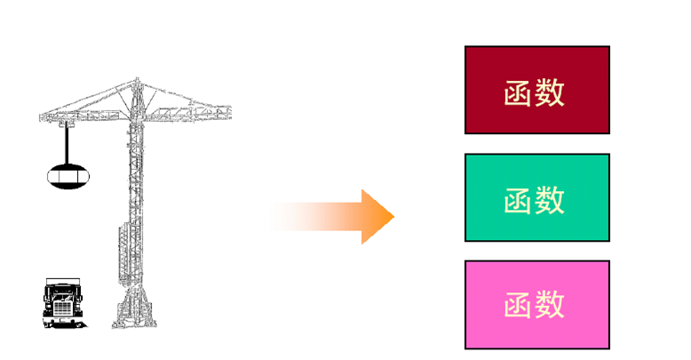
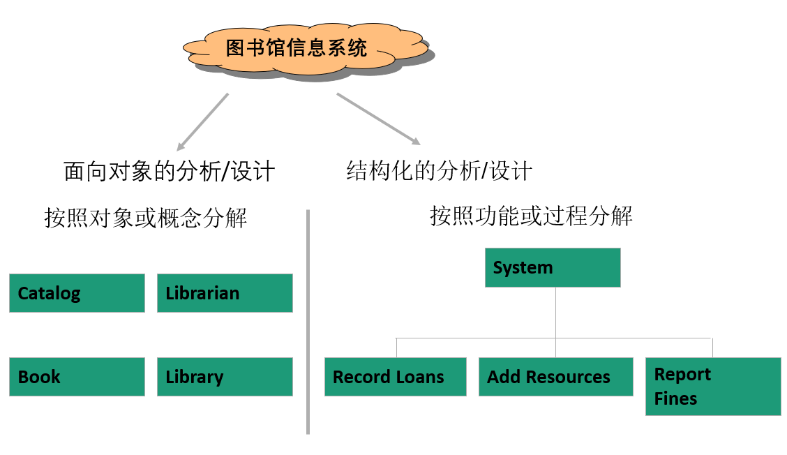

# 方法论

## 软件分析设计方法

### 演变

- 结构化方法（功能分解法）
  - 总的指导思想：
    - 自顶向下、逐步求精、单入口、单出口，基本原则是抽象和功能分解。
  - 结构化编程:
    - 结构化程序具有一个开始和一个结束的程序或程序模块，并且在程序执行中的每一步都由“顺序、选择和循环”之一组成。
  - 结构化设计
    - 结构化设计的两个基本原则：**松耦合、高内聚**
    - 结构化设计技术只是帮助系统设计者完成**部分而不是全部**系统设计生命周期阶段。

  

- 信息建模法  面向数据（数据与责任分离）

  

- 面向对象方法 描述现实世界（数据与责任结合） 
  > 出发点和基本原则是尽可能模拟人类习惯的思维方式，使开发软件的方法有过程尽可能接近人类认识世界的方法与过程。
  - 面向对象编程
    - 定义各类对象的行为，包括对象间的消息传递。
  - 面向对象分析
    - 定义在系统中工作的所有类型的对象，并显示这些对象如何通过相互作用来完成任务。
  - 面向对象设计
    - 定义在系统中人机进行通讯所必须的所有类型的对象，并对每一种类型的对象进行细化。

  
  

- 形式化方法 
  > 是提高计算机软件可靠性的一种重要技术。（VDM系统、Z系统、RAISE系统）
  - 形式化分析
    - 根据用户需求得到最初的规格说明。（采用RSL语言描述）
  - 形式化设计
    - 从最初的规格说明逐步演变到最终的规格说明。
  - 翻译
    - 将最终规格说明转换为计算机可执行的程序。

### 对比

- 结构化方法
  - 简单实用、技术成熟、应用广泛（是软件工程中最为成熟的技术之一）
  - 缺点
- 面向对象方法
  - 稳定性、可复用性、可维护性好
- 形式化方法
 
> **面向对象与面向功能分析与设计**

> **核心**

如何利用各种方法的长处，实现优势互补（SOFL开发方法）！

## 面向对象

### 面向对象整体说明

**OOA、OOD、OOP 三个连在一起就是面向对象分析、设计、编程（实现），正好是面向对象软件开发要经历的三个阶段** 。

- 面向对象分析英文缩写是 OOA，全称是 Object Oriented Analysis；
  - 分析强调对问题的调查 而不是如何确定解决方案。
  - OOA的常用工件是“域模型”，并可以用UML的类图来可视化表示域模型。
- 面向对象设计的英文缩写是 OOD，全称是 Object Oriented Design。
  - 设计强调的是问题的逻辑解决方案 。
  - OOD常用的工件是“设计模型”，可以用UML的包图、类图和交互图来可视化表示设计模型。
- 面向对象编程的英文缩写是 OOP，全称是 Object Oriented Programming。
  - 面向对象编程是一种编程范式或编程风格。它以类或对象作为组织代码的基本单元，并将封装、抽象、继承、多态四个特性，作为代码设计和实现的基石 。
  - 面向对象编程语言是支持类或对象的语法机制，并有现成的语法机制，能方便地实现面向对象编程四大特性（封装、抽象、继承、多态）的编程语言。

### OOA/OOD发展历史

- 发展
  - OO编程语言起源于挪威人Kristen Ngaard于1962年发明的Simula语言和美国人Alan Kay于1970年发明的Smalltalk语言。
  - 到1980年，Russell Abbott出版“Report onTeaching Ada”,有关OOA/D著作面世。
  - 里程碑式的论文是Grady Booch的”Describing Software Design in Ada”
  - 1995年UML语言诞生

- 注意：
  - 成功运用OOA/D重点不在表示符号（如UML）上而在于如何用对象来思考，也就是要掌握对象设计时要应用的原则和模式。
  - OOA/D不适合“瀑布”式的开发流程，而应在“迭代”过程里应用OOA/D，如RUP或XP。
  - 开发者学习多种编程语言非常有价值，这样做的目的是真正理解编程问题有多种不同的方法。

### 面向对象要素

## AOP

## FP

# 原则和模式

详见：[其大原则与设计模式](../design_patterns/design_pattern.md)

# 范式

## GP

Generic Programming

## MP

Meta Programming

# 具体思想

## 分合思想

### 分

- 集中式服务发展到分布式服务
- 从Collections.synchronizedMap(x)到1.7ConcurrentHashMap再到1.8ConcurrentHashMap，细化锁的粒度的同时依旧保证线程安全
- 从AtomicInteger到LongAdder，ConcurrentHashMap的size()方法。用分散思想，减少cas次数，增强多线程对一个数的累加
- JVM的G1 GC算法，将堆分成很多Region来进行内存管理
- Hbase的RegionServer中，将数据分成多个Region进行管理
- 平时开发是不是线程池都资源隔离

### 合

- TLAB（Thread Local Allocation Buffers），线程本地分配缓存。避免多线程冲突，提高对象分配效率
- 逃逸分析，将变量的实例化内存直接在栈里分配，无需进入堆，线程结束栈空间被回收。减少临时对象在堆内分配数量
- CMS GC算法下，虽然使用标记清除，但是也有配置支持整理内存碎片。如：
  - -XX:UseCMS-CompactAtFullCollection（FullGC后是否整理，Stop The World会变长）
  - -XX:CMSFullGCs-BeforeCompaction（几次FullGC之后进行压缩整理）
- 锁粗化，当JIT发现一系列连续的操作都是对同一对象反复加锁和释放锁，会加大锁同步的范围
- kafka的网络数据传输有一些数据配置，减少网络开销。如：batch.size和linger.ms等等
- 平时开发是不是都个叫批量获取接口

# 参考资料

待补充

- [谈谈编程思想](https://blog.p2hp.com/archives/4978)
- 《冒号课堂》
