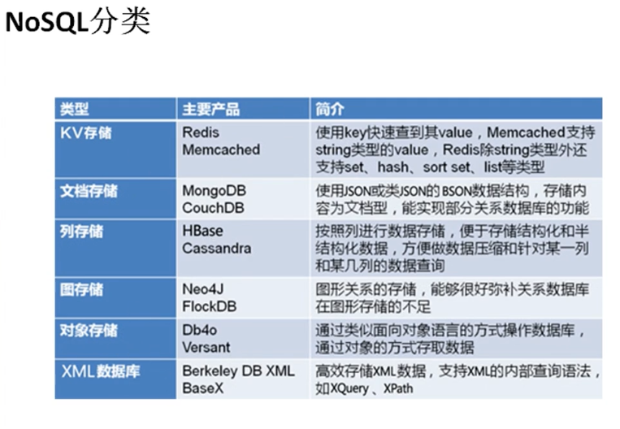

- [这里的是草稿，详细笔记来这里](../database/redis.md)

# 简介

## 数据库的发展：

- 一开始使用文本存储数据。但数据量太大的时候不容易查询
- 然后产生了关系型数据库。数据库优于文本的原因：
  - 存储：datapage
    - 专门存储片段数据的页，默认大小为4k，
    - 每个datapage都有一个datapage_id
    - 和底层file system一次io最大吞吐量4k相同
    - 充分使用io性能,每次io都能读取一页
    - 关系型数据库中有多个个datapage用来存储数据。
  - 查找：索引
    - 注意：索引同样使用datapage进行存储
    - 每个索引都记录了数据的datapage_id
    - 查数据库时，先查索引(第一次IO)，找到数据对应的datapage_id
      - 之所以能直接查索引，是因为索引是进行排序的。通过B+树
      - 详细架构：※待做※
    - 再查datapage（第二次IO）
- 在并发量暴增的情况下，因为io瓶颈问题，关系两无法满足需求，所以出现了内存数据库,如redis,mongoDB,memcached
- 也有把关系型数据库和内存数据库结合起来的，关系型内存数据库。SAP HANA
  - 贵，贵到死，搭建个集群上亿

## redis适用场景

- 数据类型及存放
  - 冷数据：基本上不使用的数据，存放到磁盘上
  - 热数据：经常使用的数据，存放到内存中

## NoSQL分类




## redis简介

- 特点
  - 开源
  - 数据结构类型丰富
  - 支持客户端丰富
  - 存放为键值对形式
  - 用途：
    - 缓存
    - 数据库
    - 消息中间件

# 安装

## 单机版安装

- 安装gcc tcl
- 解压
- 编译和安装`make && make PREFIX=/opt/learn/redis install`
  > 安装就是把必要的启动命令拷贝到指定目录下
- 配置环境变量
- 安装服务器：执行redis编译结果中的install_server.sh
  > redis数据库可以有多个实例<br />
  > 每个实例都会监听互不相同的端口 <br />
  > **使用redis-server也可以开启服务器。不过使用该命令后，每次启动linux时，会自动启动redis服务器**
  - 会选择redis实例端口（默认6379）
  - 配置文件位置（默认）
  - log文件位置（默认）
  - 数据持久化位置（默认）
  - redis-server位置（从环境变量中获取）
- 启动redis客户端：redis-cli.sh
  > **redis-cli.sh -h 可以查看帮助**

## 分布式安装

# 使用帮助

- `help`
  - `help @<group>` 列出指定组的所有命令。每一个数据类型对应一组
  - `help <command>` 列出制定命令的详细使用方法
  - `help <tab>` tab自动提示

# 键值对架构

- key值是二进制安全的
  - 也就是key是以二进制序列的形式存储的。
  - 把字符串还是图片作为key都可以
- 键值原则
  - 键不要太长，消耗内存，并且查找效率低
  - 也不要太短，导致可读性差

# 支持类型

## 字符串

### 字符串基础操作

- set
  - ex,或者setex
  - px,或者setpx
  - nx,或者setnx
  - xx
- mset key1 value1 key2 value2
  - ex,或者setex
  - px,或者setpx
  - nx,或者setnx
  - xx
- `expire <key> <num>` 重新设置k-v的清空时间，单位为秒
- `pexpire <key> <num>` 重新设置k-v的清空时间，单位为毫秒
- keys 通配符
  - `*`任意长度字符
  - ? 一个字符
  - [] 字符集合中的任何一个 
- TTL
- strlen
- flushall


```sql
set k1 a
get k1
keys k*
set k2 ex 5
expire,设置存活时间,单位为秒
ex 单位为秒
px 单位为毫秒

TTL k2
查看 time to live
setnx 只允许创建，不能覆盖。set可以覆盖
set key value xx :只允许修改，不能创建
strlen:获得字符串长度
flashall :清空所有数据(慎用)
```

### 数值计算

### 位图

## 列表

## 散列

## 集合

## 有序集合

## HyperLogLog

# 持久化

- 默认RDB,一般使用非阻塞方式 bgsave。每隔一段时间进行一次持久化
- 每次持久化都会产生一个RDB文件
- 之后新的RDB会把老的RDB覆盖掉
- AOF一般会关闭，如果开启AOF后，RDB就不会再监控了


