TODO: 《重构》笔记整理

有一定编程经验的人，下面的内容基本上可能已经心领神会，
我主要注重 **这样做有依据，可以大胆去做** 以及 **哪种时候这么做** 这两点，
确保工作中不要蹑手蹑脚，也不要过于大刀阔斧

# 1. 概述

## 1.1. 何谓重构

### 1.1.1. 重构含义

- (名词)：对软件内部结构的一种调整，目的是在**不改变软件可观察行为**的前提下，**提高其可理解性，降低其修改成本**
- (动词)：使用一系列重构手法，在**不改变软件可观察行为**的前提下，**调整其结构**。

> 所以，可能会花一两个小时进行重构(动词)，其间我会使用几十个不同的重构(名词)。

### 1.1.2. 重构关键

- 运用**大量微小且保持软件行为的步骤**，一步步达成大规模的修改
  - 每个单独的重构要么很小，要么由若干小步骤组合而成
  - 因此，在重构的过程中，代码很少进入不可工作的状态，即便重构没有完成，也可以在任何时刻停下来。
  - 整个过程中也不需要花任何时间来调试。

- **不改变可观察行为**
  - **整体而言，经过重构之后的代码所做的事应该与重构之前大致一样**
  - 重构之后的代码不一定与重构前行为完全一致
    - 比如说，提炼函数(106)会改变函数调用栈，因此程序的性能就会有所改变
    - 改变函数声明(124)和搬移函数(198)等重构经常会改变模块的接口
  - 不过就用户应该关心的行为而言，不应该有任何改变
    - 如果在重构过程中发现了任何bug，重构完成后同样的bug应该仍然存在
    - 不过，如果潜在的bug还没有被任何人发现，也可以当即把它改掉

### 1.1.3. 重构与性能优化

- 重构与性能优化有很多相似之处：
  - 两者都需要修改代码
  - 并且两者都不会改变程序的整体功能
- 两者的差别在于其目的
  - 重构是为了让代码“更容易理解，更易于修改”。这可能使程序运行得更快，也可能使程序运行得更慢
  - 在性能优化时，我只关心让程序运行得更快，最终得到的代码有可能更难理解和维护，对此我有心理准备
  -
## 1.2. 重构注意：两顶帽子

- 使用重构技术开发软件时，时间会分配给两种截然不同的行为
  - 添加新功能
    - 添加新功能时，我不应该修改既有代码，只管添加新功能
    - 通过添加测试并让测试正常运行，我可以衡量自己的工作进度
  - 重构
    - 重构时我就不能再添加功能，只管调整代码的结构
    - 此时我不应该添加任何测试(除非发现有先前遗漏的东西)，只在绝对必要(用以处理接口变化)时才修改测试。

- 软件开发过程中，可能会发现经常变换帽子
  - 首先我尝试添加新功能，然后会意识到：如果把程序结构改一下，功能的添加会容易得多
  - 于是换一顶帽子，做一会儿重构工作
  - 程序结构调整好后，又换上原先的帽子，继续添加新功能
  - 新功能正常工作后，我又发现自己的编码造成程序难以理解
  - 于是又换上重构帽子
  - 整个过程或许只花10分钟，但**无论何时都必须清楚自己戴的是哪一顶帽子，并且明白不同的帽子对编程状态提出的不同要求**

## 1.3. 为何重构

### 1.3.1. 没有银弹

- 它绝对不是所谓的银弹
- 不过它的确很有价值
- 可以帮你始终良好地控制自己的代码

### 1.3.2. 作用

- **重构改进软件的设计**
  - 如果没有重构，程序的内部设计(或者叫架构)会逐渐腐败变质
    - **当人们只为短期目的而修改代码时，他们经常没有完全理解架构的整体设计，于是代码逐渐失去了自己的结构**
    - 程序员越来越难通过阅读源码来理解原来的设计，**代码结构的流失有累积效应**
    - 越难看出代码所代表的设计意图，就越难保护其设计，于是设计就腐败得越快
    - **经常性的重构有助于代码维持自己该有的形态**
  - 完成同样一件事，设计欠佳的程序往往需要更多代码
    - 这常常是因为代码在不同的地方使用完全相同的语句做同样的事，因此改进设计的一个重要方向就是消除重复代码
    - 代码量减少并不会使系统运行更快，因为这对程序的资源占用几乎没有任何明显影响
    - 然而代码量减少将使未来可能的程序修改动作容易得多
    - 代码越多，做正确的修改就越困难，因为有更多代码需要理解
    - 消除重复代码，就可以确定所有事物和行为在代码中只表述一次，这正是优秀设计的根本

- **重构使软件更容易理解**
  - **代码不是给计算机看的，是给程序员看的**
    - 所谓程序设计，很大程度上就是与计算机对话：编写代码告诉计算机做什么事，而它的响应是按照我的指示精确行动
    - 计算机肯定会理解交给它的代码，问题是程序员是否理解自己交给计算机什么样的代码

- **重构帮助找到bug**
  - 对代码的理解，有助于找到bug
  - 如果对代码进行重构，就可以深入理解代码的所作所为，并立即把新的理解反映在代码当中
  - 搞清楚程序结构的同时，也验证了自己所做的一些假设，很容易发现潜在bug

- **重构提高编程速度**
  - 只考虑功能，不考虑代码结构
    - 一开始进展会很快，但如今想要添加一个新功能需要的时间就要长得多
    - 他们需要花越来越多的时间去考虑如何把新功能塞进现有的代码库，不断蹦出来的bug修复起来也越来越慢
    - 代码库看起来就像补丁摞补丁，需要细致的考古工作才能弄明白整个系统是如何工作的
    - 这份负担不断拖慢新增功能的速度，到最后程序员恨不得从头开始重写整个系统。

    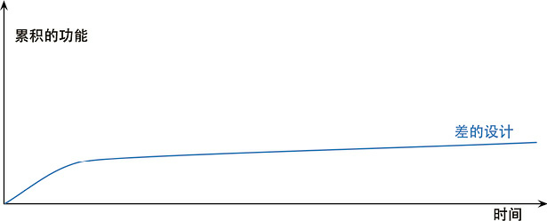

  - **投入精力改善内部设计**
    - 需要添加新功能时，内部质量良好的软件让我可以很容易找到在哪里修改、如何修改
    - **良好的模块划分使我只需要理解代码库的一小部分，就可以做出修改**
    - 如果代码很清晰，我引入bug的可能性就会变小，即使引入了bug，调试也会容易得多
    - 理想情况下，我的代码库**会逐步演化成一个平台**，在其上可以很容易地构造与其领域相关的新功能。
    - "设计耐久性假说"
      - 通过投入精力改善内部设计，我们增加了软件的耐久性，从而可以更长时间地保持开发的快速

    

### 1.3.3. 设计与重构

- 20年前，行业的陈规认为：良好的设计必须在开始编程之前完成，因为一旦开始编写代码，设计就只会逐渐腐败
- 重构改变了这个图景
  - 现在我们可以改善已有代码的设计，因此**我们可以先做一个设计，然后不断改善它**
  - 哪怕程序本身的功能也在不断发生着变化
  - 由于预先做出良好的设计非常困难，想要既体面又快速地开发功能，重构必不可少。

## 1.4. 为什么重构有用

## 1.5. 何时重构

### 1.5.1. 何时应该重构

#### 1.5.1.1. 三次法则

> Don Roberts给了我一条准则：第一次做某件事时只管去做；第二次做类似的事会产生反感，但无论如何还是可以去做；第三次再做类似的事，你就应该重构。

- 正如老话说的：事不过三，三则重构。

#### 1.5.1.2. 预备性重构：让添加新功能更容易

- 重构的最佳时机就在添加新功能之前

  ```
  在动手添加新功能之前，我会看看现有的代码库，此时经常会发现：
  如果对代码结构做一点微调，我的工作会容易得多
  也许已经有个函数提供了我需要的大部分功能，但有几个字面量的值与我的需要略有冲突。
  如果不做重构，我可能会把整个函数复制过来，修改这几个值，但这就会导致重复代码
  如果将来我需要做修改，就必须同时修改两处(更麻烦的是，我得先找到这两处)。
  而且，如果将来我还需要一个类似又略有不同的功能，就只能再复制粘贴一次，这可不是个好主意。
  所以我戴上重构的帽子，使用函数参数化(310)。做完这件事以后，接下来我就只需要调用这个函数，传入我需要的参数。
  ```

- 修复bug时的时候重构
  - 在寻找问题根因时，可能会发现：如果把3段一模一样且都会导致错误的代码合并到一处，问题修复起来会容易得多。
  - 或者，如果把某些更新数据的逻辑与查询逻辑分开，会更容易避免造成错误的逻辑纠缠。
  - 用重构改善这些情况，在同样场合再次出现同样bug的概率也会降低。

#### 1.5.1.3. 帮助理解的重构：使代码更易懂

- **代码是给人看的，不是给计算机看的** ，需要先理解代码在做什么，然后才能着手修改
  - 一旦需要思考"这段代码到底在做什么"，就需要考虑要不要重构这段代码，令其一目了然
  - 可能需要重构一段结构糟糕的条件逻辑(超长逻辑表达式)
  - 也可能希望复用一个函数，但花费了几分钟才弄懂它到底在做什么，因为它的函数命名实在是太糟糕了
  - 这些都是重构的机会。

- 当代码变得更清晰一些时，就会看见之前看不见的设计问题
  - 重构带来的帮助不仅发生在将来--常常是立竿见影。
  - 如果不做前面的重构，可能很难都看见这些设计问题
  - 在研读代码时，重构会引领我获得更高层面的理解，如果只是阅读代码很难有此领悟
  - 有些人以为这些重构只是毫无意义地把玩代码，他们没有意识到，缺少了这些细微的整理，他们就无法看到隐藏在一片混乱背后的机遇。

#### 1.5.1.4. 帮助理解的重构变体：捡垃圾式重构

- 情景：发现了可能需要重构的地方，容易理解代码在做什么，但发现它做得不好
  - 例如逻辑不必要地迂回复杂
  - 或者两个函数几乎完全相同，可以用一个参数化的函数取而代之

- 措施：这里有一个取舍：
  - 不想从眼下正要完成的任务上跑题太多，也不想把垃圾留在原地，给将来的修改增加麻烦
  - 如果我发现的垃圾很容易重构，可以马上重构它
  - 如果重构需要花一些精力，我可能会拿一张便笺纸把它记下来，完成当下的任务再回来重构它。

- 极端情况：当然，有时这样的垃圾需要好几个小时才能解决，而又有更紧急的事要完成
  - 不过即便如此，稍微花一点工夫做一点儿清理，通常都是值得的
  - 正如野营者的老话所说：至少要让营地比你到达时更干净。如果每次经过这段代码时都把它变好一点点，积少成多，垃圾总会被处理干净

- 重构原则：
  - **重构的每个小步骤都不会破坏代码**
  - 所以，有时一块垃圾在好几个月之后才终于清理干净，但即便每次清理并不完整，代码也不会被破坏。

#### 1.5.1.5. 有计划的重构和见机行事的重构

#### 1.5.1.6. 长期重构

#### 1.5.1.7. 复审代码时重构

### 1.5.2. 何时不应该重构

## 1.6. 何时不该重构

## 1.7. 重构与性能

# 2. 重构原则

# 3. 重构的难题

# 4. 代码的坏味道

## 4.1. 神秘命名(Mysterious Name)

- 说明：
  - 整洁代码最重要的一环就是好的名字，所以我们会深思熟虑如何给函数、模块、变量和类命名，使它们能清晰地表明自己的功能和用法。

- 重要性
  - 改名不仅仅是修改名字而已
  - 如果你想不出一个好名字，说明背后很可能潜藏着更深的设计问题
  - 为一个恼人的名字所付出的纠结，常常能推动我们对代码进行精简

## 4.2. 重复代码(Duplicated Code)

- 说明：在一个以上的地点看到相同的数据结构
- 常见示例及解决方式
  - 同一个类的两个函数含有相同的表达式i
    - Extract Method
    - 调用提炼出的代码
  - 两个互为兄弟的子类内含相同的表达式
    - 对两个类使用Extract Mehod
    - 两处提炼出的代码相同
      - 被提炼出来的代码使用 Pull Up Method，推入超类
    - 两处提炼出的代码不完全相同
      - Extract Method 将相似和差异部分割开
      - 运用Form Template Method获取一个Template Method设计模式
      - 相同功能的函数，使用较清晰的一个，通过 Substitute Algorithm 将其他函数的算法替换掉

## 4.3. 过长函数(Long Method)

- 说明
  - 在早期的编程语言中，子程序调用需要额外开销，这使得人们不太乐意使用小函数，现代编程语言已经免除了这种开销
  - 但是间接性带来的好处——更好的阐释力、更易于分享、更多的选择，都是由小函数来支持的

- 原则：
  - **每当感觉需要以注释来说明点什么的时候，我们就把需要说明的东西写进一个独立函数中，并以其用途(而非实现手法)命名**
    > 哪怕替换后的函数调用动作比函数自身还长(笑)
  - 条件表达式和循环常常也是提炼的信号

- 常见情况与解决：
  - 普通情况：
    - 只需使用Extract Method。找到函数中适合集中在一起的部分，将它们提炼出来形成一个新函数
  - 有大量的参数和临时变量
    - 经常运用以Replace Temp with Query来消除这些临时元素
    - Introduce Parameter Object和Preserve Whole Object则可以将过长的参数列表变得更简洁一些
    - 还是不行，最终使用 Replace Method with Method Object
  - 条件表达式
    - Decompose Conditional处理
  - 循环
    - 循环中只做了一件事
      - 将循环和其内的代码提炼到一个独立函数中
    - 循环中做了很多事
      - 地使用Split Loop将其拆分成各自独立的任务。

## 4.4. 过长参数列(Long Parameter List)

- 说明
  - 最好不要使用全局数据
  - 但过长的参数列表本身也经常令人迷惑

- 常见情况与解决(函数)
  - 如果可以向某个参数发起查询而获得另一个参数的值
    - Replace Parameter With Query
  - 如果你发现自己正在从现有的数据结构中抽出很多数据项
    - Preserve Whole Object，直接传入原来的数据结构
  - 如果有几项参数总是同时出现
    - Introduce Parameter Object,将其合并成一个对象
  - 如果某个参数被用作**区分函数行为**的标记(flag)
    - Remove Flag Parameter
  - 如果多个函数有同样的几个参数
    - 引入一个类就尤为有意义
    - 可以使用Combine Functions into class，将这些共同的参数变成这个类的字段
    - 如果戴上函数式编程的帽子，可以说，这个重构过程创造了一组部分应用函数(partially applied function)。

## 4.5. 全局数据(Global Data)

- 说明：
  - 全局数据来自地狱，尽量不要用
  - 有少量的全局数据或许无妨，但数量越多，处理的难度就会指数上升

- 解决方式：
  - 首要的防御手段是Encapsulate Variable
  - 把全局数据用一个函数包装起来，至少就能看见修改它的地方，并开始控制对它的访问
  - 随后，最好将这个函数(及其封装的数据)搬移到一个类或模块中，只允许模块内的代码使用它，从而尽量控制其作用域。

- 更糟糕的情况：可以被修改的全局数据尤其可憎
  - 如果能保证在程序启动之后就不再修改，这样的全局数据还算相对安全
  - 不过得有编程语言提供这样的保证才行(如java的final)

## 4.6. 可变数据(Mutable Data)

- 说明
  - 对数据的修改经常导致出乎意料的结果和难以发现的bug
  - 在一处更新数据，却没有意识到软件中的另一处期望着完全不同的数据
  - 于是一个功能失效了。
  - 如果故障只在很罕见的情况下发生，要找出故障原因就会更加困难

- 扩展

  ```
  有一整个软件开发流派--函数式编程，完全建立在“数据永不改变”的概念基础上
  如果要更新一个数据结构，就返回一份新的数据副本，旧的数据仍保持不变。
  ```

- 常见情况与解决方式
  - 一般修改情况：
    - 用Encapsulate Variable来确保所有数据更新操作都通过很少几个函数来进行，使其更容易监控和演进。
    - 使用Slide Statements和Extract Method尽量把逻辑从处理更新操作的代码中搬移出来，将没有副作用的代码与执行数据更新操作的代码分开。
    - 尽早使用Remove Setting Method，有时只是把设值函数的使用者找出来看看，就能帮我们发现缩小变量作用域的机会。
      > Data Class 有提 getter和setter的处理
  - 一个变量在不同时候被用于存储不同的东西
    - 使用Split Variable将其拆分为各自不同用途的变量，从而避免危险的更新操作
  - 设计API
    - 可以使用Separate Query from Modifier确保调用者不会调到有副作用的代码，除非他们真的需要更新数据。
  - 可变数据的值能在其他地方计算出来(没必要，且容易出bug)
    - 消除这种坏味道的办法很简单，使用Replace Derived Variable with Query
  - 作用域与可变数据
    - 如果变量作用域只有几行代码，即使其中的数据可变，也不是什么大问题；但随着变量作用域的扩展，风险也随之增大
    - 可以用函数组合成类(144)或者函数组合成变换(149)来限制需要对变量进行修改的代码量
  - 如果一个变量在**其内部结构中包含了数据**
    - 通常**最好不要直接修改其中的数据**
    - 而是用Change Reference to Value令其直接替换整个数据结构。

## 4.7. 发散式变化(Divergent Change)

- 说明：
  - 两个不同逻辑的上下文糅杂在一起
  - 导致两个上下文需要修改时相互影响

  ```
  如添加数据库和添加金融工具时，需要使用金融工具处理数据库中的数据，
  两处变化要修改的地方可能会有交集，
  但因为数据库交互和金融逻辑处理是两个不同的上下文，
  所以需要尽可能分离开来。
  ```

- 常见情况与解决
  - 如果发生变化的两个方向自然地形成了先后次序
    > (比如说，先从数据库取出数据，再对其进行金融逻辑处理)
    - 就可以用拆分阶段将两者分开，两者之间通过一个清晰的数据结构进行沟通
  - 如果两个方向之间有更多的来回调用
    - 应该先创建适当的模块
    - 然后用 Move Method 把处理逻辑分开
  - 如果函数内部混合了两类处理逻辑
    - 应该先用 Extract Method 将其分开
    - 然后再做搬移
  - 如果模块是以类的形式定义的
    - 就可以用 Extract Class 来做拆分。

## 4.8. 霰弹式修改(Shotgun Surgery)

- 说明：
  - **一种变化引发多个类相应修改**
  - 如果需要修改的代码散布四处，你不但很难找到它们，也很容易错过某个重要的修改

- 常见情况与解决
  - 基本情况：
    - 使用搬移函数(198)和搬移字段(207)把所有需要修改的代码放进同一个模块里
  - 如果有很多函数都在操作相似的数据
    - 可以使用函数组合成类(144)
  - 如果有些函数的功能是转化或者充实数据结构
    - 可以使用函数组合成变换(149)
  - 如果一些函数的输出可以组合后提供给一段专门使用这些计算结果的逻辑
    - 这种时候常常用得上拆分阶段(154)。

- 常用策略：
  - 使用与内联(inline)相关的重构, 如内联函数(115)或是内联类(186)
  - 把本不该分散的逻辑拽回一处。
  - 完成内联之后，你可能会闻到过长函数或者过大的类的味道
  - 不过你总可以用与提炼相关的重构手法将其拆解成更合理的小块。

## 4.9. 依恋情结(Feature Envy)

- 说明：
  - 函数对某个类的兴趣高过自己所处类的兴趣
  - 一个函数跟另一个模块中的函数或者数据交流格外频繁，远胜于在自己所处模块内部的交流，

- 常见情况和与解决
  - 基本情况：
    - 那就使用搬移函数(198)把它移过去
  - 函数中只有一部分受有这种问题
    - 使用提炼函数(106)把这一部分提炼到独立的函数中
    - 再使用搬移函数(198)移动到应到的地方
  - 一个函数往往会用到几个模块的功能
    - 原则：判断哪个模块拥有的此函数使用的数据最多，然后就把这个函数和那些数据摆在一起。
    - 如果先以提炼函数(106)将这个函数分解为数个较小的函数并分别置放于不同地点，上述步骤也就比较容易完成了。

有几个复杂精巧的模式破坏了这条规则。说起这个话题，GoF[gof]的策略(Strategy)模式和访问者(Visitor)模式立刻跳入我的脑海，Kent Beck的Self Delegation模式[Beck SBPP]也在此列。使用这些模式是为了对抗发散式变化这一坏味道。最根本的原则是：将总是一起变化的东西放在一块儿。数据和引用这些数据的行为总是一起变化的，但也有例外。如果例外出现，我们就搬移那些行为，保持变化只在一地发生。策略模式和和访问者模式使你得以轻松修改函数的行为，因为它们将少量需被覆写的行为隔离开来——当然也付出了“多一层间接性”的代价。

## 4.10. 数据泥团(Data Clumps)

- 说明：相同的若干项数据出现在不同地方，这些绑在一起出现的数据应该有属于它们自己的对象

## 4.11. 基本类型偏执(Private Obsession)

- 说明：
  - 对象技术新手通常不愿意在小任务上运用小对象

- 情况示例
  - 值的组合：Replace Data Value with Object
  - 类型码： Replate Type Code With Calss
  - 与类型码有关的条件表达式：
    - Replace Type Code with Subclass 
    - Replate Type Codd with State/Strategy
  - 总是放一起的字段:Extract Class
  - 参数列中有基本数据类型：Introduce Parameter Object
  - 从数组中挑选数据：Replate Array with Object

## 4.12. 重复的switch (Repeated Switches)

- 说明：
  - 在不同的地方反复使用同样的switch逻辑
  - 可能是以switch/case语句的形式，也可能是以连续的if/else语句的形式

- 常见情况与解决：
  - 每当你想增加一个选择分支时，必须找到所有的switch，并逐一更新。
    - 多态取代条件表达式(272)

## 4.13. 循环语句(Loops)

- 说明：使用stream替换loop，管道操作(如filter和map)可以帮助我们更快地看清被处理的元素以及处理它们的动作

## 4.14. 平行继承体系(Parallel Inheritance Hierarchies)

- 说明：当你为某一个类增加子类时，也必须为另一个类相应增加一个类

## 4.15. 冗赘元素(Lazy Element)

- 说明：
  - 如果一个元素不值得存在，那就让它消失
  - 原因可能是起初在编写这个函数或类时，程序员也许期望它将来有一天会变大、变复杂

- 常见情况与解决：
  - 有这样一个函数，它的名字就跟实现代码看起来一模一样；或有这样一个类，根本就是一个简单的函数
    - 使用内联函数(115)或是内联类(186)
  - 如果这个类处于一个继承体系中
    - 可以使用折叠继承体系(380)。

## 4.16. 夸夸其谈通用性(Speculative Generality)

- 说明：
  - 预留的无用的抽象类，无用的抽象参数

- 常见情况与解决：
  - 如果你的某个抽象类其实没有太大作用
    - 请运用折叠继承体系(380)
  - 不必要的委托
    - 可运用内联函数(115)和内联类(186)除掉
  - 如果函数的某些参数未被用上
    - 可以用改变函数声明(124)去掉这些参数
  - 如果有并非真正需要、只是为不知远在何处的将来而塞进去的参数
    - 也应该用改变函数声明(124)去掉。
  - 如果函数或类的唯一用户是测试用例，这就飘出了坏味道“夸夸其谈通用性”
    - 如果你发现这样的函数或类，可以先删掉测试用例，然后使用移除死代码(237)

## 4.17. 令人迷惑的临时字段(Temporary Field)

- 说明：
  - 类中某个字段只为某些特殊情况而设置

- 解决：
  - 请使用提炼类(182)给这个可怜的孤儿创造一个家
  - 然后用搬移函数(198)把所有和这些字段相关的代码都放进这个新家。
  - 也许你还可以使用引入特例(289)在“变量不合法”的情况下创建一个替代对象，从而避免写出条件式代码。

## 4.18. 过度耦合的消息链(Message Chains)

- 说明：
  - 用户向一个对象请求另一个对象，然后再向后者请求另一个对象......
  - `obj.getA().getB().getC()`

- 解决：
  - 这时候应该使用隐藏委托关系(189)。你可以在消息链的不同位置采用这种重构手法。
  - 理论上，你可以重构消息链上的所有对象，但这么做就会把所有中间对象都变成“中间人”。
  - 通常更好的选择是：
    - 先观察消息链最终得到的对象是用来干什么的，看看能否以提炼函数(106)把使用该对象的代码提炼到一个独立的函数中
    - 再运用搬移函数(198)把这个函数推入消息链
    - 如果还有许多客户端代码需要访问链上的其他对象，同样添加一个函数来完成此事。

## 4.19. 中间人(Middle Man)

- 说明：
  - 无用的委托，过多的中间层

- 常见情况与解决：
  - 可能过度运用委托。你也许会看到某个类的接口有一半的函数都委托给其他类，这样就是过度运用
    - 这时应该使用移除中间人(192)，直接和真正负责的对象打交道。
  - 如果这样“不干实事”的函数只有少数几个
    - 可以运用内联函数(115)把它们放进调用端。
  - 如果这些中间人还有其他行为
    - 可以运用以委托取代超类(399)或者以委托取代子类(381)把它变成真正的对象
    - 这样你既可以扩展原对象的行为，又不必负担那么多的委托动作。

## 4.20. 内幕交易(Insider Trading)

- 说明：
  - 模块间的大量交换数据，或者模块间数据交换关系过于隐蔽
- 常见情况与解决
  - 如果两个模块总是在咖啡机旁边窃窃私语
    - 就应该用搬移函数(198)和搬移字段(207)减少它们的私下交流
  - 如果两个模块有共同的兴趣
    - 可以尝试再新建一个模块，把这些共用的数据放在一个管理良好的地方
    - 或者用隐藏委托关系(189)，把另一个模块变成两者的中介。
  - 继承常会造成密谋，因为子类对超类的了解总是超过后者的主观愿望
    - 如果你觉得该让这个孩子独立生活了，请运用以委托取代子类(381)或以委托取代超类(399)让它离开继承体系。

## 4.21. 狎昵关系(Inappropriate Intimacy)

- 说明：两个类过于亲密，一个类过于关注另一个类的成员

## 4.22. 过大的类(Large Class)

- 说明
  - 如果想利用单个类做太多事情，其内往往就会出现太多字段。一旦如此，重复代码也就接踵而至了。

- 常见情况与解决
  - 太多实例变量
    - 你可以运用提炼类(182)将几个变量一起提炼至新类内
    - 提炼时应该选择类内彼此相关的变量，将它们放在一起
    - 例如，depositAmount和depositCurrency可能应该隶属同一个类
    - 通常，如果类内的数个变量有着相同的前缀或后缀，这就意味着有机会把它们提炼到某个组件内。
    - 如果这个组件适合作为一个子类，你会发现提炼超类(375)或者以子类取代类型码(362)(其实就是提炼子类)往往比较简单。
  - 有时候类并非在所有时刻都使用所有字段
    - 若果真如此，你或许可以进行多次提炼。
  - 和“太多实例变量”一样，类内如果有太多代码，也是代码重复、混乱并最终走向死亡的源头
    - 最简单的解决方案(还记得吗，我们喜欢简单的解决方案)是把多余的东西消弭于类内部
    - 如果有5个“百行函数”，它们之中很多代码都相同
    - 那么或许你可以把它们变成5个“十行函数”和10个提炼出来的“双行函数”。
  - 观察一个大类的使用者，经常能找到如何拆分类的线索。
    - 看看使用者是否只用到了这个类所有功能的一个子集，每个这样的子集都可能拆分成一个独立的类。
    - 一旦识别出一个合适的功能子集，就试用提炼类(182)、提炼超类(375)或是以子类取代类型码(362)将其拆分出来。

## 4.23. 异曲同工的类(Alternative Classes with DifferentInterfaces)

- 说明：
  - 不同名字的类或函数，做着相同的事

- 常见情况与解决
  - 使用类的好处之一就在于可以替换：今天用这个类，未来可以换成用另一个类。但只有当两个类的接口一致时，才能做这种替换。
    - 可以用改变函数声明(124)将函数签名变得一致。
    - 但这往往还不够，请反复运用搬移函数(198)将某些行为移入类中，直到两者的协议一致为止。
    - 如果搬移过程造成了重复代码，或许可运用提炼超类(375)补偿一下。

## 4.24. 不完美的库类(Incomplete Library Class)

- 说明：类库设计不可能完美

## 4.25. 纯数据类(Data Class)

- 说明
  - 所谓纯数据类是指：它们拥有一些字段，以及用于访问(读写)这些字段的函数，除此之外一无长物
  - 这样的类只是一种不会说话的数据容器，它们几乎一定被其他类过分细琐地操控着。

- 常见情况与解决
  - 这些类早期可能拥有public字段，
    - 立刻运用封装记录(162)将它们封装起来。
  - 对于那些不该被其他类修改的字段
    - 请运用移除设值函数(331)。
  - 找出这些取值/设值函数被其他类调用的地点
    - 尝试以搬移函数(198)把那些调用行为搬移到纯数据类里来
    - 如果无法搬移整个函数，就运用提炼函数(106)产生一个可被搬移的函数。

- 其他：纯数据类常常意味着行为被放在了错误的地方。
  - 也就是说，只要把处理数据的行为从客户端搬移到纯数据类里来，就能使情况大为改观。
  - 但也有例外情况，一个最好的例外情况就是，纯数据记录对象被用作函数调用的返回结果，
    - 比如使用拆分阶段(154)之后得到的中转数据结构就是这种情况。
    - 这种结果数据对象有一个关键的特征：它是不可修改的(至少在拆分阶段(154)的实际操作中是这样)。
    - 不可修改的字段无须封装，使用者可以直接通过字段取得数据，无须通过取值函数。

## 4.26. 被拒绝的遗赠(Refused Bequest)

- 说明：子类不想继承超类所有的函数和数据，只想挑几样来玩

- 解决方式
  - 按传统说法，这就意味着继承体系设计错误。(不建议每次都这样做)
    - 你需要为这个子类新建一个兄弟类，再运用函数下移(359)和字段下移(361)把所有用不到的函数下推给那个兄弟。
    - 这样一来，超类就只持有所有子类共享的东西。
    - 你常常会听到这样的建议：所有超类都应该是抽象(abstract)的。
  - 根据具体情况选择
    - 我们经常利用继承来复用一些行为，并发现这可以很好地应用于日常工作。这也是一种坏味道，我们不否认，但气味通常并不强烈，
    - 所以我们说，如果“被拒绝的遗赠”正在引起困惑和问题，请遵循传统忠告。但不必认为你每次都得那么做。**十有八九这种坏味道很淡，不值得理睬**。
    - **如果子类复用了超类的行为(实现)，却又不愿意支持超类的接口，“被拒绝的遗赠”的坏味道就会变得很浓烈**
    - 拒绝继承超类的实现，这一点我们不介意；但如果拒绝支持超类的接口，这就难以接受了。
    - **既然不愿意支持超类的接口，就不要虚情假意地糊弄继承体系** ，应该运用以委托取代子类(381)或者以委托取代超类(399)彻底划清界限。

## 4.27. 过多的注释(Comments)

- 说明：
  - 过多的注释往往是为了掩盖糟糕的代码
  - 这种情况经常发生

- 解决方针
  - 过多的注释可以带我们找到本章先前提到的各种坏味道。
  - 找到坏味道后，我们首先应该以各种重构手法把坏味道去除。
  - 完成之后我们常常会发现：注释已经变得多余了，因为代码已经清楚地说明了一切。

- 常见情况与解决
  - 如果你需要注释来解释一块代码做了什么，试试提炼函数(106)
  - 如果函数已经提炼出来，但还是需要注释来解释其行为，试试用改变函数声明(124)为它改名
  - 如果你需要注释说明某些系统的需求规格，试试引入断言(302)。

- 日常习惯
  - 当你感觉需要撰写注释时，请先尝试重构，试着让所有注释都变得多余。
  - 如果你不知道该做什么，这才是注释的良好运用时机。
  - 除了用来记述将来的打算之外，注释还可以用来标记你并无十足把握的区域。
  - 你可以在注释里写下自己“为什么做某某事”。
  - 这类信息可以帮助将来的修改者，尤其是那些健忘的家伙。

# 5. 构筑测试体系

- 重构的首要前提是拥有一个 **可靠的测试环境**。
- **只要写好一点功能，就立即添加测试**
  - 并确保所有测试都完全自动化，让它们检查自己的测试结果
  - 一套测试就是一个强大的bug侦测器，能够大大缩减查找bug所需要的时间。
- **撰写测试代码的最有用时机是在开始编程之前。**
  - 当你需要添加特性的时候，先写相应测试代码。
- **多运用单元测试。**
  - 测试你最担心出错的地方，考虑可能出错的边界条件。
  - 不要因为测试无法捕捉所有bug就不写测试，因为测试的确可以捕捉到大多数bug
  - “花合理时间抓出大多数bug”要好过“穷尽一生抓出所有bug”。

# 6. 重构规则

## 6.1. 最有用的重构

<!-- 名称，动机，作法，示例 -->

### 6.1.1. 提炼函数(Extract Method)


```javascript
function printOwing(invoice) {
　printBanner();
　let outstanding = calculateOutstanding();

　//print details
　console.log(`name: ${invoice.customer}`);
　console.log(`amount: ${outstanding}`);
}
```
```javascript
function printOwing(invoice) {
　printBanner();
　let outstanding = calculateOutstanding();
　printDetails(outstanding);

　function printDetails(outstanding) {
　　console.log(`name: ${invoice.customer}`);
　　console.log(`amount: ${outstanding}`);
　}
}
```

- 动机：你有一段代码可以被组织在一起并独立出来
- 做法：将这段代码放进一个独立函数中，并将函数名称解释该函数的用途。
- 注意情况：被提炼代码段对局部变量赋值的情况
  - 情况1：这个变量只在被提炼代码段中使用
    - 若果真如此，可以将这个临时变量的声明移到被提炼代码段中，然后一起提炼出去。
    - 如果变量的初始化和使用离得有点儿远，可以用移动语句(223)把针对这个变量的操作放到一起。
  - 情况2：被提炼代码段之外的代码也使用了这个变量
    - 只对一个临时变量赋值，直接返回
    - 如果需要返回的变量不止一个
      - 有几种选择。最好的选择通常是：挑选另一块代码来提炼。
      - 让每个函数都只返回一个值，所以我会安排多个函数，用以返回多个值
      - 如果真的有必要提炼一个函数并返回多个值，可以构造并返回一个记录对象
      - 不过通常更好的办法还是回过头来重新处理局部变量
      - 常用的重构手法有以查询取代临时变量(178)和拆分变量(240)。

### 6.1.2. 内联函数(Inline Method)

```javascript
function getRating(driver) {
　return moreThanFiveLateDeliveries(driver) ? 2 : 1;
}

function moreThanFiveLateDeliveries(driver) {
　return driver.numberOfLateDeliveries > 5;
}
```
```javascript
function getRating(driver) {
　return (driver.numberOfLateDeliveries > 5) ? 2 : 1;
}
```


- 动机：一个函数的本体与名称同样清楚易懂，没有必要作为一个函数
- 做法：
  - 在函数调用点插入函数本体，然后移除该函数
  - 可以根据需要在内联函数后重新 提炼函数
- 注意
  - 对于递归调用、多返回点、内联至另一个对象中而该对象并无访问函数等复杂情况，就不要内联了

### 6.1.3. 提炼变量/引入解释性变量(Extract Variable)

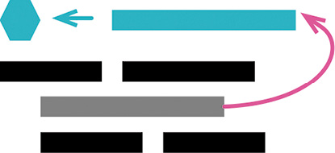

```javascript
return order.quantity * order.itemPrice -
　Math.max(0, order.quantity - 500) * order.itemPrice * 0.05 +
　Math.min(order.quantity * order.itemPrice * 0.1, 100);
```
```javascript
const basePrice = order.quantity * order.itemPrice;
const quantityDiscount = Math.max(0, order.quantity - 500) * order.itemPrice * 0.05;
const shipping = Math.min(basePrice * 0.1, 100);
return basePrice - quantityDiscount + shipping;
```

- 动机：
  - 在面对一块复杂逻辑时，局部变量使我能给其中的一部分命名
  - 局部变量可以帮助我们将表达式分解为比较容易管理的形式
  - 这样我就能更好地理解这部分逻辑是要干什么
- 做法：
  - 确认要提炼的表达式没有副作用。
  - 声明一个不可修改的变量，把你想要提炼的表达式复制一份，以该表达式的结果值给这个变量赋值。
  - 用这个新变量取代原来的表达式。
- 注意：
  - 可以尝试将变量暴露到更大的作用域中
  - 但如果工作量很大，可以暂时搁下，稍后再用以查询取代临时变量来处理它

### 6.1.4. 内联变量(InlineTemp)


```javascript
let basePrice = anOrder.basePrice;
return (basePrice > 1000);
```
```javascript
return anOrder.basePrice > 1000;
```

- 动机：
  - 在一个函数内部，变量能给表达式提供有意义的名字，因此通常变量是好东西
  - 但有时候，这个名字并不比表达式本身更具表现力
  - 还有些时候，变量可能会妨碍重构附近的代码
  - 若果真如此，就应该通过内联的手法消除变量。
- 做法：
  - 把变量声明为不可更改，执行测试
    > 这是为了确保该变量只被赋值一次。
  - 找到第一处使用该变量的地方，将其替换为直接使用赋值语句的右侧表达式。
  - 测试。
  - 重复前面两步，逐一替换其他所有使用该变量的地方。
  - 删除该变量的声明点和赋值语句。
  - 测试。

### 6.1.5. 改变函数声明(Change Function Declaration)

> - 别名
>   - 函数改名(Rename Function)
>   - 修改签名(Change Signature)
> - 曾用名
>   - 函数改名(Rename Method)
>   - 添加参数(Add Parameter)
>   - 移除参数(Remove Parameter)

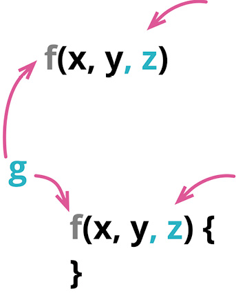

```javascript
function circum(radius) {...}
```
```javascript
function circumference(radius) {...}
```

- 动机
  - 起一个好名字并不容易，糟糕的命名会让人难以看清软件的行为
  - 函数的参数也一样，修改参数列表不仅能增加函数的应用范围，还能改变连接一个模块所需的条件，从而去除不必要的耦合。
- 做法：
  -  **一旦发现了更好的名字，就得尽快给函数改名** 。
  - 有一个改进函数名字的好办法： **先写一句注释描述这个函数的用途，再把这句注释变成函数的名字** 。
  - 如何选择正确的参数，没有简单的规则可循，并且答案会随着时间而变化

### 6.1.6. 封装变量(Encapsulate Variable)

> - 曾用名
>   - 自封装字段(Self-Encapsulate Field)
>   - 封装字段(Encapsulate Field)

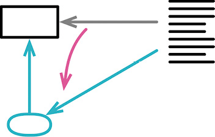

```javascript
let defaultOwner = {firstName: "Martin", lastName: "Fowler"};
```
```javascript
let defaultOwnerData = {firstName: "Martin", lastName: "Fowler"};
export function defaultOwner()       {return defaultOwnerData;}
export function setDefaultOwner(arg) {defaultOwnerData = arg;}
```

- 动机
  - 重构的作用就是调整程序中的元素。
  - 函数相对容易调整一些
    - 因为函数只有一种用法，就是调用。
    - 在改名或搬移函数的过程中，总是可以比较容易地保留旧函数作为转发函数
      > 即旧代码调用旧函数，旧函数再调用新函数
    - 这样的转发函数通常不会存在太久，但的确能够简化重构过程。
  - 数据就要麻烦得多，因为没办法设计这样的转发机制
    - 如果把数据搬走，就必须同时修改所有引用该数据的代码
    - 如果可访问范围变大，重构的难度就会随之增大，这也是说全局数据是大麻烦的原因
- 做法
  - 核心： **最好的办法往往是先以函数形式封装所有对该数据的访问**
  - 这样，就能把“重新组织数据”的困难任务转化为“重新组织函数”这个相对简单的任务。
    - 这样也可以轻松地添加数据被修改时的验证或后续逻辑
  - 对于所有可变的数据，只要它的作用域超出单个函数，可以将其封装起来，只允许通过函数访问
  - 到底应该封装什么，以及如何封装，取决于数据被使用的方式，以及想要修改数据的方式
  - 不过，一言以蔽之，数据被使用得越广，就越是值得花精力给它一个体面的封装。

- 数据副本方式：
  - 很多时候可能没必要复制一份数据，不过多一次复制对性能的影响通常也都可以忽略不计
  - 但是，如果不做复制，风险则是未来可能会陷入漫长而困难的调试排错过程。

- 封装数据很重要，不过， **不可变数据更重要** 
  - 如果数据不能修改，就根本不需要数据更新前的验证或者其他逻辑钩子
  - 可以放心地复制数据，而不用搬移原来的数据——这样就不用修改使用旧数据的代码，也不用担心有些代码获得过时失效的数据
  -  **不可变性是强大的代码防腐剂** 。

### 6.1.7. 变量改名(Rename Variable)


```javascript
let a = height * width;
```
```javascript
let area = height * width;
```

- 动机
  - 好的命名是整洁编程的核心。变量可以很好地解释一段程序在干什么
- 做法
  - 只在一行的lambda表达式中使用的变量，跟踪起来很容易——像这样的变量，可以只用一个字母命名，因为变量的用途在这个上下文中很清晰
  - 同理，短函数的参数名也常常很简单
  - 在JavaScript这样的动态类型语言中，可以把类型信息也放到变量名称中，比如(aCustomer)
  - 对于作用域超出一次函数调用的字段，则需要更用心命名

- 如果变量被广泛使用
  - 也需要考虑运用封装变量将其封装起来，而不是单纯一个改名。

- 常量命名
  - 可以先声明新的常量名，然后把新常量复制给旧的名字。
  - 这样最后删除旧名字时会稍微容易一点
  - 如果测试失败，再把旧常量放回来也稍微容易一点。

### 6.1.8. 引入参数对象(Introduce Parameter Object)


```javascript
function amountInvoiced(startDate, endDate) {...} 
function amountReceived(startDate, endDate) {...} 
function amountOverdue(startDate, endDate) {...}
```
```javascript
function amountInvoiced(aDateRange) {...} 
function amountReceived(aDateRange) {...} 
function amountOverdue(aDateRange) {...}
```

- 动机
  - 一组数据项总是结伴同行，出没于一个又一个函数
  - 也就是所谓的数据泥团
- 做法
  - 将数据组织成结构，代替零散的数据
  - 使用新的结构可以使参数列表变短，所有使用该数据结构的函数都会通过同样的名字来访问其中的元素，从而提升代码的一致性。
  - 并可以进一步针对这些数据的共同行为封装一些函数，或者用类对数据结构与函数进行组合，提升为新的抽象概念

### 6.1.9. 函数组合成类(Combine Functions into Class)

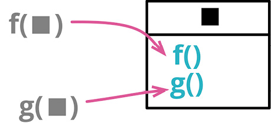

```javascript
function base(aReading) {...}
function taxableCharge(aReading) {...} 
function calculateBaseCharge(aReading) {...}
```
```javascript
class Reading { 
  base() {...}
  taxableCharge() {...} 
  calculateBaseCharge() {...}
}
```

- 动机
  - 如果发现一组函数形影不离地操作同一块数据（通常是将这块数据作为参数传递给函数）
    - 可以认为，是时候组建一个类了
  - 类能明确地给这些函数提供一个共用的环境
    - 在对象内部调用这些函数可以少传许多参数，从而简化函数调用
    - 并且这样一个对象也可以更方便地传递给系统的其他部分
  - 除了可以把已有的函数组织起来，这个重构还给我们一个机会，去发现其他的计算逻辑，将它们也重构到新的类当中。

- 嵌套函数
  - 类似这样的一组函数不仅可以组合成一个类，而且可以组合成一个嵌套函数
    - 通常我更倾向于类而非嵌套函数，因为后者测试起来会比较困难。
    - 如果我想对外暴露多个函数，也必须采用类的形式。

- 在有些编程语言中，类不是一等公民，而函数则是。
  - 面对这样的语言，可以用“函数作为对象”（Function As Object）[mf-fao]的形式来实现这个重构手法。

- 做法
  - 运用封装记录对多个函数共用的数据记录加以封装。
  - 对于使用该记录结构的每个函数，运用搬移函数将其移入新类。
  - 用以处理该数据记录的逻辑可以用提炼函数（106）提炼出来，并移入新类。

### 6.1.10. 函数组合成变换(Combine Functions into Transform)

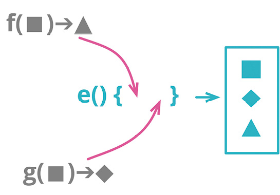

```javascript
function base(aReading) {...}
function taxableCharge(aReading) {...}
```
```javascript
function enrichReading(argReading) {
  const aReading = _.cloneDeep(argReading);
  aReading.baseCharge = base(aReading);
  aReading.taxableCharge = taxableCharge(aReading);
  return aReading;
}
```

- 动机
  - 在软件中，经常需要把数据“喂”给一个程序，让它再计算出各种派生信息。
  - 这些派生数值可能会在几个不同地方用到，因此这些计算逻辑也常会在用到派生数据的地方重复。
  - 我更愿意把所有计算派生数据的逻辑收拢到一处，这样始终可以在固定的地方找到和更新这些逻辑，避免到处重复。

- 做法：
  - 采用数据变换（transform）函数（java8中的函数函数式接口map）
  - 这种函数接受源数据作为输入，计算出所有的派生数据，将派生数据以字段形式填入输出数据。
  - 有了变换函数，我就始终只需要到变换函数中去检查计算派生数据的逻辑。

- 函数组合成变换 与 函数组合成类（144）
  - 后者的做法是先用源数据创建一个类，再把相关的计算逻辑搬移到类中。
  - 这两个重构手法都很有用，可以根据代码库中已有的编程风格来选择使用其中哪一个
  - 不过，两者有一个重要的区别：
    - 如果代码中会 **对源数据做更新** ，那么使用类要好得多
    - 如果使用变换， **派生数据会被存储在新生成的记录中，一旦源数据被修改，就会遭遇数据不一致** 。

- 把函数组合起来的原因
  - 是为了避免计算派生数据的逻辑到处重复。
  - 从道理上来说，只用提炼函数（106）也能避免重复，但孤立存在的函数常常很难找到，
  - 只有把函数和它们操作的数据放在一起，用起来才方便。
  - 引入变换（或者类）都是为了让相关的逻辑找起来方便。

### 6.1.11. 拆分阶段(Split Phase)

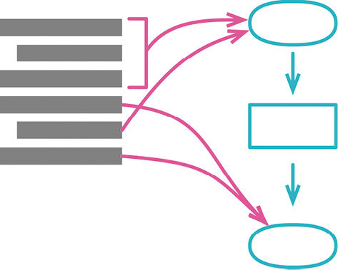

```javascript
const orderData = orderString.split(/\s+/);
const productPrice = priceList[orderData[0].split("-")[1]]; 
const orderPrice = parseInt(orderData[1]) * productPrice;
```
```javascript
const orderRecord = parseOrder(order);
const orderPrice = price(orderRecord, priceList);

function parseOrder(aString) {
　const values = aString.split(/\s+/); 
　return ({
　　productID: values[0].split("-")[1], 
　　quantity: parseInt(values[1]),
　});
}
function price(order, priceList) {
　return order.quantity * priceList[order.productID];
}
```

- 动机
  - 每当看见一段代码在同时处理两件不同的事，就需要考虑把它拆分成各自独立的模块
  - 因为这样到了需要修改的时候，就可以单独处理每个主题，而不必同时在脑子里考虑两个不同的主题
  - 如果运气够好的话，我可能只需要修改其中一个模块，完全不用回忆起另一个模块的诸般细节

- 做法：
  - 最简洁的拆分方法之一，就是把一大段行为分成顺序执行的两个阶段。
  - 可能你有一段处理逻辑，其输入数据的格式不符合计算逻辑的要求，所以你得先对输入数据做一番调整，使其便于处理。
  - 也可能是你把数据处理逻辑分成顺序执行的多个步骤，每个步骤负责的任务全然不同。

- 编译器是最典型的例子
  - 编译器的任务很直观：接受文本（用某种编程语言编写的代码）作为输入，将其转换成某种可执行的格式（例如针对某种特定硬件的目标码）。
  - 随着经验加深，我们发现把这项大任务拆分成一系列阶段会很有帮助：
    - 首先对文本做词法分析
    - 然后把token解析成语法树
    - 然后再对语法树做几步转换（如优化）
    - 最后生成目标码
  - 每一步都有边界明确的范围，我可以聚焦思考其中一步，而不用理解其他步骤的细节。

- 在大型软件中
  - 类似这样的阶段拆分很常见，例如编译器的每个阶段又包含若干函数和类
  - 即便只有不大的一块代码，只要我发现了有益的将其拆分成多个阶段的机会，同样可以运用拆分阶段重构手法。
  - 如果一块代码中出现了上下几段，各自使用不同的一组数据和函数，这就是最明显的线索。
  - 将这些代码片段拆分成各自独立的模块，能更明确地标示出它们之间的差异。

- 操作流程：
  - 将第二阶段的代码提炼成独立的函数。测试
  - 引入一个中转数据结构，将其作为参数添加到提炼出的新函数的参数列表中。测试
  - 逐一检查提炼出的“第二阶段函数”的每个参数。如果 **某个参数被第一阶段用到，就将其移入中转数据结构** 。每次搬移之后都要执行测试。
    - 有时第二阶段根本不应该使用某个参数。果真如此，就把使用该参数得到的结果全都提炼成中转数据结构的字段
    - 然后用 搬移语句到调用者 把使用该参数的代码行搬移到“第二阶段函数”之外。
  - 对第一阶段的代码运用 提炼函数，让提炼出的函数 **返回中转数据结构** 。
    - 也可以把第一阶段提炼成一个变换（transform）对象。

## 6.2. 封装

### 6.2.1. 封装记录(Encapsulate Record)

> - 曾用名
>   - 以数据类取代记录（Replace Record with Data Class）


```javascript
organization = {name: "Acme Gooseberries", country: "GB"};
```

```javascript
class Organization { 
　constructor(data) {
　　this._name = data.name; 
　　this._country = data.country;
　}
　get name()    {return this._name;} 
　set name(arg) {this._name = arg;}
　get country()    {return this._country;} 
　set country(arg) {this._country = arg;}
}
```

- 动机
  - 记录型结构是多数编程语言提供的一种常见特性。
  - 它们能直观地组织起存在关联的数据，让我可以将数据作为有意义的单元传递，而不仅是一堆数据的拼凑。
  - 但简单的记录型结构也有缺陷，最恼人的一点是，它 **强迫我清晰地区分“记录中存储的数据”和“通过计算得到的数据”** 。
  - 假使我要描述一个整数闭区间，我可以用{start: 1, end: 5}描述，或者用{start: 1, length: 5}（甚至还能用{end: 5, length: 5}，如果我想露两手华丽的编程技巧的话）。但不论如何存储，这3个值都是我想知道的，即区间的起点（start）和终点（end），以及区间的长度（length）。
  - 这就是对于可变数据，我总是更偏爱使用类对象而非记录的原因。
    - 注意，我所说的偏爱对象，是对可变数据而言。
    - 如果数据不可变，我大可直接将这3个值保存在记录里，需要做数据变换时增加一个填充步骤即可。
    - 重命名记录也一样简单，你可以复制一个字段并逐步替换引用点。
  - 对象可以隐藏结构的细节，仅为这3个值提供对应的方法。该对象的用户不必追究存储的细节和计算的过程。
  - 同时，这种封装还有助于字段的改名：我可以重新命名字段，但同时提供新老字段名的访问方法，这样我就可以渐进地修改调用方，直到替换全部完成。

- 记录型结构可以有两种类型：
  - 一种需要声明合法的字段名字，另一种可以随便用任何字段名字。
  - 后者常由语言库本身实现，并通过类的形式提供出来
    - 这些类称为散列（hash）、映射（map）、散列映射（hashmap）、字典（dictionary）或关联数组（associative array）等
    - 很多编程语言都提供了方便的语法来创建这类记录，这使得它们在各种编程场景下都能大展身手。
    - 但使用这类结构也有缺陷，那就是一条记录上持有什么字段往往不够直观。
    - 比如说，如果我想知道记录里维护的字段究竟是起点/终点还是起点/长度，就只有查看它的创建点和使用点，除此以外别无他法。
    - 若这种记录只在程序的一个小范围里使用，那问题还不大，但若其使用范围变宽，“数据结构不直观”这个问题就会造成更多困扰。
    - 我可以重构它，使其变得更直观——但如果真需要这样做，那还不如使用类来得直接。
  - 程序中间常常需要互相传递嵌套的列表（list）或散列映射结构，
    - 这些数据结构后续经常需要被序列化成JSON或XML。
    - 这样的嵌套结构同样值得封装，这样，如果后续其结构需要变更或者需要修改记录内的值，封装能够帮我更好地应对变化。

### 6.2.2. 封装集合(Encapsulate Collection)


```javascript
class Person {
  get courses() {return this._courses;}
  set courses(aList) {this._courses = aList;}
```
```javascript
class Person {
  get courses() {return this._courses.slice();} 
  addCourse(aCourse) { ... } 
  removeCourse(aCourse) { ... }
```

- 动机
  - 可以 **封装** 程序中的所有 **可变数据**
    - 这样很容易看清楚数据被修改的地点和修改方式，当需要更改数据结构时就非常方便
    - 通常鼓励封装——使用面向对象技术的开发者对封装尤为重视——但封装集合时人们常常犯一个错误
      - 只对集合变量的访问进行了封装，但 **依然让取值函数返回集合本身** 
      - 这使得集合的成员变量 **可以直接被修改** ，而封装它的类则全然不知，无法介入。
      - 为避免此种情况，可以在类上提供一些修改集合的方法——通常是“添加”和“移除”方法。
  - 限制集合自身的修改
    - 永远不直接返回集合的值。
    - 以某种形式限制集合的访问权，只允许对集合进行读操作。Java中可以很容易地返回集合的一个只读代理，
    - 最常见的做法是，为集合提供一个取值函数，但令其返回一个集合的副本

- 做法
  - 如果集合的引用尚未被封装起来，先用封装变量（132）封装它。
  - 在类上添加用于“添加集合元素”和“移除集合元素”的函数。
    > 如果存在对该集合的设值函数，尽可能先用移除设值函数（331）移除它。如果不能移除该设值函数，至少让它返回集合的一份副本。
  - 执行静态检查。
  - 查找集合的引用点。如果有调用者直接修改集合，令该处调用使用新的添加/移除元素的函数。每次修改后执行测试。
  - 修改集合的取值函数，使其返回一份只读的数据，可以使用只读代理或数据副本。
  - 测试。

### 6.2.3. 以对象取代基本类型(Replace Primitive with Object)

> 曾用名：以对象取代数据值（Replace Data Value with Object）
> 曾用名：以类取代类型码（Replace Type Code with Class）

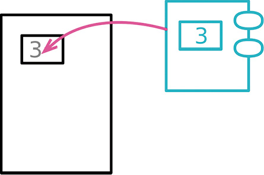

```javascript
orders.filter(o => "high" === o.priority
               || "rush" === o.priority);
```
```javascript
orders.filter(o => o.priority.higherThan(new Priority("normal")))
```

- 动机
  - 开发初期，你往往决定以简单的数据项表示简单的情况，比如使用数字或字符串等。
  - 但随着开发的进行，你可能会发现，这些简单数据项不再那么简单了。
  - 比如说
    - 一开始你可能会用一个字符串来表示“电话号码”的概念
    - 但是随后它又需要“格式化”“抽取区号”之类的特殊行为
    - 这类逻辑很快便会占领代码库，制造出许多重复代码，增加使用时的成本。
  - 一旦发现对某个数据的操作不仅仅局限于打印时，可以为它创建一个新类。
    - 一开始这个类也许只是简单包装一下简单类型的数据
    - 不过只要类有了，日后添加的业务逻辑就有地可去了
    - 这些小小的封装值开始可能价值甚微，但只要悉心照料，它们很快便能成长为有用的工具
    - 创建新类无须太大的工作量，但我发现它们往往对代码库有深远的影响
    - 实际上，许多经验丰富的开发者认为，这是他们的工具箱里最实用的重构手法之一
      > 尽管其价值常为新手程序员所低估。

- 做法
  - 如果变量尚未被封装起来，先使用 **封装变量** 封装它。
  - 为这个数据值创建一个简单的类。类的构造函数应该保存这个数据值，并为它提供一个取值函数。
  - 执行静态检查。
  - 修改第一步得到的设值函数，令其创建一个新类的对象并将其存入字段，如果有必要的话，同时修改字段的类型声明。
  - 修改取值函数，令其调用新类的取值函数，并返回结果。
  - 测试。
  - 考虑对第一步得到的访问函数使用 **函数改名** ，以便更好反映其用途。
  - 考虑应用 **将引用对象改为值对象**  或 **将值对象改为引用对象** ，明确指出新对象的角色是值对象还是引用对象。

### 6.2.4. 以查询取代临时变量(Replace Temp with Query)

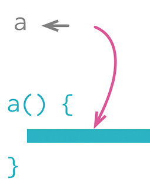

```javascript
const basePrice = this._quantity * this._itemPrice; 
if (basePrice > 1000)
  return basePrice * 0.95; 
else
  return basePrice * 0.98;
```
```javascript
get basePrice() {this._quantity * this._itemPrice;}

// ...

if (this.basePrice > 1000) 
  return this.basePrice * 0.95;
else
  return this.basePrice * 0.98;
```

- 动机
  - 临时变量的一个作用是保存某段代码的返回值，以便在函数的后面部分使用它。
    - 临时变量允许我引用之前的值，既能解释它的含义，还能避免对代码进行重复计算。
    - 但尽管使用变量很方便，很多时候还是值得更进一步，将它们抽取成函数。
  - 如果我正在分解一个冗长的函数，那么将变量抽取到函数里能 **使函数的分解过程更简单** ，
    - 因为就 **不再需要将变量作为参数传递给提炼出来的小函数** 
    - 将变量的计算逻辑放到函数中，也有助于在提炼得到的函数与原函数之间设立清晰的边界，这能帮我发现并避免难缠的依赖及副作用。
  - 改用函数还让我 **避免了在多个函数中重复编写计算逻辑** 。
    - 每当我在不同的地方看见同一段变量的计算逻辑，我就会想方设法将它们挪到同一个函数里。
  - 这项重构手法 **在类中施展效果最好** ，因为类为待提炼函数提供了一个共同的上下文
    - 如果不是在类中，我很可能会在顶层函数中拥有过多参数，这将冲淡提炼函数所能带来的诸多好处
    - 使用嵌套的小函数可以避免这个问题，但又限制了我在相关函数间分享逻辑的能力。
  - 以查询取代临时变量手法 **只适用于处理某些类型的临时变量** ：
    - 那些 **只被计算一次且之后不再被修改的变量** 
    - 最简单的情况是，这个临时变量只被赋值一次
    - 但在更复杂的代码片段里，变量也可能被多次赋值——此时应该将这些计算代码一并提炼到查询函数中
    - 并且，待提炼的逻辑多次计算同样的变量时，应该能得到相同的结果
    - 因此，对于那些做快照用途的临时变量（从变量名往往可见端倪，比如oldAddress这样的名字），就不能使用本手法。

- 做法
  - 检查变量在使用前是否已经完全计算完毕，检查计算它的那段代码是否每次都能得到一样的值。
  - 如果变量目前不是只读的，但是可以改造成只读变量，那就先改造它。
  - 测试。
  - 将为变量赋值的代码段提炼成函数。

    ```
    如果变量和函数不能使用同样的名字，那么先为函数取个临时的名字。
    确保待提炼函数没有副作用。若有，先应用将查询函数和修改函数分离（306）手法隔离副作用。
    ```

  - 测试。
  - 应用 **内联变量** 手法移除临时变量。

### 6.2.5. 提炼类(Extract Class)


> 某个类做了应该有两个类做的事。建立一个新类，将相关的字段和函数从旧类搬移到新类。

```javascript
class Person {
　get officeAreaCode() {return this._officeAreaCode;} 
　get officeNumber()   {return this._officeNumber;}
```
```javascript
class Person {
　get officeAreaCode() {return this._telephoneNumber.areaCode;} 
　get officeNumber()   {return this._telephoneNumber.number;}
}
class TelephoneNumber {
　get areaCode() {return this._areaCode;} 
　get number()   {return this._number;}
}
```

- 动机：
  - 一个类应该是一个清晰的抽象，只处理一些明确的责任，等等。
    - 是在实际工作中，类会不断成长扩展。你会在这儿加入一些功能，在那儿加入一些数据
    - 给某个类添加一项新责任时，你会觉得不值得为这项责任分离出一个独立的类
    - 于是，随着责任不断增加，这个类会变得过分复杂。很快，你的类就会变成一团乱麻。
  - 此时你需要考虑哪些部分可以分离出去，并将它们分离到一个独立的类中。
    - 如果 **某些数据和某些函数总是一起出现** ，某些数据经常同时变化甚至彼此相依，这就表示你应该 **将它们分离出去** 。
    - 一个有用的测试就是问你自己，如果你搬移了某些字段和函数，会发生什么事？其他字段和函数是否因此变得无意义？
  - 另一个往往在开发后期出现的信号是 **类的子类化** 方式。
    - 如果你发现子类化只影响类的部分特性，或如果你发现某些特性需要以一种方式来子类化，某些特性则需要以另一种方式子类化，这就意味着你需要分解原来的类。

- 做法
  - 决定如何分解类所负的责任。
  - 创建一个新的类，用以表现从旧类中分离出来的责任。
    > 如果旧类剩下的责任与旧类的名称不符，为旧类改名。
  - 构造旧类时创建一个新类的实例，建立“从旧类访问新类”的连接关系。
  - 对于你想搬移的每一个字段，运用 **搬移字段** 进行搬移。每次更改后运行测试。
  - 使用 **搬移函数** 将必要函数搬移到新类。
    - 先搬移较低层函数（也就是“被其他函数调用”多于“调用其他函数”者）
    - 每次更改后运行测试。
  - 检查两个类的接口，去掉不再需要的函数，必要时为函数重新取一个适合新环境的名字。
  - 决定是否公开新的类。
    - 如果确实需要，考虑对新类应用 **将引用对象改为值对象** 使其成为一个值对象。


### 6.2.6. 内联类(Inline Class)

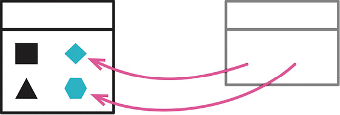

> 某个类没有做太多事情。将这个类的所有特性搬移到另一个类中，然后移除原类。

```javascript
class Person {
　get officeAreaCode() {return this._telephoneNumber.areaCode;} 
　get officeNumber() 　{return this._telephoneNumber.number;}
}
class TelephoneNumber {
　get areaCode() {return this._areaCode;} 
　get number() {return this._number;}
}
```
```javascript
class Person {
　get officeAreaCode() {return this._officeAreaCode;} 
　get officeNumber()　 {return this._officeNumber;}
```

- 动机
  - 内联类正好与 **提炼类** 相反
  - 如果一个类不再承担足够责任，不再有单独存在的理由
    > 这通常是因为此前的重构动作移走了这个类的责任
  - 可以挑选使用这一“萎缩类”的最频繁的类，以本手法将“萎缩类”塞进另一个类中。
  - 应用这个手法的另一个场景是，我手头有两个类，想重新安排它们肩负的职责，并让它们产生关联
    - 这时我发现先用本手法将它们内联成一个类再用 **提炼类** 去分离其职责会更加简单
    - 这是重新组织代码时常用的做法：
      - 有时把相关元素一口气搬移到位更简单
      - 但有时先用内联手法合并各自的上下文，再使用提炼手法再次分离它们会更合适。

- 做法
  - 对于待内联类（源类）中的所有public函数，在目标类上创建一个对应的函数，新创建的所有函数应该直接委托至源类。
  - 修改源类public方法的所有引用点，令它们调用目标类对应的委托方法。每次更改后运行测试。
  - 将源类中的函数与数据全部搬移到目标类，每次修改之后进行测试，直到源类变成空壳为止。
  - 删除源类， ~为它举行一个简单的“丧礼”~

### 6.2.7. 隐藏委托关系(Hide Delegate)(添加中间人)


> 客户通过一个委托来调用另一个对象。在服务类上建立客户所需的所有函数，用以隐藏委托关系。

```javascript
// 这样的编码就对客户端揭露了Department的工作原理
// 于是客户知道：Department负责追踪“经理”这条信息。
manager = aPerson.department.manager;
```
```javascript
// 如果对客户隐藏Department，可以减少耦合。为了这一目的，我在Person中建立一个简单的委托函数
manager = aPerson.manager; 

class Person {
  get manager() {return this.department.manager;}
```

- 动机
  - 一个好的模块化的设计，“封装”即使不是其最关键特征，也是最关键特征之一。
    - “封装”意味着 **每个模块都应该尽可能少了解系统的其他部分** 。
    - 如此一来，一旦发生变化，需要了解这一变化的模块就会比较少——这会使变化比较容易进行。
  - 当我们初学面向对象技术时就被教导，封装意味着应该隐藏自己的字段。
    - 随着经验日渐丰富，你会发现，有更多可以（而且值得）封装的东西。
    - 如果某些客户端先通过服务对象的字段得到另一个对象（受托类），然后调用后者的函数，那么客户就必须知晓这一层委托关系。
    - 万一受托类修改了接口， **变化会波及通过服务对象使用它的所有客户端** 。
    - 我可以 **在服务对象上放置一个简单的委托函数** ， **将委托关系隐藏起来** ，从而去除这种依赖。
    - 这么一来，即使将来 **委托关系发生变化，变化也只会影响服务对象** ，而不会直接波及所有客户端。

  

- 做法
  - 对于每个委托关系中的函数，在服务对象端建立一个简单的委托函数。
  - 调整客户端，令它只调用服务对象提供的函数。每次调整后运行测试。
  - 如果将来不再有任何客户端需要取用Delegate（受托类），便可移除服务对象中的相关访问函数。
  - 测试。

### 6.2.8. 移除中间人(Remove Middle Man)


> 某个类做了过多的简单委托动作。让客户直接调用受托类。

```javascript
manager = aPerson.manager; 

class Person {
　get manager() {return this.department.manager;}
```
```javascript
manager = aPerson.department.manager;
```

- 动机
  - 在 **隐藏委托关系** 的中，说明了“封装受托对象”的好处，但是 **这层封装也是有代价的** 
    - 每当客户端要使用受托类的新特性时，你就必须在服务端添加一个简单委托函数。
    - 随着受托类的特性（功能）越来越多，更多的转发函数就会使人烦躁。
    - 服务类完全变成了一个 **中间人** ，此时就应该让客户直接调用受托类
      > 这个味道通常在人们狂热地遵循 **迪米特法则** 时悄然出现。
      > 如果这条法则当初叫作“偶尔有用的迪米特建议”，如今可能少很多烦恼。
  - 很难说什么程度的隐藏才是合适的。
    - 还好，有了 **隐藏委托关系** 和 **移除中间人** ，可以在系统运行过程中不断进行调整
    - 随着代码的变化，“合适的隐藏程度”这个尺度也相应改变
    - 6个月前恰如其分的封装，现今可能就显得笨拙
    - 重构的意义就在于： **你永远不必说对不起——只要把出问题的地方修补好就行了** 
- 做法
  - 为受托对象创建一个取值函数。
  - 对于每个委托函数，让其客户端转为连续的访问函数调用。每次替换后运行测试。
    > 替换完委托方法的所有调用点后，你就可以删掉这个委托方法了。
    > 这能通过可自动化的重构手法来完成，
    > 你可以先对受托字段使用封装变量（132），再应用内联函数（115）内联所有使用它的函数。

### 6.2.9. 替换算法(Substitute Algorithm)

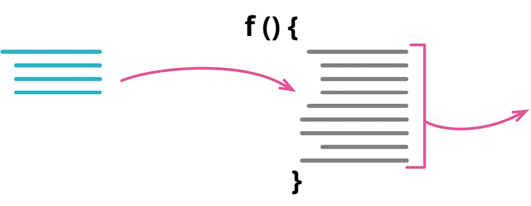

> 在足够了解已有算法并且可行的情况下，使用简单的算法替换原先复杂的算法

```javascript
function foundPerson(people) {
　for(let i = 0; i < people.length; i++) { 
　　if (people[i] === "Don") {
　　　return "Don";
　　}
　　if (people[i] === "John") { 
　　　return "John";
　　}
　　if (people[i] === "Kent") { 
　　　return "Kent";
　　}
　}
　return "";
}
```
```javascript
function foundPerson(people) {
　const candidates = ["Don", "John", "Kent"];
　return people.find(p => candidates.includes(p)) || '';
}
```

- 动机
  - **如果做一件事可以有更清晰的方式，就用比较清晰的方式取代复杂的方式** 
    - “重构”可以把一些复杂的东西分解为较简单的小块，但有时你就必须删掉整个算法，代之以较简单的算法
    - 随着对问题有了更多理解，往往会发现，在原先的做法之外，有更简单的解决方案，
    - 此时就需要改变原先的算法。
    - 如果我开始使用程序库，而其中提供的某些功能/特性与自己的代码重复，那么也需要改变原先的算法。
  - 有时会想修改原先的算法，让它去做一件与原先略有差异的事。
    - 这时候可以先把原先的算法替换为一个较易修改的算法，这样后续的修改会轻松许多。
  - 使用这项重构手法之前，得确定自己已经尽可能分解了原先的函数。
    - 替换一个巨大且复杂的算法是非常困难的，
    - 只有先将它分解为较简单的小型函数，才能很有把握地进行算法替换工作。

- 做法
  - 整理一下待替换的算法，保证它已经被抽取到一个独立的函数中。
  - 先只为这个函数准备测试，以便固定它的行为。
  - 准备好另一个（替换用）算法。
  - 执行静态检查。
  - 运行测试
    - 比对新旧算法的运行结果。如果测试通过，那就大功告成；
    - 否则，在后续测试和调试过程中，以旧算法为比较参照标准。


## 6.3. 搬移特性

### 6.3.1. 搬移函数(Move Function)


> 你的程序中，有个函数与其所驻之外的另一个类进行更多交流：调用后者，或被后者调用。在该函数最常引用的类中建立一个有着类似行为的新函数。将旧函数变成一个单纯的委托函数，或是将旧函数完全移除。

```javascript
class Account {
　get overdraftCharge() {...}
```
```javascript
class AccountType {
    get overdraftCharge() {...}
```

- 动机
  - **模块化** 是优秀软件设计的核心所在，好的模块化能够让我在修改程序时只需理解程序的一小部分。
    - 为了设计出高度模块化的程序，我得保证互相关联的软件要素都能集中到一块，
    - 并确保块与块之间的联系易于查找、直观易懂。
  - 同时，对模块设计的理解并不是一成不变的
    - 随着 **对代码的理解加深，会知道那些软件要素如何组织最为恰当**
    - 要将这种理解反映到代码上，就得不断地搬移这些元素。
  - 任何函数都需要具备 **上下文环境** 才能存活。
    - 这个上下文可以是全局的，但它更多时候是由某种形式的模块所提供的。
    - 对一个面向对象的程序而言，类作为最主要的模块化手段，其本身就能充当函数的上下文；
    - 通过嵌套的方式，外层函数也能为内层函数提供一个上下文。
    - 不同的语言提供的模块化机制各不相同，但这些模块的共同点是，它们都能为函数提供一个赖以存活的上下文环境。
  - 搬移函数最直接的一个 **动因** 是:
    - 它 **频繁引用其他上下文中的元素** ，而对自身上下文中的元素却关心甚少
    - 此时，让它去与那些更亲密的元素相会，通常能取得更好的封装效果，因为系统别处就可以减少对当前模块的依赖。
  - 是否需要搬移函数需要进行抉择
    - 需要 **仔细检查函数当前上下文与目标上下文之间的区别**
      - 需要查看函数的调用者都有谁
      - 它自身又调用了哪些函数
      - 被调用函数需要什么数据
      - 等等
    - 新情况: 
      - 在搬移过程中，通常会发现 **需要为一整组函数创建一个新的上下文** 
      - 此时就可以用函数 **组合成类** 或 **提炼类** 创建一个
    - 尽管为函数选择一个最好的去处不太容易，但 **决定越难做，通常说明“搬移这个函数与否”的重要性也越低** 
      - 好的做法是先把函数安置到某一个上下文里去，这样就能发现它们是否契合
      - 如果不太合适我可以再把函数搬移到别的地方

- 做法
  - 检查函数在当前上下文里引用的所有程序元素（包括变量和函数），考虑是否需要将它们一并搬移
    > 如果发现有些被调用的函数也需要搬移，我通常会先搬移它们。这样可以保证移动一组函数时，总是从依赖最少的那个函数入手。
    >
    > 如果该函数拥有一些子函数，并且它是这些子函数的唯一调用者，那么你可以先将子函数内联进来，一并搬移到新家后再重新提炼出子函数。
  - 检查待搬移函数是否具备多态性。
    > 在面向对象的语言里，还需要考虑该函数是否覆写了超类的函数，或者为子类所覆写。
  - 将函数复制一份到目标上下文中。调整函数，使它能适应新家。
    > 如果函数里用到了源上下文（source context）中的元素，我就得将这些元素一并传递过去，要么通过函数参数，要么是将当前上下文的引用传递到新的上下文那边去。
    >
    > 搬移函数通常意味着，我还得给它起个新名字，使它更符合新的上下文。
  - 执行静态检查。
  - 设法从源上下文中正确引用目标函数。
  - 修改源函数，使之成为一个纯委托函数。
  - 测试。
  - 考虑对源函数使用 **内联函数** 
  - 也可以不做内联，让源函数一直做委托调用。但如果调用方直接调用目标函数也不费太多周折，那么最好还是把中间人移除掉。


### 6.3.2. 搬移字段(MoveField)


> 你的程序中，某个字段被其所驻类之外的另一个类更多地用到。在目标类新建一个字段，修改源字段的所有用户，令它们改用新字段。

```javascript
class Customer {
  get plan() {return this._plan;}
  get discountRate() {return this._discountRate;}
```
```javascript
class Customer {
  get plan() {return this._plan;}
  get discountRate() {return this.plan.discountRate;}
```

- 动机
  - 编程活动中你需要编写许多代码，为系统实现特定的行为，但往往 **数据结构才是一个健壮程序的根基** 
    - 一个适应于问题域的良好数据结构，可以让行为代码变得简单明了
    - 而一个糟糕的数据结构则将招致许多无用代码，这些代码更多是在差劲的数据结构中间纠缠不清，而非为系统实现有用的行为
    - 代码凌乱，势必难以理解；不仅如此，坏的数据结构本身也会掩藏程序的真实意图。
  - 因此，好的数据结构至关重要
    - 不过这也与编程活动的许多方面一样，它们都 **很难一次做对**
    - 通常都会做些预先的设计，设法得到最恰当的数据结构
      > 此时如果你具备一些 **领域驱动设计（domain-driven design）** 方面的经验和知识，往往有助于你更好地设计数据结构。
    - 但即便经验再丰富，技能再熟练，仍然还是会犯错
    - 在 **不断编程的过程中，对问题域的理解会加深** ，对“什么是理想的数据结构”会有更多想法
  - 如果 **发现数据结构已经不适应于需求，就应该马上修缮它** 
    - 如果容许瑕疵存在并进一步累积，它们就会经常使我困惑，并且使代码愈来愈复杂。
  - 准备搬移数据的原因
    - 可能是因为发现每当调用某个函数时
      - 除了传入一个记录参数，还总是需要同时传入另一条记录的某个字段一起作为参数
      - 总是 **一同出现、一同作为函数参数传递的数据，最好是规整到同一条记录中** 
      - 以体现它们之间的联系
    - **修改的难度** 也是引起我注意的一个原因
      - 如果修改一条记录时，总是需要同时改动另一条记录，那么说明很可能有字段放错了位置
    - 此外，如果更新一个字段时， **需要同时在多个结构中做出修改** ，那也是一个征兆
      - 表明该字段需要被搬移到一个集中的地点，这样每次只需修改一处地方。
  - 搬移字段的操作 **通常是在其他更大的改动背景下** 发生的
    - 实施字段搬移后，可能会发现字段的诸多使用者应该通过目标对象来访问它，而不应该再通过源对象来访问
    - 诸如此类的清理，可以在此后的重构中一并完成
    - 同样，也可能因为字段当前的一些用法而无法直接搬移它。得先对其使用方式做一些重构(比如 **封装变量** )，然后才能继续搬移工作。
  - 到目前为止，用以指称数据结构的术语都是 **“记录”（record）** ，但以上论述 **对类和对象同样适用**
    - 类只是一种多了实例函数的记录，它与其他任何数据结构一样
    - 不过类的实例函数确实简化了搬移数据的操作，因为它已经将数据的存取封装到访问函数中
    - 当搬移数据时，只需要相应修改访问函数的引用，该字段的所有客户端依然可以正常工作
    - 因此，如果你的数据已经用类进行了封装，那么这个重构手法会更容易进行
    - 如果要搬移的数据是裸记录，没有任何封装，虽然类似的搬移仍然能够进行，但情况就会复杂一些。

- 做法
  - 确保源字段已经得到了良好封装。
  - 测试。
  - 在目标对象上创建一个字段（及对应的访问函数）。
  - 执行静态检查。
  - 确保源对象里能够正常引用目标对象。
    > 也许你已经有现成的字段或方法得到目标对象。
    > 如果没有，看看是否能简单地创建一个方法完成此事。
    > 如果还是不行，你可能就得在源对象里创建一个字段，用于存储目标对象了。
    > 这次修改可能留存很久，但你也可以只做临时修改，等到系统其他部分的重构完成就回来移除它。
  - 调整源对象的访问函数，令其使用目标对象的字段。
    > 如果源类的所有实例对象都共享对目标对象的访问权，那么可以考虑先更新源类的设值函数，
    > 让它修改源字段时，对目标对象上的字段做同样的修改。
    > 然后，再通过 **引入断言** （302）， **当检测到源字段与目标字段不一致时抛出错误** 。
    > 一旦你确定改动没有引入任何可观察的行为变化，就可以放心地让访问函数直接使用目标对象的字段了。
  - 测试。
  - 移除源对象上的字段。
  - 测试。

### 6.3.3. 提炼类(Extract Class)

某个类做了应该有两个类做的事。建立一个新类，将相关的字段和函数从旧类搬移到新类。

### 6.3.4. 将类内联化(Inline Class)

### 6.3.5. 隐藏“委托关系”(Hide Delegate)

### 6.3.6. 移除中间人(Remove Middle Man)

### 6.3.7. 引入外加函数(Introduce ForeignMethod)

你需要为提供服务的类增加一个函数，但你无法修改这个类。在客户类中建立一个函数，并以第一参数形式传入一个服务类实例。

### 6.3.8. 引入本地扩展(Introduce LocalExtension)

你需要为服务类提供一些额外函数，但你无法修改这个类。建立一个新类，使它包含这些额外函数。让这个扩展品成为源类的子类或包装类。

## 6.4. 重新组织数据

### 6.4.1. 分解临时变量(Split TemporaryVariable)

你的程序有某个临时变量被赋值过一次，它既不是循环变量，也不被用于收集计算结果。针对每次赋值，创造一个独立、对应的临时变量。

### 6.4.2. 自封装字段(Self Encapsulate Field)

你直接访问一个字段，但与字段之间的耦合关系逐渐变得笨拙。为这个字段建立取值/设值函数，并且只以这些函数来访问字段。

### 6.4.3. 以对象取代数据值(Replace Data Value withObject)

你有一个数据项，需要与其他数据和行为一起使用才有意义。将数据项变成对象。

### 6.4.4. 将值对象改为引用对象(Change Value toReference)

你从一个类衍生出许多彼此相等的实例，希望将它们替换为同一个对象。将这个值对象变成引用对象。

### 6.4.5. 将引用对象改为值对象(Change Reference to Value)

你有一个引用对象，很小且不可变，而且不易管理。将它变成一个值对象。

### 6.4.6. 以对象取代数据(Replace Array withObject)

你有一个数组，其中的元素各自代表不同的东西。以对象替换数组，对于数组中的每个元素，以一个字段来表示。

### 6.4.7. 复制“被监视数据”(Duplicate ObservedData)

你有一些领域数据置身 GUI 控件中，而领域函数需要访问这些数据。将该数据复制到一个领域对象中。建立一个 Observe 模式，用以同步领域对象和 GUI 对象内的重复数据。

### 6.4.8. 将单向关联改为双向关联(Change Unidirectional Association toBidirectional)

两个类都需要使用对方特性，但其间只有一条单向链接。添加一个反向指针，并使修改函数能够同时更新两条链接。

### 6.4.9. 将双向关联改为单向关联(Change Bidirectional Association toUnidirectional)

两个类之间有双向关联，但其中一个类如今不再需要另一个类的特性。去除不必要的关联。

### 6.4.10. 以字面常量取代魔法数(Replace Magic Number with SymbolicConstant)

你有一个字面数值，带有特别含义。创造一个常量，根据其意义为它命名，并将上述的字面数值替换为这个常量。

### 6.4.11. 封装字段(Encapsulate Field)

你的类中存在一个 public 字段。将它声明为 private，并提供相应的访问函数。

### 6.4.12. 封装集合(EncapsulateCollection)

有个函数返回一个集合。让这个函数返回该集合的一个只读副本，并在这个类中提供添加/移除集合元素的函数。

### 6.4.13. 以数据类取代记录(Replace Record with Data Class)

你需要面对传统编程环境中的记录结构。为该记录创建一个“哑”数据对象。

### 6.4.14. 以类取代类型码(Replace Type Code withClass)

类之中有一个数值类行码，但它并不影响类的行为。以一个新的类替换该数值类型码。

### 6.4.15. 以子类取代类型码(Replace Type Code withSubclass)

你又一个不可变的类型码，它会影响类的行为。以子类取代这个类型码。

### 6.4.16. 以 State/Strategy 取代类型码(Replace Type Code withState/Strategy)

你有一个类型码，它会影响类的行为，但你无法通过继承手法消除它。以状态对象取代类型码。

### 6.4.17. 以字段取代子类(Replace Subclass withFields)

你的各个子类的唯一差别只在“返回常量数据”的函数身上。修改这些函数，使他么返回超类中的某个(新增)字段，然后销毁子类。

## 6.5. 简化条件表达式

### 6.5.1. 分解条件表达式(Decompose Conditional)

你有一个复杂的条件(if-then-else)语句。从 if、then、else 三分段落中分别提炼出独立函数。

### 6.5.2. 合并条件表达式(Consolidate ConditionalExpression)

你有一系列条件测试，都得到相同结果。将这些测试合并为一个条件表达式，并将这个条件表达式提炼成为一个独立函数。

### 6.5.3. 合并重复的条件片段(Consolidate Duplicate ConditionalFragments)

在条件表达式的每个分支上有着相同的一段代码。将这段重复的代码搬移到条件表达式之外。

### 6.5.4. 移除控制标记(Remove ControlFlag)

在一系列布尔表达式中，某个变量带有“控制标记”的作用。以 break 语句或 return 语句取代控制标记。

### 6.5.5. 以卫语句取代嵌套条件表达式(Replace nested Conditional with GuardClauses)

函数中的条件逻辑使人难以看清正常的执行路径。使用卫语句表现所有的特殊情况。

### 6.5.6. 以多态取代条件表达式(Replace Conditional withPolymorphism)

你手上有个条件表达式，它根据对象类型的不同选择不同的行为。将这个条件表达式的每个分支放进一个子类内的覆写函数中，然后将原始函数声明为抽象函数。

### 6.5.7. 引入 Null 对象(Introduce Null Object)

你需要再三检查某对象是否为 null。将 null 值替换为 null 对象。

### 6.5.8. 引入断言(Introduce Assertion)

某一段代码需要对程序状态做出某种假设。以断言明确表现这种假设。

## 6.6. 重构 API

### 6.6.1. 函数改名(Rename Method)

函数的名称未能揭示函数的用途。修改函数的名称。

### 6.6.2. 添加参数(Add Parameter)

某个函数需要从调用端得到更多信息。为此函数添加一个对象参数，让该对象带进函数所需信息。

### 6.6.3. 移除参数(Remove Parameter)

函数本体不再需要某个参数。将该参数去除。

### 6.6.4. 将查询函数和修改函数分离(Separate Query from Modifier)

某个函数既返回对象状态值，又修改对象状态。建立两个不同的函数，其中一个负责查询，另一个负责修改。

### 6.6.5. 令函数携带参数(ParameterizeMethod)

若干函数做了类似的工作，但在函数本体中却包含了不同的值。建立单一函数，以参数表达那些不同的值。

### 6.6.6. 以明确函数取代参数(Replace Parameter with ExplicitMethods)

你有一个函数，其中完全取决于参数值而采取不同行为。针对该参数的每一个可能值，建立一个独立函数。

### 6.6.7. 保持对象完整(Preserve WholeObject)

你从某个对象中取出若干值，将它们作为某一次函数调用时的参数。改为传递整个对象。

### 6.6.8. 以函数取代参数(Replace Parameter withMethods)

对象调用某个函数，并将所得结果作为参数，传递给另一个函数。而接受该参数的函数本身也能够调用前一个函数。让参数接受者去除该项参数，并直接调用前一个函数。

### 6.6.9. 引入参数对象(Introduce Parameter Object)

某些参数总是很自然地同时出现。以一个对象取代这些参数。

### 6.6.10. 移除设值函数(Remove Setting Method)

类中的某个字段应该在对象创建时被设值，然后就不再改变。去掉该字段的所有设值函数。

### 6.6.11. 隐藏函数(Hide Method)

有一个函数，从来没有被其他任何类用到。将这个函数修改为 private。

### 6.6.12. 以工厂函数取代构造函数(Replace Constructor with FactoryMethod)

你希望在创建对象时不仅仅是做简单的构建动作。将构建函数替换为工厂函数。

### 6.6.13. 封装向下转型(Encapsulate Downcast)

某个函数返回的对象，需要由函数调用者执行向下转型。将向下转型动作移到函数中。

### 6.6.14. 以函数对象取代函数(Replace Method with MethodObject)

你有一个大型函数，其中对局部变量的使用使你无法采用 Extract Method。将这个函数放进一个单独对象中，如此一来局部变量就成了对象内的字段。然后你可以在同一个对象中将这个大型函数分解为多个小型函数。

### 6.6.15. 以异常取代错误码(Replace Error Code withException)

某个函数返回一个特定的代码，用以表示某种错误情况。改用异常。

### 6.6.16. 以测试取代异常(Replace Exception withTest)

面对一个调用者可以预先检查的条件，你抛出了一个异常。修改调用者，使它在调用函数之前先做检查。

## 6.7. 处理继承关系

### 6.7.1. 字段上移(Pull Up Field)

两个子类拥有相同的字段。将该字段移至超类。

### 6.7.2. 函数上移(Pull Up Method)

有些函数，在各个子类中产生完全相同的结果。将该函数移至超类。

### 6.7.3. 构造函数本体上移(Pull Up ConstructorBody)

你在各个子类中拥有一些构造函数，他们的本体几乎完全一致。在超类中新建一个构造函数，并在子类构造函数中调用它。

### 6.7.4. 函数下移(Push Down Method)

超类中的某个函数只与部分(而非全部)子类有关。将这个函数移到相关的那些子类去。

### 6.7.5. 字段下移(Push Down Field)

超类中的某个字段只被部分(而非全部)子类用到。将这个字段移到需要它的那些子类去。

### 6.7.6. 提炼子类(Extract Subclass)

类中的某些特性只被某些(而非全部)实例用到。新建一个子类，将上面所说的那一部分特性移到子类中。

### 6.7.7. 提炼超类(Extract Superclass)

两个类有相似特性。为这两个类建立一个超类，将相同特性移至超类。

### 6.7.8. 提炼接口(Extract Interface)

若干客户使用类接口中的同一子集，或者两个类的接口有部分相同。将相同的子集提炼到一个独立接口中。

### 6.7.9. 折叠继承体系(Collapse Hierarchy)

超类和子类之间无太大差别。将它们合为一体。

### 6.7.10. 塑造模板函数(Form TemPlateMethod)

你有一些子类，其中相应的某些函数以相同顺序执行类似的操作，但各个操作的细节上所有不同。将这些操作分别放进独立函数中，并保持它们都有相同的签名，于是原函数也就变得相同了。然后将原函数上移至超类。

### 6.7.11. 以委托取代继承(Replace Inheritance withDelegation)

某个子类只使用超类接口中的一部分，或是根本不需要继承而来的数据。在子类中新建一个字段用以保存超类；调整子类函数令它改而委托超类；然后去掉两者之间的继承关系。

### 6.7.12. 以继承取代委托(Replace Delegation withInheritance)

你在两个类之间使用委托关系，并经常为整个接口编写许多极简单的委托函数。让委托类来继承受托类。

## 6.8. 大型重构

### 6.8.1. 梳理并分解继承体系(Tease ApartInheritance)

某个继承体系同时承担两项责任。建立两个继承体系，并通过委托关系让其中一个可以调用另一个。

### 6.8.2. 将过程化设计转化为对象设计(Convert Procedural Design toObjects)

你手上有一些传统过程化风格的代码。将数据记录变成对象，将大块的行为分成小块，并将行为移入相关对象之中。

### 6.8.3. 将领域和表述/显示分离(Separate Domain fromPresentation)

某些 GUI 类之中包含了领域逻辑。将领域逻辑分离出来，为它们建立独立的领域类。

### 6.8.4. 提炼继承体系(Extract Hierarchy)

你有某各类做了太多工作，
# 7. 怎么对经理说

**此章节只可意会不可言传。**

# 8. 引用

- 《重构，改善既有代码的设计》
- 《重构，改善既有代码的设计》 第二版
- [重构指北——《重构，改善既有代码设计》精读](https://juejin.cn/post/6996990620233383967)
- [代码中常见的 24 种坏味道及重构手法(上篇)](https://juejin.cn/post/6973780556664438820)

