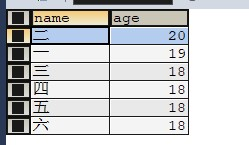
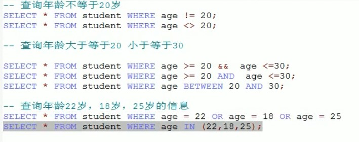
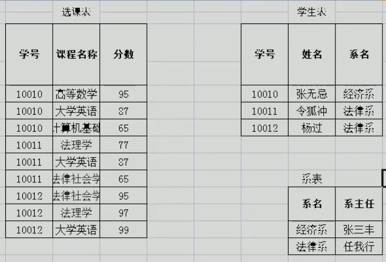
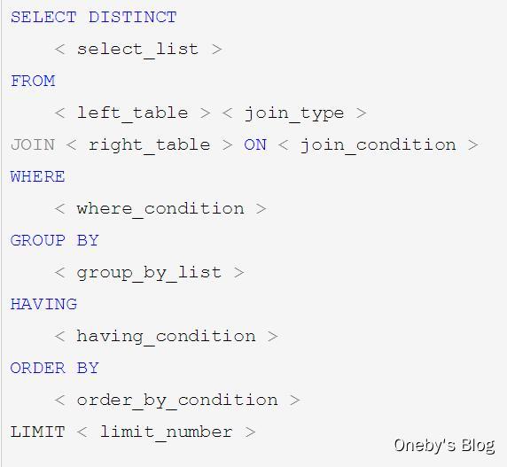
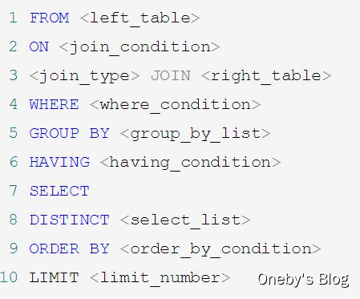
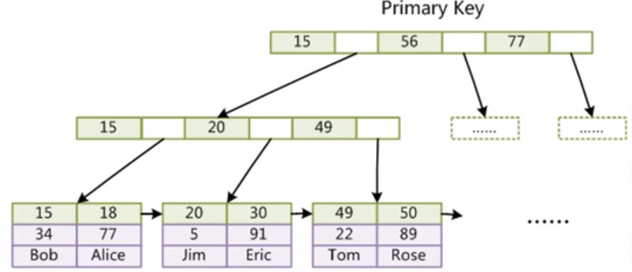
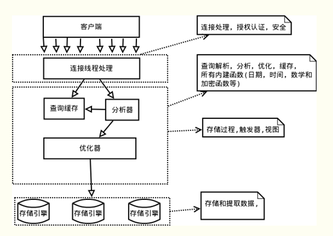
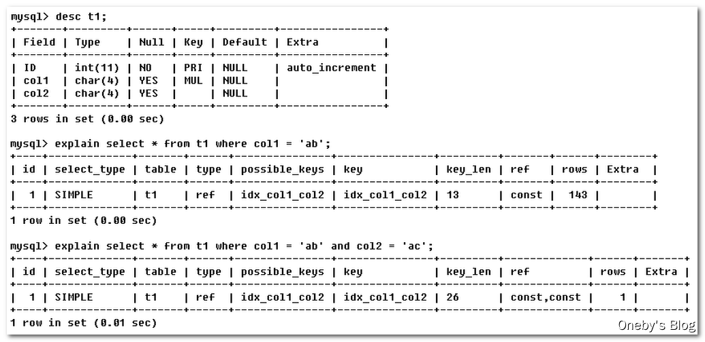
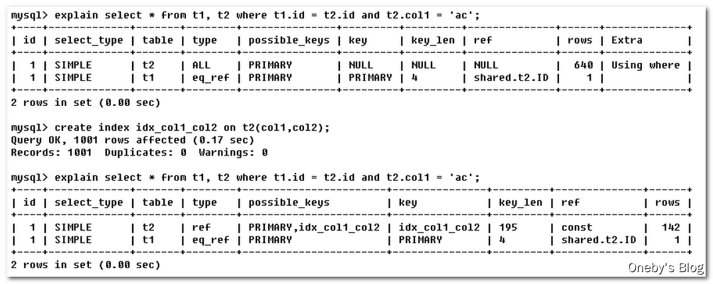
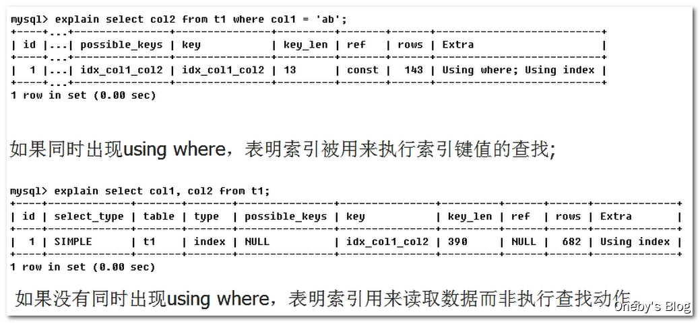

# 1. 概述

## 1.1. 数据库基本概念

1. 英文名称：Database
2. 什么是数据库：
   - 用于存储和管理数据的仓库
3. 数据可特点：
   1. 持久化存储数据，其实数据库就是一个文件系统
   2. 方便存储和管理数据，使用了统一的方式操作数据库--SQL
4. 常用数据库软件：
   

## 1.2. 基本命令

- cmd->services.msc 打开服务
- MySQL 打开与关闭（cmd 下）
  1. net start mysql 开启 mysql（管理员权限打开 cmd）
  2. net stop mysql 关闭 mysql（管理员权限打开 cmd）
- 登陆与退出（cmd 下）

  - 本地：
    1. 登陆：mysql -uroot -proot
       > -u:user，后面直接加用户名 -p:password,后面直接加密码
       > 也可以写成--user=root --password=root
       > 或者不直接加，只输入-p（即：mysql -uroot -p,之后输入密码会以\*反显）
    2. 退出：exit
  - 远程：

    1. 登陆： mysql -h127.0.0.1 -uroot -proot

       > -h 后直接加上 ip 地址，本机为 127.0.0.1

    2. 退出：exit 或者 quit
    3. 登陆： mysql --host=127.0.0.1 --user=root --password=root

       > 相当于全称，这里有两个-

## 1.3. 数据结构


- 安装目录
  - 配置文件 my.ini
- 数据目录
  - 计算机硬件和 MySQL 软件合称 MySQL 服务器
  - 一个数据库就是一个文件夹
  - 一个数据库中可以存放多张表，表对应文件夹中的.frm 结尾文件
  - 每个表中存放多条数据记录

# 2. MySQL 基础

## 2.1. 什么是 SQL

    Structured Query Language：结构话查询语言。
    其实就是操作所有关系型数据库(Relational DBMS)的规则
    每一种数据库操作方式存在不一样的地方，称为“方言”

## 2.2. 通用语法

1. SQL 可以单行或者多行书写，以分号结尾
2. 使用 table 制表符增强可读性
3. 数据库不区分大小写，但关键字推荐使用大写
  > **注意：linux中是字段名称是区分大小写的**
4. 3 种注释
   1. 单行注释：
      1. -- 内容（两个横杠和**一个空格**）
      2. #内容 （方言 MySQL 特有书写方式，不必要加空格）
   2. 多行注释：/_ 内容 _/

## 2.3. SQL 语句分类

1. DDL(data definition Language)
   用来定义数据库对象：数据库，表，列等。关键字：Creat，drop，alter 等
2. DML(Data Manipulation Language)
   用来对数据库中的数据进行增删。关键字：insert，delete，update 等。
3. DQL(Data Query Language)
   用来查询表中的记录（数据）。关键字 select，where 等
4. DCL(Data Control Language)
   数据控制语言，用来定义数据库访问权限和安全级别，及创建用户。关键字：GRANT，REVOKE 等
   


## 2.4. 数据类型


* 类型转换
  * 例：cast (department.budget to numeric(12,2))
* 从date/time/timestamp中提取部分时间
  * 例：extract(year from r.starttime)

</br>

* 操作数据类型
  * 创建数据类型
    * create type Dollars as numberic(12,2) final
      > 在人民币和美元都是数字，但有汇率的情况下可以创建数据类型帮助存储数据  
      > final无实意，是曾经标准所要求的，一些系统允许可以忽略,
  * 删除数据类型：delete
  * 修改数据类型：alter
* 操作域
  *  创建域
     * create domain DDollars as numberic not null;
* 数据类型和域的区别：
  * 域可以声明约束（not null,check等）
  * 域不是强类型，只要两个域中的数值类型相同，就能互相赋值；而数据类型不行


## 2.5. 语法

### 2.5.1. DDL(操作数据库)

- 对数据库整体

  1. C(Create) 创建

     - create database 数据库名

       > 重名时会报错

     - create database if not exists 数据库名

       > 当指定数据库名不存在时才创建，存在也不会报错

     - create database 数据库名 character set gbk

       > 以指定字符集创建数据库，这里为 gbk

  2. R(Retrieve) 查询

     - show databases;
       > 额外知识：
       > information_schema 用来 MySQL 中的一些信息，里面存放的是视图（以后才学），而不是表，并且并不对应物理文件
       > mysql 用来存放数据库中的核心数据
       > performance_schema 用来存放调整数据库性能的一些数据
       > 这是三个都最好不要改
     - show creat database 数据库名称

       > 查看某一个数据库字符集：查询某个数据库创建语句

  3. U(Update) 修改

     - alter database 数据库名称 character set 字符集名称

       > 修改某个数据库字符集（utf8，没有-）

  4. D(Delete) 删除

     - drop database 数据库名称

       > 一般不会做的操作

     - drop database if exists

       > 当数据库存在时才删除

  5. 使用数据库

     - select database()

       > 查询正在使用的数据库名称

     - use 数据库名称

       > 使用数据库，相当于进入数据库

- 对表整体

  1. C(Create) 创建

     - create table (if not exists) 表名(
       列名 1 数据类型 1,
       列名 2 数据类型 2,
       列名 3 数据类型 3,
       ......
       列名 n 数据类型 n;
       );
       > 创建表，注意小括号和逗号，最后一列没有逗号
       > 在声明字段后面加 defult 值1 可以用来设置默认值
       ```sql
       //常用数据类型例：
       age int
       score double(5,2)//最多有5位，小数点后保留两位
       riqi date 2000-12-12
       jutiriqi datetime //格式举例：2000-12-12 12:12:12
       shijianchuo timestamp //格式举例：2000-12-12 12:12:12
       //时间戳：如果不给这个字段赋值，那么默认使用当前系统时间赋值
       name varchar(20)
       //字符串类型，最多20个字符
       ```
       ```sql
       //例：
       create table student(
           id int,
           name varchar(32),
           age int,
           score double(4,1),
           birthday date,
           inserttime timestamp
       );
       ```
     - create 新表 like 已经存在表

       > 创建一个新的表和已经存在的一个表结构相同，也就是赋值表

  2. R(Retrieve) 查询

     - show tables

       > 查询一个数据库中所有表的名称

     - desc 表名

       > 查询表结构

     - show create table 表名

       > 查询表的字符集

  3. U(Update) 修改<p id="DML_update"> </p>

     - alter table 表名 rename to 新表名;

       > 修改表名

     - alter table 表名 character set 字符集;

       > 修改表的字符集

     - alter table 表名 add 列名 数据类型;

       > 增加一列

     - alter table 表名 drop 列名;

       > 删除列

     - alter table 表名 change 旧列名 新列名 新列名类型

       > 修改列名称，类型

     - alter table 表名 modify 列名 新的类型

       > 只修改列的类型

  4. D(Delete) 删除

     - drop table (if exists) 表名

       > 删除表

     - truncate table 表名
       > 删除整个表再创建一个一模一样结构的表
       > 相当于一下两条语句整合
       > create 新表 like 已经存在表;
       > drop table 表名

### 2.5.2. DML(增删改表中数据)

1. 添加数据
   - insert into 表名(列名 1,列名 2.....列名 n) values(值 1,值 2...值 n),(值 1,值 2...值 n).....;
     > 往表中插入数据
     - 注意：
       1. 列名和值要一一对应
       2. 如果表名后没有写列名，那么默认给所有列添加值。但建议都写上，不要偷懒
       3. 除了数字类型，其他数据类型都要使用引号引起来，单引号双引号都行
2. 删除数据
   - delete from 表名 [where 条件]
     > 把满足条件的数据从指定表中删除。例： delete from student where id=1;
     - 注意：
       1. !!!!!如果不加条件，就会删除表中所有数据!!!!!!
       2. 但不推荐上述操作，因为会一条一条删除，效率太低，推荐使用 **truncate table 表名**;--删除整个表，然后再创建一个一模一样的空表
3. 修改数据
   - update 表名 set 列名 1=值 1,.....[where 条件];
     > 例：UPDATE student SET age=20,score=100 WHERE id=2;
     - 注意：
       1. 如果不加任何条件，就会把所有表中所有记录都修改，比如把 score 都改为 100
   - **case 结构使用**
     > 不同条件不同修改方式
     ```sql
     update
       student
     set
       score = case
               when score<60 then score+1 --没有逗号
               when score>95 then score-1
               else score*1.005
               end
     ```

### 2.5.3. DQL(表内数据查询)

- select \* from 表名

  > 查询表中所有数据

1. 整体语法： >所有语句都涉及到

   <pre>
       select 
           字段列表
       from
           表名列表
       where
           条件列表
       group by
           分组字段
       having
           分组之后的条件
       order by
           排序
       limit
           分页限定
   </pre>

2. 基础查询：

   1. 多个字段查询
      - select 字段名 from 表名;
        > 例：-- 查询姓名和年龄：SELECT NAME,age FROM student;
        > 一般不使用\*号，阅读性太差,也可以分分行，多加些注释
        > 
   2. 去除重复结果集

      - select distinct 字段名 from 表名;

        > 如果指定的多个字段名都相同，才可以去重

   3. 计算列
      - select 字段 1+字段 2 from 表名;
        > 计算两个字段相加结果,这里可以进行四则运算。
        > 例：SELECT id,score+age FROM student;
        > 
        > 如果有 null 参与的运算结果都是 null，因此有下面表达式：
      - select 字段 1+ifnull(表达式 1,表达式 2) from 表名;
        > 表达式 1：判断那个字段为 null。
        > 表达式 2：为 null 时的替换值。
        > 例：select id+ifnull(score,0) from student;
   4. 起别名
      - select 字段 1+字段 2 as 新名称 from 表名;
        > 将某个结果（列名字段或者表名）起一个别名用来显示出来,as 也能用**一个或者多个空格**表示。
        > 此时多分行比较好

3. 条件查询
   1. where 条件
   2. 运算符
      >  >
      > 例：select \* from student where age>15
      > 
   3. 注意：
      - null 不能使用=和<>来判断，应该使用 is 和 is not.
        > 例：select _ from student where age is null
        > select _ from student where age is not null <br>
        > 与 null 的任何比较运算（> < =）结果都为**unknown**(第三个逻辑值),并且：
        > true and unknownu=nknown
        > true or unknown:true
        > not unknown=unknown
   4. like：
      - \_:单个任意字符
      - %:多个任意字符
        > 例： select name from student where '李%'
        > 
4. 排序查询
   - select 字段 from 表名 order by 排序字段 1 排序方式 1,排序字段 2 排序方式 2....;
     > 排序方式：
     > ASC:升序（默认）
     > DESC:降序
     > 越靠后，排序优先度越低，只有靠第一种排序相同时，那么才考虑之后的排序方式
5. 聚合函数:将一列数据作为一个整体，进行**纵向**的计算。

   1. count:计算个数

      - 一般选择非空的列
      - 或者使用 count(\*)（不推荐）

        > count (distinct nam) 来去重（mysql 是否可用未证实）

   2. max:计算最大值
   3. min:计算最小值
   4. sum:计算和；
   5. avg:计算平均值

   - 注意：聚合函数计算会自动**排除 null 值**，可以通过 ifnull()来避免
   - 语法：select 函数(字段名) from 表名<br>select 函数(ifnull(字段名,值)) from 表名
     > 默认是保留重复元组进行计算，如果不想保留。可以写成：
     > 例：select count(distinct id) from student <br>
     > 如果为 null 按 1 算：
     > select count(ifnull(id,1)) from student) <br> > 

6. 分组查询
   > **任何没有出现在 group by 中的属性，如果要出现在 select 中的话，只能出现在聚集函数内部**
   - group by 分组字段;
     > 例：select sex,AVG(math),count(id) from student group by sex;
     > select 后有什么，后面就显示什么
     > <br>
     > 注意：分组之后查询字段：分组字段(比如 sex,如果用每个人都不同的字段分组，就没有意义了)，另外如果不进行分组就使用聚合函数的话，就相当于把整个表作为一个分组。
     > 例：<br>
   - 添加判断语句：
     > 普通 where 添加在前面，分组之后条件判断加载后面并且用 having 关键字
     > where 和 having 区别（**面试会考**）：
     1. where 在分组之前进行限定，不满足条件不参与分组， having 在分组之后进行限定，不满足条件不会被查询出来
     2. where 不可以进行聚合函数的判断，而 having 可以
        > [查看格式](#253-dql表内数据修改查询)
        > 例：
        > 
7. 分页查询

   - limit 开始的索引,每页查询的条数
     > 例：<br>select _from student limit 0,3;-- 从 0 开始查，显示三条记录。（第一页）
     > select _ from student limit 3,3;-- 从 3 开始，显示 3 条，（第二页）
     > 开始索引=（当前页码-1）\*每页显示条数
   - limit 这个语法是 SQL 的一个**方言**

8. 集合运算
   > 作用于两个关系，两关系中的属性类型要相同
   - (--查询语句 1，返回一个表)union(--查询语句 2，返回一个表)
     > 并运算。如果要保留所有重复，必须用 union all 替换掉 union
   - (--查询语句 1，返回一个表)intersect(--查询语句 2，返回一个表)
     > 交运算。如果要保留所有重复，必须用 intersect all 替换掉 intersect
   - (--查询语句 1，返回一个表)except(--查询语句 2，返回一个表)
     > 差运算.如果要保留所有重复，必须用 except all 替换掉 except

### 2.5.4. DCL

[跳转](#611-dcl)

## 2.6. 约束

### 2.6.1. 概念

> 对表中的数据进行限定，保证数据的正确性，有效性和完整性

### 2.6.2. 分类

- 主键约束 pramary key
- 非空约束 not null
- 唯一约束 unique
- 外键约束 foreign key
- check约束

### 2.6.3. 非空约束

1. 在创建表是添加约束
   - 在数据定义后面加 空格+not null
     例：
     `SQL creat table stu{ id int, name varchar(20) not null -- name为非空约束 };`
2. 删除非空约束(就是修改表的一个字段)
   - alter table 表名 modify 字段名 字段类型
     > 也就是说后面什么都不加，就取消掉了约束
     > [跳转到列数据类型修改](#DML_update)
3. 创建表后添加非空约束

   - alter table 表名 modify 字段名 字段类型 not null

     > 和上面同理

### 2.6.4. 唯一约束

- 注意：MySQL 中唯一约束限定的列的值可以有多个 null

1. 创建表是添加唯一约束
   - 在数据定义后面加 空格和 unique
   - 在表的定义后面加上 unique(属性 1,属性 2,...) 括号里的属性构成候选码
     ```SQL
     creat table ste{
         id int,
         phont_number varchar(20) unique
     };
     ```
2. 删除唯一约束
   - alter table 表名 drop index 字段名
     > 唯一约束有时候也称为唯一索引，所有有 drop index
     > [跳转到列数据类型修改](#DML_update)
3. 创建表后添加唯一约束

   - alter table 表名 modify 字段名 字段类型 unique

     > 和非空约束添加同理，但当添加时，该列数据必须不能有重复的，否则会报错

### 2.6.5. 主键约束

- 含义：非空且唯一。是表中记录的唯一标识
- 限制：一张表只能有一个字段为主键

1. 创建表时添加主键约束

   - 后面加 primary key 即可

     ```SQL
     creat table stu(
         id int primary key,
         name varchar(20)
     );

     -- 约束格式也可以写成这样：
     creat table stu(
         id int,
         name varchar(20),
         primary key (id)
     );
     ```

2. 删除主键约束

   - alter table 表名 drop primary key;

     > 主键只有一个，所以不需要指定

3. 创建表后添加主键

   - alter table 表名 modify 字段名 字段类型 primary key;

     > 不能有重复数据以及空数据。

4. 自动增长
   - 概念：如果某一列是数值类型的，使用 auto_increment 可以完成值的自动增长
   - 基本上都是和主键一起使用，但也可以分开使用，但是这种情况很少
   - 语法：
     ```SQL
     creat table stu(
         id int primary key auto_increment,
         name varchar(20)
     );
     ```
     > 也可以手动设置，但每次增长是上次数据+1（也就是等价于最大值+1）

### 2.6.6. check 约束和断言

> 用来保证属性值满足指定的条件，实际上创建了一个强大的类型系统，类似于枚举

```sql
-- 例：
create table student(
  name varchar(32),
  id int(16),
  gender varchar(32),
  primary key(id),
  age int(16)
  check(gender in ('male','female') and age>10) -- in后面的也可以是select语句，但是有些数据库不支持
)

```

> 断言是一个谓语，表明希望数据库满足一个条件

### 2.6.7. 外键约束

- 情景
  > 有时数据会有冗余
  > 例：
  > 
  > 每个部门就在一个地方，不需要每条员工信息都记一次
  > <br>解决办法：
  > 创建两张表
  > 一张表记员工信息（employee 表），一张表记部门所在地（department 表）
  >  
  > 此时如果删除一个部门，另一张表中还有人对应那个部门，显然不合理。应该先删除人员。
- 为解决上述问题使用外键约束，即让表与表之间产生关系，从而确保数据的正确性。

1. 添加表时添加外键

   ```SQL
   creat table 表名(
       ...
       外键列
       constraint 外键名称(自己起名，不能重复) foreign key 外键列名称 references 主表名称(主表列名称)
       -- 一般都关联主键列，当然也能关联其他列
       -- 主表必须先存在，此处主表为部门表
       -- 必须先删除关联表记录，再删除主表记录
       -- 在多的一方建立外键，指向一的一方的主键
       -- contraint 外键名称 这部分也可以不写，系统会自动分配外键名称
   )

   -- 例：
   creat table employee(
       ...
       dep_id int, -- 外键对应主表的主键   --注意，此时该句不是最后一句，要加逗号
       constraint emp_dept foreign key (dep_id) references  department(id)
   )
   ```

   大致图解：
   

   > 此时若其他表记录与主表记录相互关联，那么就不能对该条主表记录进行删除
   > 同样，新加的其他表记录也必须与主表关联记录的所有数据中来取。例如这里新建员工体条目 dep_id 只能取 1 和 2 或者保留为 null

2. 删除外键

   - alter table 其他表的名 drop foreign key 外键名（自己起的那个）

3. 创建表之后，添加外键

   - alter table 其他表的名 add constraint 外键名称（自己起名，不能重复） foreign key 外键列名称 references 主表名称(主表列名称)

     > 中文括号是备注，英文括号中需要填东西

4. 级联操作

   - 情景

     > 当修改主表中的记录时，必须先修改与之关联的记录。为了方便修改数据，就有了级联操作。也就是修改一的同时自动修改多

   - 概念：当修改主表中的记录时，其他表中的记录也会跟着修改（使用一定要谨慎）

     > 比如这里修改 department 表中的一个 id 为 5，employee 表中对应 dep_id 也会修改为 5

   - 添加级联更新：

     - 在添加外键语句后 加上：on update cascade

   - 添加级联删除：

     - 在添加外键语句后 加上：on delete cascade

       例：

     ```SQL
     -- 先取消键的关联
     alter table employee drop foreign key emp_dept
     -- 再重新加上外键，此时添加级联更新语句和级联删除语句
     alter table employee add constraint emp_dept foreign key dem_id references department(id) on
     e
     ```

## 2.7. 数据库设计

### 2.7.1. 多表间关系

1. 多表间关系：

   - 一对一（了解）：

     - 如人的身份证

       > 一个人只能有一个身份证

   - 一对多（多对一）：
     - 如部门和部门
       > 一个部门能有多个员工
       > 一个员工只能在一个部门
   - 多对多
     - 如大学生选择课程
       > 一个学生能选多门课程，
       > 一个课程能被多个学生选择

2. 实现关系：
   - 一对多（多对一）
     - 实现方式：在多的一方建立外键，指向一的一方的主键
       
   - 多对多
     - 实现方式：通过中间表
       
   - 一对一（实际开发基本不会使用）
     - 实现方式：
     - 基本上会合成一张表，如果必须要用两张表的话：
     1. <br> 
     2. 使两表主键（id）相同

### 2.7.2. 范式

- 概念：在设计数据库是需要遵循的规范，要遵循后面的范式要求，必须要遵循前面所有范式。
  范式（数据库设计范式，数据库的设计范式）是符合某一种级别的关系模式的集合。构造数据库必须遵循一定的规则。在关系数据库中，这种规则就是范式。关系数据库中的关系必须满足一定的要求，即满足不同的范式。
- 分类(一般前三个就足够)：

  1. 第一范式（1NF）：每一列都是不可分割的原子数据项

     > 即每列不可分割。所有的表创建出来后都满足该范式

  2. 第二范式（2NF）：在 1NF 的基础上，非码属性必须依赖于候选码（在 1NF 基础上消除非主属性对主码的部分函数依赖）

     - 函数依赖：通过 A 的属性的值，可以确定唯一 B 的属性的值（A-->B），则称 B 依赖于 A。
     - 属性组：如果（A,B）-->C，则（A,B）称为一个属性组，合称为 D。
     - 完全函数依赖：如果 D 是一个**属性组**，通过 D 中所有属性才能确定 B 属性的唯一值，那么则称 B 完全依赖于 D
     - 部分函数依赖：如果 D 是一个**属性组**，通过 D 中部分属性便可以确定 B 属性的唯一的值，那么称 B 部分依赖于 D
     - 传递函数依赖：A-->B,B-->C(A,是属性或者属性组，B,C 是属性)，则称属性 C 函数传递依赖于 A
     - 码：如果一个属性或者属性组在一张表中被其他所有属性完全依赖，则称该属性或属性组为该表的**码**。比如学号和课程名称组合可以称为码
       _ 主属性：码属性组中的所有属性
       _ 非主属性：除码属性组中的所有属性

       > 即消除部分函数依赖

  3. 第三范式（3NF）：在 2NF 的基础上，任何非主属性不依赖于其他非主属性。（在 2 范式的基础上消除传递依赖。）
  4. Boyce-Codd 范式（BCNF）
  5. 第四范式（4NF）
  6. 第五范式（5NF）

- 情景举例：
  1. 第一范式所存在问题：
     
  2. 通过分表实行第二范式，解决第一个问题：
     
  3. 通过分表实行第三范式，解决第二三个问题。
     

## 2.8. 数据库备份和还原

> 其实就是将所有数据还原为命令行

1. 命令行
   - 备份（不用登陆）： mysqldump -u 用户名 -p 密码 指定数据库 > 保存的路径
   - 还原：
     1. 登陆数据库
     2. 创建数据库
     3. 使用数据库
     4. 执行文件：source 文件路径
2. 直接右键备份还原。

## 2.9. 多表查询

### 2.9.1. 小知识点

- 单表查询语法回顾：

    <pre>
        select 
            字段列表
        from
            表名
        where
            条件列表
        group by
            分组字段
        having
            分组之后的条件
        order by
            排序
        limit
            分页限定
    </pre>

- 多表查询查询出来的内容称为**笛卡尔积**
  > 即多个表的所有记录的所有组合，个数为 n*m *.....
  > 要完成多表查询，需要消除无用的数据

### 2.9.2. 多表查询分类

#### 2.9.2.1. 内连接查询

> **内连接中**on 和 where 其实可以互换，但也可以同时使用 on 和 where，on 来表示连接条件，where 表示筛选条件，阅读性 3 更好
> 默认就是内连接 inner 可以不写

- 自然连接查询
  > 作用于两个关系，并产生一个关系作为结果。将所有元祖进行笛卡尔积，并且只取共同属性值相同的组合。
  - select 字段列表 from 表名 1 natural join 表名 2

1. 隐式内连接

   - from 后有多个表，使用 where 条件消除无用的数据。表名.'列名' 来表示某表某列，单引号加不加都行

     > 例：emp.'dept_id'=dept.'id'

     ```SQL
     -- 例：
     select
         t1.name,
         t1.sex,
         t2.name  -- 2
     from
         employee t1,
         department t2   -- 1 先起别名，避免表名过长过于麻烦
     where
         t1.id=t2.id -- 3
     -- 格式仿照这样写，多分行方便加注释
     ```

2. 显式内连接

   - select 字段列表 from 表名 inner join 表名 2 on 条件

     > 通过 on 进行记录筛选。效果与隐式内连接相同
     > 显式连接可以减少字段的扫描，有更快的执行速度。这种速度优势在 3 张或更多表连接时比较明显

     ```SQL
     -- 例：
     select
         *
     from
         employee t1
     [inner] join
         department t2
     on
         t1.id=t2.id;
     ```

- 内连接查询注意：
  1. 从哪些表中查数据
  2. 查询条件是什么
  3. 查询那些字段

#### 2.9.2.2. 外连接查询

> 外连接在结果中会给某些元组中的属性赋空值从而保留本应在连接中丢失的元组
> **其次外连接中 on 和 where 作用不同**。on 后面是连接条件，并且对不满足条件的进行补空值，然后再通过 where 对连接结果进行筛选。
> 内连接中因为没有补空值这种操作所以 on 和 where 作用相同

1. 左外连接：
   - select 查询字段列表 from 表 1 left [outer] join 表 2 on 条件
   - 查询的是左表(语句中表的位置)所有记录与笛卡尔积中满足条件记录的和，不满足条件的左表记录，对应其他表数据会以 null 显示。
     
   ```SQL
   -- 例：
   select
       t1.*,t2.name
   from
       employee t1
   left join
       department t2
   on
       t1.id=t2.id  --如果不写这个的话可以在left前加一个natural
   ```
2. 右外连接：
   - select 查询字段列表 from 表 1 right [outer] join 表 2 on 条件
   - 查询的是右表中所有记录与笛卡尔积中满足条件记录的和，不满足条件的右表记录，对应其他表的数据会以 null 显示

- 可以注意到，只要掌握一个即可，把两个表换换位置就能从左变右，从右变左

3. 全外连接
   - full join
     > 保留出现在两个表中的所有元组

#### 2.9.2.3. 子查询

##### 2.9.2.3.1. 嵌套子查询

- 概念：查询中嵌套查询，称嵌套查询为子查询。

  ```SQL
  -- 如计算工资最高的人的姓名：
  select max(salary) from employee
  select * from employee where salary=9000 -- 不一定是9000，看上一条语句执行结果

  --上两条语句整合为：
  select * from employee where employee.'salary'=(select max(salary) from employee)
  -- 括号内为子查询
  -- 单个表时在列字段前面加不加表限定都行
  ```

- 不同情况

  1. 子查询结果是单行单列（**标量子查询**）

     - 这样的子查询可以放到 select 中，并且可以直接使用使用进行相等或者其他比较

       > 例：上面

  2. 子查询结果是多行单列

     - 使用运算符 in 来进行所有值的 or 操作(也有 not in 操作)：

       ```SQL
       -- 格式不知道是否规范！

       -- 查询两个部门对应的所有员工的信息
       select
           *
       from
           employee
       where
           id
       in
           (
           select
               id
           from
               department
           where
               name='财务部'
               or name='市场部'
           )
       ```

  3. 子查询结果是多行多列
     - 将子查询得到的结果也作为一个表来进行处理
       ```SQL
       -- 查询入职日期是2000-2-22之后的员工的信息
       -- 普通内连接
       select
           *
       from
           employee t1,
           department t2
       where
           t1.dept_id=t2.id
           and t1.join_date>'2000-2-22'
       -- 子表查询
       select
           *
       from
           employee t1,
           (
               select
                   *
               from
                   employee
               where
                   employee.join_date>'2000-2-22'
           ) t2
       where
           t1.id=t2.id
       ```

- 多表查询练习，再看下视频？

  - 自关联映射（不会的话看 30 分钟处）

##### 2.9.2.3.2. with 字句查询

> 进行临时定义关系，只对下面挨着的 select 语句有效

```sql
-- 镶嵌
select
     *
 from
     employee
 where
     id
 in
     (
     select
         id
     from
         department
     where
         name='财务部'
         or name='市场部'
     )

-- 等价with

with
  idtable(id) -- 表名(字段名1,字段名2....) 要和下面括号里select查询向对应
as
  (
    select
         id
     from
         department
     where
         name='财务部'
         or name='市场部'
  )   -- 此处还可以写个逗号，继续写  ...as... 定义多个临时表
select
  *
from
  depatment
where
  id
in
  idtable;

```

### 2.9.3. 表间关系

- 集合的比较
  - some
    > <some =some >some >=some <>some <=some 都可
    ```sql
    -- 找出年龄至少大于一个女生的男生
    select
      name
    from
      student
    where
     age>some (select
                age
              from
                student
              where
                sex='female')
    and
      sex='male'
    ```
  - all
    > <all =all >all <>all >=all <=all 都行
    ```sql
    -- 找出年龄大于所有女生的男生
    select
      name
    from
      student
    where
     age>all(select
                age
              from
                student
              where
                sex='female')
    ```
- exists:空关系测试

  ```sql
  -- 寻找2018级里当助教的学生
  select
    name
  from
    student s
  where
    year=2018
  and
    exists(
      select
        *
      from
        teacher T
      where
        S.id=T.id
    )
  -- **含义解析**：
  -- 在Student表中的每行数据，都去teacher表中找找有没有与之id相同的。
  -- 有的话返回true，没有的话就是false
  ```

  - unique：重复元组存在性测试(也有 not unique)
    > 如果子查询不存在与之重复的元组，将返回 true。也就是说
    > 尚未被广泛实现
    ```sql
    -- mysql中没有此语句的使用
    ```

## 2.10. 事务

### 2.10.1. 基本介绍

- 概念：
  - 如果一个包含多个步骤的业务操作，被事务管理，那么这些操作会同时成功或者同时失败
    
    > 拿 java 类比：
    > 被事务管理：编译。如果有语法错误，整个类都不会被编译
    > 不被事务管理：异常。出现异常后停止执行后面代码，前面代码已经执行
- 操作：

  1. 开启事务 start transaction
  2. 回滚 rollback
  3. 提交 commit

  ```SQL
  -- 例：张三给李四转500

  -- 0 开启事务
      start transaction;

  -- 1 张三账户-500
      update account set balance=balance-500 where name='zhangsan';

  --  **假设此处可能出错**

  -- 2 李四账户+500
      update account set balance=balance+500 where name='lisi';

  -- 中间没有发生错误，进行提交
      commit;

  -- 发现有错误，回滚.此时会回滚到开启事务之前
  -- 也可以说提交后没有事务开启了，此时rollback什么也不会发生
      rollback;
  ```

- 提交
  - 提交方式：
    1. mysql 默认是自动提交的，一条 DML（增删改）语句会自动提交一次.（oracle 是默认手动提交事务）
    2. 当开启事务后，就不会自动提交了，如果不进行手动提交数据不会被修改
  - 查看默认提交方式：
    > select @@autocommit;
    > 结果为 1 代表自动提交，0 代表手动提交<br>
    > set @@autocommit =0
    > 关闭自动提交

### 2.10.2. 四大特征

1. 原子性：是不可分割的最小操作单位，要么同时成功，要么同时失败
2. 持久性：如果事务一旦提交或者回滚，数据库会持久更新数据。
3. 隔离性：多个事务之间相互独立。但一般会相互影响。
4. 一致性：表示事务操作前后数据总量不变。

### 2.10.3. 隔离等级（了解）

- 概念：多个事务之间，是相互独立的。但如果多个事务操作**同一批数据**，也就是并发操作，则会引发一些问题，设置不同的隔离级别就可以解决这些问题
- 存在问题：
  1. 脏读：一个事务读取到另一个事务中没有提交的数据
  2. 不可重复读（虚读）：同一个事务中，两次读取的数据不一样
  3. 幻读：一个事务操作（DML）数据表中所有记录，而此时另一个事务添加了一条数据，导致第一个事务查询不到自己的修改（MySQL 中并不存在该问题）
- 隔离级别：
  - 隔离级别从小到大安全性越来越高，效率越来越低
  1. read uncommitted:读未提交（事务 1 修改的数据未提交时，事务 2 会读到修改后的数据）
     - 产生问题：脏读，不可重复读，幻读
  2. read committed:读已提交（事务 1 只有提交了修改数据，事务 2 才可以读到已经修改改的数据，否则只会读到修改前数据）（oracle 默认）
     - 产生问题：不可重复读，幻读
  3. repeatalbe read:可重复读（事务 1 只有提交了修改数据，事务 2 也提交后，才可以读到已修改数据，否则只会读到修改前数据）（MySQL 默认）
     - 产生问题：幻读
  4. serializable（只有事务 1 提交后才可以读到数据，否则事务 2 会一直等待，不会读取任何数据）:串行化
     - 可以解决所有问题
- 隔离级别设置与查询：

  ```SQL
  -- 查询：
  select @@tx_isolation

  -- 设置：
  set global transaction isolation level 级别字符串
  -- 设置后必须重新关闭打开数据库才能生效
  ```

## 2.11. DCL

- 注意：
  基本上不常用，因为会有 DBA（数据库管理员）专门管一个公司的数据库，并且分配给职员账户，所以 DCL 了解即可

- 管理用户

  1. 添加用户

     - creat user '用户名'@'主机名' identified by '密码'

       > 主机名可以写 localhost 和%等

  2. 删除用户

     - drop user '用户名'@'主机名'

  3. 修改用户密码

     1. 普通修改密码

        - update user set password=password('新密码') where user='用户名'

          > password()是 MySQL 密码加密函数

        - set password for '用户名'@'主机名'=password('新密码')

          > 同样效果，DCL 特有方式。

     2. 当忘记 root 账户密码

        1. cmd --> net stop mysql

           > 停止 MySQL 服务

        2. mysqld --skip-grant-tables

           > 使用无验证方式打开 MySQL 服务，此时光标会卡住

        3. 打开一个新的 cmd，输入 mysql 回车，登录成功
        4. 通过命令行修改密码，关闭两个窗口

           - update user set password=password('新密码') where user='root'

        5. 打开任务管理器，手动结束 mysqld.exe 这一进程
        6. 打开新 cmd，正常登陆

  4. 查询用户：
     mysql 数据库-->user 表
     
     localhost 是本地主机，%是通配符，表示任意主机，可以用来远程登陆
     数据库中密码会进行加密

- 权限管理

  - 查询权限

    - show grants for '用户名'@'主机名';

  - 授予权限
    - grant 权限列表 on 数据库名.表名 to '用户名'@'主机名';
      > 所有权限关键字：all
      > 所有数据库和表：_ ._ ><br>所有权限分类：SELECT, INSERT, UPDATE, DELETE, CREATE, DROP, RELOAD, SHUTDOWN, PROCESS, FILE, REFERENCES, INDEX, ALTER, SHOW DATABASES, SUPER, CREATE TEMPORARY TABLES, LOCK TABLES, EXECUTE, REPLICATION SLAVE, REPLICATION CLIENT, CREATE VIEW, SHOW VIEW, CREATE ROUTINE, ALTER ROUTINE, CREATE USER
  - 撤销权限

    - revoke 权限列表 on 数据库名.表名 from '用户名'@'主机名';

## 2.12. 视图

> 视图相当于存储一个 sql 查询语句，而不是一个查询结果，当使用视图时便会执行查询。确保了实时性
> 视图的查询使用和表的查询相同
> 视图在限定条件下才可进行删除，插入，更新操作。不同数据库条件可能不同

- create view 视图名称(属性名称 1，属性名称 2) as 查询语句
  > 创建视图。小括号属性名称并不必要。

# 3. MySQL架构

# 4. Mysql索引优化

> 使用的外部截图。
> 图片来源：[来源](https://blog.csdn.net/oneby1314/category_10278969.html)

## 4.1. 慢SQL的原因

- 查询语句写的烂
- 索引失效：
  - 单值索引：在user表中给name属性建个索引，`create index idx_user_name on user(name)`
  - 复合索引：在user表中给name、email属性建个索引，`create index idx_user_nameEmail on user(name,email)`
- 关联查询太多join(设计缺陷或不得已的需求)
- 服务器调优及各个参数设置(缓冲、线程数等)

## 4.2. SQL执行顺序

- 手写顺序  
  
- 执行顺序  
  - mysql 执行的顺序：随着 Mysql 版本的更新换代， 其优化器也在不断的升级， 优化器会分析不同执行顺序产生的性能消耗不同而动态调整执行顺序。
  - 下面是经常出现的查询顺序：

  

- 总结  
  -


## 4.3. 索引概述

### 4.3.1. 索引是什么

- MySQL官方对索引的定义为：索引(Index)是帮助MySQL高效获取数据的数据结构。可以得到索引的本质：索引是数据结构
- 你可以简单理解为"排好序的快速查找数据结构"，即索引 = 排序 + 查找
- 一般来说索引本身占用内存空间也很大，不可能全部存储在内存中，因此索引往往以文件形式存储在硬盘上
- 我们平时所说的索引，如果没有特别指明，都是指B树(多路搜索树，并不一定是二叉树)结构组织的索引。
- 聚集索引，次要索引，覆盖索引，复合索引，前缀索引，唯一索引默认都是使用B+树索引，统称索引。当然，除了B+树这种类型的索引之外，还有哈希索引(hash index)等。

### 4.3.2. 索引分类

- 普通索引：是最基本的索引，它没有任何限制，即一个索引只包含单个列，一个表可以有多个单列索引；建议一张表索引不要超过5个，优先考虑复合索引
- 唯一索引：与前面的普通索引类似，不同的就是：索引列的值必须唯一，但允许有空值。如果是组合索引，则列值的组合必须唯一
- 主键索引：是一种特殊的唯一索引，一个表只能有一个主键，不允许有空值。一般是在建表的时候同时创建主键索引：
- 复合索引：指多个字段上创建的索引，只有在查询条件中使用了创建索引时的第一个字段，索引才会被使用。使用组合索引时遵循最左前缀集合
- 全文索引：主要用来查找文本中的关键字，而不是直接与索引中的值相比较。fulltext索引跟其它索引大不相同，它更像是一个搜索引擎，而不是简单的where语句的参数匹配

---

- 索引类型
- BTree索引
- Hash索引
- full-text索引
- R-Tree索引

### 4.3.3. 什么时候需要建索引

- 索引的优势
  - 类似大学图书馆的书目索引，提高数据检索效率，降低数据库的IO成本
  - 通过索引列对数据进行排序，降低数据排序成本，降低了CPU的消耗
- 索引的劣势
  - 实际上索引也是一张表，该表保存了主键和索引字段，并指向实体表的记录，所以索引列也是要占用空间的
  - 虽然索引大大提高了查询速度，同时却会降低更新表的速度，如果对表INSERT，UPDATE和DELETE。因为更新表时，MySQL不仅要不存数据，还要保存一下索引文件每次更新添加了索引列的字段，都会调整因为更新所带来的键值变化后的索引信息
  - 索引只是提高效率的一个因素，如果你的MySQL有大数据量的表，就需要花时间研究建立优秀的索引，或优化查询语句

---

- 哪些情况下适合建立索引
  - **主键自动建立唯一索引**
  - **频繁作为查询的条件的字段应该创建索引**
  - **查询中与其他表关联的字段，外键关系建立索引**
  - 频繁更新的字段不适合创建索引
  - Where 条件里用不到的字段不创建索引
  - 单间/组合索引的选择问题，Who？（在高并发下倾向创建组合索引）
  - **查询中排序的字段，排序字段若通过索引去访问将大大提高排序的速度**
  - **查询中统计或者分组字段**
- 哪些情况不要创建索引
  - 表记录太少
  - **经常增删改的表**
  - **数据重复且分布平均的表字段**，因此应该只为经常查询和经常排序的数据列建立索引。注意，如果某个数据列包含许多重复的内容，为它建立索引就没有太大的实际效果。

## 4.4. 索引语法

- 创建索引：
  ```sql
  CREATE [UNIQUE] INDEX  indexName ON mytable(columnname(length));
  ' or '
  ALTER mytable ADD [UNIQUE]  INDEX [indexName] ON(columnname(length));
  ```
  - 如果是CHAR和VARCHAR类型，length可以小于字段实际长度；
  - 如果是BLOB和TEXT类型，必须指定length。
- 删除索引
  ```sql
  DROP INDEX [indexName] ON mytable;
  ```
- 查看索引（\G表示将查询到的横向表格纵向输出，方便阅读）
  ```sql
  SHOW INDEX FROM table_name\G
  ```

- Alter
  - `ALTER TABLE tbl_name ADD PRIMARY KEY(column_list)`：该语句添加一个主键，这意味着索引值必须是唯一的，且不能为NULL。
  - `ALTER TABLE tbl_name ADD UNIQUE index_name(column_list)`：这条语句创建索引的值必须是唯一的（除了NULL外，NULL可能会出现多次）。
  - `ALTER TABLE tbl_name ADD INDEX index_name(column_list)`：.添加普通索引，索引值可出现多次。
  - `ALTER TABLE tbl_name ADD FULLTEXT index_name(column_list)`：该语句指定了索引为FULLTEXT，用于全文索引。

## 4.5. 存储引擎和索引

### 4.5.1. 概述


### 4.5.2. B+树

 

<br /><br />

- 为什么不用红黑树：红黑树一个节点只能存储一个数据，会导致深度过深。
  - 红黑树每个节点只能存储一个数据。
  - 在大规模数据存储的时候，红黑树往往出现由于树的深度过大而造成磁盘IO读写过于频繁，进而导致效率低下的情况。

---

- 为什么用B+树而不是B-树
  - 一般来说索引非常大，尤其是关系性数据库这种数据量大的索引能达到亿级别，所以为了减少内存的占用，索引也会被存储在磁盘上。
  - B-树/B+树 的特点就是每层节点数目非常多，层数很少，目的就是为了减少磁盘IO次数，
  - 但是B-树的每个节点都有data域（指针），这无疑增大了节点大小，
  - 说白了增加了磁盘IO次数（**磁盘IO一次读出的数据量大小是固定的，单个数据变大，每次读出的就少，IO次数增多，一次IO多耗时**）
  - 而B+树除了叶子节点其它节点并不存储数据，节点小，磁盘IO次数就少。

---

- B+树的优点
  - 优点一： 
    - B+树只有叶节点存放数据，其余节点用来索引。
  - 优点二：
    - B+树所有的Data域在叶子节点，并且所有叶子节点之间都有一个链指针。
    - 这样遍历叶子节点就能获得全部数据，这样就能进行区间访问啦。在数据库中基于范围的查询是非常频繁的，而B树不支持这样的遍历操作。

---

- mysql中B+树的大小与计算
  >  
  - mysql B+树中指针大小大概6Byte
  - 而int类型的索引为8Byte
  - 每个节点大小约为16KB
    ```sql
    -- 该语句可以得到
    show global status like 'Innodb_page_size'
    ```
  - 也就是说每个节点大约可以有1170个索引元素
  - 假设叶节点存储的（索引+数据）大小为1KB，那么每个节点可以存储16个数据元素
    - 注意：叶子节点存储的data中，
    - 可能存储 **索引指向的一行数据 的指向每个字段数据 的指针**(也就是存储指向数据的指针,myisam存储引擎)
    - 也可能存储 **索引指向的一行数据的每个字段的数据**(也就是存储数据,Innodb存储引擎)
  - 那么三层的B+数能够存储的数据元素数量为 1170*1170*16

### 4.5.3. myisam存储引擎

> 存储引擎是表级别的。不同的表在定义的时候都可以设置存储引擎

- 一个myisam表对应三个文件：
  - .frm:表结构定义
  - .MYD:myisam data，数据文件
  - .MYI:myisam index，索引数据文件

- myisam索引结构
  >  
  - 叶子节点的data中存放指向数据的指针

### 4.5.4. Innodb存储引擎

- 一张Innodb表对应两个文件
  - .frm:表结构文件
  - .ibd:索引+数据文件

- Innodb索引结构
  > 
  - 叶子节点的data中存放具体数据

### 4.5.5. 两个存储引擎的区别


MyISAM比较适合读操作。

### 4.5.6. Mysql分支

Percona和MariaDB是Mysql的分支。[说明](https://www.biaodianfu.com/mysql-percona-or-mariadb.html)

Percona为MySQL数据库服务器进行了改进，在功能和性能上较MySQL有着很显著的提升。该版本提升了在高负载情况
下的lnnoDB的性能、为DBA提供一些非常有用的性能诊断工具；另外有更多的参数和命令来控制服务器行为。

该公司新建了一款存储引擎叫xtradb完全可以替代innodb,并且在性能和并发上做得更好，

阿里巴巴大部分mysql数据库其实使用的percona的原型加以修改。有退出AliSql和AliRedis。

### 4.5.7. 思考题(重要)

- 索引种类：
  - 非聚集索引/非聚簇索引:指索引文件和数据文件是分离的，如myisam
  - 聚集索引/聚簇索引:索引和数据聚集在一个文件中，如Innodb
    - 因为只需要查找一次，因此性能要比非聚集索引性能要高

- **为什么Innodb必须要有主键，并且推荐使用整型的自增主键(阿里)**
  - Innodb的数据是通过主键进行组织的。(见上面的图)
  - 如果没有设置主键，会自动选择unique的列作为主键，如果还是没有，就会自动创建一个不可见的列作为主键
  - 整型比较大小更快，查B+树的时候更快。
  - 使用自增是为了可以一直往后面添加元素，避免B+树中的节点分裂。

- 为什么不使用hash索引
  - Hash不支持模糊查询以及范围查询，在生产环境中使用性差

- 叶子节点间的链指针用途
  - 支持范围查找

---

使用`explain`进行调优时，Extra列的Using filesort也与之有关。

## 4.6. 索引性能分析

### 4.6.1. Explain概述

- 说明：
  - 使用EXPLAIN关键字可以模拟优化器执行SQL语句，从而知道MySQL是如何处理你的SQL语句的。分析你的查询语句或是结构的性能瓶颈
  - [官网地址](https://dev.mysql.com/doc/refman/8.0/en/explain-output.html)

- **显示字段**
  - 表的读取顺序（id 字段）
  - 数据读取操作的操作类型（select_type 字段）
  - 哪些索引可以使用（possible_keys 字段）
  - 哪些索引被实际使用（keys 字段）
  - 表之间的引用（ref 字段）
  - 每张表有多少行被优化器查询（rows 字段）

- 使用：`explain`+`sql语句`
  ```
  mysql> explain select * from tbl_emp;
  +----+-------------+---------+------+---------------+------+---------+------+------+-------+
  | id | select_type | table   | type | possible_keys | key  | key_len | ref  | rows | Extra |
  +----+-------------+---------+------+---------------+------+---------+------+------+-------+
  |  1 | SIMPLE      | tbl_emp | ALL  | NULL          | NULL | NULL    | NULL |    8 | NULL  |
  +----+-------------+---------+------+---------------+------+---------+------+------+-------+
  1 row in set (0.00 sec)
  ```

### 4.6.2. Explain详解

#### 4.6.2.1. id

- 说明： **select查询的序列号，包含一组数字，表示查询中执行select子句或操作表的顺序**


- id 取值的三种情况：
  - id相同，执行顺序由上至下
    >  
  - id不同，如果是子查询，id的序号会递增，id值越大优先级越高，越先被执行
    >  
  - id相同不同，同时存在：id如果相同，可以认为是一组，从上往下顺序执行；在所有组中，id值越大，优先级越高，越先执行；衍生=DERIVED
    >  


#### 4.6.2.2. select_type

- 说明： **查询的类型，主要用于区别普通查询、联合查询、子查询等复杂查询**

- 取值：
  - SIMPLE：简单的select查询，查询中不包含子查询或者UNION
  - PRIMARY：查询中若 **包含任何复杂的子部分** ， **最外层** 查询则被标记为PRIMARY
  - SUBQUERY：在 **SELECT或者WHERE** 列表中包含了 **子查询**
  - DERIVED：在 **FROM** 列表中包含的 **子查询** 被标记为DERIVED（衍生）MySQL会递归执行这些子查询，把结果放在临时表里
  - UNION：若第二个 **SELECT** 出现在 **UNION之后** ，则被标记为UNION；若UNION包含在FROM子句的子查询中，外层SELECT将被标记为：DERIVED
  - UNION RESULT： **从UNION表获取结果** 的SELECT
    <details>
    <summary style="color:red;">union和union result</summary>

    ```
    explain
        -> select * from tbl_emp e left join tbl_dept d on e.deptId = d.id
        -> union
        -> select * from tbl_emp e right join tbl_dept d on e.deptId = d.id;
    +----+--------------+------------+------+---------------+------------+---------+-----------+------+----------------------------------------------------+
    | id | select_type  | table      | type | possible_keys | key        | key_len | ref       | rows | Extra                                              |
    +----+--------------+------------+------+---------------+------------+---------+-----------+------+----------------------------------------------------+
    |  1 | PRIMARY      | e          | ALL  | NULL          | NULL       | NULL    | NULL      |    8 | NULL                                               |
    |  1 | PRIMARY      | d          | ALL  | PRIMARY       | NULL       | NULL    | NULL      |    5 | Using where; Using join buffer (Block Nested Loop) |
    |  2 | UNION        | d          | ALL  | NULL          | NULL       | NULL    | NULL      |    5 | NULL                                               |
    |  2 | UNION        | e          | ref  | fk_dept_Id    | fk_dept_Id | 5       | db01.d.id |    1 | NULL                                               |
    | NULL | UNION RESULT | <union1,2> | ALL  | NULL          | NULL       | NULL    | NULL      | NULL | Using temporary                                    |
    +----+--------------+------------+------+---------------+------------+---------+-----------+------+----------------------------------------------------+
    5 rows in set (0.00 sec)
    ```
    </details>

#### 4.6.2.3. table

- 说明： **显示这一行的数据是关于哪张表的**

#### 4.6.2.4. type

- 说明： **访问类型排列，显示查询使用了何种类型**
  - 是较为重要的一个指标，结果值从最好到最坏依次是
  - `system>const>eq_ref>ref>fultext>ref_or_null>index_merge>unique_subquery>index_subquery>range>index>ALL`
  - 比较重要的几个是：`system>const>eq_ref>ref>range>index>ALL`

- 取值说明
  > 结合B+树结构进行理解
  - system： **表只有一行记录**（等于系统表），这是const类型的特例，平时不会出现，这个也可以忽略不计
     
  - const： **表示通过索引一次就找到了** ，const用于比较primary key或者unique索引。因为只匹配一行数据，所以很快。如将主键置于where列表中，MySQL就能将该查询转换为一个常量
    
  - eq_ref：唯一性索引， **对于每个索引键，表中只有一条记录与之匹配** ，常见于主键或唯一索引扫描
    
  - ref：非唯一索引扫描，返回匹配某个单独值的所有行。本质上也是一种索引访问， **它返回所有匹配某个单独值的行，然而，它可能会找到多个符合条件的行** ，所以他应该属于查找和扫描的混合体
    
  - range： **只检索给定范围的行** ，使用一个索引来选择行。key列显示使用了哪个索引一般就是在你的where语句中出现了between、<、>、in等的查询这种范围扫描索引扫描比全表扫描要好，因为他只需要开始索引的某一点，而结束于另一点，不用扫描全部索引
    
  - index：Full Index Scan，index与ALL区别为 **index类型只遍历索引树** 。这通常比ALL快，因为索引文件通常比数据文件小。（也就是说虽然 **all和index都是读全表** ，但index是从索引中读取的，而all是从硬盘数据库文件中读的）
    
  - all：FullTable Scan，将 **遍历全表** 以找到匹配的行（全表扫描）
    
  - 备注：一般来说， **得保证查询只是达到range级别，最好达到ref** 

#### 4.6.2.5. possible_keys

- 说明：
  - 显示 **可能** 应用在这张表中的索引，一个或多个
  - 若查询涉及的字段上存在索引，则该索引将被列出，但不一定被查询实际使用

#### 4.6.2.6. key

- 说明
  - **实际使用** 的索引，如果为null，则没有使用索引
  - **若查询中使用了覆盖索引，则该索引仅出现在key列表中，possible_keys中不会出现**
    


<details>
<summary style="color:red;">覆盖索引（后面也会提到）</summary>

- 覆盖索引（Covering Index），也说为索引覆盖
  - 理解方式一： **就是select的数据列只用从索引中就能够取得，不必读取数据行，MySQL可以利用索引返回select列表中的字段，而不必根据索引再次读取数据文件，换句话说查询列要被所建的索引覆盖。**
  - 理解方式二：索引是高效找到行的一个方法，但是一般数据库也能使用索引找到一个列的数据，因此它不必读取整个行。毕竟索引叶子节点存储了它们索引的数据；当能通过读取索引就可以得到想要的数据，那就不需要读取行了。一个索引包含了（或覆盖了）满足查询结果的数据就叫做覆盖索引。
  - 注意：如果要使用覆盖索引，一定要注意select列表中只取出需要的列，不可select * ，因为如果将所有字段一起做索引会导致索引文件过大，查询性能下降。
</details>

#### 4.6.2.7. key_len

- 说明
  - 表示索引中 **使用的字节数** ，可通过该列计算查询中使用的索引的长度。在不损失精确性的情况下，长度越短越好
  - key_len显示的值为 **索引最大可能长度** ， **并非实际使用长度** ，即key_len是 **根据表定义计算而得** ，不是通过表内检索出的



#### 4.6.2.8. ref

- 说明
  - 表示 **哪些列或常量被用于查找索引列上的值**

- 示例：由key_len可知t1表的索引idx_col1_col2被充分使用，t1表的col1匹配t2表的col1，t1表的col2匹配了一个常量，即’ac’
  

#### 4.6.2.9. rows

- 说明：根据表统计信息及索引选用情况，大致估算出找到所需的记录所需要读取的行数



#### 4.6.2.10. Extra

**说明：包含不适合在其他列中显示但十分重要的额外信息**

- **Using filesort（文件排序）** ：
  - MySQL中无法利用索引完成排序操作成为“文件排序”
  - 说明mysql会对数据使用一个外部的索引排序，而不是按照表内的索引顺序进行读取
  - **出现 Using filesort 不好（九死一生），需要尽快优化 SQL**
  - 示例中第一个查询只使用了 col1 和 col3，原有索引派不上用场，所以进行了外部文件排序
  - 示例中第二个查询使用了 col1、col2 和 col3，原有索引派上用场，无需进行文件排序

  

- **Using temporary（创建临时表）** ：
  - 使用了临时表保存中间结果，MySQL在对查询结果排序时使用临时表。常见于排序 order by 和分组查询 group by
  - 出现 Using temporary 超级不好（十死无生），需要立即优化 SQL
  - 示例中第一个查询只使用了 col1，原有索引派不上用场，所以创建了临时表进行分组
  - 示例中第二个查询使用了 col1、col2，原有索引派上用场，无需创建临时表

  

- **Using index（覆盖索引）**：
  - **理解方式一**：
    - 就是select的数据列只用从索引中就能够取得，不必读取数据行，
    - MySQL可以利用索引返回select列表中的字段，而不必根据索引再次读取数据文件，换句话说查询列要被所建的索引覆盖。
  - 理解方式二：
    - 索引是高效找到行的一个方法，但是一般数据库也能使用索引找到一个列的数据，
    - 因此它不必读取整个行。毕竟索引叶子节点存储了它们索引的数据；
    - 当能通过读取索引就可以得到想要的数据，那就不需要读取行了。一个索引包含了（或覆盖了）满足查询结果的数据就叫做覆盖索引。
  - 注意：如果要使用覆盖索引，一定要注意select列表中只取出需要的列，不可select * ，因为如果将所有字段一起做索引会导致索引文件过大，查询性能下降。
  - 表示相应的select操作中使用了覆盖索引（Coveing Index），避免访问了表的数据行，效率不错！
  - 如果同时出现using where，表明索引被用来执行索引键值的查找
  - 如果没有同时出现using where，表明索引用来读取数据而非执行查找动作

  

- **Using where：表明使用了where过滤**
- **Using join buffer：表明使用了连接缓存**
- **impossible where** ：where子句的值总是false，不能用来获取任何元组
  

### 4.6.3. 综合示例(重要)


写出每一行语句的执行顺序并进行分析。

<details>
<summary style="color:red;">答案</summary>

1. 第一行（执行顺序4）：id列为1，表示是union里的第一个select，select_type列的primary表示该查询为外层查询，table列被标记为`<derived3>`，表示查询结果来自一个衍生表，其中derived3中3代表该查询衍生自第三个select查询，即id为3的select。【`select d1.name ...`】
2. 第二行（执行顺序2）：id为3，是整个查询中第三个select的一部分。因查询包含在from中，所以为derived。【`select id, name from t1 where other_column= ' '`】
3. 第三行（执行顺序3）：select列表中的子查询select_type为subquery，为整个查询中的第二个select。【`select id from t3`】
4. 第四行（执行顺序1）：select_type为union，说明第四个select是union里的第二个select，最先执行【`select name, id from t2`】
5. 第五行（执行顺序5）：代表从union的临时表中读取行的阶段，table列的<union1, 4>表示用第一个和第四个select的结果进行union操作。【两个结果进行uinion操作】

</details>

## 4.7. 索引优化

### 4.7.1. 单表索引优化

#### 4.7.1.1. 数据准备

- 建表sql
  <details>
  <summary style="color:red;">sql</summary>

  ```sql
  CREATE TABLE IF NOT EXISTS article(
      id INT(10) UNSIGNED NOT NULL PRIMARY KEY AUTO_INCREMENT,
      author_id INT(10) UNSIGNED NOT NULL,
      category_id INT(10) UNSIGNED NOT NULL,
      views INT(10) UNSIGNED NOT NULL,
      comments INT(10) UNSIGNED NOT NULL,
      title VARCHAR(255) NOT NULL,
      content TEXT NOT NULL
  );

  INSERT INTO article(author_id,category_id,views,comments,title,content)
  VALUES
  (1,1,1,1,'1','1'),
  (2,2,2,2,'2','2'),
  (1,1,3,3,'3','3');
  ```
  </details>

- 数据
  ```
  mysql> SELECT * FROM article;
  +----+-----------+-------------+-------+----------+-------+---------+
  | id | author_id | category_id | views | comments | title | content |
  +----+-----------+-------------+-------+----------+-------+---------+
  |  1 |         1 |           1 |     1 |        1 | 1     | 1       |
  |  2 |         2 |           2 |     2 |        2 | 2     | 2       |
  |  3 |         1 |           1 |     3 |        3 | 3     | 3       |
  +----+-----------+-------------+-------+----------+-------+---------+
  3 rows in set (0.00 sec)
  ```

#### 4.7.1.2. 需求与查询

- 需求： **查询category_id为1且comments 大于1的情况下，views最多的article_id。**

- sql语句
  ```sql
  SELECT id, author_id FROM article WHERE category_id = 1 AND comments > 1 ORDER BY views DESC LIMIT 1;
  ```

#### 4.7.1.3. 性能分析与优化

- 无索引时，为All
  ```
  mysql> EXPLAIN SELECT id, author_id FROM article WHERE category_id = 1 AND comments > 1 ORDER BY views DESC LIMIT 1;
  +----+-------------+---------+------+---------------+------+---------+------+------+-----------------------------+
  | id | select_type | table   | type | possible_keys | key  | key_len | ref  | rows | Extra                       |
  +----+-------------+---------+------+---------------+------+---------+------+------+-----------------------------+
  |  1 | SIMPLE      | article | ALL  | NULL          | NULL | NULL    | NULL |    3 | Using where; Using filesort |
  +----+-------------+---------+------+---------------+------+---------+------+------+-----------------------------+
  1 row in set (0.00 sec)
  ```

- 结论：
  - 很显然，type是ALL，即最坏的情况。
  - Extra 里还出现了Using filesort，也是最坏的情况。
  - 优化是必须的。

---

- 优化1：
  - 构建索引：`create index idx_article_ccv on article(category_id, comments, views);`
  - 查看索引
    ```
    mysql> SHOW INDEX FROM article;
    +---------+------------+-----------------+--------------+-------------+-----------+-------------+----------+--------+------+------------+---------+---------------+
    | Table   | Non_unique | Key_name        | Seq_in_index | Column_name | Collation | Cardinality | Sub_part | Packed | Null | Index_type | Comment | Index_comment |
    +---------+------------+-----------------+--------------+-------------+-----------+-------------+----------+--------+------+------------+---------+---------------+
    | article |          0 | PRIMARY         |            1 | id          | A         |           3 |     NULL | NULL   |      | BTREE      |         |               |
    | article |          1 | idx_article_ccv |            1 | category_id | A         |           3 |     NULL | NULL   |      | BTREE      |         |               |
    | article |          1 | idx_article_ccv |            2 | comments    | A         |           3 |     NULL | NULL   |      | BTREE      |         |               |
    | article |          1 | idx_article_ccv |            3 | views       | A         |           3 |     NULL | NULL   |      | BTREE      |         |               |
    +---------+------------+-----------------+--------------+-------------+-----------+-------------+----------+--------+------+------------+---------+---------------+
    4 rows in set (0.00 sec)
    ```
  - 分析
    ```
    mysql> EXPLAIN SELECT id, author_id FROM article WHERE category_id = 1 AND comments > 1 ORDER BY views DESC LIMIT 1;
    +----+-------------+---------+-------+-----------------+-----------------+---------+------+------+---------------------------------------+
    | id | select_type | table   | type  | possible_keys   | key             | key_len | ref  | rows | Extra                                 |
    +----+-------------+---------+-------+-----------------+-----------------+---------+------+------+---------------------------------------+
    |  1 | SIMPLE      | article | range | idx_article_ccv | idx_article_ccv | 8       | NULL |    1 | Using index condition; Using filesort |
    +----+-------------+---------+-------+-----------------+-----------------+---------+------+------+---------------------------------------+
    1 row in set (0.00 sec)
    ```
    - **再次执行查询：type变成了range，这是可以忍受的。但是extra里使用Using filesort仍是无法接受的。**
    - 但是我们已经建立了索引，为啥没用呢？
    - 这是因为按照B+Tree索引的工作原理，先排序 category_id，如果遇到相同的 category_id 则再排序comments，如果遇到相同的 comments 则再排序 views。
    - 当comments字段在联合索引里处于 **中间位置** 时，因为comments>1条件是一个 **范围值（所谓 range）** ，MySQL 无法利用索引再对后面的views部分进行检索，即 **range 类型查询字段后面的索引无效** 。因此就无法使用views的索引进行排序，只能通过filesort
      > 稍微想一下应该就能想通。后面索引失效也会讲。
    - 如果将查询条件中的 comments > 1 改为 comments = 1 ，发现 Use filesort 神奇地消失了，从这点可以验证： **范围后的索引会导致索引失效**
      ```
      mysql> EXPLAIN SELECT id, author_id FROM article WHERE category_id = 1 AND comments = 1 ORDER BY views DESC LIMIT 1;
      +----+-------------+---------+------+-----------------+-----------------+---------+-------------+------+-------------+
      | id | select_type | table   | type | possible_keys   | key             | key_len | ref         | rows | Extra       |
      +----+-------------+---------+------+-----------------+-----------------+---------+-------------+------+-------------+
      |  1 | SIMPLE      | article | ref  | idx_article_ccv | idx_article_ccv | 8       | const,const |    1 | Using where |
      +----+-------------+---------+------+-----------------+-----------------+---------+-------------+------+-------------+
      1 row in set (0.00 sec)
      ```
---

- 优化2：为了解决优化1带来的view索引无法使用的问题
  - 删除刚才创建的 idx_article_ccv 索引 `DROP INDEX idx_article_ccv ON article;`
  - 解决说明
    - 由于 range 后（comments > 1）的索引会失效，这次我们建立索引时，直接抛弃 comments 列，
    - 先利用 category_id 索引查出所需要的数据
    - 并遍历得到comment>1的数据（此处没有用索引）
    - 再使用views索引进行排序
  - 建立索引 `create index idx_article_ccv on article(category_id, views);`
  - 结果：再次执行查询：可以看到，type变为了ref，Extra中的Using filesort也消失了，结果非常理想
    ```
    mysql> EXPLAIN SELECT id, author_id FROM article WHERE category_id = 1 AND comments > 1 ORDER BY views DESC LIMIT 1;
    +----+-------------+---------+------+-----------------+-----------------+---------+-------+------+-------------+
    | id | select_type | table   | type | possible_keys   | key             | key_len | ref   | rows | Extra       |
    +----+-------------+---------+------+-----------------+-----------------+---------+-------+------+-------------+
    |  1 | SIMPLE      | article | ref  | idx_article_ccv | idx_article_ccv | 4       | const |    2 | Using where |
    +----+-------------+---------+------+-----------------+-----------------+---------+-------+------+-------------+
    1 row in set (0.00 sec)
    ```

### 4.7.2. 两表索引优化

#### 4.7.2.1. 数据准备

#### 4.7.2.2. 需求与查询

#### 4.7.2.3. 优化

### 4.7.3. 三表索引优化

#### 4.7.3.1. 数据准备

#### 4.7.3.2. 需求与查询

#### 4.7.3.3. 优化

## 4.8. 索引失效

### 4.8.1. 失效原因

### 4.8.2. 索引最左前缀原理


- 表现：

  - 在MySQL建立联合索引时会遵守最左前缀匹配原则，即最左优先，在检索数据时从联合索引的最左边开始匹配， **不能跳过** 。
  - 上图中，必须根据name字段比较后，再比较age字段。

- 原因：
  - 排序时就是 **按照字段的顺序** 构建B+树的。
  - 上图例子中，只有name相同时，才会按照age进行排序
  - 没办法直接根据第二个字段直接去查索引B+树。


### 4.8.3. 总结

类型转换等计算 + 查索引查的是一个范围 

会导致索引失效。

## 4.9. 面试题实践

# 5. 查询截取优化

## 5.1. 查询优化

### 5.1.1. MySQL 优化原则

### 5.1.2. ORDER BY 优化

### 5.1.3. GROUP BY 优化

## 5.2. 慢查询日志

### 5.2.1. 慢查询日志介绍

### 5.2.2. 慢查询日志开启

### 5.2.3. 慢查询日志示例

## 5.3. 批量数据脚本

## 5.4. Show Profile

## 5.5. 全局查询日志

# 6. 锁机制

# 7. 主从复制

# 8. 其他待做

- 唯一索引和普通索引关键不同点: buffer区

- MRR: multi range read


