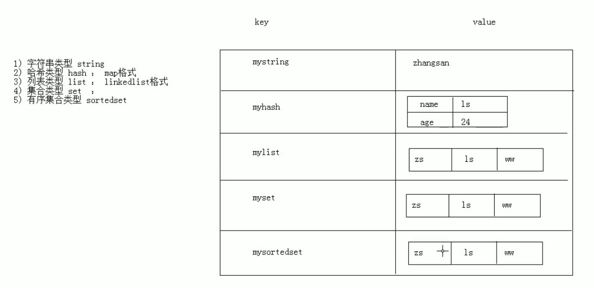
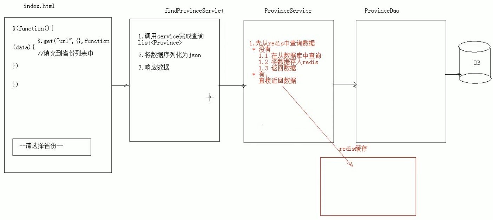

# 1. Redis

## 1.1. 基础

- 概念：redis时一款高性能的NOSQL系列的非关系型数据库
  > 推荐阅读：https://baijiahao.baidu.com/s?id=1644537541383564235&wfr=spider&for=pc
- 详细
  ```
  1.1.什么是NOSQL
			NoSQL(NoSQL = Not Only SQL)，意即“不仅仅是SQL”，是一项全新的数据库理念，泛指非关系型的数据库。
			随着互联网web2.0网站的兴起，传统的关系数据库在应付web2.0网站，特别是超大规模和高并发的SNS类型的web2.0纯动态网站已经显得力不从心，暴露了很多难以克服的问题，而非关系型的数据库则由于其本身的特点得到了非常迅速的发展。NoSQL数据库的产生就是为了解决大规模数据集合多重数据种类带来的挑战，尤其是大数据应用难题。

			1.1.1.	NOSQL和关系型数据库比较
				优点：
					1）成本：nosql数据库简单易部署，基本都是开源软件，不需要像使用oracle那样花费大量成本购买使用，相比关系型数据库价格便宜。
					2）查询速度：nosql数据库将数据存储于缓存之中，关系型数据库将数据存储在硬盘中，自然查询速度远不及nosql数据库。
					3）存储数据的格式：nosql的存储格式是key,value形式、文档形式、图片形式等等，所以可以存储基础类型以及对象或者是集合等各种格式，而数据库则只支持基础类型。
					4）扩展性：关系型数据库有类似join这样的多表查询机制的限制导致扩展很艰难。

				缺点：
					1）维护的工具和资料有限，因为nosql是属于新的技术，不能和关系型数据库10几年的技术同日而语。
					2）不提供对sql的支持，如果不支持sql这样的工业标准，将产生一定用户的学习和使用成本。
					3）有的不提供关系型数据库对事务的处理。
          4）并不安全，数据存储在内存中可能未来得及持久化导致丢失

			1.1.2.	非关系型数据库的优势：
				1）性能NOSQL是基于键值对的，可以想象成表中的主键和值的对应关系，而且不需要经过SQL层的解析，所以性能非常高。
				2）可扩展性同样也是因为基于键值对，数据之间没有耦合性，所以非常容易水平扩展。

			1.1.3.	关系型数据库的优势：
				1）复杂查询可以用SQL语句方便的在一个表以及多个表之间做非常复杂的数据查询。
				2）事务支持使得对于安全性能很高的数据访问要求得以实现。对于这两类数据库，对方的优势就是自己的弱势，反之亦然。

			1.1.4.	总结
				关系型数据库与NoSQL数据库并非对立而是互补的关系，即通常情况下使用关系型数据库，在适合使用NoSQL的时候使用NoSQL数据库，
				让NoSQL数据库对关系型数据库的不足进行弥补。
				一般会将数据存储在关系型数据库中，在nosql数据库中备份存储关系型数据库的数据

  1.2.主流的NOSQL产品
    •	键值(Key-Value)存储数据库
        相关产品： Tokyo Cabinet/Tyrant、Redis、Voldemort、Berkeley DB
        典型应用： 内容缓存，主要用于处理大量数据的高访问负载。 
        数据模型： 一系列键值对
        优势： 快速查询
        劣势： 存储的数据缺少结构化
    •	列存储数据库
        相关产品：Cassandra, HBase, Riak
        典型应用：分布式的文件系统
        数据模型：以列簇式存储，将同一列数据存在一起
        优势：查找速度快，可扩展性强，更容易进行分布式扩展
        劣势：功能相对局限
    •	文档型数据库
        相关产品：CouchDB、MongoDB
        典型应用：Web应用（与Key-Value类似，Value是结构化的）
        数据模型： 一系列键值对
        优势：数据结构要求不严格
        劣势： 查询性能不高，而且缺乏统一的查询语法
    •	图形(Graph)数据库
        相关数据库：Neo4J、InfoGrid、Infinite Graph
        典型应用：社交网络
        数据模型：图结构
        优势：利用图结构相关算法。
        劣势：需要对整个图做计算才能得出结果，不容易做分布式的集群方案。
  1.3 什么是Redis
    Redis是用C语言开发的一个开源的高性能键值对（key-value）数据库，官方提供测试数据，50个并发执行100000个请求,读的速度是110000次/s,写的速度是81000次/s ，且Redis通过提供多种键值数据类型来适应不同场景下的存储需求，目前为止Redis支持的键值数据类型如下：
      1) 字符串类型 string
      2) 哈希类型 hash
      3) 列表类型 list
      4) 集合类型 set
      5) 有序集合类型 sortedset
    1.3.1 redis的应用场景
      •	缓存（数据查询、短连接、新闻内容、商品内容等等）
      •	聊天室的在线好友列表
      •	任务队列。（秒杀、抢购、12306等等）
      •	应用排行榜
      •	网站访问统计
      •	数据过期处理（可以精确到毫秒
      •	分布式集群架构中的session分离
  ```

- 特点及原理：
  > 

- 下载安装
  - 解压直接可以使用（默认端口6379）
  - 文件
    - redis.windows.conf:配置文件
    - redis.cli.exe:redis客户端
    - redis.server.exe:redis服务端

- 数据结构
  > key-value形式，key都是字符串，value有5种不同的数据结构
  - 类型：
    - 字符串：string 重复时会进行覆盖
    - 哈希 hash
    - 列表 list 允许重复
    - 集合 set 不允许重复
    - 有序集合 sortedset 不允许重复，自动排序
  - 示例图 
    > 

## 1.2. 基本命令操作

> 更多请查询redis官方文档

- 字符串类型
  - 存储 set key value
  - 获取 get key
  - 删除 del key
    > set username zhangsan 
    > get username

- 哈希
  - hset key field value
  - hget key  field
  - hgetall key 获取所有hash表中的键值对
  - hdel key field
    > hset myhash username wangwu
    > hget myhash username
    > hgetall myhash

- 列表
  > 可以添加一个元素到列表的头部或者尾部
  - 添加
    - lpush key value:列表头部添加一个元素
      > 在Redis2.4版本以前， lpush 只接受单个 value 值。
    - rpush key value:列表尾部添加一个元素
  - 查询
    - lrange key start end:获取一定范围的元素
      > lrange mylist 0 -1：这样会获取所有元素
  - 删除
    - lpop key:删除列表最左边的元素，并将元素返回
    - rpop key:删除最右边的元素，并将元素返回
    
- hash 
  - 添加:sadd key value
    > 在Redis2.4版本以前， SADD 只接受单个value 值。
  - 查询：smembers key：获取set中所有元素
  - 删除：srem key value:删除set集合中value元素

- sortedset
  ```
  Redis 有序集合和集合一样也是string类型元素的集合,且不允许重复的成员。
  不同的是每个元素都会关联一个double类型的分数。redis正是通过分数来为集合中的成员进行从小到大的排序。
  有序集合的成员是唯一的,但分数(score)却可以重复。
  集合是通过哈希表实现的，所以添加，删除，查找的复杂度都是O(1)。 集合中最大的成员数为 232 - 1 (4294967295, 每个集合可存储40多亿个成员)。
  ```
  - 存储：zadd key score value
    > score的大小表示权的大小，权高的在后面
    > zadd mysortedset 80 zhangsan
  - 获取：zrange key start end
    > 依旧0,-1为所有元素
  - 删除：zrem key value
    > 删除key对应sortedset中的value值


- 通用
  - keys 正则表达式：查询key值
  - type key ：查询key对应value的类型
  - del key：删除指定的键值对。（会删除整个list，set，而不是删除里面的元素）

## 1.3. 持久化

- 概念：
  - redis是一个内存数据库，当redis服务器重启或者电脑重启，数据就会丢失。
  - 持久化可以保存内存中的数据到硬盘中
- 机制
  - RDB：默认方式，不需要就行配置，默认使用这种机制。在一定的间隔事件中检测key的变化，进行持久化数据。频率设置根据实际需要进行改动
    > 推荐
    - redis.windows.conf文件中可以配置
      ```
      #   after 900 sec (15 min) if at least 1 key changed
      save 900 1
      #   after 300 sec (5 min) if at least 10 keys changed
      save 300 10
      #   after 60 sec if at least 10000 keys changed
      save 60 10000
      ```
    - 存储在redis文件夹下的rdb后缀名的文件中
    - 以指定配置文件启动或重新启动redis服务器：
      > D:\learn\redis-2.8.9>redis-server.exe redis.windows.conf
  - AOF：在日志中，记录每一条命令的操作。每执行一条命令都会进行记录
    > 不推荐。默认关闭
    - 修改appendonly 的值为yes，开启AOF
    - 设置：
      ```
      //配置文件中默认为这样。注释掉两个，开启一个
      # appendfsync always：每一次操作都进行持久化
      appendfsync everysec：每隔一秒操作一次持久化
      # appendfsync no：每隔不进行持久化
      ```
    - 持久化文件存储在redis文件夹下后缀名为aof的文件中

## 1.4. Jedis

### 1.4.1. 基本

- 概念：java操作redis数据库的工具，类似于jdbc
- 快速开始：
  - 下载jar包
    - commoms-pool(连接池)
    - jedis
  - 导入使用
  - 关闭连接
    ```java
    public void test1(){
      //1.获取连接
      Jedis jedis = new Jedis ("localhost",6379) ;//也可以空参，默认为"localhost",6379
      //2.操作
      jedis.set("usernaml","zhangsan");
      //3.关闭连接
      jedis.close();
    }
    ```

### 1.4.2. 方法

> 名称和命令的名字相同

- 操作string
  - set
  - get
  - setex(key,second,value)指定时间后自动删除
    > 以后可以用来存激活码什么的
- 操作hash
  - hset
  - hget
  - hgetAll()返回`Map<String,String>`
- 操作list
  - lpush/lpop
  - rpush/lpop
- 操作set
  - sadd
  - smembers() 返回Set<String>
- 操作sortedset
  - zadd

### 1.4.3. 连接池

- 概念：类似jdbc连接池

- 使用：
  - 创建JedisPool连接池对象
    - 也有空参方法，为默认配置
    - 也可以传入 JedisPoolConfig对象,host,port 来创建对象
      > JedisPoolConfig对象可以设置最大连接数
  - 获取连接并使用
    - getResouce()
  - 归还到连接池中
    - Jedis.close()

- 详细配置：
  ```
  #最大活动对象数     
  redis.pool.maxTotal=1000    
  #最大能够保持idel状态的对象数      
  redis.pool.maxIdle=100  
  #最小能够保持闲置状态的对象数   
  redis.pool.minIdle=50    
  #当池内没有返回对象时，最大等待时间    
  redis.pool.maxWaitMillis=10000    
  #当调用borrow Object方法时，是否进行有效性检查    
  redis.pool.testOnBorrow=true    
  #当调用return Object方法时，是否进行有效性检查    
  redis.pool.testOnReturn=true  
  #“空闲链接”检测线程，检测的周期，毫秒数。如果为负值，表示不运行“检测线程”。默认为-1.  
  redis.pool.timeBetweenEvictionRunsMillis=30000  
  #向调用者输出“链接”对象时，是否检测它的空闲超时；  
  redis.pool.testWhileIdle=true  
  # 对于“空闲链接”检测线程而言，每次检测的链接资源的个数。默认为3.  
  redis.pool.numTestsPerEvictionRun=50  
  #redis服务器的IP    
  redis.ip=xxxxxx  
  #redis服务器的Port    
  redis1.port=6379   
  ```
- 通过配置文件进行获取连接池
  - 要通过自己读取一个一个设置，推荐写一个工具类，获取连接

### 1.4.4. 案例

- 需求：
  - 在index.html页面，页面中有一个省份下拉列表
  - 当页面加载完毕后，发送ajax请求，加载所有省份

- 流程：
  > 
  ```java  
  public class ProvinceServiceImpl implements ProvinceService {
      //声明dao
      private ProvinceDao dao = new ProvinceDaoImpl();

      @Override
      public List<Province> findAll() {
          return dao.findAll();
      }

      /**
          使用redis缓存
      */

      @Override
      public String findAllJson() {
          //1.先从redis中查询数据
          //1.1获取redis客户端连接
          Jedis jedis = JedisPoolUtils.getJedis();
          String province_json = jedis.get("province");//province键对应的是json字符串

          //2判断 province_json 数据是否为null
          if(province_json == null || province_json.length() == 0){
              //redis中没有数据
              System.out.println("redis中没数据，查询数据库...");
              //2.1从数据中查询
              List<Province> ps = dao.findAll();
              //2.2将list序列化为json
              ObjectMapper mapper = new ObjectMapper();
              try {
                  province_json = mapper.writeValueAsString(ps);
              } catch (JsonProcessingException e) {
                  e.printStackTrace();
              }

              //2.3 将json数据存入redis
              jedis.set("province",province_json);
              //归还连接
              jedis.close();
          }else{
              System.out.println("redis中有数据，查询缓存...");
          }
          return province_json;
      }
  }
  ```
- 注意：
  - 使用redis缓存不经常发生变化的数据。
  - 数据库中的数据发生改变时要更将redis数据删除后再次存入。否则数据不会更新
  - 通常在service中进行redis数据更新


# 2. 数据结构精讲

## 2.1. string

- 应用场景
  - 单值缓存
    - set
    - get
  - 对象缓存（对象转为json）
    - set
    - mset
  - 分布式锁
    - setnx
  - 计数器(记录文章阅读次数)
    - INCR
    - GET

## 2.2. hash

## 2.3. list

## 2.4. set

## 2.5. zset
