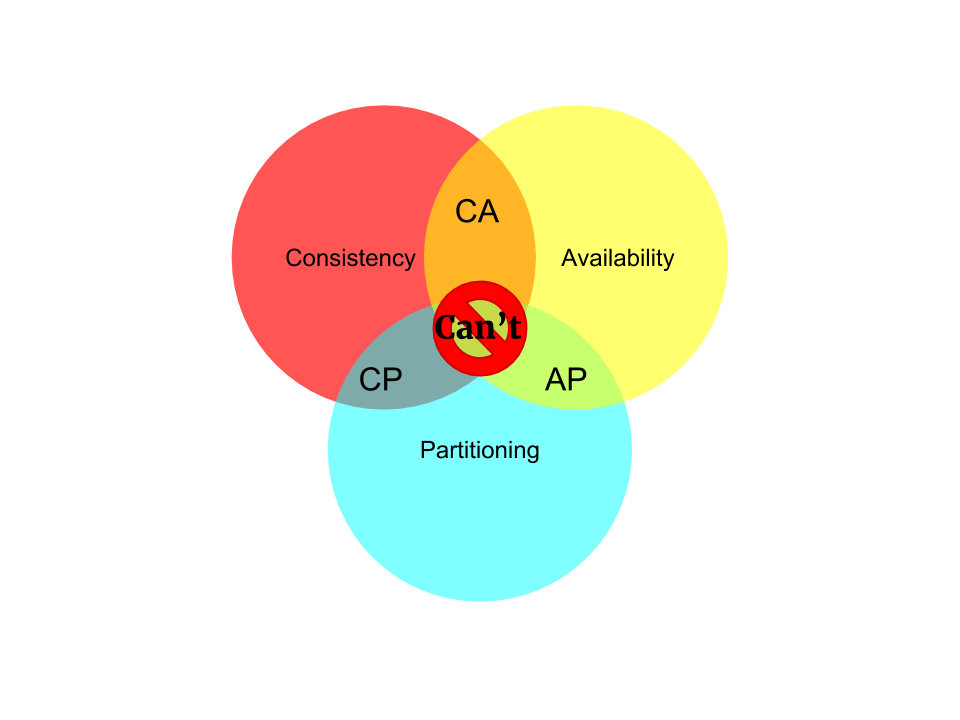

# 基础理论

## 分布式

## 分布式和集群

简单说，分布式是以缩短单个任务的执行时间来提升效率的，而集群则是通过提高单位时间内执行的任务数来提升效率。

- 区别与联系：
  - 业务分布
    - 分布式是指将不同的业务分布在不同的地方
    - 而集群指的是将几台服务器集中在一起，实现同一业务。
  - 包含关系/联系
    - 分布式中的每一个节点，都可以做集群
    - 而集群并不一定就是分布式的。 
  - 容错性
    - 分布式，从窄意上理解，也跟集群差不多， 但是它的组织比较松散，不像集群，有一个组织性，一台服务器垮了，其它的服务器可以顶上来。
    - 分布式的每一个节点，都完成不同的业务，一个节点垮了，那这个业务就不可访问了。

- 示例：秒杀系统
  - 集群

    
  - 分布式

    

- 加机器就是分布式吗？
  - 加机器更加适用于构建集群，因为它真是只有加机器。
  - 而对于分布式来说，你首先需要将业务进行拆分，然后再加机器（不仅仅是加机器那么简单），同时你还要去解决分布式带来的一系列问题。

## 微服务

- 概念：
  - 微服务化的核心就是将传统的一站式应用，根据业务拆分成一个一个的服务，彻底地去耦合
  - 每一个微服务提供单个业务功能的服务，一个服务做一件事
  - 从技术角度看就是一种小而独立的处理过程
  - 类似进程概念，能够自行单独启动或销毁

- 优点：
  - 针对特定服务发布，影响小，风险小，成本低
  - 频繁发布版本，快速交付需求
  - 低成本扩容，弹性伸缩，适应云环境
- 缺点/问题
  - 分布式系统的复杂性
    > 包括服务间的依赖，服务如何拆封，内部接口规范，数据传递等等问题
  - 部署，测试和监控的成本问题
    > 分布式系统，部署，测试和监控都需要大量的中间件来支撑，而且中间件本身也要维护，原先单体应用很简单的事务问题 ，转到分布式环境就变得很复杂
  - 分布式事务和CAP的相关问题

- 技术栈

  

  
展开

  | 微服务条目                             | 落地技术                                                        |
  | -------------------------------------- | --------------------------------------------------------------- |
  | 服务开发                               | Springboot、Spring、SpringMVC                                   |
  | 服务配置与管理                         | Netflix 公司的 Archaius、阿里的 Diamond 等                      |
  | 服务注册与发现                         | Eureka、Consul、Zookeeper 等                                    |
  | 服务调用                               | Rest、RPC、gRPC                                                 |
  | 服务熔断器                             | Hystrix、Envoy 等                                               |
  | 负载均衡                               | Ribbon、Nginx 等                                                |
  | 服务接口调用(客户端调用服务的简化工具) | Feign 等                                                        |
  | 消息队列                               | Kafka、RabbitMQ、ActiveMQ 等                                    |
  | 服务配置中心管理                       | SpringCloudConfig、Chef 等                                      |
  | 服务路由（API 网关）                   | Zuul 等                                                         |
  | 服务监控                               | Zabbix、Nagios、Metrics、Spectator 等                           |
  | 全链路追踪                             | Zipkin，Brave、Dapper 等                                        |
  | 服务部署                               | Docker、OpenStack、Kubernetes 等                                |
  | 数据流操作开发包                       | SpringCloud Stream（封装与 Redis,Rabbit、Kafka 等发送接收消息） |
  | 事件消息总线                           | Spring Cloud Bus                                                |

  

# 分布式理论

## 幂等

幂等性是数学上的含义是对于参数 x，f(x)=f(f(x));比如绝对值函数。 在分布式环境下表示的是对于同样的请求，在一次或者多次请求的情况下对系统的使用资源是一样的。保证失败重试不会导致提交两次。 

- 方法： 
  - 带版本号的方式；
  - 采用数据库唯一索引方式；

## CAP

### 基本概念

#### 一致性

在分布式环境中，一致性是指数据在多个节点之间能够保持一致的特性。如果在某个节点上执行变更操作后，用户可以立即从其他任意节点上读取到变更后的数据，那么就认为这样的系统具备强一致性。

#### 可用性

可以性是指系统提供的服务必须一直处于可用状态，对于用户的每一个操作请求总是能够在有限的时间内返回结果。它主要强调以下两点：

- **有限的时间内**：对于用户的一个请求操作，系统必须要在指定的时间内返回处理结果，如果超过这个时间，那么系统就被认为是不可用的。
- **返回结果**：不论成功或者失败，都需要明确地返回响应结果。

#### 分区容错性

分区容错性指定是分布式系统在遇到网络分区时，仍需要能够对外提供一致性和可用性的服务，除非是整个网络环境都发生了故障。

这里的网络分区指的是：在分布式系统中，由于不同的节点会分布在不同子网中（不同机房或异地网络等），由于一些特殊的原因，可能会出现子网内部是正常的，但子网彼此之间却无法正常通信，从而导致整个系统的网络被切分成若干个独立的区域，这就是网络分区。

### CAP 理论

CAP 理论强调：一个分布式系统不可能同时满足一致性（C：Consistency）、可用性（A：Availability）和分区容错性（P：Partition tolerance）这三个需求，最多只能同时满足其中的两个。这里我们来进行一下解释说明：

首先对于一个分布式系统而言，网络分区是不可避免的，不可能永远不出现网络故障，所以分区容错性 P 必须要保证。假设一个分布式系统中出现了网络分区，如下：

假设用户 1 向节点 1 上增加了 10 个数据，但节点 1 和节点 2 之间因为网络分区而无法进行数据同步，碰巧用户 2 此时发起了查询请求，此时有两种处理方案：

- **放弃 A，保证 C**：即对于用户 2 的查询返回失败，直至节点 1 上的数据同步至节点 2，两者的数据都变为 60 为止；
- **放弃 C，保证 A**：对于本次的查询直接返回原来的数据 50，此时放弃了一致性，但保证了可用性。待网络恢复后，仍然需要将节点 1 上的数据同步至节点 2。

可以看到无论如何，都是无法既保证 A ，又保证 C 的。

### 选择策略

因为 CAP 理论不能将一致性、可用性和分区容错性都满足，所以需要根据不同系统的特性进行取舍，主要分为以下三种情况：

- **保证 AC ，放弃 P**：这种情况下可以将所有数据（或者是与事务相关的数据）都放在一个分布式节点上，这样可以避免网络分区带来的影响，但同时也意味着放弃了系统的可扩展性，如单机版本的 MySQL、Oracle 等。
- **保证 CP ，放弃 A**：这种情况下如果发生了网络分区故障，此时节点间的数据就无法同步。因此在故障修复前都需要放弃对外提供服务，直至网络恢复，数据到达一致为止。
- **保证 AP ，放弃 C**：这种情况相当于放弃一致性。具体而言，是放弃数据的强一致性，但保证数据的最终一致性。因为不论是什么系统，数据最终都需要保持一致，否则整个系统就无法使用。在这种策略下，在某个短暂的时间窗口内会存在数据不一致的情况。

### 注意点

- CAP原理是对**分布式数据存储系统**的一个定论
  - 比如我们一个分布式系统各个节点都读写同一个mysql实例，那么对于这个分布式系统来说，讨论CAP原理是没有意义的
  - 因为各个节点之间可以不用因为数据复制而进行通信，满足分区容忍性（P），可以随时响应请求，满足可用性（A），同时因为访问的是一个数据库实例，本身已经保证了数据一致性（C）。
  - 因此，**在讨论CAP原理的时候，更多的是针对那些有数据存储、数据复制场景的分布式存储系统，也就是我们熟悉的NoSql数据库。**
    > 由于我们大多数人都不会去设计一款新的NoSql数据库来使用，更多的是使用现成的NoSql开源系统进行数据的存储，比如Hbase、MongoDB、Cassandra等。所以大多数时候，其实我们都用不上CAP原理。

- **保证了其中2点后，不是就要完全抛弃另外一点。只是相对的要做一些牺牲**
  - 比如在保证CP的情况下，虽然没办法保证高可用性，但这不意味着可用性为0
  - 我们可以通过合理的设计尽量的提高可用性，让可用性尽可能的接近100%。
  - 同理，在AP的情况下，也可以尽量的保证数据的一致性，或者实现弱一致性，即最终一致性。

## BASE

### 基本说明

BASE是对基本可用（Basically Available）、软状态（ Soft State）、最终一致性（ Eventually Consistent）三个短语的简写，它是对 CAP 理论中 AP 策略的延伸。其核心是即便无法做到强一致性，但每个系统应用都应该根据自身业务的特点，采取适当的方式来保证系统的最终一致性，而具体的方案就体现在这三个短语上：

### 基本可用

基本可用是指分布式系统在出现不可预知的故障时，允许损失部分可用性，例如：

- 延长响应时间：比如原来的的查询只需要 0.5 秒，现在延长到 1～ 2 秒；
- 服务降级：比如在商品秒杀时，部分用户会被引导到一个降级页面。

### 软状态

软状态也称为弱状态，是指允许系统中的数据存在中间状态，并认为该中间状态的存在不会影响系统整体的可用性，即允许不同节点间的数据同步存在延时。

### 最终一致性

最终一致性强调的是系统中所有的数据副本，在经过一段时间的同步后，最终需要达到一致的状态。

## RPC

# 强一致性算法

## 一致性问题

## 2PC(两阶段提交)

## 3PC(三阶段提交)

## paxos

## raft

# 分布式锁

## Msyql实现

## Redis实现

## Zookeeper实现

# 分布式事务

# 常见问题

