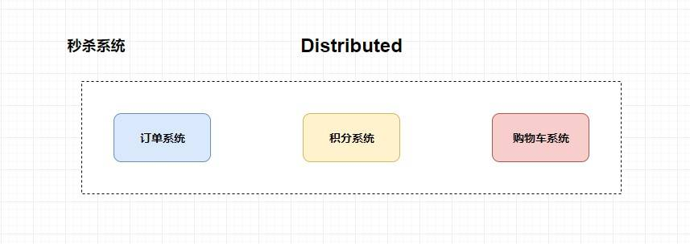
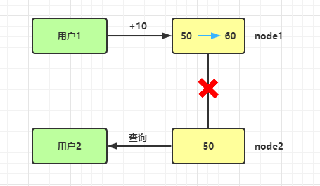
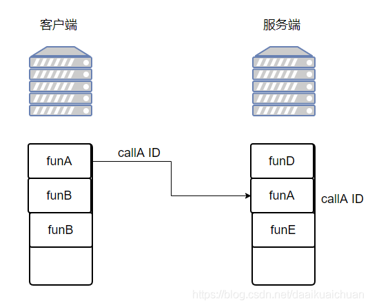

# 基础理论

## 分布式

## 分布式和集群

简单说，分布式是以缩短单个任务的执行时间来提升效率的，而集群则是通过提高单位时间内执行的任务数来提升效率。

- 区别与联系：
  - 业务分布
    - 分布式是指将不同的业务分布在不同的地方
    - 而集群指的是将几台服务器集中在一起，实现同一业务。
  - 包含关系/联系
    - 分布式中的每一个节点，都可以做集群
    - 而集群并不一定就是分布式的。 
  - 容错性
    - 分布式，从窄意上理解，也跟集群差不多， 但是它的组织比较松散，不像集群，有一个组织性，一台服务器垮了，其它的服务器可以顶上来。
    - 分布式的每一个节点，都完成不同的业务，一个节点垮了，那这个业务就不可访问了。

- 示例：秒杀系统
  - 集群

    
  - 分布式

    

- 加机器就是分布式吗？
  - 加机器更加适用于构建集群，因为它真是只有加机器。
  - 而对于分布式来说，你首先需要将业务进行拆分，然后再加机器（不仅仅是加机器那么简单），同时你还要去解决分布式带来的一系列问题。

## 微服务

- 概念：
  - 微服务化的核心就是将传统的一站式应用，根据业务拆分成一个一个的服务，彻底地去耦合
  - 每一个微服务提供单个业务功能的服务，一个服务做一件事
  - 从技术角度看就是一种小而独立的处理过程
  - 类似进程概念，能够自行单独启动或销毁

- 优点：
  - 针对特定服务发布，影响小，风险小，成本低
  - 频繁发布版本，快速交付需求
  - 低成本扩容，弹性伸缩，适应云环境
- 缺点/问题
  - 分布式系统的复杂性
    > 包括服务间的依赖，服务如何拆封，内部接口规范，数据传递等等问题
  - 部署，测试和监控的成本问题
    > 分布式系统，部署，测试和监控都需要大量的中间件来支撑，而且中间件本身也要维护，原先单体应用很简单的事务问题 ，转到分布式环境就变得很复杂
  - 分布式事务和CAP的相关问题

- 技术栈

  

  
展开

  | 微服务条目                             | 落地技术                                                        |
  | -------------------------------------- | --------------------------------------------------------------- |
  | 服务开发                               | Springboot、Spring、SpringMVC                                   |
  | 服务配置与管理                         | Netflix 公司的 Archaius、阿里的 Diamond 等                      |
  | 服务注册与发现                         | Eureka、Consul、Zookeeper 等                                    |
  | 服务调用                               | Rest、RPC、gRPC                                                 |
  | 服务熔断器                             | Hystrix、Envoy 等                                               |
  | 负载均衡                               | Ribbon、Nginx 等                                                |
  | 服务接口调用(客户端调用服务的简化工具) | Feign 等                                                        |
  | 消息队列                               | Kafka、RabbitMQ、ActiveMQ 等                                    |
  | 服务配置中心管理                       | SpringCloudConfig、Chef 等                                      |
  | 服务路由（API 网关）                   | Zuul 等                                                         |
  | 服务监控                               | Zabbix、Nagios、Metrics、Spectator 等                           |
  | 全链路追踪                             | Zipkin，Brave、Dapper 等                                        |
  | 服务部署                               | Docker、OpenStack、Kubernetes 等                                |
  | 数据流操作开发包                       | SpringCloud Stream（封装与 Redis,Rabbit、Kafka 等发送接收消息） |
  | 事件消息总线                           | Spring Cloud Bus                                                |

  

# 分布式理论

## 幂等

幂等性是数学上的含义是对于参数 x，f(x)=f(f(x));比如绝对值函数。 在分布式环境下表示的是对于同样的请求，在一次或者多次请求的情况下对系统的使用资源是一样的。保证失败重试不会导致提交两次。 

- 方法： 
  - 带版本号的方式；
  - 采用数据库唯一索引方式；

## CAP

### 基本概念

#### 一致性

在分布式环境中，一致性是指数据在多个节点之间能够保持一致的特性。如果在某个节点上执行变更操作后，用户可以立即从其他任意节点上读取到变更后的数据，那么就认为这样的系统具备强一致性。

#### 可用性

可以性是指系统提供的服务必须一直处于可用状态，对于用户的每一个操作请求总是能够在有限的时间内返回结果。它主要强调以下两点：

- **有限的时间内**：对于用户的一个请求操作，系统必须要在指定的时间内返回处理结果，如果超过这个时间，那么系统就被认为是不可用的。
- **返回结果**：不论成功或者失败，都需要明确地返回响应结果。

#### 分区容错性

分区容错性指定是分布式系统在遇到网络分区时，仍需要能够对外提供一致性和可用性的服务，除非是整个网络环境都发生了故障。

这里的网络分区指的是：在分布式系统中，由于不同的节点会分布在不同子网中（不同机房或异地网络等），由于一些特殊的原因，可能会出现子网内部是正常的，但子网彼此之间却无法正常通信，从而导致整个系统的网络被切分成若干个独立的区域，这就是网络分区。

### CAP 理论

CAP 理论强调：一个分布式系统不可能同时满足一致性（C：Consistency）、可用性（A：Availability）和分区容错性（P：Partition tolerance）这三个需求，最多只能同时满足其中的两个。这里我们来进行一下解释说明：

首先对于一个分布式系统而言，网络分区是不可避免的，不可能永远不出现网络故障，所以分区容错性 P 必须要保证。假设一个分布式系统中出现了网络分区，如下：

假设用户 1 向节点 1 上增加了 10 个数据，但节点 1 和节点 2 之间因为网络分区而无法进行数据同步，碰巧用户 2 此时发起了查询请求，此时有两种处理方案：

- **放弃 A，保证 C**：即对于用户 2 的查询返回失败，直至节点 1 上的数据同步至节点 2，两者的数据都变为 60 为止；
- **放弃 C，保证 A**：对于本次的查询直接返回原来的数据 50，此时放弃了一致性，但保证了可用性。待网络恢复后，仍然需要将节点 1 上的数据同步至节点 2。

可以看到无论如何，都是无法既保证 A ，又保证 C 的。

### 选择策略

因为 CAP 理论不能将一致性、可用性和分区容错性都满足，所以需要根据不同系统的特性进行取舍，主要分为以下三种情况：

- **保证 AC ，放弃 P**：这种情况下可以将所有数据（或者是与事务相关的数据）都放在一个分布式节点上，这样可以避免网络分区带来的影响，但同时也意味着放弃了系统的可扩展性，如单机版本的 MySQL、Oracle 等。
- **保证 CP ，放弃 A**：这种情况下如果发生了网络分区故障，此时节点间的数据就无法同步。因此在故障修复前都需要放弃对外提供服务，直至网络恢复，数据到达一致为止。
- **保证 AP ，放弃 C**：这种情况相当于放弃一致性。具体而言，是放弃数据的强一致性，但保证数据的最终一致性。因为不论是什么系统，数据最终都需要保持一致，否则整个系统就无法使用。在这种策略下，在某个短暂的时间窗口内会存在数据不一致的情况。

### 注意点

- CAP原理是对**分布式数据存储系统**的一个定论
  - 比如我们一个分布式系统各个节点都读写同一个mysql实例，那么对于这个分布式系统来说，讨论CAP原理是没有意义的
  - 因为各个节点之间可以不用因为数据复制而进行通信，满足分区容忍性（P），可以随时响应请求，满足可用性（A），同时因为访问的是一个数据库实例，本身已经保证了数据一致性（C）。
  - 因此，**在讨论CAP原理的时候，更多的是针对那些有数据存储、数据复制场景的分布式存储系统，也就是我们熟悉的NoSql数据库。**
    > 由于我们大多数人都不会去设计一款新的NoSql数据库来使用，更多的是使用现成的NoSql开源系统进行数据的存储，比如Hbase、MongoDB、Cassandra等。所以大多数时候，其实我们都用不上CAP原理。

- **保证了其中2点后，不是就要完全抛弃另外一点。只是相对的要做一些牺牲**
  - 比如在保证CP的情况下，虽然没办法保证高可用性，但这不意味着可用性为0
  - 我们可以通过合理的设计尽量的提高可用性，让可用性尽可能的接近100%。
  - 同理，在AP的情况下，也可以尽量的保证数据的一致性，或者实现弱一致性，即最终一致性。

## BASE

### 基本说明

BASE是对基本可用（Basically Available）、软状态（ Soft State）、最终一致性（ Eventually Consistent）三个短语的简写，它是对 CAP 理论中 AP 策略的延伸。其核心是即便无法做到强一致性，但每个系统应用都应该根据自身业务的特点，采取适当的方式来保证系统的最终一致性，而具体的方案就体现在这三个短语上：

### 基本可用

基本可用是指分布式系统在出现不可预知的故障时，允许损失部分可用性，例如：

- 延长响应时间：比如原来的的查询只需要 0.5 秒，现在延长到 1～ 2 秒；
- 服务降级：比如在商品秒杀时，部分用户会被引导到一个降级页面。

### 软状态

软状态也称为弱状态，是指允许系统中的数据存在中间状态，并认为该中间状态的存在不会影响系统整体的可用性，即允许不同节点间的数据同步存在延时。

### 最终一致性

最终一致性强调的是系统中所有的数据副本，在经过一段时间的同步后，最终需要达到一致的状态。

# 通信设计

## RPC

### 说明

- 简单说明：**RPC（Remote Procedure Call）**
  - 即远程过程调用，关注的是**远程调用**而非本地调用。
    > 也就是说两台服务器A，B，一个应用部署在A服务器上，想要调用B服务器上应用提供的函数/方法，
  - 由于不在一个内存空间，不能直接调用，需要通过网络来表达调用的语义和传达调用的数据。

- 目的/作用：
  - **RPC 的出现就是为了让你调用远程方法像调用本地方法一样简单。**
  - 屏蔽了底层网络编程的具体细节。

- 使用场景
  - 由于 RPC 固有的消耗相对本地调用高出几个数量级，本地调用的固有消耗是纳秒级，而 RPC 的固有消耗是在毫秒级。 
  - 那么对于**过于轻量的计算任务就并不合适导出远程接口由独立的进程提供服务**
  - 只有**花在计算任务上时间远远高于 RPC 的固有消耗才值得导出为远程接口提供服务**。

### 原理

- 服务消费方（client）调用以本地调用方式调用服务；
- client stub接收到调用后负责将方法、参数等组装成能够进行网络传输的消息体；
- client stub找到服务地址，并将消息发送到服务端；
- server stub收到消息后进行解码；
- server stub根据解码结果调用本地的服务；
- 本地服务执行并将结果返回给server stub；
- server stub将返回结果打包成消息并发送至消费方；
- client stub接收到消息，并进行解码；
- 服务消费方得到最终结果。

### RPC主要考虑的问题

#### Call ID映射

- 说明
  - 在本地调用中，函数体是直接通过方法指针来指定的
  - 再远程调用中，两个进程的地址空间是不同的，无法使用方法指针
  - 因此需要其他方法来指定远程方法

- 要求
  - 在RPC中，**所有的函数都必须有自己的一个ID**。
  - 这个ID在所有进程中都是**唯一确定**的。
  - 客户端在做远程过程调用时，必须附上这个ID。
  - 然后我们还需要在客户端和服务端分别维护一个 {函数 <–> Call ID} 的对应表。
  - 两者的表不一定需要完全相同，但相同的函数对应的Call ID必须相同。

- 基本流程
  - 当客户端需要进行远程调用时，它就查一下这个表，找出相应的Call ID，然后把它传给服务端
  - 服务端也通过查表，来确定客户端需要调用的函数，然后执行相应函数的代码。

  

#### 网络传输/协议

- 说明
  - 远程调用往往用在网络上，客户端和服务端是通过网络连接的
  - 所有的数据都需要通过网络传输，因此就需要有一个网络传输层。

- 要求：
  - 网络传输层需要把Call ID和序列化后的参数字节流传给服务端，然后再把序列化后的调用结果传回客户端。
  - 只要能完成这两者的，都可以作为传输层使用。
  - 因此，它所**使用的协议其实是不限**的，能完成传输就行
  - 尽管大部分RPC框架都使用TCP协议，但其实UDP也可以，而gRPC干脆就用了HTTP2。

问题：既有 HTTP ,为啥用 RPC 进行服务调用

- RPC 只是一种概念、一种设计，就是为了解决 不同服务之间的调用问题, 它一般会包含有 **传输协议** 和 **序列化协议** 这两个。
- 但是，HTTP 是一种协议，RPC框架可以使用 **HTTP协议作为传输协议**或者**直接使用TCP作为传输协议**，使用不同的协议一般也是为了适应不同的场景。

#### 序列化问题/协议

- 说明
  - 在本地调用中，我们只需要把参数压到栈里，然后让函数自己去栈里读就行。
  - 但是在远程过程调用时，客户端跟服务端是不同的进程，不能通过内存来传递参数
    > 甚至有时候客户端和服务端使用的都不是同一种语言（比如服务端用C++，客户端用Java或者Python）。
  - 因此需要通过网络传输的方式把数据发送过去。数据以什么格式传输，就涉及到了序列化，反序列化

- 要求
  - 客户端把参数先转成一个字节流（编码），传给服务端
  - 服务端再把字节流转成自己能读取的格式（解码）
  - 这个过程叫**序列化和反序列化**
  - 同理，从服务端返回的值也需要序列化反序列化的过程。

- 为什么需要序列化？
  - 1.转换为字节流方便进行网络传输。
  - 2.实现跨平台、跨语言；

- 常见序列化方式
  - XML（Extensible Markup Language）是一种常用的序列化和反序列化协议，具有跨机器，跨语言等优点。狭义web service就是基于SOAP消息传递协议（一个基于XML的可扩展消息信封格式）来进行数据交换的。
  - Hessian是一个动态类型，简洁的，可以移植到各个语言的二进制序列化对象协议。采用简单的结构化标记、采用定长的字节记录值、采用引用取代重复遇到的对象。
  - JSON（Javascript Object Notation）起源于弱类型语言Javascript， 是采用"Attribute－value"的方式来描述对象协议。与XML相比，其协议比较简单，解析速度比较快。
  - Protocol Buffers 是google提供的一个开源序列化框架，是一种轻便高效的结构化数据存储格式，可以用于结构化数据串行化，或者说序列化。它很适合做数据存储或 RPC 数据交换格式。可用于通讯协议、数据存储等领域的语言无关、平台无关、可扩展的序列化结构数据格式。同 XML 相比， Protobuf 的主要优点在于性能高。它以高效的二进制方式存储，比 XML 小 3 到 10 倍，快 20 到 100 倍。
  - Thrift 既是rpc框架，同时也具有自己内部定义的传输协议规范(TProtocol)和传输数据标准(TTransports)，通过IDL脚本对传输数据的数据结构(struct) 和传输数据的业务逻辑(service)根据不同的运行环境快速的构建相应的代码，并且通过自己内部的序列化机制对传输的数据进行简化和压缩提高高并发、 大型系统中数据交互的成本。

### 常见RPC框架

- **RMI（JDK自带）：** JDK自带的RPC，有很多局限性，不推荐使用。

  

  
说明

  
  

  - stub(桩)：
    - stub实际上就是远程过程在客户端上面的一个代理proxy。
    - 当我们的客户端代码调用API接口提供的方法的时候，RMI生成的stub代码块会将请求数据序列化，交给远程服务端处理，
    - 然后将结果反序列化之后返回给客户端的代码。
    - 这些处理过程，对于客户端来说，基本是透明无感知的。
  - remote：
    - 这层就是底层网络处理了，RMI对用户来说，屏蔽了这层细节
    - stub通过remote来和远程服务端进行通信。
  - skeleton(骨架)：
    - 和stub相似，skeleton则是服务端生成的一个代理proxy。
    - 当客户端通过stub发送请求到服务端，则交给skeleton来处理，其会根据指定的服务方法来反序列化请求，然后调用具体方法执行
    - 最后将结果返回给客户端。
  - registry(服务发现)：
    - 借助JNDI发布并调用了rmi服务。
    - 实际上，JNDI就是一个注册表，服务端将服务对象放入到注册表中，客户端从注册表中获取服务对象。
    - rmi服务，在服务端实现之后需要注册到rmi server上，然后客户端从指定的rmi地址上lookup服务，调用该服务对应的方法即可完成远程方法调用。
    - registry是个很重要的功能，当服务端开发完服务之后，要对外暴露，如果没有服务注册，则客户端是无从调用的，即使服务端的服务就在那里。

  

- **Dubbo:** Dubbo是 阿里巴巴公司开源的一个高性能优秀的服务框架，使得应用可通过高性能的 RPC 实现服务的输出和输入功能，可以和 Spring框架无缝集成。目前 Dubbo 已经成为 Spring Cloud Alibaba 中的官方组件。
- **gRPC** ：gRPC是可以在任何环境中运行的现代开源高性能RPC框架。它可以通过可插拔的支持来有效地连接数据中心内和跨数据中心的服务，以实现负载平衡，跟踪，运行状况检查和身份验证。它也适用于分布式计算的最后一英里，以将设备，移动应用程序和浏览器连接到后端服务。
- **Hessian：** Hessian是一个轻量级的remotingonhttp工具，使用简单的方法提供了RMI的功能。 相比WebService，Hessian更简单、快捷。采用的是二进制RPC协议，因为采用的是二进制协议，所以它很适合于发送二进制数据。
- **Thrift：** Apache Thrift是Facebook开源的跨语言的RPC通信框架，目前已经捐献给Apache基金会管理，由于其跨语言特性和出色的性能，在很多互联网公司得到应用，有能力的公司甚至会基于thrift研发一套分布式服务框架，增加诸如服务注册、服务发现等功能。

### 异常处理

- 本地调用和 RPC 调用的一些差异：
  - 本地调用一定会执行，而远程调用则不一定，调用消息可能因为网络原因并未发送到服务方。
  - 本地调用只会抛出接口声明的异常，而远程调用还会跑出 RPC 框架运行时的其他异常。
  - 本地调用和远程调用的性能可能差距很大，这取决于 RPC 固有消耗所占的比重。

- 异常分析：
> 正是上面那些区别决定了使用 RPC 时需要更多考量
 - 当调用远程接口抛出异常时，异常可能是一个**业务异常**， 也可能是 RPC 框架抛出的**运行时异常**（如：网络中断等）。
 - 业务异常：表明服务方已经执行了调用，可能因为某些原因导致未能正常执行，
 - RPC 运行时异常：则有可能服务方根本没有执行

对调用方而言的异常处理策略自然需要区分。

### rpc框架设计思路

- 最最基本的设计思路
  - 上来你的服务就得去注册中心注册吧，你是不是得有个注册中心，保留各个服务的信息，可以用 zookeeper 来做，对吧。
  - 然后你的消费者需要去注册中心拿对应的服务信息吧，对吧，而且每个服务可能会存在于多台机器上。
  - 接着你就该发起一次请求了，咋发起？当然是基于动态代理了，你面向接口获取到一个动态代理，这个动态代理就是接口在本地的一个代理，然后这个代理会找到服务对应的机器地址。
  - 然后找哪个机器发送请求？那肯定得有个负载均衡算法了，比如最简单的可以随机轮询是不是。
  - 接着找到一台机器，就可以跟它发送请求了，第一个问题咋发送？你可以说用 netty 了，nio 方式；第二个问题发送啥格式数据？你可以说用 hessian 序列化协议了，或者是别的，对吧。然后请求过去了。
  - 服务器那边一样的，需要针对你自己的服务生成一个动态代理，监听某个网络端口了，然后代理你本地的服务代码。接收到请求的时候，就调用对应的服务代码，对吧。

- 三个问题：
  - Call ID映射可以直接使用函数字符串，也可以使用整数ID。映射表一般就是一个哈希表。
  - 序列化反序列化可以自己写，也可以使用Protobuf或者FlatBuffers之类的。
  - 网络传输库可以自己写socket，或者用asio，ZeroMQ，Netty之类。

## RESTful

待做

<!--file:///D:/learn/githubRepo/JavaGuide/docs/system-design/coding-way/RESTfulAPI%E7%AE%80%E6%98%8E%E6%95%99%E7%A8%8B.md-->

# 分布式事务算法

## 一致性问题

## 2PC(两阶段提交)

## 3PC(三阶段提交)

## paxos

## raft

# 分布式锁

## Msyql实现

## Redis实现

[实现](../database/redis.md)

## Zookeeper实现

[实现](./zookeeper.md)

## 锁的比较

- Redis分布式锁
  - 说明
    - 它获取锁的方式简单粗暴，获取不到锁直接不断尝试获取锁，比较消耗性能。
  - 缺点
    - 另外来说的话，Redis 的设计定位决定了它的数据并不是强一致性的，在某些极端情况下，可能会出现问题。锁的模型不够健壮。（比如哨兵模式下，Master宕机，可能出现两个客户端获得锁）
    - Redis 分布式锁，其实需要自己不断去尝试获取锁，比较消耗性能。
  - 使用情况
    - 但是另一方面使用 Redis 实现分布式锁在很多企业中非常常见，而且大部分情况下都不会遇到所谓的“极端复杂场景”。
    - 所以使用 Redis 作为分布式锁也不失为一种好的方案，最重要的一点是 Redis 的性能很高，可以支撑高并发的获取、释放锁操作。

- ZK 分布式锁:
  - 说明
    - ZK 天生设计定位就是分布式协调，强一致性。锁的模型健壮、简单易用、适合做分布式锁。
    - 如果获取不到锁，只需要添加一个监听器就可以了，不用一直轮询，性能消耗较小。
  - 缺点
    - 如果有较多的客户端频繁的申请加锁、释放锁，对于 ZK 集群的压力会比较大。

- 一些建议
  - 如果公司里面有 ZK 集群条件，优先选用 ZK 实现
  - 但是如果说公司里面只有 Redis 集群，没有条件搭建 ZK 集群。 那么其实用 Redis 来实现也可以
  - 另外还可能是系统设计者考虑到了系统已经有 Redis，但是又不希望再次引入一些外部依赖的情况下，可以选用 Redis。这个是要系统设计者基于架构来考虑了。

# 分布式id

详见：[Mysql笔记](../database/mysql.md)

# 高可用

## 集群

## 负载均衡算法

- 1、轮询法
  - 将请求按顺序轮流地分配到后端服务器上，它均衡地对待后端的每一台服务器
  - 不关心服务器实际的连接数和当前的系统负载。
- 2、随机法
  - 通过系统的随机算法，根据后端服务器的列表大小值来随机选取其中的一台服务器进行访问。
  - 由概率统计理论可以得知，随着客户端调用服务端的次数增多，
  - 其实际效果越来越接近于平均分配调用量到后端的每一台服务器，也就是轮询的结果。
- 3、源地址哈希法
  - 源地址哈希的思想是根据获取客户端的IP地址，通过哈希函数计算得到的一个数值，
  - 用该数值对服务器列表的大小进行取模运算，得到的结果便是客服端要访问服务器的序号。
  - 采用源地址哈希法进行负载均衡，同一IP地址的客户端，当后端服务器列表不变时，它每次都会映射到同一台后端服务器进行访问。
- 4、加权轮询法
  - 不同的后端服务器可能机器的配置和当前系统的负载并不相同，因此它们的抗压能力也不相同。
  - 加权轮询能很好地处理这一问题，并将请求顺序且按照权重分配到后端。
    - 给配置高、负载低的机器配置更高的权重，让其处理更多的请；
    - 而配置低、负载高的机器，给其分配较低的权重，降低其系统负载
- 5、加权随机法
  - 与加权轮询法一样，加权随机法也根据后端机器的配置，系统的负载分配不同的权重
  - 不同的是，它是按照权重随机请求后端服务器，而非顺序。
- 6、最小连接数法
  - 最小连接数算法比较灵活和智能，由于后端服务器的配置不尽相同，对于请求的处理有快有慢，
  - 它是根据后端服务器当前的连接情况，动态地选取其中当前积压连接数最少的一台服务器来处理当前的请求
  - 尽可能地提高后端服务的利用效率，将负责合理地分流到每一台服务器。

## 限流算法

待做

<!--file:///D:/learn/githubRepo/JavaGuide/docs/system-design/high-availability/limit-request.md-->

### 固定窗口计数器算法

### 滑动窗口计数器算法

### 漏桶算法

### 令牌桶算法

## 超时和重试机制

## 熔断机制

## 异步调用

## 使用缓存

# 常见问题

