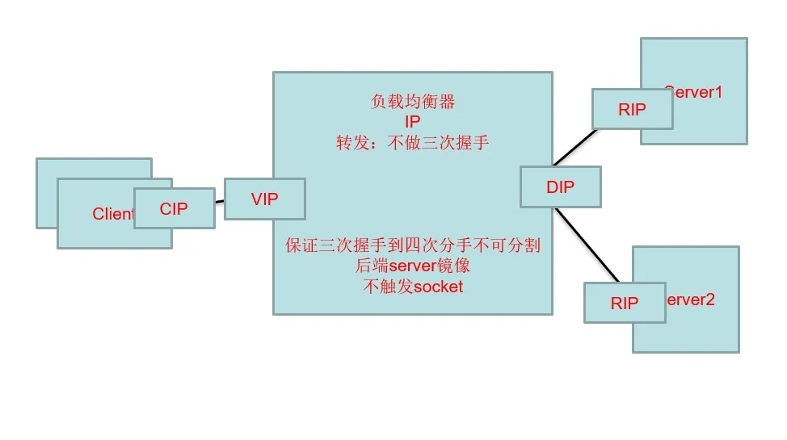
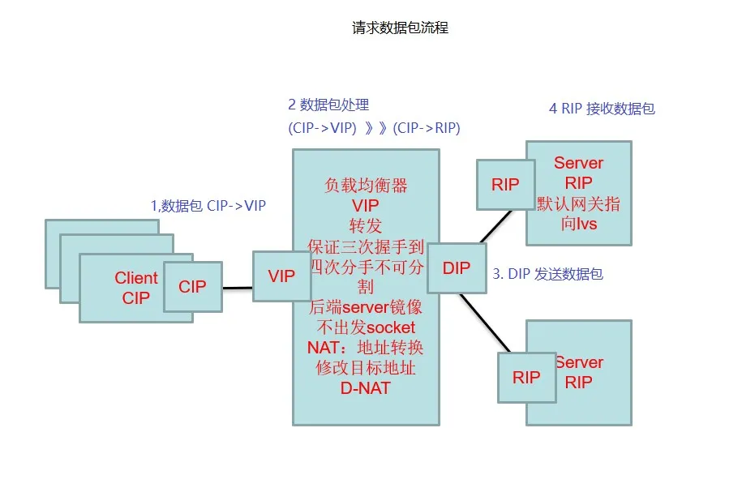
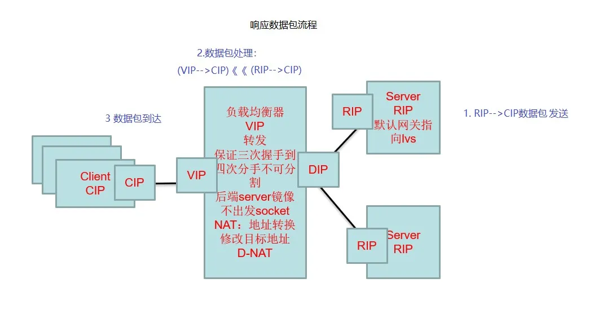
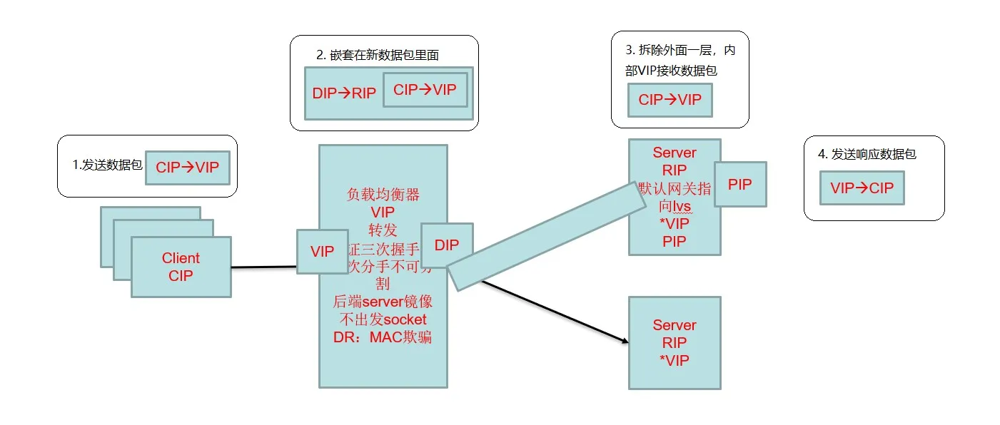
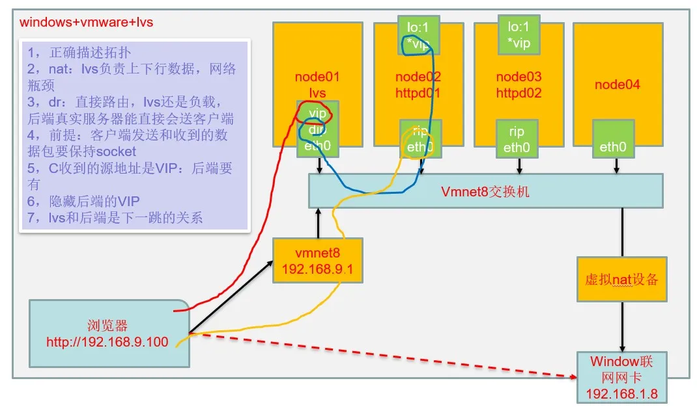

待整理

**警告：该文件只是曾经的随笔，急需整理**

# 负载均衡实现

- 软件
  - apache nginx,Reverse-proxy,pWEB
  - lvs
- 硬件:F5
- DNS负载均衡

# 1. lvs

## 搭建

[详细搭建见个人博客](https://whitestarrain.github.io/blog/posts/lvs/)

## 简单说明

- **简介**：LVS 是 Linux Virtual Server 的简称，也就是 Linux 虚拟服务器，是一个由章文嵩博士发起的自由软件项目，官方站点是：http://www.linuxvirtualserver.org。现在LVS已经是Linux标准内核的一部分。

- **特点**： lvs 解析到第四层传输层，只关心 port，状态。

  > 交换机解析到第二层链路层，只关心 mac 地址。路由器解析到第三层网络层，只关心 ip 和路由表。
  > nginx 需要解析到第七层应用层。nginx 也可以做负载均衡服务器，但因为内解析更多，速度相对于 lvs 更慢

- **目标**：通过 LVS 提供的负载均衡技术和 Linux 操作系统实现一个高性能，高可用的服务器群集，它具有良好的可靠性、可扩展性和可操作性。从而以低廉的成本实现最优的服务性能

- **术语**：
  - DS：Director Server。指的是前端负载均衡器节点。
  - RS：Real Server。后端真实的工作服务器。
  - VIP：Virtual Service IP，向外部直接面向用户请求，作为用户请求的目标的 IP 地址。
  - DIP：Director Server IP，主要用于和内部主机通讯的 IP 地址。
  - RIP：Real Server IP，后端服务器的 IP 地址。
  - CIP：Client IP，访问客户端的 IP 地址

- **架构：** 
  - CIP 发送数据包到负载均衡服务器(CIP–>VIP),负载均衡服务器根据指定的调度算法,将数据包转发到 RIP(DIP–>RIP)
  - 数据包只通过负载均衡服务器进行转发，类似路由，不会进行三次握手和四次挥手
  - 在实际应用中，所有 RS 中的服务器互为镜像

  > 

## 种类

### D_NAT 地址转换

- 请求数据包流程: (`CIP–>VIP` 是指 ip 数据报中的源 ip 和目的 ip)
  > 

- 响应数据包流程：
  >  

- 为何响应数据包也需要经过 lvs？
  - 客户端发送的数据包为 `CIP–>VIP`，所以会接收的数据包为 `VIP–>CIP`。而 RS 发送的数据包为 `RIP–>CIP`，不修改源 ip 的话无法被客户端接收

### DR 直接路由(使用最多)

- **出现缘由**：
  - 网络 io 具有非对称性，比如下载文件时，一个 http 访问可能响应上 G 的文件，因此以往经常会通过限制上传速度而满足下载速度。
  - 但企业服务器对上传速度有较高要求，若依旧使用 D_NAt 模式，CIP–VIP 间的硬件设施会限制上传速度

- 整体流程：
  > 
  - 图中的三个 VIP 是一个地址，只不过内部 VIP 地址仅仅为了 RIP 在接收数据包后不丢弃。这个网络中只有一个 VIP

### TUN 隧道

- 整体流程
  - 如果是 vpn，client 就是用户使用的手机或电脑，负载均衡服务器就是中国香港的服务器， RS 就是外网服务器。
  > 

## 实际搭建示例



- 红线：客户访问负载均衡服务器 
- 蓝线：负载均衡服务器转发数据包到真是后端服务器 
- 黄线：后端服务器返回响应数据包

# 2. keepalive

- 单点故障：一个real server 挂了的话，会有部分访问失败,当real server较多时，单点故障就是必然
- lvs挂了的话，就全完了

- 高可用
  - 主备模型：当一个lvs挂了的话，备用lvs代替
    - lvs：主挂掉，备接替；主修复，主抢回
    - 其他：主挂掉，备接替；主修复，主变备
  - 健康检查：rs不能用了的话，就从lvs中抹除。
    - 需要心跳机制探测后端RS是否提供服务
      - 探测down，需要从lvs中删除rs
      - 探测发送从down到up，需要从lvs中再次添加rs

- 一个技术开发出来，如果想弥补某些问题，通常会单独开发一个模块来解决，而不是修改内部代码

- 原理：VRRP协议，虚拟路由冗余协议。Virtual Router Redundancy Protocol
  > ip漂移

- 防火墙原理和lvs相似，都是对数据包做操作
  - 所以服务器一般没有防火墙
  - 但数据中心边缘，要有一个防火墙

- 每个服务器不只有一块网卡
  - 一个网卡走业务数据包
  - 一个网卡走管理数据包（比如心跳，监控）

- keepalived的lvs服务器会进行广播存活信息，和备lvs服务器通信
  > 心跳机制
  - 一旦接受不到了，备lvs就会配置上vip

- keepalived使用：
  - 后端服务器配置和lvs那里相同
  - lvs服务器：
    - 安装keepalive
    - ipvsadm安不安装都行，不过可以安一下用`ipvsadm -lnc`看日志
  - keepalive配置文件：`/etc/keepalived/keepalived.conf`
    > 配置文档的帮助文档： `man keepalived.conf`

    <details>
    <summary style="color:red;">配置文件（重要）</summary>

      ```
      ! Configuration File for keepalived
      global_defs {
        notification_email { # 邮箱通知，当服务器挂了时进行通知
          acassen@firewall.loc
          failover@firewall.loc
          sysadmin@firewall.loc
        }
        notification_email_from Alexandre.Cassen@firewall.loc
        smtp_server 192.168.200.1
        smtp_connect_timeout 30
        router_id LVS_DEVEL
      }

      # 虚拟路由冗余协议配置
      vrrp_instance VI_1 {
          state MASTER  # 取值master / backup   主备
          interface eth0  # 设置管理数据包的网卡接口
          virtual_router_id 51 # 配置虚拟id，当有两套keepalived时，为了互相区分
          priority 100  # 权重值，master大些，备用的小些

          # 验证用的，先别管
          advert_int 1
          authentication {
              auth_type PASS
              auth_pass 1111
          }

          virtual_ipaddress { # ip漂移到哪里
            192.168.187.100/24 dev eth0 label eth0:7   # 等同于 ifconfig eth0:7 192.168.187.100/24
          }
      }

      #  一个VS，包含多个RS的
      # 可以设置多个 VS就
      virtual_server 192.168.187.100 80 { # 设置地址
          delay_loop 6
          lb_algo rr
          lb_kind DR  # 选择模型
          nat_mask 255.255.255.0
          persistence_timeout 0 # 保持会话时间。如果两个同一个地址的请求间隔在指定时间（单位：s）内，那么就第二次会负载到上一次的服务器上 
          protocol TCP

          real_server 192.168.187.102 80 {
              weight 1
              # 健康检查配置。SSL就是指的HTTPS，此处用HTTP
              # SSL_GET {
              HTTP_GET {
                  url {
                    path /  # 测试服务器存活页面
                    status_code 200
                  }
                  # 也可以写多个
                  # url {
                    # path /mrtg/
                    # digest 9b3a0c85a887a256d6939da88aabd8cd
                  # }
                  connect_timeout 3 # 连接超时
                  nb_get_retry 3  # 失败重试次数
                  delay_before_retry 3 # 重试间隔
              }
          }
          real_server 192.168.187.103 80 {
              weight 1
              # 健康检查配置。SSL就是指的HTTPS，此处用HTTP
              # SSL_GET {
              HTTP_GET {
                  url {
                    path /  # 测试服务器存活页面
                    status_code 200
                  }
                  # 也可以写多个
                  # url {
                    # path /mrtg/
                    # digest 9b3a0c85a887a256d6939da88aabd8cd
                  # }
                  connect_timeout 3 # 连接超时
                  nb_get_retry 3  # 失败重试次数
                  delay_before_retry 3 # 重试间隔
              }
          }
      }

      ```
    </details>
  - 将配置文件拷贝到 192.168.187.104
    - 修改MASTER 为 BACKUP
    - 权重值改为50
  - 两个lvs服务器，service keepalived start
    - 备lvs服务器不会配置vip（可以自己查查）
    - 但配置了rs。备lvs也会对rs进行健康检查
  - 测试
    - 禁用主lvs服务器网卡或者关闭系统模拟故障
      > ifconfig eth0 down
      - 会发现备机自动配置vip（ip漂移，高可用）
    - 修复lvs服务器网卡或重新开启系统和服务
      > ifconfig eth0 up
      - 会发现重新启动主lvs服务器
    - 关闭rs1
      - 主lvs服务器剔除rs1
      - 备lvs服务器剔除rs1
    - 尝试强制关闭主lvs的keepalived进程
      > keepalived本身并不高可用

  
- 如果后端服务器不能访问，那么keepalived会自动剔除
  - 启动后
  - 经过心跳间隔后，就会加入RS中

- 强制关闭进程`kill -9 pid`

-  keepalived本身并不高可用，
  - 如果强制关闭主lvs服务器的keepalived的进程，
  - 备lvs服务器就会开启（因为没有存活广播了）
  - 然后就出现了两个vip
  - 数据包从不同线路来，就可能分配到不同vip上
  - 数据包被打散，无法完成握手，无法建立连接

# 3. nginx

[中文文档](http://tengine.taobao.org/nginx_docs/cn/docs/)

- 代理；
- 反向代理


- `/etc/init.d`存放服务，服务就是脚本，脚本调用实际程序
- chkconfig 检查或设置系统的各种服务
  > 服务脚本中有 chkconfig 相关的一条注释才能读取到
  - chkconfig nginx on 开机启动

- nginx会开启两个进程：
  - master:
  - worker:用于处理客户端连接。
    - worker是master的子进程
    - worker会热加载配置文件
      - 旧worker继续处理
      - master开启新的worker子进程
      - 旧worker子进程关闭  

- nginx配置文件原理`安装目录/conf/nginx.conf`：
  - 重新加载配置文件：`service nginx reload`
  - localtion映射:
    > 看看文档。core模块中
    <details>
    <summary style="color:red;">文档</summary>

      ```
      location [ = | ~ | ~* | ^~ ] uri { ... }
        location URI {}:
          对当前路径及子路径下的所有对象都生效；
        location = URI {}: 注意URL最好为具体路径。
          精确匹配指定的路径，不包括子路径，因此，只对当前资源生效；
        location ~ URI {}:
        location ~* URI {}:
          模式匹配URI，此处的URI可使用正则表达式，~区分字符大小写，~*不区分字符大小写；
        location ^~ URI {}:
          匹配上之后会阻断正则，不会和之后使用正则表达式的location进行匹配(该匹配不使用正则)
        优先级：= > ^~ > ~|~* >  /|/dir/
      
      location配置规则
      location 的执行逻辑跟 location 的编辑顺序无关。
      矫正：这句话不全对，“普通 location ”的匹配规则是“最大前缀”，因此“普通 location ”的确与 location 编辑顺序无关；

      但是“正则 location ”的匹配规则是“顺序匹配，且只要匹配到第一个就停止后面的匹配”；
      “普通location ”与“正则 location ”之间的匹配顺序是？先匹配普通 location ，再“考虑”匹配正则 location 。
      注意这里的“考虑”是“可能”的意思，也就是说匹配完“普通 location ”后，有的时候需要继续匹配“正则 location ”，有的时候则不需要继续匹配“正则 location ”。两种情况下，不需要继续匹配正则 location ：
          （ 1 ）当普通 location 前面指定了“ ^~ ”，特别告诉 Nginx 本条普通 location 一旦匹配上，则不需要继续正则匹配；
          （ 2 ）当普通location 恰好严格匹配上，不是最大前缀匹配，则不再继续匹配正则
      ```
    </details>
  - 匹配顺序
    <details>
    <summary style="color:red;">文档</summary>

    ```
    nginx  收到请求头：判定ip，port，hosts决定server
    nginx location匹配：用客户端的uri匹配location的uri
      先普通
        顺序无关
        最大前缀
        匹配规则简单
      打断：
        ^~
        完全匹配
      再正则
        不完全匹配
        正则特殊性：一条URI可以和多条location匹配上
        有顺序的
        先匹配，先应用，即时退出匹配
    ```
    </details>

- 配置文件
  <details>
  <summary style="color:red;">配置文件（重要）</summary>

  ```
  #user  nobody;  # worker进程对应的用户权限，master为root权限。通过客户端连接攻破worker进程后，也只能拿到nobody进程
  worker_processes  1;  # 内核数量，一个内核会开启一个进程。nginx使用非阻塞io，每个进程都处理上万个io

  # 日志位置
  #error_log  logs/error.log;
  #error_log  logs/error.log  notice;
  #error_log  logs/error.log  info;

  #pid        logs/nginx.pid;

  events {
      # worker_connections  1024; # 处理连接数
      worker_connections 10240;
        # cat /proc/sys/fs/file-max 查看系统最多打开文件描述符个数（与内存大小有关）
        # ulimit -a （open files）查看一个进程最多文件描述符个数，一个socket就是一个文件描述符
        # ulimit -SHn 65535   设置一个进程最多文件描述符个数为65535
  }

  # load modules compiled as Dynamic Shared Object (DSO)
  #
  #dso {
  #    load ngx_http_fastcgi_module.so;
  #    load ngx_http_rewrite_module.so;
  #}

  http {
      include       mime.types;
      default_type  application/octet-stream;

      # 日志格式化定义
      # 有些地方可以通过日志记录功能用nginx做数据采集
      # 定义log格式 main，之后可以调用
      #log_format  main  '$remote_addr - $remote_user [$time_local] "$request" '
      #                  '$status $body_bytes_sent "$http_referer" '
      #                  '"$http_user_agent" "$http_x_forwarded_for"';

      #access_log  logs/access.log  main;

      sendfile        on;
      #tcp_nopush     on; # 打开后，buffer未填满会一直堵塞

      keepalive_timeout  0; 
      # keepalive_timeout  65;
      # 对应http协议1.1版本中那个请求头，持续多长时间不传输数据时才断开tcp连接
      # 此处为了查看RS切换过程，暂且先写成0，

      #gzip  on; # nginx返回的数据是否经过gzip压缩，能够传输更多数据

      # 服务器设置
      # 当一个ip拥有多个域名时，可以设置多个虚拟服务器
      # 在同一个操作系统上监听同一个接口，会因为访问域名的不同而访问不同的虚拟服务器
        # 原理： http协议中，请求头中的host字段会携带域名，到达nginx后会根据host的值，与server_name作比较，从而判断哪个虚拟服务器进行服务
        # 使用ip访问的话，默认走第一个

      # 负载均衡（在http中定义，和server同级）
      upstream fuzai{
        server 192.168.187.101:80; # 默认端口80，写不写都行
        server 192.168.187.102;
      }
      # 然后在下面server中的location中写
      # location /text{ proxy_pass https://fuzai/; }
      # 此处反向代理域名解析顺序：upstream-->本机hosts-->dns服务器

      # 负载均衡另一种情况；
      # 一个域名能解析出多个ip地址（可以通过hosts文件设置）

      server {
          listen       80; # 端口
          server_name www.node0001.com; # 测试域名通过host文件指定

          #charset koi8-r;

          #access_log  logs/host.access.log  main;

          location / { # 相当于tomcat的项目名称，或虚拟目录
          # 先匹配location，再匹配root
              root   html; # 网页资源根目录，相对于安装目录。只能有一个
              autoindex on; # 不会展示页面，会显示页面目录，就是镜像源网站那些
              # 可以通过此选项做镜像站
          }
          location /aabb { 
            proxy_pass https://192.168.187.102:80/;# 实现反向代理，请求其他服务器
          }
          location /thebaidu{
            proxy_pass https://www.baidu.com/; #反向代理百度
            # !!注意：带不带最后面的斜线差别很大
            # 如果带的话，则是反向代理地址替换用户访问地址
            # 如果不带的话，会反向代理地址拼上用户访问地址
            # 访问http://192.168.187.101/thebaidu 就是访问https://www.baidu.com
          }
          location ~* ^/s { # 以/s开头
            proxy_pass https://www.baidu.com/; #反向代理百度
            # 访问http://192.168.187.101/thebaidu 就是访问https://www.baidu.com/thebaidu
          }
      }
      server {
          listen       80; # 端口
          server_name www.node0001-2.com;

          #charset koi8-r;

          #access_log  logs/host.access.log  main;

          location / { # 相当于tomcat的项目名称，或虚拟目录
              root   html; # 网页资源根目录，相对于安装目录。只能有一个
              index  index.html index.htm; # 主页
          }

          #error_page  404              /404.html;

          # redirect server error pages to the static page /50x.html
          #
          error_page   500 502 503 504  /50x.html;
          location = /50x.html {
              root   html;
          }

          # proxy the PHP scripts to Apache listening on 127.0.0.1:80
          #
          #location ~ \.php$ {
          #    proxy_pass   http://127.0.0.1;
          #}

          # pass the PHP scripts to FastCGI server listening on 127.0.0.1:9000
          #
          #location ~ \.php$ {
          #    root           html;
          #    fastcgi_pass   127.0.0.1:9000;
          #    fastcgi_index  index.php;
          #    fastcgi_param  SCRIPT_FILENAME  /scripts$fastcgi_script_name;
          #    include        fastcgi_params;
          #}

          # deny access to .htaccess files, if Apache's document root
          # concurs with nginx's one
          #
          #location ~ /\.ht {
          #    deny  all;
          #}
      }
  }
  ```
  </details>
- 客户端跳转
  - location中设置反向代理 http://www.baidu.com
    - nginx访问http://www.baidu.com
    - http://www.baidu.com返回客户端跳转连接https://www.baidu.com
    - nginx返回https://www.baidu.com
    - 客户端直接访问https://www.baidu.com
  - 应该禁用客户端跳转，让nginx使用反向代理
    - nginx能访问到的主机客户端不一定能访问到
    - nginx无法做负载均衡

- session一致性
  - 方式1：session复制
    - tomcat本身带session复制功能（不用）
  - 方式2：共享session
    - 需专门管理session的软件。
    - memcached缓存服务，可以和tomcat整合，帮助tomcat共享管理session
      > 以后主要用redis，memcached只是讲下
- memcached使用
  - 一台nginx+memcached，两台tomcat
  - memcached处理
    - yum install memcached -y
    - `memcached -d -m 128m -p 11211 -l 192.168.187.101 -u root -P /tmp/`
    - `netstat -natp | grep 11211`
  - tomcat处理
    - 拷贝多个jar包到lib目录
    - conf/context.xml中插入：
      ```xml
      <!-- 指定memcached主机ip和端口 -->
      <Manager className="de.javakaffee.web.msm.MemcachedBackupSessionManager" 
        memcachedNodes="n1:192.168.187.101:11211" 
          sticky="false" 
          lockingMode="auto"
          sessionBackupAsync="false"
        requestUriIgnorePattern=".*\.(ico|png|gif|jpg|css|js)$"
          sessionBackupTimeout="1000" transcoderFactoryClass="de.javakaffee.web.msm.serializer.kryo.KryoTranscoderFactory" 
      />
      ```
  - 时间问题：
    - 如果两台机器时间差距很大，session一致性设置会出现问题
    - 其他情况甚至出现进程退出，退出服务等
    - 至少不要超过10秒，最好控制在2秒以内


# 4. LVS和nginx

待整理

> **【四层和七层】**

- 四层和七层的区别；   
  - 四层负载均衡，指的是IP+端口的负载均衡；
  - 七层负载均衡，指的是基于WEB请求，URL等应用层信息的负载均衡。
  - 当然，同理，还有基于MAC地址的二层负载均衡和基于IP地址的三层负载均衡。
  - 四层负载均衡，主要分析IP层和TCP/UDP层。
  - 七层负载均衡，要分析应用层协议，比如HTTP协议，URL，cookie等信息。

> **【关于LVS】**

- LVS的负载能力很强，因为其工作模式非常简单，仅进行请求的分发，而且其工作在第四层，没有流量，在效率方面最高。
- LVS是在四层，可以对几乎所有的应用作负载均衡。
- 但是LVS对于故障后端感知并不敏感，比如在DR模式下，要是有一个后端服务器没有配置VIP，就会导致请求的一部分数据会直接丢失。
- 且LVS对于网络环境的稳定性要求较高，如果请求失败了，只能依赖于前端的应用自身的重试机制，负载均衡不对请求进行重新下发。
- 而且LVS也很受限于网络架构，在设计之初就要考虑到网络架构是否满足LVS负载的前置条件。 

> **【关于nginx】**

- 同样的，nginx也可以用于负载均衡，但是由于nginx需要对源端/目的端都建立连接，所以处理流量的速度受限于机器I/O，CPU内存等一系列配置，所以nginx的负载能力相对较差。
- nginx安装，配置都比较简单，与LVS对比，nginx不需要很严格的网络架构，只要网络可以联通即可。
- 且nginx自身的重试机制，可以保证请求下发失败之后，会重新下发到健康的后端上。
- 但是，nginx因为没有现成的热备机制，所以，存在单点故障的问题，一般需要搭配keepalived使用。
- 不过，nginx作为一款应用层负载均衡（后来引入stream模块之后，四层也支持了），可以提供负载分担，贮备切换，HTTPS写在，带宽限速，隐藏真实IP，隐藏真实端口，屏蔽攻击等能力，这是LVS所不能提供的。

> **【对比】**

lvs和nginx都是现在很主流的负载均衡方式，他们各有优缺点，在生产环境需要根据其特点做选择。

|                | LVS                                                          | Nginx                                                        |
| -------------- | ------------------------------------------------------------ | ------------------------------------------------------------ |
|                | 四层                                                         | 四层/七层                                                    |
| 抗负载能力     | 强                                                           | 弱                                                           |
| 配置性         | 可配置性低同时也减少了人为出错的概率                         | 可配置性高可以配置一些高级功能                               |
| 稳定性         | 稳定性高有完整的双机热备方案                                 | 稳定性低，有单机故障无现成的双机热备方案                     |
| 网络架构依赖   | 强依赖非常依赖网络架构设计当然可以采用比较简单的NAT方式解决此问题 | 无依赖                                                       |
| 网络稳定性依赖 | 依赖数据包分发到坏的后端，不会重新分发，会直接返回错误       | 不依赖数据包分发到坏的后端并返回错误后，会尝试重新分发到健康的后端 |
| 网络流量       | 仅请求流量经过lvs的网络，响应流量由后端服务器的网络返回。FULL_NAT同Nginx。 | 所有的请求和响应流量都会经过nginx                            |
| 宿主机性能要求 | 要求较低lvs仅仅做分发请求，流量并不从它本身出去，所以瓶颈仅仅受限于网络带宽和网卡性能 | 要求较高因为nginx需要对源端和目的端都单独建立连接，中间还涉及到一些数据包的解析处理，所以依赖宿主机的I/O性能和CPU内存 |
| 转发方式       | 同步转发lvs服务器接收到请求之后，立即redirect到一个后端服务器，由客户端直接和后端服务器建立连接。 | 异步转发在保持客户端连接的同时，发起一个相同内容的新请求到后端，等后端返回结果后，由nginx返回给客户端 |
| 其他           |                                                              | 支持rewrite重写规则：能够根据域名、url的不同，将http请求分到不同的后端服务器群组。节省带宽：支持gzip压缩，可以添加浏览器本地缓存的header头。 |


> **【两者配合】**

在使用上，一般最前端所采取的的策略应是lvs，也就是dns的指向应为lvs均衡器，主要原因在于nginx虽然功能强大，但是当作为后端的服务器规模庞大时，nginx的网络带宽就成了一个巨大的瓶颈。

但是当lvs作为负载均衡的话，一旦后端接受到请求的服务器出了问题，那么这次请求就失败了。        

所以在很多情况下，nginx会作为lvs的节点进行负载均衡，这样，既可以避免nginx的性能造成很严重的带宽瓶颈，也可以利用nginx的错误重传避免lvs一锤子买卖，还能利用nginx的各种高级功能，包括https卸载，报文头修改等。


