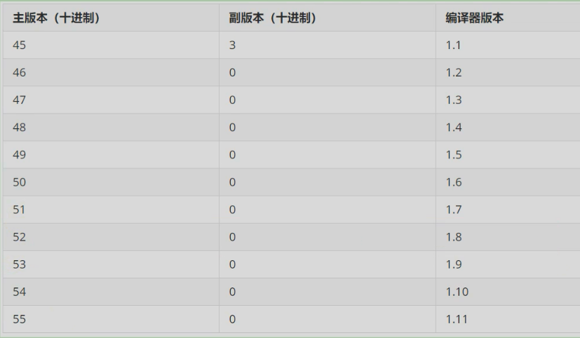
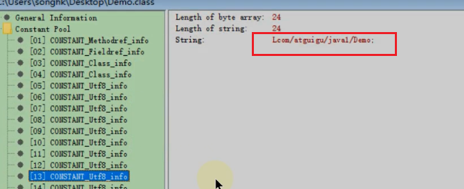
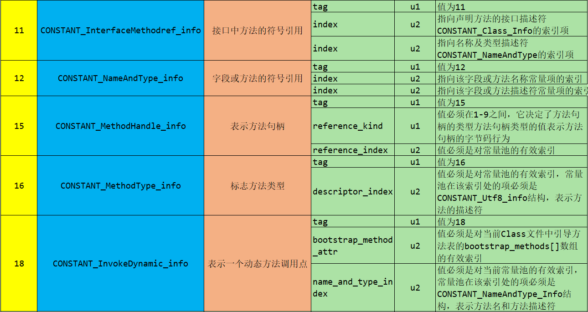

[java8文档](https://docs.oracle.com/javase/specs/jvms/se8/html/index.html)

# 1. 学习路线回顾


- 最终目的是性能的监控和调优(下篇)
- 所以学会使用性能监测工具(下篇)
- 要想看得懂可视化工具显示的数据，就要懂内存的分配和回收(上篇)
- 想懂内存的分配和回收，就要懂内存的结构(上篇)
- 为了更好得理解内存结构，分配位置，内存中的数据是干什么的等等，要
  - 学习类的加载器(上篇简单谈一下，中篇深入)
  - 执行引擎(上篇)
  - class文件结构和字节码指令(中篇)
    > 在上篇也会简单涉及

# 2. class文件结构

## 2.1. 概述

### 2.1.1. 字节码文件的跨平台性

> 前面就有讲过，`跨平台的语言，跨语言的平台`，此处不再重复说明

### 2.1.2. java前端编译器说明

- 说明
  - Java源代码的编译结果是字节码，那么肯定需要有一种编译器能够将Java源码编译为字节码，
  - 承担这个重要责任的就是配置在path环境变量中的**javac编译器**
  - javac是一种能够将Java源码编译为字节码的**前端编译器**。

    ```
    HotSpot VM并没有强制要求前端编译器只能使用javac来编译字节码，
    其实只要编译结果符合JVM规范都可以被JVM所识别即可。
    ```
- 其他编译器编译器
  - 在Java的前端编译器领域，除了javac之外，还有一种被大家经常用到的前端编译器，那就是内置在Eclipse中的**ECJ （EclipseCompiler for Java）编译器**。
  - 和Javac的全量式编译不同，ECJ是一种增量式编译器。
  - 在Eclipse中，当开发人员编写完代码后，使用“Ctrl+S”快捷键时，ECJ编译器所采取的编译方案是把未编译部分的源码逐行进行编译，而非每次都全量编译。
  - 因此ECJ的编译效率会比javac更加迅速和高效，当然编译质量和javac相比大致还是一样的。
  - ECJ不仅是Eclipse的默认内置前端编译器，在Tomcat中同样也是使用ECJ编译器来编译jsp文件。
  - 默认情况下， IntelliJ IDEA 使用 javac编译器。（还可以自己设置为AspectJ编译器ajc）

- 优化：前端编译器并不会直接涉及编译优化等方面的技术，而是将这些具体优化细节移交给HotSpot的JIT编译器负责。

<br />

> 复习：AOT

### 2.1.3. 示例：透过字节码查看代码细节

#### 2.1.3.1. 示例1--Integer间的==

- 通过字节码查看代码细节示例：

  ```java
  Integer i1 = 10;
  Integer i2 = 10;
  System.out.println(i1==i2);//true

  Integer i1 = 128;
  Integer i2 = 128;
  System.out.println(i1==i2);//false
  ```

<details>
<summary style="color:red;">解析</summary>

```
invokestatic #2 <java/lang/Integer.valueOf>
```

查看字节码可以发现调用了Integer的valueOf方法。如果是-128~127之间，就会存在与IntegerCache中，不会创建新的Integer，因此引用相同。

```java
public static Integer valueOf(int i) {
    if (i >= IntegerCache.low && i <= IntegerCache.high)
        return IntegerCache.cache[i + (-IntegerCache.low)];
    return new Integer(i);
}
```
</details>

#### 2.1.3.2. 示例2--String间的==

- 该示例在上面面试题中已经说明过，不再重复说明。涉及
  - `new String()+new String()`实现原理
  - `StringBuilder` 的 `toString()`方法

```java
String str = new String("hello") + new String("world");
String str1 = "helloworld";
System.out.println(str == str1);
```

#### 2.1.3.3. 示例3(难)--继承

下面代码的输出是什么

```java
class Father {
    int x = 10;

    public Father() {
        this.print();
        x = 20;
    }
    public void print() {
        System.out.println("Father.x = " + x);
    }
}

class Son extends Father {
    int x = 30;
//    float x = 30.1F;
    public Son() {
        this.print();
        x = 40;
    }
    @Override
    public void print() {
        System.out.println("Son.x = " + x);
    }
}

public class SonTest {
    public static void main(String[] args) {
        Father f = new Son();
        System.out.println(f.x);
    }
}
```

<details>
<summary style="color:red;">答案与解析</summary>

结果：

```
Son.x = 0
Son.x = 30
20  // 属性不存在多态性
```

<br /><br />

Son类的字节码：

```
 0 aload_0 // 把this放到局部变量表中
 1 invokespecial #1 <com/atguigu/java/Father.<init>> // 调用父类的init方法，init方法中调用了print,但是因为子类重写了父类的print方法，
                                                     // 所以执行子类的print方法。因为在下面才给Son里面的x赋值为30，因此此处打印为0
 4 aload_0 
 5 bipush 30  // 对应 int x=30
 7 putfield #2 <com/atguigu/java/Son.x>  // 对应this.print()
10 aload_0
11 invokevirtual #3 <com/atguigu/java/Son.print>
14 aload_0
15 bipush 40
17 putfield #2 <com/atguigu/java/Son.x>
20 return
```

</details>

> （复习）属性初始化方式：1.默认初始化；2.显式初始化；3.代码块中初始化；4.构造器中初始化；5.对象.属性 初始化

### 2.1.4. 字节码与解读

- 字节码文件里是什么--字节码定义
  - 源代码经过编译器编译之后便会生成一个字节码文件
  - 字节码是一种二进制的类文件,它的内容是JVM的指令,而不像C、C++经由编译器直接生成机器码。

- 什么是字节码指令(byte code)--字节码指令构成
  - Java虚拟机的指令由一个字节长度的、代表着某种特定操作含义的**操作码(opcode)**，
  - 以及跟随其后的零至多个代表此操作所需参数的**操作数(operand)**所构成。
  - 虚拟机中许多指令并不包含操作数,只有一个操作码。

- 解读字节码方式
  - jclasslib
  - javap反编译
  - Notepad++搭配HEX-Editor插件。或者Binary Viewer

## 2.2. class文件结构

### 2.2.1. 整体说明

- Class类的本质
  - 任何一个C1ass文件都对应着唯一一个类或接口的定义信息,
  - 但反过来说,C1ass文件实际上它并不一定以磁盘文件的形式存在，也能以网络等的方式传输过来
  - Class文件是一组以8位字节为基础单位的**二进制流**

- Class文件格式
  - 要求
    - Class的结构不像XML等描述语言
    - 由于它没有任何分隔符号，所以在其中的数据项,无论是字节顺序还是数量,都是被严格限定的
    - 哪个字节代表什么含义,长度是多少,先后顺序如何,都不允许改变
  - 组成: Class文件格式采用一种类似于C语言结构体的方式进行数据存储,这种结构中只有两种数据类型:**无符号数**和**表**
    - **无符号数**:
      - 属于基本的数据类型
      - 以u1、u2、u4、u8来分别代表1个字节、2个字节、4个字节和8个字节的无符号数
      - 无符号数可以用来描述**数字、索引引用、数量值或者按照UTF-8编码构成字符串值**
    - **表**:
      - 是由**多个无符号数或者其他表**作为数据项构成的**复合数据类型**
        > 类似java中的数组
      - 所有表都习惯性地以"_info"结尾。
      - 表用于描述有层次关系的复合结构的数据,**整个C1ass文件本质上就是一张表**。
      - 由于表没有固定长度,所以通常会在其前面加上个数说明

- class文件结构
  - 官网定义

    ```
    ClassFile {
        u4             magic;
        u2             minor_version;
        u2             major_version;
        u2             constant_pool_count;
        cp_info        constant_pool[constant_pool_count-1];
        u2             access_flags;
        u2             this_class;
        u2             super_class;
        u2             interfaces_count;
        u2             interfaces[interfaces_count];
        u2             fields_count;
        field_info     fields[fields_count];
        u2             methods_count;
        method_info    methods[methods_count];
        u2             attributes_count;
        attribute_info attributes[attributes_count];
    }
    ```
  - 详细说明

    | 类型           | 名称                | 说明                     | 长度     | 数量                      |
    | -------------- | ------------------- | ------------------------ | -------- | ------------------------- |
    | u4             | magic               | 魔数,识别 Class 文件格式 | 4 个字节 | 1                         |
    | u2             | minor_version       | 副版本号(小版本)         | 2 个字节 | 1                         |
    | u2             | major_version       | 主版本号(大版本)         | 2 个字节 | 1                         |
    | u2             | constant_pool_count | 常量池计数器             | 2 个字节 | 1                         |
    | cp_info        | constant_pool       | 常量池表                 | n 个字节 | **constant_pool_count-1** |
    | u2             | access_flags        | 访问标识                 | 2 个字节 | 1                         |
    | u2             | this_class          | 类索引                   | 2 个字节 | 1                         |
    | u2             | super_class         | 父类索引                 | 2 个字节 | 1                         |
    | u2             | interfaces_count    | 接口计数器               | 2 个字节 | 1                         |
    | u2             | interfaces          | 接口索引集合             | 2 个字节 | interfaces_count          |
    | u2             | fields_count        | 字段计数器               | 2 个字节 | 1                         |
    | field_info     | fields              | 字段表                   | n 个字节 | fields_count              |
    | u2             | methods_count       | 方法计数器               | 2 个字节 | 1                         |
    | method_info    | methods             | 方法表                   | n 个字节 | methods_count             |
    | u2             | attributes_count    | 属性计数器               | 2 个字节 | 1                         |
    | attribute_info | attributes          | 属性表                   | n 个字节 | attributes_count          |

  - 魔数:
    - magic
    - 用来识别为一个class文件的标识
  - C1ass文件版本
    - minor_version
    - major_version
  - 常量池
    - constant_pool_count
      > 由于表没有固定长度,所以通常会在其前面加上个数说明
    - constant_pool。首索引没有分配，所以长度为constant_pool_count-1
  - 访问标志
    - access_flags
    - 是类，还是接口，权限是什么等
  - 类索引,父类索引,接口索引集合
    - this_class：当前类是什么
    - super_class：父类是什么
    - interfaces_count + interfaces: 接口数组
      > 由于表没有固定长度,所以通常会在其前面加上个数说明
  - 字段表集合
    - fields_count;
      > 由于表没有固定长度,所以通常会在其前面加上个数说明
    - fields[fields_count];
  - 方法表集合
    - methods[methods_count];
    - attributes_count;
  - 属性表集合
    > **注意，field和attribute不同。日常总是称类中的字段为属性，但是JVM中属性有其他含义**。
    > 比如类名，LineNumberTable,LocalVariableTable
    - attributes_count;
    - attributes[attributes_count];

### 2.2.2. 详细说明

#### 2.2.2.1. 代码

```java
package com.atguigu.java1;

public class Demo {
    private int num = 1;

    public int add(){
        num = num + 2;
        return num;

    }
}
```

#### 2.2.2.2. 魔数


- 说明：
  - 每个C1ass文件开头的**4个字节的无符号整数**称为魔数(Magic Number)
  - 作用: 是**确定这个文件是否为一个能被虚拟机接受的有效合法的Class文件**。即**魔数是 Class文件的标识符**。
  - 原因：
    - 使用魔数而不是扩展名来进行识别主要是基于安全方面的考虑,因为文件扩展名可以随意地改动。
    - 类似png格式图片，使用notepad++的HEX-Editor查看二进制内容，可以发现前32个字节也相同

- 值：魔数值固定为`0xCAFEBABE`。不会改变。

- 相关异常：如果一个 Class文件不以θ XCAFEBABE开头,虚拟机在进行文件校验的时候就会直接抛出以下错误:
  ```
  Error: A JNI error has occurred, please check your installation and try again
  Exception in thread "main" java. lang Class Format Error: Incompatible magic value 1885430635 in class
  file StringTest
  ```

#### 2.2.2.3. class文件版本号


- 说明：文件中紧接着魔数的4个字节存储的是 Class文件的版本号。
  - 第5个和第6个字节所代表的含义就是编译的副版本号 minor version
  - 而第7个和第8个字节就是编译的主版本号 major version
  - 主副版本号共同构成了c1ass文件的格式版本号。譬如某个C1ass文件的主版本号为M,副版本号为m,那么这个c1ass文件的格式版本号就确定为M.m
- 版本号和]ava编译器的对应关系：
  > 
  - Java的版本号是从45开始的,JDK1.1之后的每个DK大版本发布主版本号向上加1。
  - 虚拟机JDK版本为1.k(k>=2)时,对应的c1ass文件格式版本号的范围为45.0 - 44+k.0(含两端)

- 向下兼容：
  - 不同版本的]ava编译器编译的C1ass文件对应的版本是不一样的
  - 目前,高版本的Java虚拟机可以执行由低版本编译器生成的Class文件,但是低版本的Java虚拟机不能执行由高版本编译器生成的C1ass文件。
  - 否则JVM会抛出`iava.lang, UnsupportedclassVersionError`异常。
  > 在实际应用中,由于开发环境和生产环境的不同,可能会导致该问题的发生。因此,需要我们在开发时,特别注意开发编译的JDK版本和生产环境中的DK版本是否一致

#### 2.2.2.4. 常量池

##### 2.2.2.4.1. 说明

- 重要性 
  - 常量池是C1ass文件中内容最为丰富的区域之一。常量池对于C1ass文件中的字段和方法解析也有着至关重要的作用。
  - 随着]ava虚拟机的不断发展,常量池的内容也日渐丰富。可以说,常量池是整个class文件的基石。
  - 如以下三个为基于java动态的特性在1.7时添加
    - CONSTANT MethodHandle info 表示方法句柄
    - CONSTANT_ MethodType_into 标志方法类型
    - CONSTANT Invoke Dynamic info 表示一个动态方法调用点

- 字节码中的位置
  - 在版本号之后,紧跟着的是**常量池的数量,以及若干个常量池表项**
  - 常量池中常量的数量是不固定的,所以在常量池的入口需要放置一项u2类型的无符号数,代表**常量池容量计数值(constant pool count)**
  - 与Java中语言习惯不一样的是,**这个容量计数是从1而不是开始的**。

- 组成
  > -
  - C1ass文件使用了一个前置的**容量计数器(constant_pool_count)**加**若干个连续的数据项(constant pool)**的形式来描述常量池内容。
  - 我们把这一系列连续常量池数据称为常量池集合
  - 常量池表项中,用于存放编译时期生成的各种**字面量和符号引用**,这部分内容将在类加载后进入方法区**运行时常量池**中存放

##### 2.2.2.4.2. 常量池计数器

- 由于常量池的数量不固定，时长时短，所以需要放置两个字节来表示常量池容量计数值。
- 常量池容量计数值（u2类型）:**从1开始，表示常量池中有多少项常量。即constant_pool_count=1表示常量池中有0个常量项**
- Demo的值为：

  

  - 其值为0×0016,也就是22。
  - 也就是说实际上只有21项常量。索引为范围是1-21。

  ```
  通常我们写代码时都是从0开始的，但是这里的常量池却是从1开始，因为它把第0项常量空出来了。
  这是为了满足后面某些指向常量池的索引值的数据在特定情况下需要表达不引用任何一个常量池项目的含义
  这种情况可用索引值来表示。
  ```

##### 2.2.2.4.3. 概念说明(补充)

- 全限定名
  - `com/atguigu/test/Demo`这个就是类的全限定名，仅仅是把包名的`.`替换成`/`，为了使连续的多个全限定名之间不产生混淆
  - 在使用时最后一般会加入一个`;`,表示全限定名结束。
- 简单名称
  - 简单名称是指没有类型和参数修饰的方法或者字段名称，上面例子中的类的add()方法和num字段的简单名称分别是add和num。
- 描述符
  - 作用:用来描述字段的数据类型、方法的参数列表（包括数量、类型以及顺序）和返回值。
  - 规则:
    > (数据类型：基本数据类型、引用数据类型）
    - 基本数据类型(byte、char、double、float、int、long、short、boolean)以及代表无返回值的void类型都用一个大写字符来表示
    - 而对象类型则用字符L加对象的全限定名来表示

    | 标志符 | 含义                                                 |
    | ------ | ---------------------------------------------------- |
    | B      | 基本数据类型 byte                                    |
    | C      | 基本数据类型 char                                    |
    | D      | 基本数据类型 double                                  |
    | F      | 基本数据类型 float                                   |
    | I      | 基本数据类型 int                                     |
    | J      | 基本数据类型 long                                    |
    | S      | 基本数据类型 short                                   |
    | Z      | 基本数据类型 boolean                                 |
    | V      | 代表 void 类型                                       |
    | L      | 对象类型，比如：`Ljava/lang/Object;`                 |
    | `[`    | 数组类型，代表一维数组。比如：`double[][][] is [[[D` |

    > 例：

    

##### 2.2.2.4.4. 常量池表

- constant_pool是一种表结构，以`1~constant_pool_count-1`为索引。表明了后面有多少个常量项。
- 常量池**主要**存放**两大类常量**：
  - `字面量（Literal)`
    - 文本字符串
    - 声明为final的常量值
  - `符号引用（Symbolic References)`
    - 类和接口的全限定名
      >  示例：类名

      

    - 字段的名称和描述符(字段类型等)
      > 示例

    - 方法的名称和描述符(返回类型，形参等)
      > 示例：无形参，返回值为void的方法描述符

       

      > 示例：方法名

      

- 常量池元素类型。常量池表中元素的类型可能是下面任何一个

  | 类型                                   | 标志 | 描述                   |
  | -------------------------------------- | ---- | ---------------------- |
  | CONSTANT_utf8_info                     | 1    | UTF-8 编码的字符串     |
  | CONSTANT_Integer_info                  | 3    | 整型字面量             |
  | CONSTANT_Float_info                    | 4    | 浮点型字面量           |
  | CONSTANT_Long_info                     | 5    | 长整型字面量           |
  | CONSTANT_Double_info                   | 6    | 双精度浮点型字面量     |
  | CONSTANT_Class_info                    | 7    | 类或接口的符号引用     |
  | CONSTANT_String_info                   | 8    | 字符串类型字面量       |
  | CONSTANT_Fieldref_info                 | 9    | 字段的符号引用         |
  | CONSTANT_Methodref_info                | 10   | 类中方法的符号引用     |
  | CONSTANT_InterfaceMethodref_info       | 11   | 接口中方法的符号引用   |
  | CONSTANT_NameAndType_info              | 12   | 字段或方法的符号引用   |
  | CONSTANT_MethodHandle_info(jdk7 引入)  | 15   | 表示方法句柄           |
  | CONSTANT_MethodType_info(jdk7 引入)    | 16   | 标志方法类型           |
  | CONSTANT_InvokeDynamic_info(jdk7 引入) | 18   | 表示一个动态方法调用点 |

  - 常量池元素数据类型中没有基本数据类型`byte,short,boolean,char`对应的类型，是因为都可以使用integer表示

##### 字节码解读

- 常量类型详细说明

   

  

  - 常量池中的每一项都具备相同的特征: **第1个字节作为类型标记，用于确定该项的格式，这个字节称为tag byte(标记字节、标签字节）**。
  - 字符串的byte部分长度这里标的是u1，但其实是不确定的。长度为length的值

- 元素区分解读结果:
  > `22-1`个元素，用两种颜色分隔标记 <br />
  > **可以使用jclasslib，对照着看看**

  

  

- 数据解读：以第一项为例
  - 数据
    ```
    0a 00 04 00 12 为例
    ```
  - 解读:
    - **tag**:0a是10，对应CONSTANT_Methodref_info，
    - CONSTANT_Methodref_info 有两个长度为u2的index
      - 指向声明方法的类描述符
        - `00 04`，值是4
        - 也就是找常量池表中的第4项，是一个CONSTANT_Class_info，
        - 然后同理继续解读，最后指向字符串
      - 指向名称及类型描述符
        - `00 12`，值是18
        - 也就是说常量池表中的第18项，是一个CONSTANT_NameAndType_info，
        - 然后同理继续解读，最后指向字符串

    

> 现在再用jclasslib或者bytecode viewer看看，估计可以理解透彻不少

##### 2.2.2.4.5. 小结

- 常量池：
  - 可以理解为class文件之中的资源仓库
  - 它是class文件结构中与其他项目关联最多的数据类型（后面的很多数据类型都会指向此处）
  - 也是占用class文件空间最大的数据项目之一。
- 常量池中为什么要包含这些内容
  - Java代码在进行Javac编译的时候，并不像C和C++那样有"连接"这一步骤，而是在虚拟机加载Class文件的时候进行动态链接。
  - **也就是说，在class文件中不会保存各个方法、字段的最终内存布局信息**
  - **因此这些字段、方法的符号引用不经过运行期换的话无法得到真正的内存入口地址，也就无法直接被虚拟机使用**
  - **当虚拟机运行时，需要从常量池获得对应的符号引用，再在类创建时或运行时解析、翻译到具体的内存地址之中**
  - 关于类的创建和动态链接的内容，在虚拟机类加载过程时再进行详细讲解

---

- 符号引用和直接引用的区别与关联：
  - 符号引用：
    - 内容：符号引用以**一组符号**来描述所引用的目标，符号可以是任何形式的字面量，只要使用时能**无歧义**地定位到目标即可。
    - 内存布局：**符号引用与虚拟机实现的内存布局无关**，**引用的目标并不一定已经加载到了内存中** 。
  - 直接引用：
    - 内容：直接引用可以是 **直接指向目标的指针、相对偏移量或是一个能间接定位到目标的句柄** 
      > 复习：JVM1, 符号引用详解章节，复习符号引用的表现
    - 内存布局： 
      - **直接引用是与虚机实现的内存布局相关的**，
      - 同一个符号引用在不同虚拟机实例上翻译出来的直接引用一般不会相同。
      - 如果有了直接引用，那说明引用的目标必定已经存在于内存之中了。

#### 访问标识(access_flag)

#### 类索引，父类索引，接口索引集合

#### 字段表集合

#### 方法表集合

#### 属性表集合

### 2.2.3. 面试题

```
类文件结构有几个部分
```

```
知道字节码吗？字节码都有哪些？Integer x = 5;int y = 5;比较x==y要经过哪些步骤
```

