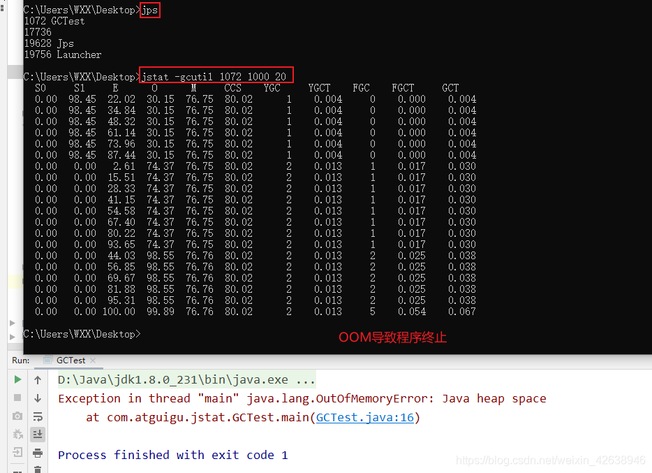
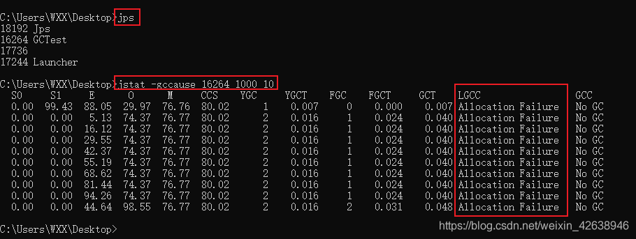
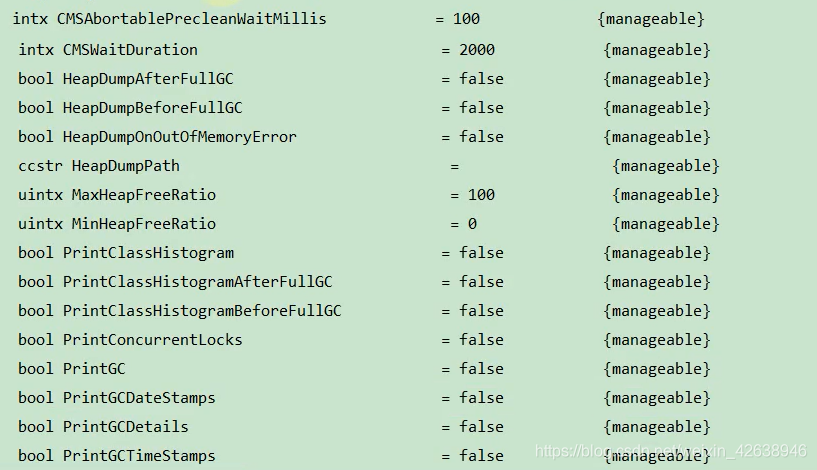
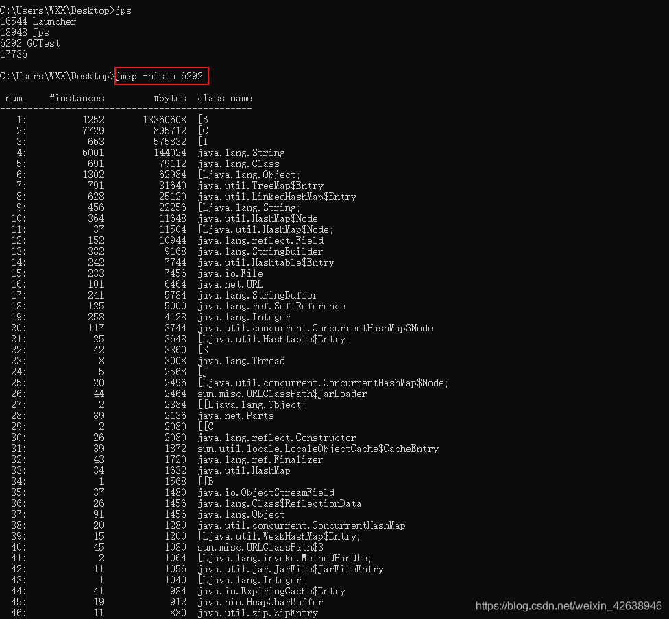

- <mark> [官方文档](https://docs.oracle.com/javase/8/docs/technotes/tools/windows/index.html) </mark>

# 1. 性能监控与调优概述

## 1.1. 调优背景

- 生产环境中的问题
  - 生产环境发生内存溢出该如何处理？
  - 生产环境应该给服务器分配多少内存合适？
  - 如何对垃圾回收器的性能进行调优？
  - 生产环境 CPU 负载飙高该如何处理？
  - 生产环境应该给应用分配多少线程合适？
  - 不加 log，如何确定请求是否执行了某一行代码？
  - 不加 log，如何实时查看某个方法的入参与返回值？

- 为什么要调优？
  - 防止出现 OOM
  - 解决 OOM
  - 减少 Full GC 出现的频率

- 不同阶段的考虑
  - 上线前:测试，jps降低，延迟，cpu使用率等问题
  - 项目运行阶段：线上出现 OOM，运行情况监控

## 1.2. 调优的概述

- 监控的依据
  - 运行日志
  - 异常堆栈
  - GC 日志
  - 线程快照
  - 堆转储快照

- 调优的大方向
  - 合理的编写代码
  - 充分并合理的使用硬件资源
  - 合理的进行 JVM 调优

## 1.3. 性能优化的步骤

- 第一步（发现问题）：**性能监控**
  - 说明：
    - 一种以非强行或者入侵方式**收集或查看**应用运行性能数据的活动
    - 监控通常是指一种在生产、质量评估或者开发环境下实施的带有**预防或主动性**的活动
  - 执行时期：
    - 当应用相关干系人提出性能问题却**没有提供足够多的线索时**，首先我们需要进行性能监控，随后是性能分析。
  - 发现的问题：
    - GC 频繁
    - CPU load 过高
    - OOM
    - 内存泄露
    - 死锁
    - 程序相应时间较长

- 第二步（排查问题）：**性能分析**
  - 说明：
    - 一种以**侵入方式**收集运行性能问题的答复结果，它会影响应用的吞吐量或响应性
    - 性能分析是针对性能问题的答复结果，关注的范围通常比性能监控更加集中
  - 执行环境：
    - 性能分析**很少在生产环境**下进行
    - 通常是在质量评估、**系统测试或者开发环境下进行**
  - 执行时期：
    - 是性能监控之后的步骤。
  - 行为：
    - 打印 GC 日志，通过 GCviewer 或者[gceasy](https://gceasy.io/)来分析日志信息
    - 灵活运用命令行工具，jstack、jmap、jinfo 等
    - dump 出堆文件，使用内存分析工具分析文件
    - 使用阿里 Arthas 或 jconsole，JVisualVM 来实时查看 JVM 状态
    - jstack 查看堆栈信息

- 第三步（解决问题）：**性能调优**
  - 说明：
    - 一种为改善应用响应性或吞吐量而更改参数、源代码、属性配置的活动
  - 执行时期：
    - 性能调优是在性能监控、性能分析之后的活动。
  - **性能调优的目的**
    - 减少 GC 的频率，以较少的内存获取更大的吞吐量和更低的延迟
  - 调优行为：
    - 适当增加内存，根据业务背景选择垃圾回收器
    - 优化代码，控制内存使用
    - 增加机器，分散节点压力
    - 合理设置线程池线程数量
    - 使用中间件提高程序效率，比如缓存，消息队列等
    - 其他…

    ```
    没有绝对的调优，具体问题具体分析
    ```

## 1.4. 评价指标

### 1.4.1. 停顿时间（或响应时间）

- 应用层面：
  - 提交请求和返回请求的响应之间使用的时间，一般比较关注平均响应时间。
  - 常用操作的响应时间列表

    | 操作                                | 响应时间 |
    | ----------------------------------- | -------- |
    | 打开一个站点                        | 几秒     |
    | 数据库查询一条记录（有索引）        | 十几毫秒 |
    | 机械硬盘一次寻址                    | 4 毫秒   |
    | 从机械硬盘顺序读取 1M 数据          | 2 毫秒   |
    | 从 SSD 磁盘顺序读取 1M 数据         | 0.3 毫秒 |
    | 从远程分布式换成 Redis 读取一个数据 | 0.5 毫秒 |
    | 从内存读取 1M 数据                  | 十几微秒 |
    | Java 程序本地方法调用               | 几微秒   |
    | 网络传输 2Kb 数据                   | 1 微秒   |

- 垃圾回收层面
  - 暂停时间：**执行垃圾收集时，程序的工作线程被暂停的时间
  - 参数： `-XX:MaxGCPauseMills`

### 1.4.2. 吞吐量

- 对单位时间内完成的工作量（请求）的度量
- 在 GC 中：运行用户代码的时间占总运行时间的比例（总运行时间：程序运行时间+内存回收的时间n）吞吐量为 **`1- 1/(1+n)`**
  > n为参数`-XX:GCTimeRatio`获取的值

### 1.4.3. 并发数

- 同一时刻，对服务器有实际交互的请求数。
- 1000 个人同时在线，估计并发数在 5%-15%之间，也就是同时并发量：50-150 之间。

### 1.4.4. 内存占用

- Java 堆区所占的内存大小
- 主要是堆

# 2. JVM监控及诊断工具-命令行

## 2.1. 概述

[文档](https://docs.oracle.com/javase/8/docs/technotes/tools/windows/index.html)

```
使用数据说明问题，使用知识分析问题，使用工具处理问题
无监控、不调优！
```

- Java作为最流行的编程语言之一，其应用性能诊断一直受到业界广泛关注
- 可能造成Java应用出现性能问题的因素非常多，例如
  - 线程控制
  - 磁盘读写
  - 数据库访问
  - 网络I/O
  - 垃圾收集
  - ... 
- 想要定位这些问题，一款优秀的性能诊断工具必不可少。

------

- 简单命令行工具
  - jdk的bin目录中还有一系列辅助工具。这些辅助工具用来获取目标JVM不同方面、不同层次的信息，帮助开发人员很好的解决Java应用程序的一些疑难杂症。

    

  - exe执行文件类似快捷键方式，具体程序信息在 `tools.jar`下
  - 这些命令对应的源码地址：[源码](https://hg.openjdk.java.net/jdk/jdk11/file/1ddf9a99e4ad/src/jdk.jcmd/share/classes/sun/tools)

## 2.2. jps:查看正在运行的java进程

### 2.2.1. 基本说明

- jps：Java Process Status
  - 显示指定系统内所有的HotSpot虚拟机进程（查看虚拟机进程信息），可用于查询正在运行的虚拟机进程。
  - 对于本地虚拟机进程来说，**进程的本地虚拟机ID与操作系统的进程ID是一致的**，是唯一的。

- 示例

  ```java
  public class ScannerTest {
      public static void main(String[] args) {
          Scanner scanner = new Scanner(System.in);
          String info = scanner.next();
      }
  }
  ```

  

  > 另外注意：每次jps执行都是一个新的进程

### 2.2.2. 语法与参数

- jps的进本语法：`jps [options] [hostid]`

- **[options]：**
  - -q：仅仅显示LVMID（local virtual machine id），即本地虚拟机唯一id。不显示主类的名称等。
  - -l：输出应用程序主类的全类名 或 如果执行的是jar包，则输出jar包的完整路径
  - -m：输出虚拟机进程启动时传递给主类main()的参数
  - -v：列出虚拟机进程启动时的JVM参数。比如：`-Xms100m -Xmx100m`是启动程序指定的JVM参数

  > 说明：以上参数可以综合使用。

- **[hostid]：**
  - RMI注册表中注册的主机名
  - 如果想要**远程监控主机上的java程序，需要安装jstatd**
  - 对于具有更严格的安全实践的网络场所而言，可以使用一个自定义的策略文件来显式对特定的可信主机或网络的访问，尽管 **这种技术很容易受到IP地址欺诈攻击**
  - 如果安全问题无法使用一个定制的策略文件来处理，那么最安全的操作是不运行jstatd服务器，而是本地使用jstat和jps工具。

- 注意
  - 如果某Java进程关闭了默认开启的`-XX UsePerfData`参数（即使用参数-XX:-UsePerfData），那么jps命令（以及下面介绍的jstat）将无法探知该Java进程

- 示例

  <details>
  <summary style="color:red;">展开</summary>

  - 示例1

    

  - 示例2
    - 在IDEA中配置参数如下：

      

    - 执行：

      ```shell
      jps -m > a.txt
      ```

    - 生成文件的内容如下，可以看到刚才输入的参数

      

  - 示例3
    - 在IDEA中配置参数如下：

      

    - 执行：

      ```shell
      jps -v > b.txt
      ```

    - 生成文件的内容如下，可以看到刚才输入的参数

      
  </details>

## 2.3. jstat:查看jvm统计信息

### 2.3.1. 基本说明

- jstat（JVM Statistics Monitoring Tool）：用于监视虚拟机各种运行状态信息的命令工具。它可以显示本地或者远程虚拟机中的类装载、内存、垃圾收集、JIT编译等运行数据。
- 在没有GUI图形界面，只提供了纯文本控制台环境的服务器上，它将是运行期间定位虚拟机性能问题的首选工具。常用于检测**垃圾回收**问题以及**内存泄露**问题。
- [官方文档](https://docs.oracle.com/javase/8/docs/technotes/tools/unix/jstat.html)

### 2.3.2. 基本语法

- 基本语法
  - options参数，用来指定展示哪方面的信息
  - interval参数：统计数据的周期
  - count参数：总查询次数
  - -t 参数：添加timestamp信息
  - -h 参数： 输出行信息

  ```shell
  jstat -<option> [-t] [-h<lines>] <vmid> [<interval> [<count>]]
  ```
  ```bash
  Usage: jstat -help|-options
        jstat -<option> [-t] [-h<lines>] <vmid> [<interval> [<count>]]

  Definitions:
    <option>      An option reported by the -options option
    <vmid>        Virtual Machine Identifier. A vmid takes the following form:
                      <lvmid>[@<hostname>[:<port>]]
                  Where <lvmid> is the local vm identifier for the target
                  Java virtual machine, typically a process id; <hostname> is
                  the name of the host running the target Java virtual machine;
                  and <port> is the port number for the rmiregistry on the
                  target host. See the jvmstat documentation for a more complete
                  description of the Virtual Machine Identifier.
    <lines>       Number of samples between header lines.
    <interval>    Sampling interval. The following forms are allowed:
                      <n>["ms"|"s"]
                  Where <n> is an integer and the suffix specifies the units as
                  milliseconds("ms") or seconds("s"). The default units are "ms".
    <count>       Number of samples to take before terminating.
    -J<flag>      Pass <flag> directly to the runtime system.
  ```

  

- 说明与示例

  ```java
  public class ScannerTest {
      public static void main(String[] args) {
          Scanner scanner = new Scanner(System.in);
          String info = scanner.next();
      }
  }
  ```

  

### 2.3.3. 所有参数

#### 2.3.3.1. options

- 测试代码

  ```java
  /**
    * -Xms60m -Xmx60m -XX:SurvivorRatio=8
    */
  public class GCTest {
      public static void main(String[] args) {
          ArrayList<byte[]> list = new ArrayList<>();
  
          for (int i = 0; i < 1000; i++) {
              byte[] arr = new byte[1024 * 100];  // 100KB
              list.add(arr);
              try {
                  Thread.sleep(120);
              } catch (InterruptedException e) {
                  e.printStackTrace();
              }
          }
      }
  }
  ```

> **类装载相关的：**

- -class：显示ClassLoader的相关信息：类的装载、卸载数量、总空间、类装载所消耗的时间等

 > **垃圾回收相关的：**

- -gc：显示与GC相关的堆信息。包括Eden区，两个Survivor区、老年代、永久代的用量、已用空间、GC时间合计等信息。

  

  

- -gccapacity：显示内容与-gc基本相同，但输出**主要关注Java堆各个区域使用的最大、最小空间**。

- -gcutil：显示内容与-gc基本相同，但输出**主要关注已使用空间占总空间的百分比**。

  

- -gccause：与-gcutil功能一样，但是**会额外输出导致最后一次或当前正在发生的GC产生的原因**。

  

- -gcnew：显示新生代GC状况

- -gcnewcapacity：显示内容与-gcnew基本相同，输出主要关注使用到的最大、最小空间。

- -gcold：显示老年代GC状况

- -gcoldcapacity：显示内容与-gcold基本相同，输出主要关注使用到的最大、最小空间。

- -gcpermcapacity：显示永久代用到的最大、最小空间。

> **JIT相关的：**

- -compiler：显示JIT编译器编译过的方法、耗时等信息
- -printcompilation：输出已被JIT编译的方法


#### 2.3.3.2. 展示选项

- interval参数:用于指定输出统计数据的周期，单位为毫秒。即：查询间隔

- count参数:用于指定查询的总次数

- -t参数:可以在输出信息前面加上一个Timestamp列，显示程序的运行时间。单位：秒

- -h参数:可以在周期性数据输出时，输出多少行数据后输出一个表头信息

### 2.3.4. 经验之谈

- OOM隐患
  - 通过`-t`和`GCT`:
  - 比较Java进程的启动时间以及总GC时间（GCT列），或者两次测量的时间间隔以及总GC时间的增量，来得出GC时间栈运行时间的比例
  - 如果该比例超过20%，则说明目前堆的压力较大；如果该比例超过90%，则说明堆里几乎没有可用空间，随时都可能抛出OOM异常。

- 内存泄漏。
  - 第1步：在长时间运行的Java程序中，我们可以运行jstat命令连续获取多行性能数据，并取这几行数据中的OU列（即已占用的老年代内存）的最小值。
  - 第2步：
    - 然后，我们每隔一段较长的时间重复一次上述操作，来获取多组OU最小值
    - 如果这些值呈现上涨趋势，则说明该Java程序的老年代内存已使用量不断上涨，这意味着无法回收的对象在不断增加，因此有可能存在内存泄露。

  > 待做，shell脚本检测内存泄漏+报错

## 2.4. jinfo:实时查看和修改JVM配置参数

### 2.4.1. 基本说明

- jinfo（Configuration Info For Java）：查看虚拟机配置参数信息，也可以用于调整虚拟机的配置参数
- 在很多情况下，Java应用程序不会指定所有的Java虚拟机参数
  - 而此时，开发人员可能不知道某一个具体的Java虚拟机参数默认值
  - 在这种情况下，可能需要查找文档获取某个参数的默认值。这个查找过程可能是非常艰难的
  - 但是有了jinfo工具，开发人员可以很方便地找到Java虚拟机参数的当前值。
  - 同时也可以实时修改一些参数的值

- [官方文档](https://docs.oracle.com/en/java/javase/11/tools/jinfo.html)

### 2.4.2. 语法与参数

#### 2.4.2.1. 基本语法与参数

  ```shell
  jinfo [option] pid  # pid：进程的ID，必须加上
  ```

  ```
  Usage:
      jinfo [option] <pid>
          (to connect to running process)
      jinfo [option] <executable <core>
          (to connect to a core file)
      jinfo [option] [server_id@]<remote server IP or hostname>
          (to connect to remote debug server)

  where <option> is one of:
      -flag <name>         to print the value of the named VM flag
      -flag [+|-]<name>    to enable or disable the named VM flag
      -flag <name>=<value> to set the named VM flag to the given value
      -flags               to print VM flags
      -sysprops            to print Java system properties
      <no option>          to print both of the above
      -h | -help           to print this help message
  ```

- option列表：

  | 选项                    | 选项说明                                                                                    |
  | ----------------------- | ------------------------------------------------------------------------------------------- |
  | 查看： no option        | 输出全部参数和系统属性                                                                      |
  | 查看：-flag name        | 输出对应名称的参数                                                                          |
  | 查看： -flags           | 输出全部赋过值的参数                                                                        |
  | 查看： -sysprops        | 输出系统属性，可以由 System.getProperties()取得                                             |
  | 修改： -flag [±]name    | 针对 boolean 类型，开启或者关闭对应名称的参数， <br />只有被标为 manageable 的参数才可以被动态修改 |
  | 修改： -flag name=value | 针对非 boolean 类型，设置对应名称的参数                                                     |

#### 2.4.2.2. 示例：查看配置参数默认值


#### 2.4.2.3. 示例：修改配置参数值

> jinfo不仅可以查看运行时某一个Java虚拟机的实际取值，甚至可以在运行时修改部分参数，并使之立即生效。

- 注意：并非所有的参数都支持动态修改。参数只有被标记为manageable的flag可以实时修改。其实，这个修改能力是极其有限的。

  ```shell
  # 可以查看被标记为manageable的参数
  java -XX:+PrintFlagsFinal -version | grep manageable
  ```




### 2.4.3. 拓展:查看所有jvm参数与值

```shell
  # 查看所有JVM参数启动的初始值
  java -XX:+PrintFlagsInitial
  # 查看所有JVM参数的最终值
  java -XX:+PrintFlagsFinal
  # 查看哪些已经被用户或者JVM设置过的详细的XX参数的名称和值
  java -XX:+PrintCommandLineFlags
```

## 2.5. jmap:导出内存映像文件&内存使用情况

### 2.5.1. 基本说明

- jmap（JVM Memory Map）：
  - 作用一方面是获取dump文件（堆转储快照文件，二进制文件）
  - 另一方面是获取目标Java进程的内存相关信息，包括Java堆各区域的使用情况、堆中对象的统计信息、类加载信息等。
- 开发人员可以在控制台中输入命令`jmap -help`查阅jmap工具的具体使用方式和一些标准选项配置
- [官方文档](https://docs.oracle.com/en/java/javase/11/tools/jmap.html)

### 2.5.2. 语法与参数

- 基本语法

  ```shell
  jmap [option] <pid>
  jmap [option] <executable <core>
  jmap [option] [server_id@]<remote server IP or hostname>
  ```
  ```bash
  Usage:
      jmap [option] <pid>
          (to connect to running process)
      jmap [option] <executable <core>
          (to connect to a core file)
      jmap [option] [server_id@]<remote server IP or hostname>
          (to connect to remote debug server)

  where <option> is one of:
      <none>               to print same info as Solaris pmap
      -heap                to print java heap summary
      -histo[:live]        to print histogram of java object heap; if the "live"
                          suboption is specified, only count live objects
      -clstats             to print class loader statistics
      -finalizerinfo       to print information on objects awaiting finalization
      -dump:<dump-options> to dump java heap in hprof binary format
                          dump-options:
                            live         dump only live objects; if not specified,
                                          all objects in the heap are dumped.
                            format=b     binary format
                            file=<file>  dump heap to <file>
                          Example: jmap -dump:live,format=b,file=heap.bin <pid>
      -F                   force. Use with -dump:<dump-options> <pid> or -histo
                          to force a heap dump or histogram when <pid> does not
                          respond. The "live" suboption is not supported
                          in this mode.
      -h | -help           to print this help message
      -J<flag>             to pass <flag> directly to the runtime system
  ```

- [option]。 注意：这些参数和linux下输入显示的命令多少会有些不同，包括也受jdk版本的影响。

  | 选项           | 作用                                                                                                 |
  | -------------- | ---------------------------------------------------------------------------------------------------- |
  | **-dump**      | 生成 dump 文件，`-dump:live`，只保存堆中存活的对象                                                   |
  | **-heap**      | 输出整个堆空间的统计信息，包括 GC 的使用、堆配置信息，以及内存的使用信息等                           |
  | **-histo**     | 输出堆空间中的对象的统计信息，包括类、实例数量和合计容量。 <br />`-histo:live`只统计堆中的存活对象   |
  | -finalizerinfo | 仅显示在 F-Queue 中等待 Finalizer 方法的对象。 <br />**仅 linux/solaris 平台有效**                   |
  | -permstat      | 以 ClassLoader 为统计口径输出**永久代**的内存状态信息。 <br />**仅 linux/solaris 平台有效**          |
  | -F             | 当虚拟机进程对-dump 选项没有任何响应时，强制执行生成 dump 文件。 <br />**仅 linux/solaris 平台有效** |
  | `-J <flag>`    | 传递参数给 jmap 命令启动的 jvm                                                                       |

### 2.5.3. 具体使用示例

#### 2.5.3.1. 使用1：导出内存映像文件

> **说明**

- 注意：
  - （1）通常在写Heap Dump文件前会触发一次Full GC，所以heap dump文件里保存的都是Full GC后留下的对象信息。
  - （2）由于生成dump文件比较耗时，因此大家需要耐心等待，尤其是大内存镜像生成的dump文件则需要耗费更长的时间来完成。

- 示例代码

  ```java
  /**
   * -Xms60m -Xmx60m -XX:SurvivorRatio=8
   */
  public class GCTest {
      public static void main(String[] args) {
          ArrayList<byte[]> list = new ArrayList<>();
  
          for (int i = 0; i < 1000; i++) {
              byte[] arr = new byte[1024 * 100];  // 100KB
              list.add(arr);
              try {
                  Thread.sleep(60);
              } catch (InterruptedException e) {
                  e.printStackTrace();
              }
          }
      }
  }
  ```

> **分为两种导出的方式**

- 手动的方式

  ```shell
  # format=b 是为了jmap生成的文件能和hprof文件匹配起来

  # 文件会越来越大
  jmap -dump:format=b,file=<filename.hprof> <pid>
  # 因为只抓取存活对象，未来得及回收的对象不会抓取，可能会越来越小
  jmap -dump:live,format=b,file=<filename.hprof> <pid>
  ```

  

  - 使用注意
    - 生产环境中的内存映像文件可能会很大
    - 加上`:live`比较好

- 自动的方式
  - 当程序发生OOM退出系统时，一些瞬时信息都随着程序的终止而消失，而OOM问题往往比较困难或者耗时。
  - 此时若能在OOM时，自动导出dump文件就显得非常迫切

  ```shell
  # 当程序发生OOM时，导出应用程序的当前堆快照
  -XX:+HeapDumpOnOutOfMemoryError
  # 可以指定堆快照的保存位置
  -XX:HeapDumpPath=<filename.hprof>
  ```
  ```shell
  # 比如：
  -Xms60m -Xmx60m -XX:SurvivorRatio=8 -XX:+HeapDumpOnOutOfMemoryError -XX:HeapDumpPath=d:\heap\oom.hprof
  ```
  - 操作示例

    <details>
    <summary style="color:red;">展开</summary>

    - 在IDEA中配置参数如下，执行程序，等到OOM是则会自动生成dump文件

      

    - 生成的oom.hprof文件如下：

      
    </details>

#### 2.5.3.2. 使用2：显示堆内存相关信息

- `jmap -heap pid`
  - 获取**某一时刻**整个堆空间的统计信息
  - 包括GC的使用、堆配置信息，以及内存的使用信息等

  

- `jmap -histo pid`
  - 获取某一时刻堆空间中的对象的统计信息
  - 包括类、实例数量和合计容量

  

#### 2.5.3.3. 使用3：其他作用

- jmap -permstat pid
  - 查看系统的ClassLoader信息
- jmap -finalizerinfo
  - 查看堆积在finalizer队列中的对象

### 2.5.4. 注意

- 由于jmap将访问堆中的所有对象，为了保证在此过程中不被应用线程干扰，jmap需要借助安全点机制，让所有线程都停留在不改变堆中数据的状态
  > 安全点机制在GC是有提
- 也就是说，由jmap导出的堆快照必定是安全点位置的。 **这可能导致基于该堆快照的分析结果存在偏差**
- 举个例子，假设在编译生成的机器码中，某些对象的生命周期在两个安全点之间，那么`:live`选项将无法探知到这些对象。
- 另外，如果某个线程长时间无法跑到安全点，jmap将一直等下去。

## 2.6. jhat:JDK自带堆分析工具

### 2.6.1. 基本说明

- jhat（JVM Heap Analysis Tool）：
  - Sun JDK提供的jhat命令与jmap命令搭配使用，用于分析jmap生成的heap dump文件（堆转储快照）。
  - jhat内置了一个微型的HTTP/HTML服务器，生成dump文件的分析结果后，用户可以在浏览器中分析查看结果（分析虚拟机转储快照信息）。
- 使用了jhat命令，就启动了一个http服务，端口是7000，即`http://localhost:7000/`，既可以在服务器里分析。
- 说明：**jhat命令在JDK9，JDK10中已经被删除，官方建议使用VisualVM代替**

### 2.6.2. 语法与参数

```
$ jhat -h
Usage:  jhat [-stack <bool>] [-refs <bool>] [-port <port>] [-baseline <file>] [-debug <int>] [-version] [-h|-help] <file>

        -J<flag>          Pass <flag> directly to the runtime system. For
                          example, -J-mx512m to use a maximum heap size of 512MB
        -stack false:     Turn off tracking object allocation call stack.
        -refs false:      Turn off tracking of references to objects
        -port <port>:     Set the port for the HTTP server.  Defaults to 7000
        -exclude <file>:  Specify a file that lists data members that should
                          be excluded from the reachableFrom query.
        -baseline <file>: Specify a baseline object dump.  Objects in
                          both heap dumps with the same ID and same class will
                          be marked as not being "new".
        -debug <int>:     Set debug level.
                            0:  No debug output
                            1:  Debug hprof file parsing
                            2:  Debug hprof file parsing, no server
        -version          Report version number
        -h|-help          Print this help and exit
        <file>            The file to read

For a dump file that contains multiple heap dumps,
you may specify which dump in the file
by appending "#<number>" to the file name, i.e. "foo.hprof#3".

All boolean options default to "true"
```


- 示例

  <details>
  <summary style="color:red;">展开</summary>

  - 启动服务器
    
  - 关于OQL语句：
    
  </details>

## 2.7. jstack

### 2.7.1. 基本说明

- jstack（JVM Stack Trace）：
  - 用于生成虚拟机指定进程当前时刻的线程快照（虚拟机堆栈跟踪）。
  - 线程快照就是当前虚拟机内指定进程的每一条线程正在执行的方法堆栈的集合。
- 生成线程快照的作用：
  - 可用于定位线程出现长时间停顿的原因，如线程间死锁、死循环、请求外部资源导致的长时间等待问题。这些都是导致线程长时间停顿的常见原因
  - 也可以查看同步状态
  - 当线程出现停顿时，就可以用jstack显示各个线程调用的堆栈情况。
- 在thread dump中，要留意下面几种状态
  - **死锁，Deadlock（重点关注）**
  - **等待资源，Waiting on condition（重点关注）**
  - **等待获取监视器，Waiting on monitor entry（重点关注）**
  - **阻塞，Blocked（重点关注）**
  - 执行中，Runnable
  - 暂停，Suspended

### 2.7.2. 语法与参数

- 基本语法与参数

  ```
  Usage:
      jstack [-l] <pid>
          (to connect to running process)
      jstack -F [-m] [-l] <pid>
          (to connect to a hung process)
      jstack [-m] [-l] <executable> <core>
          (to connect to a core file)
      jstack [-m] [-l] [server_id@]<remote server IP or hostname>
          (to connect to a remote debug server)

  Options:
      -F  to force a thread dump. Use when jstack <pid> does not respond (process is hung)
      -m  to print both java and native frames (mixed mode)
      -l  long listing. Prints additional information about locks
      -h or -help to print this help message
  ```

- jstack远程管理的话，需要在远程程序的启动参数中增加：

  ```shell
  -Djava.rmi.server.hostname=......
  -Dcom.sun.management.jmxremote
  -Dcom.sun.management.jmxremote.port=8888
  -Dcom.sun.management.jmxremote.authenticate=false
  -Dcom.sun.management.jmxremote.ssl=false
  ```

- Java层面追踪当前进程中的所有的线程

  ```java
  public class AllStackTrace {
      public static void main(String[] args) {
          Map<Thread, StackTraceElement[]> all = Thread.getAllStackTraces();
          Set<Map.Entry<Thread, StackTraceElement[]>> entries = all.entrySet();
          for (Map.Entry<Thread, StackTraceElement[]> en : entries) {
              Thread t = en.getKey();
              StackTraceElement[] v = en.getValue();
              System.out.println("【Thread name is :" + t.getName() + "】");
              for (StackTraceElement s : v) {
                  System.out.println("\t" + s.toString());
              }
          }
      }
  }
  ```

### 2.7.3. 示例

<details>
<summary style="color:red;">代码展开</summary>

```java
/**
  * 演示线程的死锁问题
  */
public class ThreadDeadLock {

    public static void main(String[] args) {

        StringBuilder s1 = new StringBuilder();
        StringBuilder s2 = new StringBuilder();

        new Thread() {
            @Override
            public void run() {

                synchronized (s1) {
                    s1.append("a");
                    s2.append("1");
                    try {
                        Thread.sleep(100);
                    } catch (InterruptedException e) {
                        e.printStackTrace();
                    }
                    synchronized (s2) {
                        s1.append("b");
                        s2.append("2");
                        System.out.println(s1);
                        System.out.println(s2);
                    }
                }

            }
        }.start();

        new Thread(new Runnable() {
            @Override
            public void run() {

                synchronized (s2) {
                    s1.append("c");
                    s2.append("3");
                    try {
                        Thread.sleep(100);
                    } catch (InterruptedException e) {
                        e.printStackTrace();
                    }
                    synchronized (s1) {
                        s1.append("d");
                        s2.append("4");
                        System.out.println(s1);
                        System.out.println(s2);
                    }
                }
            }
        }).start();

        try {
            Thread.sleep(1000);
        } catch (InterruptedException e) {
            e.printStackTrace();
        }
    }
}
```
</details>


## 2.8. jcmd:多功能的命令行

### 2.8.1. 基本说明

- 在JDK1.7以后，新增了一个命令行工具jcmd
- 它是一个多功能的工具，**可以用来实现前面除了jstat之外所有命令的功能**。比如：
  - 导出堆，内存使用
  - 查看Java进程、导出线程信息
  - 执行GC、JVM运行时间等。
- jcmd拥有jmap的大部分功能，并且在Oracle的官方网站上页**推荐使用jcmd命令代替jmap命令**

### 2.8.2. 语法及参数

- 说明
  - `jcmd -h`:整体使用帮助
  - `jcmd <pid> help`:展示指定线程可执行的操作
  - `jcmd pid 具体命令` :执行具体命令

- 语法及参数
  ```
  Usage: jcmd <pid | main class> <command ...|PerfCounter.print|-f file>
    or: jcmd -l
    or: jcmd -h

    command must be a valid jcmd command for the selected jvm.
    Use the command "help" to see which commands are available.
    If the pid is 0, commands will be sent to all Java processes.
    The main class argument will be used to match (either partially
    or fully) the class used to start Java.
    If no options are given, lists Java processes (same as -p).

    PerfCounter.print display the counters exposed by this process
    -f  read and execute commands from the file
    -l  list JVM processes on the local machine
    -h  this help
  ```

- 示例

  ```shell
  # 使用如下命令可以替换jps，即列出所有的JVM进程，加不加-l运行结果一样
  jcmd -l
  # 针对指定的进程，列出支持的所有命令
  jcmd pid help
  # 显示指定进程的指令命令的数据
  jcmd pid 具体命令
  ```

  

# 3. jstatd:远程主机信息收集

- 之前的命令值涉及到监控本机的Java应用程序，而在这些工具中，一些监控工具也支持对远程计算机的监控（如jps、jstat）。为了启用远程监控，则需要配合使用jstatd工具。
- 命令jstatd是一个**RMI服务端程序**，它的作用**相当于代理服务器**，建立本地计算机与远程监控工具的通信。jstatd服务器将本机的Java应用程序传递到远程计算机。


# 4. JVM监控及诊断工具=GUI

# 5. JVM运行时参数

# 6. GC日志分析

# 7. 面试题

- 支付宝
  - 支付宝三面：JVM 性能调优都做了什么？
- 小米
  - 有做过 JVM 内存优化吗？
  - 从 SQL、JVM、架构、数据库四个方面讲讲优化思路
- 蚂蚁金服
  - JVM 的编译优化
  - JVM 性能调优都做了什么
  - JVM 诊断工具用过哪些？
  - 二面：JVM 怎样调优，堆内存、栈空间设置多少合适
  - 三面：JVM 相关的分析工具使用过哪些？具体的性能优化步骤如何？
- 字节跳动
  - 三面：JVM 如何调优、参数怎么调？
- 拼多多
  - 从 SQL、JVM、架构、数据库四个方面讲讲优化思路
- 京东
  - JVM 诊断工具用过哪些？
  - 每秒几十万并发的秒杀系统为什么会频繁发生 GC？
  - 日均百万级交易系统如何优化 JVM？
  - 线上生产系统 OOM 如何监控及定位与解决？
  - 高并发系统如何基于 G1 垃圾回收器优化性能？
