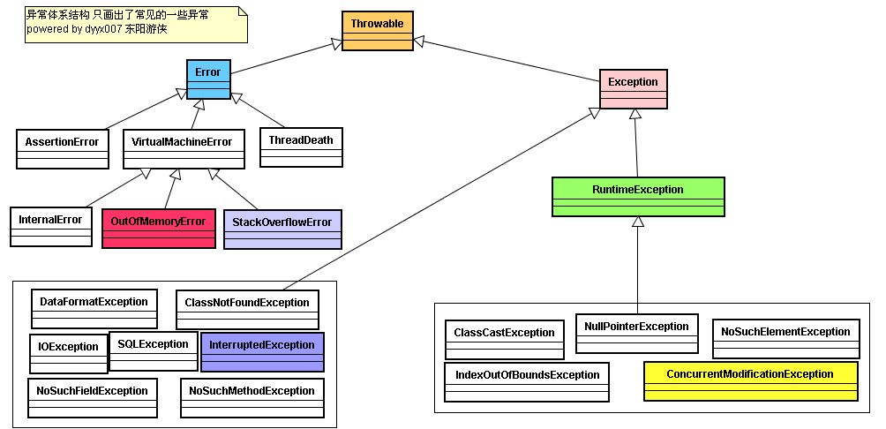
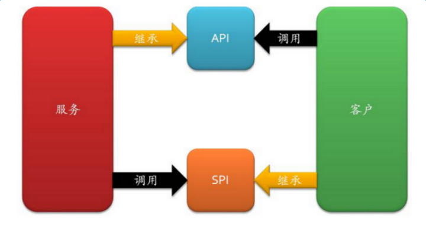
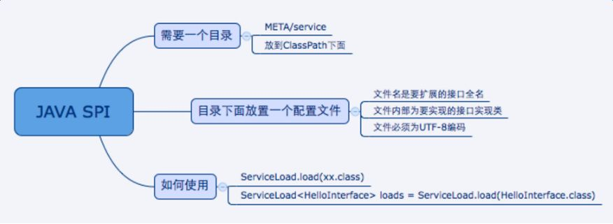

# 基础中的基础

## 面向对象

## 多态

## 重载，重写

## 关键字

## 异常体系



- 检查型异常与非检查型异常
  - 继承自Runtime Exception或 Error 的是非检查型异常
    > 当然，Runtime Exception 本身也是 Exception 的子类
    - 编译时无法被编译器检查到
    - 对非检查型类异常可以不用捕获
    - 通常无法从异常中恢复
  - 而继承自 Exception 的则是检查型异常
    - 可以被编译器检查到
    - 检查型异常则必须用try语句块进行捕获处理或者把异常交给上级方法处理
    - 通常可以从异常中恢复或者有一定的处理手段


# 反射

待补充

[深入理解java反射原理(源码)](https://www.cnblogs.com/yougewe/p/10125073.html)

- 反射机制说明
  - **在运行状态中**
  - 对于任意一个类，都能够知道这个类的所有属性和方法；
  - 对于任意一个对象，都能够调用它的任意一个属性和方法；


- 原理
  - 来源：
    - **每个类都会有一个与之对应的Class实例**
    - 从而每个类都可以获取method反射方法，并作用到其他实例身上；
  - 成员的查找：
    - 反射类及反射方法的获取，都是通过从列表中搜寻查找匹配的方法
    - 所以查找性能会随类的大小方法多少而变化；
  - 线程安全：
    - 反射考虑了**线程安全**的
    - 使用的CAS
  - 内存使用：
    - 反射**使用软引用relectionData缓存class信息**
    - 避免每次重新从jvm获取带来的开销；
  - 数据隔离
    - **当找到需要的方法，都会copy一份出来**
    - **不使用原来的实例，从而保证数据隔离**；
  - 方法执行：
    - **调度反射方法，最终是由jvm执行invoke0()执行**
  - 反射调用多次生成新代理Accessor, 而通过字节码生存的则考虑了卸载功能，所以会使用独立的类加载器；

基本使用：[JavaNote](./JavaNote.md)

# 集合

# 泛型

<!--
https://www.cnblogs.com/coprince/p/8603492.html
https://juejin.cn/post/6844903456533135368#heading-17
https://cloud.tencent.com/developer/article/1033693
https://blog.csdn.net/briblue/article/details/76736356
-->

## 什么是泛型

## 使用方式和场景

## 泛型通配符

## 类型擦除

Java 编译器会将泛型代码中的类型完全擦除，使其变成原始类型。

当然，这时的代码类型和我们想要的还有距离，接着 Java 编译器会在这些代码中加入类型转换，将原始类型转换成想要的类型。这些操作都是编译器后台进行，可以保证类型安全。

总之泛型就是一个语法糖，它运行时没有存储任何类型信息。

## 泛型数组

# 枚举

# String

String,StringBilder,StringBuffer


# 包装类

# BigXxx

# 类型

POJO

VO

...

# IO模型

# SPI机制

## 概念

### 说明

> **所有的调用情况**


- 我们在“调用方”和“实现方”之间引入了“接口”，上图没有给出“接口”应该位于哪个“包”中，从纯粹的可能性上考虑，我们有三种选择：
  - “接口”位于“调用方”所在的“包”中。
  - “接口”位于“实现方”所在的“包”中。
  - “接口”位于独立的“包”中。

> **情况说明**



- 接口位于实现方所在的包中：API(Application Programming Interface)
  - 概念上**更接近实现方**
  - 组织上**位于实现方所在的包**中
  - 实现和接口在一个包中(比如dao接口和dao实现类)

-  接口位于调用方所在的包中：SPI(service provider interface)
  - 概念上**更依赖调用方**
  - 组织上**位于调用方所在的包**中
  - 实现位于独立的包中（如数据库sql接口和mysql实现类）
  ```
  可以想象成：
    - 调用方提供规范
    - 实现方进行实现
  ```

- 接口位于独立的包中
  - 可能一个“接口”在一个上下文是“API”
  - 在另一个上下文是“SPI”
  - 不管是SPI或API，接口都是可以组织到独立的包中，这么做是否有意义，自己来做出决定了。

> **注意**

- SPI和API也不一定是接口，我这里都是指狭义的具体的接口。

### SPI原理

- **将接口的实现类放在配置文件中，我们在程序运行过程中读取配置文件，通过反射加载实现类**
- 这样，我们可以在运行的时候，**动态替换接口的实现类**。和 IoC 的解耦思想是类似的。

## JDK SPI示例

### 手动实现案例

#### jdk依赖

- 说明：
  - 在**jdk6**里面引进的一个新的特性**ServiceLoader**，从官方的文档来说，它主要是用来装载一系列的service provider
  - 而且ServiceLoader可以通过service provider的配置文件来装载指定的service provider。
- 使用
  - 当服务的提供者，提供了服务接口的一种实现之后，我们只需要在jar包的META-INF/services/目录里同时创建一个以服务接口命名的文件
  - 该文件里就是实现该服务接口的具体实现类
  - 而当外部程序装配这个模块的时候，就能通过该jar包META-INF/services/里的配置文件找到具体的实现类名，并装载实例化，完成模块的注入。

  

#### 示例代码

- 搜索接口定义
  ```java
  package com.cainiao.ys.spi.learn;

  import java.util.List;

  public interface Search {
      public List<String> searchDoc(String keyword);   
  }
  ```
- 文件搜索实现
  ```java
  package com.cainiao.ys.spi.learn;

  import java.util.List;

  public class FileSearch implements Search{
      @Override
      public List<String> searchDoc(String keyword) {
          System.out.println("文件搜索 "+keyword);
          return null;
      }
  }
  ```
- 数据库搜索实现
  ```java
  package com.cainiao.ys.spi.learn;

  import java.util.List;

  public class DatabaseSearch implements Search{
      @Override
      public List<String> searchDoc(String keyword) {
          System.out.println("数据搜索 "+keyword);
          return null;
      }
  }
  ```
- resources下新建`META-INF/services/`目录
  - 创建文件名为`com.cainiao.ys.spi.learn.Search`的文件
  - 添加内容：
    ```
    com.cainiao.ys.spi.learn.FileSearch
    ```
- 测试方法
  ```java
  package com.cainiao.ys.spi.learn;

  import java.util.Iterator;
  import java.util.ServiceLoader;

  public class TestCase {
      public static void main(String[] args) {
          // 首先找到META-INF/services/下为Search接口全类名的文件
          // 然后读取文件，加载类进内存。
          ServiceLoader<Search> s = ServiceLoader.load(Search.class);
          Iterator<Search> iterator = s.iterator();
          while (iterator.hasNext()) {
            Search search =  iterator.next();
            search.searchDoc("hello world");
          }
      }
  }
  ```
- 结果
  ```
  文件搜索 hello world
  ```

#### 总结分析

- 流程
  - ServiceLoader.load(Search.class)在加载某接口时
  - 会去META-INF/services下找接口的全限定名文件
  - 再根据里面的内容加载相应的实现类。
  - 因此：如果在com.cainiao.ys.spi.learn.Search文件里写上两个实现类，那最后的输出结果就是两行了。

- 思想总结：
  - **接口的实现由provider实现**
  - provider只用在提交的jar包里的META-INF/services下根据平台定义的接口新建文件，并添加进相应的实现类内容就好。

- 那为什么配置文件为什么要放在META-INF/services下面？
  - 可以打开ServiceLoader的代码，里面定义了文件的PREFIX如下：

  ```java
  private static final String PREFIX = "META-INF/services/"
  ```

### DriverManager案例(底层就是JDK SPI)

#### 说明

- DriverManager是jdbc里管理和注册不同数据库driver的工具类。从它设计的初衷来看，和我们前面讨论的场景有相似之处。
- 针对一个数据库，可能会存在着不同的数据库驱动实现。
- 在使用特定的驱动实现时，不希望修改现有的代码，而希望通过一个简单的配置就可以达到效果。

#### 手动加载

可以使用`Class.forName("com.mysql.jdbc.Driver")`加载mysql驱动

- 执行其中的静态代码把driver注册到DriverManager中，以便后续的使用
  ```java
  package com.mysql.jdbc;

  public class Driver extends NonRegisteringDriver implements java.sql.Driver {
      public Driver() throws SQLException {
      }

      static {
          try {
              DriverManager.registerDriver(new Driver());
          } catch (SQLException var1) {
              throw new RuntimeException("Can't register driver!");
          }
      }
  }
  ```
  > 体现了`使用方来提供规范`(java提供sql规范)，`提供方根据规范把自己加载到使用方`(Mysql实现Driver等接口)中的spi思想

#### 不手动加载

也可以不手动加载，尽管不调用`Class.forName("com.mysql.jdbc.Driver")` 也会加载驱动器，原因是因为调用方(java源码中的DriverManager)有使用ServiceLoader

因为对符合DriverManager设定规则的驱动，我们并不用去调用class.forname，直接连接就好。因为DriverManager在初始化的时候已经把所有符合的驱动都加载进去了，避免了在程序中频繁加载。

- 查看DriverManager的源码
  - 可以看到其内部的静态代码块中有一个loadInitialDrivers方法，在注释中我们看到用到了上文提到的spi工具类ServiceLoader
    ```java
    /**
    * Load the initial JDBC drivers by checking the System property
    * jdbc.properties and then use the {@code ServiceLoader} mechanism
    */
    static {
      loadInitialDrivers();
      println("JDBC DriverManager initialized");
    }
    ```
  - 点进方法，看到方法里有如下代码：
    ```java
    ServiceLoader<Driver> loadedDrivers = ServiceLoader.load(Driver.class);
    Iterator<Driver> drivers = loadedDrivers.iterator();
    println("DriverManager.initialize: jdbc.drivers = " + loadedDrivers);
    ```
    > 可见，DriverManager初始化时也运用了spi的思想，使用ServiceLoader把写到配置文件里的Driver都加载了进来。

> **为何oracle必须调用`Class.forName("com.mysql.jdbc.Driver")`**


不符合配置文件规则


## 其他案例

### Spring SPI

> **scan**

我们在spring中可以通过component-scan标签来对指定包路径进行扫描，只要扫到spring制定的@service、@controller等注解，spring自动会把它注入容器。

这就相当于spring**制定了注解规范**，我们按照这个注解规范开发相应的实现类或controller，spring并不需要感知我们是怎么实现的，他只需要根据注解规范和scan标签注入相应的bean，这正是spi理念的体现。

> **自定义Scope**

spring中有作用域scope的概念。
除了singleton、prototype、request、session等spring为我们提供的域，我们还可以自定义scope。

像是自定义一个 ThreadScope实现Scope接口
再把它注册到beanFactory中

```java
Scope threadScope = new ThreadScope();
beanFactory.registerScope("thread", threadScope);
```

接着就能在xml中使用了

```java
<bean id=".." class=".." scope="thread"/>
```

spring作为使用方**提供了自定义scope的规则**，提供方根据规则进行编码和配置，这样在spring中就能运用我们自定义的scope了，并不需要spring感知我们scope里的实现，这也是平台使用方制定规则，提供方负责实现的思想。

> **自定义标签**

扩展Spring自定义标签配置大致需要以下几个步骤

1. 创建一个需要扩展的组件，也就是一个bean
2. 定义一个XSD文件描述组件内容，也可以给bean的属性赋值啥的
3. 创建一个文件，实现BeanDefinitionParser接口，用来解析XSD文件中的定义和对组件进行初始化，像是为组件bean赋上xsd里设置的值
4. 创建一个Handler文件，扩展自NamespaceHandlerSupport，目的是将组件注册到Spring容器，重写其中的的init方法

这样我们就边写出了一个自定义的标签，spring只是为我们**定义好了创建标签的流程**，不用感知我们是如何实现的，我们通过register就把自定义标签加载到了spring中，实现了spi的思想。

> **ConfigurableBeanFactory**

spring里为我们提供了许多属性编辑器，这时我们如果想把spring配置文件中的字符串转换成相应的对象进行注入，就要自定义属性编辑器，这时我们可以按照spring为我们提供的规则来自定义我们的编辑器

自定义好了属性编辑器后，ConfigurableBeanFactory里面有一个registerCustomEditor方法，此方法的作用就是注册自定义的编辑器，也是spi思想的体现

### HotSpot SPI


# Java8新特性


