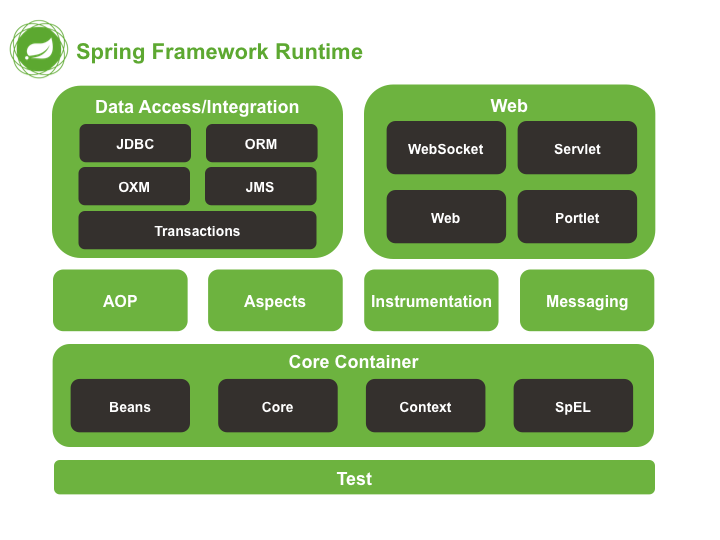
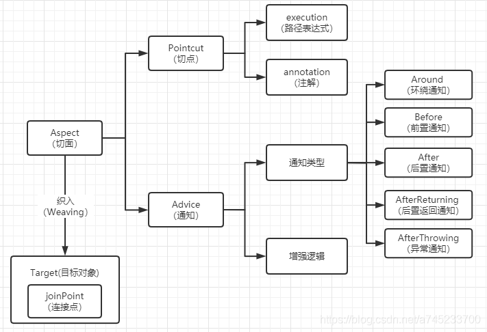
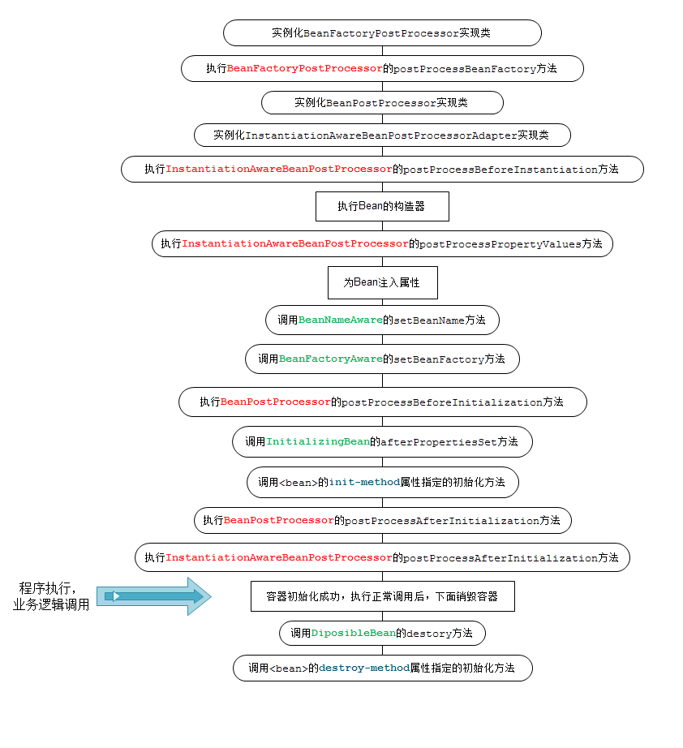

> **还差挺多**

# 1. Spring概述

## 1.1. 什么是Spring

Spring是一个轻量级的IoC和AOP容器框架。是为Java应用程序提供基础性服务的一套框架，目的是用于简化企业应用程序的开发，它使得开发者只需要关心业务需求。

## 1.2. 有什么好处

- **轻量：**Spring 是轻量的，基本的版本大约2MB。
- **控制反转：**Spring通过控制反转实现了松散耦合，对象们给出它们的依赖，而不是创建或查找依赖的对象们。
- **面向切面的编程(AOP)：**Spring支持面向切面的编程，并且把应用业务逻辑和系统服务分开。
- **容器：**Spring 包含并管理应用中对象的生命周期和配置。
- **MVC框架**：Spring的WEB框架是个精心设计的框架，是Web框架的一个很好的替代品。
- **事务管理：**Spring 提供一个持续的事务管理接口，可以扩展到上至本地事务下至全局事务（JTA）。
- **异常处理：**Spring 提供方便的API把具体技术相关的异常（比如由JDBC，Hibernate or JDO抛出的）转化为一致的unchecked 异常。

## 1.3. Spring模块组成

 

- Spring Context：提供框架式的Bean访问方式，以及企业级功能（JNDI、定时任务等）；
- Spring Core：核心类库，所有功能都依赖于该类库，提供IOC和DI服务；
- Spring AOP：AOP服务；
- Spring Web：提供了基本的面向Web的综合特性，提供对常见框架如Struts2的支持，Spring能够管理这些框架，将Spring的资源注入给框架，也能在这些框架的前后插入拦截器；
- Spring MVC：提供面向Web应用的Model-View-Controller，即MVC实现。
- Spring DAO：对JDBC的抽象封装，简化了数据访问异常的处理，并能统一管理JDBC事务；
- Spring ORM：对现有的ORM框架的支持；

# 2. Spring IOC

## 2.1. 是什么

IOC就是控制反转，指创建**对象的控制权转移给Spring框架进行管理**，并**由Spring根据配置文件去创建实例和管理各个实例之间的依赖关系**，对象与对象之间松散耦合，也利于功能的复用。

DI(Dependency injection)依赖注入，和控制反转是同一个概念的不同角度的描述，即应用程序在运行时依赖IoC容器来动态注入对象需要的外部依赖。

最直观的表达就是，以前创建对象的主动权和时机都是由自己把控的，IOC让对象的创建不用去new了，可以由spring自动生产，使用java的反射机制，根据配置文件在运行时动态的去创建对象以及管理对象，并调用对象的方法的。

## 2.2. IOC的方式

Spring的IOC有三种注入方式 

- 构造器注入
- setter方法注入
- 根据注解注入

## 2.3. IOC读过源码吗


[Spring IOC 容器源码分析](https://javadoop.com/post/spring-ioc)

# 3. AOP

## 3.1. 是什么啊

AOP，一般称为面向切面，作为面向对象的一种补充，用于将那些与业务无关，但却对多个对象产生影响的公共行为和逻辑，抽取并封装为一个可重用的模块，这个模块被命名为“切面”（Aspect），减少系统中的重复代码，降低了模块间的耦合度，提高系统的可维护性。可用于权限认证、日志、事务处理。

## 3.2. 织入，通知这些概念了解吗



[详细请看此处笔记](./Spring.md)

## 3.3. AOP实现原理是什么啊

### 3.3.1. 说明

AOP实现的关键在于 代理模式，AOP代理主要分为**静态代理**和**动态代理**

静态代理的代表为AspectJ；动态代理则以Spring AOP为代表。


### 3.3.2. 静态代理AspectJ

AspectJ是静态代理，也称为编译时增强，AOP框架会在编译阶段生成AOP代理类，并将AspectJ(切面)织入到Java字节码中，运行的时候就是增强之后的AOP对象。

**Spring AOP 已经集成了AspectJ** ，AspectJ 应该算的上是 Java 生态系统中最完整的 AOP 框架了。

使用 AOP 之后我们可以把一些通用功能抽象出来，在需要用到的地方直接使用即可，这样大大简化了代码量。我们需要增加新功能时也方便，这样也提高了系统扩展性。日志功能、事务管理等等场景都用到了 AOP 。

### 3.3.3. 动态代理

#### 3.3.3.1. 说明

Spring AOP使用的动态代理，所谓的动态代理就是说AOP框架不会去修改字节码，而是每次运行时在内存中临时为方法生成一个AOP对象，这个AOP对象包含了目标对象的全部方法，并且在特定的切点做了增强处理，并回调原对象的方法。

#### 3.3.3.2. JDK

DK动态代理只提供接口的代理，不支持类的代理，要求被代理类实现接口。JDK动态代理的核心是InvocationHandler接口和Proxy类，在获取代理对象时，使用Proxy类来动态创建目标类的代理类（即最终真正的代理类，这个类继承自Proxy并实现了我们定义的接口），当代理对象调用真实对象的方法时， InvocationHandler 通过invoke()方法反射来调用目标类中的代码，动态地将横切逻辑和业务编织在一起；

InvocationHandler 的 invoke(Object  proxy,Method  method,Object[] args)：为主要方法

- proxy是最终生成的代理对象;
- method 是被代理目标实例的某个具体方法;
- args 是被代理目标实例某个方法的具体入参, 在方法反射调用时使用。

<details>
<summary style="color:red;">代码示例</summary>

**1.定义发送短信的接口**

```java
public interface SmsService {
    String send(String message);
}
```

**2.实现发送短信的接口**

```java
public class SmsServiceImpl implements SmsService {
    public String send(String message) {
        System.out.println("send message:" + message);
        return message;
    }
}
```

**3.定义一个 JDK 动态代理类**

```java
import java.lang.reflect.InvocationHandler;
import java.lang.reflect.InvocationTargetException;
import java.lang.reflect.Method;

/**
 * @author shuang.kou
 * @createTime 2020年05月11日 11:23:00
 */
public class DebugInvocationHandler implements InvocationHandler {
    /**
     * 代理类中的真实对象
     */
    private final Object target;

    public DebugInvocationHandler(Object target) {
        this.target = target;
    }

    /**
    * proxy :动态生成的代理类
    * method : 与代理类对象调用的方法相对应
    * args : 当前 method 方法的参数
    */
    public Object invoke(Object proxy, Method method, Object[] args) throws InvocationTargetException, IllegalAccessException {
        //调用方法之前，我们可以添加自己的操作
        System.out.println("before method " + method.getName());
        Object result = method.invoke(target, args);
        //调用方法之后，我们同样可以添加自己的操作
        System.out.println("after method " + method.getName());
        return result;
    }
}
```

`invoke()` 方法: 当我们的动态代理对象调用原生方法的时候，最终实际上调用到的是 `invoke()` 方法，然后 `invoke()` 方法代替我们去调用了被代理对象的原生方法。

**4.获取代理对象的工厂类**

```java
public class JdkProxyFactory {
    public static Object getProxy(Object target) {
        return Proxy.newProxyInstance(
                target.getClass().getClassLoader(), // 目标类的类加载
                target.getClass().getInterfaces(),  // 代理需要实现的接口，可指定多个
                new DebugInvocationHandler(target)   // 代理对象对应的自定义 InvocationHandler
        );
    }
}
```

`getProxy()` ：主要通过`Proxy.newProxyInstance（）`方法获取某个类的代理对象

**5.实际使用**

```java
SmsService smsService = (SmsService) JdkProxyFactory.getProxy(new SmsServiceImpl());
smsService.send("java");
```

运行上述代码之后，控制台打印出：

```
before method send
send message:java
after method send
```
</details>

#### 3.3.3.3. GBLib

**JDK 动态代理有一个最致命的问题是其只能代理实现了接口的类。**

为了解决这个问题，我们可以用 CGLIB 动态代理机制来避免。

如果被代理类没有实现接口，那么Spring AOP会选择使用CGLIB来动态代理目标类。

CGLIB（Code Generation Library），是一个代码生成的类库，可以在运行时动态的生成指定类的一个子类对象，并覆盖其中特定方法并添加增强代码，从而实现AOP。

CGLIB是通过**继承**的方式做的动态代理，因此如果某个类被标记为final，那么它是无法使用CGLIB做动态代理的。

不同于 JDK 动态代理不需要额外的依赖。[CGLIB](https://github.com/cglib/cglib)(*Code Generation Library*) 实际是属于一个开源项目，如果你要使用它的话，需要手动添加相关依赖。

<details>
<summary style="color:red;">代码示例</summary>

**0.加入依赖**

```xml
<dependency>
  <groupId>cglib</groupId>
  <artifactId>cglib</artifactId>
  <version>3.3.0</version>
</dependency>
```

**1.实现一个使用阿里云发送短信的类**

```java
package github.javaguide.dynamicProxy.cglibDynamicProxy;

public class AliSmsService {
    public String send(String message) {
        System.out.println("send message:" + message);
        return message;
    }
}
```

**2.自定义 MethodInterceptor（方法拦截器）**

```java
import net.sf.cglib.proxy.MethodInterceptor;
import net.sf.cglib.proxy.MethodProxy;

import java.lang.reflect.Method;

/**
 * 自定义MethodInterceptor
 */
public class DebugMethodInterceptor implements MethodInterceptor {

    /**
     * @param o           被代理的对象（需要增强的对象）
     * @param method      被拦截的方法（需要增强的方法）
     * @param args        方法入参
     * @param methodProxy 用于调用原始方法
     */
    @Override
    public Object intercept(Object o, Method method, Object[] args, MethodProxy methodProxy) throws Throwable {
        //调用方法之前，我们可以添加自己的操作
        System.out.println("before method " + method.getName());
        Object object = methodProxy.invokeSuper(o, args);
        //调用方法之后，我们同样可以添加自己的操作
        System.out.println("after method " + method.getName());
        return object;
    }

}
```

**3.获取代理类**

```java
import net.sf.cglib.proxy.Enhancer;

public class CglibProxyFactory {

    public static Object getProxy(Class<?> clazz) {
        // 创建动态代理增强类
        Enhancer enhancer = new Enhancer();
        // 设置类加载器
        enhancer.setClassLoader(clazz.getClassLoader());
        // 设置被代理类
        enhancer.setSuperclass(clazz);
        // 设置方法拦截器
        enhancer.setCallback(new DebugMethodInterceptor());
        // 创建代理类
        return enhancer.create();
    }
}
```

**4.实际使用**

```java
AliSmsService aliSmsService = (AliSmsService) CglibProxyFactory.getProxy(AliSmsService.class);
aliSmsService.send("java");
```

运行上述代码之后，控制台打印出：

```bash
before method send
send message:java
after method send
```
</details>

#### 3.3.3.4. JDK和GBLib对比

1. **JDK 动态代理只能只能代理实现了接口的类或者直接代理接口，而 CGLIB 可以代理未实现任何接口的类** 。另外， CGLIB 动态代理是通过生成一个被代理类的子类来拦截被代理类的方法调用，因此不能代理声明为 final 类型的类和方法。
2. 就二者的效率来说，大部分情况都是 JDK 动态代理更优秀，随着 JDK 版本的升级，这个优势更加明显。
  > Java动态代理使用Java原生的反射API进行操作，在生成类上比较高效；CGLIB使用ASM框架直接对字节码进行操作，在类的执行过程中比较高效

### 3.3.4. 静态代理和动态代理对比

1. **灵活性** ：动态代理更加灵活，不需要必须实现接口，可以直接代理实现类，并且可以不需要针对每个目标类都创建一个代理类。另外，静态代理中，接口一旦新增加方法，目标对象和代理对象都要进行修改，这是非常麻烦的！
2. **JVM 层面** ：静态代理在编译时就将接口、实现类、代理类这些都变成了一个个实际的 class 文件。而动态代理是在运行时动态生成类字节码，并加载到 JVM 中的。

## 3.4. AOP都怎么用啊

- xml配置
- 注解配置

[详细请看此处笔记](./Spring.md)

# 4. Spring Bean

## 4.1. 作用域都有哪些？

- singleton : 唯一 bean 实例，Spring 中的 bean 默认都是单例的。
- prototype : 每次请求都会创建一个新的 bean 实例。
- request : 每一次HTTP请求都会产生一个新的bean，该bean仅在当前HTTP request内有效。
- session : 每一次HTTP请求都会产生一个新的 bean，该bean仅在当前 HTTP session 内有效。
- global-session： 全局session作用域，仅仅在基于portlet的web应用中才有意义，Spring5已经没有了。Portlet是能够生成语义代码(例如：HTML)片段的小型Java Web插件。它们基于portlet容器，可以像servlet一样处理HTTP请求。但是，与 servlet 不同，每个 portlet 都有不同的会话

## 4.2. 有线程安全问题吗

存在安全问题的，当多个线程操作同一个对象的时候，对这个对象的成员变量的写操作会存在线程安全问题。

但是，一般情况下，我们常用的 Controller、Service、Dao 这些 Bean 是无状态的。无状态的 Bean 不能保存数据，因此是线程安全的。

常见的有 2 种解决办法：

- 在类中定义一个 ThreadLocal 成员变量，将需要的可变成员变量保存在 ThreadLocal 中（推荐的一种方式）。
  > 复习：ThreadLoacl内存泄漏问题
- 改变 Bean 的作用域为 “prototype”：每次请求都会创建一个新的 bean 实例，自然不会存在线程安全问题。

## 生命周期

### 整体流程



> 若容器注册了以上各种接口，程序那么将会按照以上的流程进行

- Bean 容器找到配置文件中 Spring Bean 的定义。
- Bean 容器利用 Java Reflection API 创建一个Bean的实例。
- 如果涉及到一些属性值 利用 `set()`方法设置一些属性值。
- 如果 Bean 实现了 `BeanNameAware` 接口，调用 `setBeanName()`方法，传入Bean的名字。
- 如果 Bean 实现了 `BeanClassLoaderAware` 接口，调用 `setBeanClassLoader()`方法，传入 `ClassLoader`对象的实例。
- 与上面的类似，如果实现了其他 `*.Aware`接口，就调用相应的方法。
- 如果有和加载这个 Bean 的 Spring 容器相关的 `BeanPostProcessor` 对象，执行`postProcessBeforeInitialization()` 方法
- 如果Bean实现了`InitializingBean`接口，执行`afterPropertiesSet()`方法。
- 如果 Bean 在配置文件中的定义包含 init-method 属性，执行指定的方法。
- 如果有和加载这个 Bean的 Spring 容器相关的 `BeanPostProcessor` 对象，执行`postProcessAfterInitialization()` 方法
- 当要销毁 Bean 的时候，如果 Bean 实现了 `DisposableBean` 接口，执行 `destroy()` 方法。
- 当要销毁 Bean 的时候，如果 Bean 在配置文件中的定义包含 destroy-method 属性，执行指定的方法。

代码实验看这里：[Spring Bean的生命周期（非常详细）](https://www.cnblogs.com/zrtqsk/p/3735273.html)

### 方法调用说明

- 各种方法调用分类
  - 1、Bean自身的方法：
    - Bean本身调用的方法
    - 通过配置文件中`<bean>`的init-method和destroy-method指定的方法
  - 2、Bean级生命周期接口方法
    - `BeanNameAware`接口的方法
    - `BeanFactoryAware`接口的方法
    - `InitializingBean` 接口的方法
    - `DiposableBean`接口的方法
  - 3、容器级生命周期接口方法
    > 一般称下面下面两个接口的实现类为“后处理器”。
    - `InstantiationAwareBeanPostProcessor`接口的方法
    - `BeanPostProcessor`接口的方法
  - 4、工厂后处理器接口方法
    > 工厂后处理器接口的方法。工厂后处理器也是容器级的。在应用上下文装配配置文件之后立即调用。
    - AspectJWeavingEnabler
    - ConfigurationClassPostProcessor
    - CustomAutowireConfigurer
    - 等等

# 5. Spring 注解

# 6. Spring数据访问

# 7. Spring事务

# 8. Spring 设计模式

# 9. Spring MVC

## 9.1. Spring MVC工作原理

# 10. SpringBoot

## 10.1. 装配过程

# 11. 容器相关

## 11.1. Spring容器启动流程

详细内容可以阅读这篇文章：https://blog.csdn.net/a745233700/article/details/113761271

1. 初始化Spring容器，注册内置的BeanPostProcessor的BeanDefinition到容器中：
  > - ① 实例化BeanFactory【DefaultListableBeanFactory】工厂，用于生成Bean对象
  > - ② 实例化BeanDefinitionReader注解配置读取器，用于对特定注解（如@Service、@Repository）的类进行读取转化成  BeanDefinition 对象，（BeanDefinition 是 Spring 中极其重要的一个概念，它存储了 bean 对象的所有特征信息，如是否单例，是否懒加载，factoryBeanName 等）
  > - ③ 实例化ClassPathBeanDefinitionScanner路径扫描器，用于对指定的包目录进行扫描查找 bean 对象
2. 将配置类的BeanDefinition注册到容器中：
3. 调用refresh()方法刷新容器：
  > - ① prepareRefresh()刷新前的预处理：
  > - ② obtainFreshBeanFactory()：获取在容器初始化时创建的BeanFactory：
  > - ③ prepareBeanFactory(beanFactory)：BeanFactory的预处理工作，向容器中添加一些组件：
  > - ④ postProcessBeanFactory(beanFactory)：子类重写该方法，可以实现在BeanFactory创建并预处理完成以后做进一步的设置
  > - ⑤ invokeBeanFactoryPostProcessors(beanFactory)：在BeanFactory标准初始化之后执行BeanFactoryPostProcessor的方法，即BeanFactory的后置处理器：
  > - ⑥ registerBeanPostProcessors(beanFactory)：向容器中注册Bean的后置处理器BeanPostProcessor，它的主要作用是干预Spring初始化bean的流程，从而完成代理、自动注入、循环依赖等功能
  > - ⑦ initMessageSource()：初始化MessageSource组件，主要用于做国际化功能，消息绑定与消息解析：
  > - ⑧ initApplicationEventMulticaster()：初始化事件派发器，在注册监听器时会用到：
  > - ⑨ onRefresh()：留给子容器、子类重写这个方法，在容器刷新的时候可以自定义逻辑
  > - ⑩ registerListeners()：注册监听器：将容器中所有的ApplicationListener注册到事件派发器中，并派发之前步骤产生的事件：
  > - ⑪  finishBeanFactoryInitialization(beanFactory)：初始化所有剩下的单实例bean，核心方法是preInstantiateSingletons()，会调用getBean()方法创建对象；
  > - ⑫ finishRefresh()：发布BeanFactory容器刷新完成事件：

## 11.2. Spring容器与web容器

## 11.3. Spring容器与MCV容器

# 待分类

- 注解是干什么的？
- 一个注解可以使用多次么？如何使用？
- @Inherited是做什么的？
- @Target中的TYPE_PARAMETER和TYPE_USER用在什么地方？
- 泛型中如何使用注解？
- 注解定义可以实现继承么？
- spring中对注解有哪些增强？@Aliasfor注解是干什么的？
- spring中，类上加不加@Configuration注解，有什么区别？
- @ComponentScan注解是做什么的？
- basePackages的方式和basePackageClasses的方式有什么区别？你建议用哪个？为什么？
- useDefaultFilters有什么用？
- 常见的过滤器有哪些类型？说说你知道的几个
- @ComponentScan是在哪个类中处理的？说一下大概的解析过程？
- @Import你用过么？是做什么的？
- @Import使用有几种方式？有何区别？
- DeferredImportSelector是做什么的？他和ImportSelector有什么区别？
- 可以介绍介绍一下spring中哪些功能是通过@Import来实现的？
- 可以介绍一下spring中是如何解析@Import注解的么？
- @Conditional是做什么的?
- @Conditional多个条件是什么逻辑关系？
- 条件判断在什么时候执行？
- ConfigurationCondition和Condition有什么区别？什么时候使用ConfigurationCondition？
- 多个Condition执行的顺序是什么样的？可以配置优先级么？
- 可以介绍一下@Conditional常见的一些用法么？
- 通过注解的方式注入依赖对象，介绍一下你知道的几种方式
- @Autowired和@Resource有何区别
- 说一下@Autowired查找候选者的过程
- 说一下@Resource查找候选者的过程
- @Qulifier有哪些用法？
- @Qulifier加在类上面是干什么用的？
- @Primary是做什么的？
- 泛型注入用过么？

# 参考文献

- [Spring Bean的生命周期（非常详细）](https://www.cnblogs.com/zrtqsk/p/3735273.html)
- [ ] [java充电社-Spring教程](http://www.itsoku.com/course/5)

