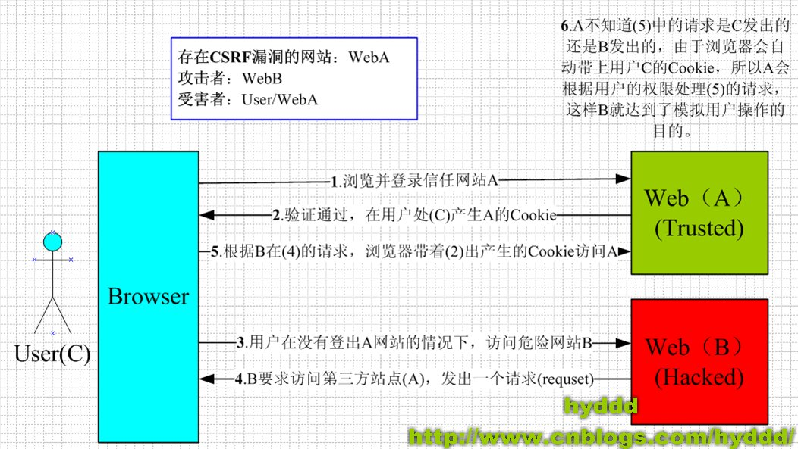

# 引入：CSRF攻击


## CSRF是什么？

- CSRF(cross-site request forgery)
  - 中文名称：`跨站请求伪造`，
  - 也被称为：`one click attack/session riding`(很形象)
  - 缩写为 `CSRF/XSRF`;

```
CSRF这种攻击方式在2000年已经被国外的安全人员提出，但在国内，直到06年才开始被关注，
08年，国内外的多个大型社区和交互网站分别爆出CSRF漏洞，
如：NYTimes.com（纽约时报）、Metafilter（一个大型的BLOG网站），YouTube和百度HI......而现在，
互联网上的许多站点仍对此毫无防备，以至于安全业界称CSRF为“沉睡的巨人”。
```

## CSRF可以做什么？

- 你可以这么理解`CSRF`:`攻击者盗用了你的身份,以你的名义发送恶意请求`。`CSRF`能够做的事情包括：
  - 以你的名义发送邮件，发消息
  - 盗取你的账号
  - 购买商品
  - 虚拟货币转账

## CSRF原理



- 从图中我们可以看到，要完成一次`CSRF`攻击，受害者必须一次完成两个步骤
  - **1.登陆受信任网站A，并在本地生成cookie**
  - **2.在不退出A的情况下，访问了危险网站B**

- `如果不满足以上条件的中的任何一个，就不会受到攻击`。但是我们平时无法保证以下情况:
  - 1.你不能保证你登陆了一个网站后，不再打开一个tab 页面并访问另外的网站。
  - 2.你不能保证你关闭浏览器后，你本地的cookie 马上过期，你上次的会话已经结束
  - 3.上图中所谓的攻击网站，可能是一个存在其他漏洞的可信任的经常被人访问的网站。


## 示例

- 说明：
  - 银行网站A，它以GET请求来完成银行转账的操作
    - 如：`http://www.mybank.com/Transfe...`
  - 危险网站B，它里面有一段HTML的代码如下：
    ```html
    
    ```

- 步骤：
  - **首先，你登录了银行网站A**
  - **然后访问危险网站B**
  - **噢，这时你会发现你的银行账户少了1000块。。。**

- 原因：
  - 银行网站A违反了`HTTP`规范，使用`GET`请求更新资源。
  - 在访问危险网站B的之前，你已经登录了银行网站A
  - 而B中的``以GET的方式请求第三方资源（这里的第三方就是指A网站了，原本这是一个合法的请求，但这里被不法分子利用了）
  - 所以你的浏览器会带上你的银行网站A的`Cookie`发出`GET`请求，去获取资源`http://www.mybank.com/Transfer.php?toBankId=11&money=1000`
  - 结果银行网站服务器收到请求后，认为这是一个更新资源操作（转账操作），所以就立刻进行转账操作

## CSRF的防御


# CORS说明


# 参考

- [浅谈CSRF 攻击方式](https://www.cnblogs.com/hyddd/archive/2009/04/09/1432744.html?login=1)
- [MDN文档-跨资源共享(CORS)](https://developer.mozilla.org/zh-CN/docs/Web/HTTP/CORS)
