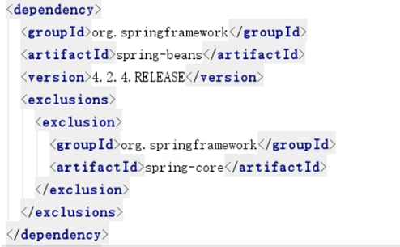
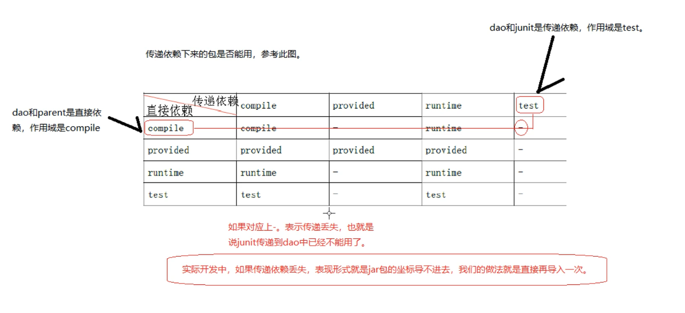

# 1. Maven(Java)

## 1.1. 概述

## 1.2. 基本说明

- Maven是基于项目对象模型(POM project object model)，可以通过一小段描述信息（配置）来管理项目的构建，报告和文档的软件项目管理工具
- 简单来说，就是通过一个pom文件，合理叙述项目间的依赖关系，获取jar包

## 1.3. java编译指令

- 基本使用
  ```bash
  # java 执行必须有和包名相同层级的目录
  # javac 不需要package和目录层级相同
  $ ls com/compile/test/
  JavaCompileTest.java
  # ----------
  $ cat com/compile/test/JavaCompileTest.java
  class JavaCompileTest{
          public static void main(String[] args){
                  System.out.println("hello world");
          }
  }
  # ----------
  $ javac com/compile/test/JavaCompileTest.java
  # ----------
  $ ls com/compile/test/
  JavaCompileTest.class  JavaCompileTest.java
  # ----------
  $ java com/compile/test/JavaCompileTest
  错误: 找不到或无法加载主类 com.compile.test.JavaCompileTest
  # ----------
  $ sed -i "1i\package com.compile.test;" com/compile/test/JavaCompileTest.java
  # ----------
  $ javac com/compile/test/JavaCompileTest.java
  # ----------
  $ java com/compile/test/JavaCompileTest
  hello world
  ```

- `javac -help`：
  ```
  用法: javac <options> <source files>
  其中, 可能的选项包括:
    -g                         生成所有调试信息
    -g:none                    不生成任何调试信息
    -g:{lines,vars,source}     只生成某些调试信息
    -nowarn                    不生成任何警告
    -verbose                   输出有关编译器正在执行的操作的消息
    -deprecation               输出使用已过时的 API 的源位置
    -classpath <路径>            指定查找用户类文件和注释处理程序的位置
    -cp <路径>                   指定查找用户类文件和注释处理程序的位置
    -sourcepath <路径>           指定查找输入源文件的位置
    -bootclasspath <路径>        覆盖引导类文件的位置
    -extdirs <目录>              覆盖所安装扩展的位置
    -endorseddirs <目录>         覆盖签名的标准路径的位置
    -proc:{none,only}          控制是否执行注释处理和/或编译。
    -processor <class1>[,<class2>,<class3>...] 要运行的注释处理程序的名称; 绕过默认的搜索进程
    -processorpath <路径>        指定查找注释处理程序的位置
    -parameters                生成元数据以用于方法参数的反射
    -d <目录>                    指定放置生成的类文件的位置
    -s <目录>                    指定放置生成的源文件的位置
    -h <目录>                    指定放置生成的本机标头文件的位置
    -implicit:{none,class}     指定是否为隐式引用文件生成类文件
    -encoding <编码>             指定源文件使用的字符编码
    -source <发行版>              提供与指定发行版的源兼容性
    -target <发行版>              生成特定 VM 版本的类文件
    -profile <配置文件>            请确保使用的 API 在指定的配置文件中可用
    -version                   版本信息
    -help                      输出标准选项的提要
    -A关键字[=值]                  传递给注释处理程序的选项
    -X                         输出非标准选项的提要
    -J<标记>                     直接将 <标记> 传递给运行时系统
    -Werror                    出现警告时终止编译
    @<文件名>                     从文件读取选项和文件名
  ```

- 指定编译依赖jar包和输出位置

  ```bash
  # 不指定依赖位置，编译失败
  $ ls
  com  lib

  # ----------
  $ ls lib
  commons-logging-1.2.jar

  # ----------
  $ vim com/compile/test/JavaCompileTest.java

  # ----------
  $ sed -i "1a\import org.apache.commons.logging.Log;" com/compile/test/JavaCompileTest.java

  # ----------
  $ cat com/compile/test/JavaCompileTest.java
  package com.compile.test;
  import org.apache.commons.logging.Log;
  class JavaCompileTest{
          public static void main(String[] args){
                  System.out.println("hello world");
          }
  }

  # ----------
  $ javac com/compile/test/JavaCompileTest.java
  com\compile\test\JavaCompileTest.java:2: 错误: 程序包org.apache.commons.logging不存在
  import org.apache.commons.logging.Log;
                                  ^
  1 个错误
  ```
  ```bash

  ```

## 1.4. 编译示例情景

> **不使用maven**

> **使用maven**

## 1.5. Maven 仓库

## 1.6. Maven

## 1.7. Maven POM

- maven 常用命令
  - clean
  - compile
  - test
  - package
  - install
  - deploy：打包上传到私服
- maven生命周期；
  - 清理生命周期
  - 默认生命周期
  - 站点生命周期

- 解决jar包冲突：
  - 方式一： 第一声明优先原则：哪个jar包的坐标在靠上的位置，这个jar包就是先声明的。 先声明的jar包坐标下的依赖包，可以优先进入项目中。
  - 方式二：
    - 相关概念：
      - 直接依赖：项目中直接导入的jar包，是该项目的直接以来包
      - 传递依赖：项目中没有直接导入的包，可以通过项目直接依赖jar包传递到项目中去
        > 比如A1依赖B1，B2，导入A1时，也会导入B1，B2
    - 路径近者优先原则，直接依赖比传递依赖路径近，也就是直接依赖优先级大于传递依赖
    - 若都是传递依赖，旧导入声明顺序靠上的
  - 方式三：使用exclusion直接排除依赖 **(推荐使用)**
    - 当要排除某个jar包下的依赖包时使用
      > 
    - 不用写版本号，只指定哪个包即可

- 锁住依赖
  - 注意：仅仅会锁住版本，而不会导入。必须在下面复制一份导入依赖才行
  ```
    maven工程是可以分父子依赖关系的。
    凡是依赖别的项目后，拿到的别的项目的依赖包，都属于传递依赖。
    比如：当前A项目，被B项目依赖。那么我们A项目中所有jar包都会传递到B项目中。
    B项目开发者，如果再在B项目中导入一套ssm框架的jar包，对于B项目是直接依赖。
    那么直接依赖的jar包就会把我们A项目传递过去的jar包覆盖掉。
    为了防止以上情况的出现。我们可以把A项目中主要jar包的坐标锁住，那么其他依赖该项目的项目中，
    即便是有同名jar包直接依赖，也无法覆盖。
  ```
  ```xml
    <!-- 锁定jar包版本 -->
  <dependencyManagement>
    <dependency>
    ...
    </dependency>
  </dependencyManagement>
  ```

- SSM框架依赖

  ```
  maven工程要导入jar包的坐标，就必须要考虑解决jar包冲突。
  解决jar包冲突的方式一：
    第一声明优先原则：哪个jar包的坐标在靠上的位置，这个jar包就是先声明的。
    先声明的jar包坐标下的依赖包，可以优先进入项目中。

  maven导入jar包中的一些概念：
    直接依赖：项目中直接导入的jar包，就是该项目的直接依赖包。
    传递依赖：项目中没有直接导入的jar包，可以通过项目直接依赖jar包传递到项目中去。

  解决jar包冲突的方式二：
    路径近者优先原则。
    直接依赖路径比传递依赖路径近，那么最终项目进入的jar包会是路径近的直接依赖包。

  解决jar包冲突的方式三【推荐使用】：
    直接排除法。
    当我们要排除某个jar包下依赖包，在配置exclusions标签的时候，内部可以不写版本号。
    因为此时依赖包使用的版本和默认和本jar包一样。
  ```
  <details>
  <summary style="color:red;">展开</summary>

  ```xml
  <?xml version="1.0" encoding="UTF-8"?>

  <project xmlns="http://maven.apache.org/POM/4.0.0" xmlns:xsi="http://www.w3.org/2001/XMLSchema-instance"
    xsi:schemaLocation="http://maven.apache.org/POM/4.0.0 http://maven.apache.org/xsd/maven-4.0.0.xsd">
    <modelVersion>4.0.0</modelVersion>

    <groupId>com.itheima</groupId>
    <artifactId>maven_day02_1</artifactId>
    <version>1.0-SNAPSHOT</version>
    <packaging>war</packaging>

    <!--maven工程要导入jar包的坐标，就必须要考虑解决jar包冲突。
        解决jar包冲突的方式一：
        第一声明优先原则：哪个jar包的坐标在靠上的位置，这个jar包就是先声明的。
        先声明的jar包坐标下的依赖包，可以优先进入项目中。

        maven导入jar包中的一些概念：
        直接依赖：项目中直接导入的jar包，就是该项目的直接依赖包。
        传递依赖：项目中没有直接导入的jar包，可以通过项目直接依赖jar包传递到项目中去。

        解决jar包冲突的方式二：
        路径近者优先原则。直接依赖路径比传递依赖路径近，那么最终项目进入的jar包会是路径近的直接依赖包。

        解决jar包冲突的方式三【推荐使用】：
        直接排除法。
        当我们要排除某个jar包下依赖包，在配置exclusions标签的时候，内部可以不写版本号。
        因为此时依赖包使用的版本和默认和本jar包一样。
        -->
      <!-- 统一管理jar包版本 -->
      <properties>
        <spring.version>5.0.2.RELEASE</spring.version>
        <slf4j.version>1.6.6</slf4j.version>
        <log4j.version>1.2.12</log4j.version>
        <shiro.version>1.2.3</shiro.version>
        <mysql.version>5.1.6</mysql.version>
        <mybatis.version>3.4.5</mybatis.version>
        <spring.security.version>5.0.1.RELEASE</spring.security.version>
      </properties>

      <!--
      maven工程是可以分父子依赖关系的。
      凡是依赖别的项目后，拿到的别的项目的依赖包，都属于传递依赖。
      比如：当前A项目，被B项目依赖。那么我们A项目中所有jar包都会传递到B项目中。
      B项目开发者，如果再在B项目中导入一套ssm框架的jar包，对于B项目是直接依赖。
      那么直接依赖的jar包就会把我们A项目传递过去的jar包覆盖掉。
      为了防止以上情况的出现。我们可以把A项目中主要jar包的坐标锁住，那么其他依赖该项目的项目中，
      即便是有同名jar包直接依赖，也无法覆盖。
      -->
      <!-- 锁定jar包版本 -->
      <dependencyManagement>
        <dependencies>
          <dependency>
            <groupId>org.springframework</groupId>
            <artifactId>spring-context</artifactId>
            <version>${spring.version}</version>
          </dependency>
          <dependency>
            <groupId>org.springframework</groupId>
            <artifactId>spring-web</artifactId>
            <version>${spring.version}</version>
          </dependency>
          <dependency>
            <groupId>org.springframework</groupId>
            <artifactId>spring-webmvc</artifactId>
            <version>${spring.version}</version>
          </dependency>
          <dependency>
            <groupId>org.springframework</groupId>
            <artifactId>spring-tx</artifactId>
            <version>${spring.version}</version>
          </dependency>
          <dependency>
            <groupId>org.springframework</groupId>
            <artifactId>spring-test</artifactId>
            <version>${spring.version}</version>
          </dependency>
          <dependency>
            <groupId>org.mybatis</groupId>
            <artifactId>mybatis</artifactId>
            <version>${mybatis.version}</version>
          </dependency>
        </dependencies>
      </dependencyManagement>

      <!-- 项目依赖jar包 -->
      <dependencies>
        <!-- spring -->
        <dependency>
          <groupId>org.aspectj</groupId>
          <artifactId>aspectjweaver</artifactId>
          <version>1.6.8</version>
        </dependency>
        <dependency>
          <groupId>org.springframework</groupId>
          <artifactId>spring-aop</artifactId>
          <version>${spring.version}</version>
        </dependency>
        <dependency>
          <groupId>org.springframework</groupId>
          <artifactId>spring-context</artifactId>
          <version>${spring.version}</version>
        </dependency>
        <dependency>
          <groupId>org.springframework</groupId>
          <artifactId>spring-context-support</artifactId>
          <version>${spring.version}</version>
        </dependency>
        <dependency>
          <groupId>org.springframework</groupId>
          <artifactId>spring-web</artifactId>
          <version>${spring.version}</version>
        </dependency>
        <dependency>
          <groupId>org.springframework</groupId>
          <artifactId>spring-orm</artifactId>
          <version>${spring.version}</version>
        </dependency>
        <dependency>
          <groupId>org.springframework</groupId>
          <artifactId>spring-beans</artifactId>
          <version>${spring.version}</version>
        </dependency>
        <dependency>
          <groupId>org.springframework</groupId>
          <artifactId>spring-core</artifactId>
          <version>${spring.version}</version>
        </dependency>
        <dependency>
          <groupId>org.springframework</groupId>
          <artifactId>spring-test</artifactId>
          <version>${spring.version}</version>
        </dependency>
        <dependency>
          <groupId>org.springframework</groupId>
          <artifactId>spring-webmvc</artifactId>
          <version>${spring.version}</version>
        </dependency>
        <dependency>
          <groupId>org.springframework</groupId>
          <artifactId>spring-tx</artifactId>
          <version>${spring.version}</version>
        </dependency>
        <dependency>
          <groupId>junit</groupId>
          <artifactId>junit</artifactId>
          <version>4.12</version>
          <scope>test</scope>
        </dependency>
        <dependency>
          <groupId>mysql</groupId>
          <artifactId>mysql-connector-java</artifactId>
          <version>${mysql.version}</version>
        </dependency>
        <dependency>
          <groupId>javax.servlet</groupId>
          <artifactId>javax.servlet-api</artifactId>
          <version>3.1.0</version>
          <scope>provided</scope>
        </dependency>
        <dependency>
          <groupId>javax.servlet.jsp</groupId>
          <artifactId>jsp-api</artifactId>
          <version>2.0</version>
          <scope>provided</scope>
        </dependency>
        <dependency>
          <groupId>jstl</groupId>
          <artifactId>jstl</artifactId>
          <version>1.2</version>
        </dependency>
        <!-- log start -->
        <dependency>
          <groupId>log4j</groupId>
          <artifactId>log4j</artifactId>
          <version>${log4j.version}</version>
        </dependency>
        <dependency>
          <groupId>org.slf4j</groupId>
          <artifactId>slf4j-api</artifactId>
          <version>${slf4j.version}</version>
        </dependency>
        <dependency>
          <groupId>org.slf4j</groupId>
          <artifactId>slf4j-log4j12</artifactId>
          <version>${slf4j.version}</version>
        </dependency>
        <!-- log end -->
        <dependency>
          <groupId>org.mybatis</groupId>
          <artifactId>mybatis</artifactId>
          <version>${mybatis.version}</version>
        </dependency>
        <dependency>
          <groupId>org.mybatis</groupId>
          <artifactId>mybatis-spring</artifactId>
          <version>1.3.0</version>
        </dependency>
        <dependency>
          <groupId>c3p0</groupId>
          <artifactId>c3p0</artifactId>
          <version>0.9.1.2</version>
          <type>jar</type>
          <scope>compile</scope>
        </dependency>
        <dependency>
          <groupId>com.github.pagehelper</groupId>
          <artifactId>pagehelper</artifactId>
          <version>5.1.2</version>
        </dependency>
        <dependency>
          <groupId>org.springframework.security</groupId>
          <artifactId>spring-security-web</artifactId>
          <version>${spring.security.version}</version>
        </dependency>
        <dependency>
          <groupId>org.springframework.security</groupId>
          <artifactId>spring-security-config</artifactId>
          <version>${spring.security.version}</version>
        </dependency>
        <dependency>
          <groupId>org.springframework.security</groupId>
          <artifactId>spring-security-core</artifactId>
          <version>${spring.security.version}</version>
        </dependency>
        <dependency>
          <groupId>org.springframework.security</groupId>
          <artifactId>spring-security-taglibs</artifactId>
          <version>${spring.security.version}</version>
        </dependency>
        <dependency>
          <groupId>com.alibaba</groupId>
          <artifactId>druid</artifactId>
          <version>1.0.9</version>
        </dependency>
        <dependency>
          <groupId>junit</groupId>
          <artifactId>junit</artifactId>
          <version>4.12</version>
        </dependency>
      </dependencies>
      <!-- 添加tomcat7插件 -->
      <build>
        <plugins>
          <plugin>
            <groupId>org.apache.tomcat.maven</groupId>
            <artifactId>tomcat7-maven-plugin</artifactId>
            <version>2.2</version>
          </plugin>
        </plugins>
      </build>
  </project>
  ```
  </details>

## 1.8. maven进阶

### 1.8.1. 多模块开发

```
情景：
电商系统
顾客端需要查看发票信息
管理端需要查看发票信息
共用一套dao代码即可，如何实现
```

- maven解决代码可冲用和便于维护问题方式:
  ```
  maven把一个完整的项目，分成不同的独立模块，这些模块都有各自独立的坐标，以及pom文件。
  哪个地方需要其中某个模块， 就直接引用该模块的坐标即可。

  今后如果公司开发一个新项目，我们先考虑问题不是dao,service,utils,domain如何编写，I 
  我们要考虑的是，dao,servic,utils,domain这些模块是否已经存在，如果存在直接引用。
  ```
  - 拆分：分模块构建
  - 聚合：引用模块


- 示例：
  - idea中创建一个工程，作为主模块（只要有一个pom即可）
    - 注意：工程和模块都不是一个完整的项目，一个项目看的是代码，和工程和模块没有关系
    - 工程天生只能使用自己内部资源。后天可以和其他工程和模块建立关系
    - 模块天生不是独立的。模块一被创建，就可以**使用父工程所有资源**
    - 子模块间一开始没有任何关系，通过坐标依赖引入。
      - 平级是继承
    - 父子模块间继承关系是先天的。
      - 上下级是继承（也可以说成依赖）
  - idea中创建三个子模块，dao，service，web。
    - 此时子模块的pom中就有parent的坐标
    - 子模块会使用父模块的groupId和version，然后使用自己定义的artifactId
    - 父模块中也会自动添加三个子模块
    - web模块可以使用骨架或者自己搭建，使用骨架的话，把pom清理到和其他两个相同
    - dao模块对应spring配置文件中，只保留dao层
    - service模块对应spring配置文件中，只保留service层
    - web模块下的application.xml通过import引入上面两个xml
  - 示例结构：
    ```
    maven_day02_parent
    │  maven_day02_parent.iml
    │  pom.xml
    │
    ├─maven_day02_dao
    │  │  maven_day02_dao.iml
    │  │  pom.xml
    │  │
    │  └─src
    │      ├─main
    │      │  ├─java
    │      │  │  └─com
    │      │  │      └─itheima
    │      │  │          ├─dao
    │      │  │          │      ItemsDao.java
    │      │  │          │
    │      │  │          └─domain
    │      │  │                  Items.java
    │      │  │
    │      │  └─resources
    │      │      ├─com
    │      │      │  └─itheima
    │      │      │      └─dao
    │      │      │              ItemsDao.xml
    │      │      │
    │      │      └─spring
    │      │              applicationContext-dao.xml
    │      │
    │      └─test
    │          └─java
    ├─maven_day02_service
    │  │  maven_day02_service.iml
    │  │  pom.xml
    │  │
    │  └─src
    │      ├─main
    │      │  ├─java
    │      │  │  └─com
    │      │  │      └─itheima
    │      │  │          └─service
    │      │  │              │  ItemsService.java
    │      │  │              │
    │      │  │              └─impl
    │      │  │                      ItemsServiceImpl.java
    │      │  │
    │      │  └─resources
    │      │      └─spring
    │      │              applicationContext-service.xml
    │      │
    │      └─test
    │          └─java
    └─maven_day02_web
        │  maven_day02_web.iml
        │  pom.xml
        │
        └─src
            └─main
                ├─java
                │  └─com
                │      └─itheima
                │          └─controller
                │                  ItemsController.java
                │
                ├─resources
                │      applicationContext.xml
                │      log4j.properties
                │      springmvc.xml
                │
                └─webapp
                    │  index.jsp
                    │
                    └─WEB-INF
                        │  web.xml
                        │
                        └─pages
                                itemDetail.jsp
    ```
  - 测试三种方式：
    - 右侧maven管理器，root模块，开启tomcat
    - root模块install，上传到本地（为了让web模块查找到依赖），再在web模块中使用maven的tomcat插件
    - 使用外部tomcat
  - 了解：
    > 

## 1.9. 常见 maven 编译插件


## 1.10. 打包方式

- pom是maven依赖文件
  - pom打包方式可以作为其他项目的maven依赖，构建maven项目时可用在父级工程或者聚合工程中，用来做jar包的版本控制；
  - **注意，pom打包方式会导致多环境配置失效**
- jar是java普通项目打包文件
  - jar包通常是开发时需要应用的类，当需要某些功能时就导入相应的jar包,在构建maven时作为子类；
- war是javaweb项目打包文件
  - war包用来发布服务，打成war包后部署到服务器访问。


# 2. Gradle(java)

# 3. 参考资料

- [程序运行时，No active profile set, falling back to default profiles: default](https://www.imooc.com/qadetail/302046)
